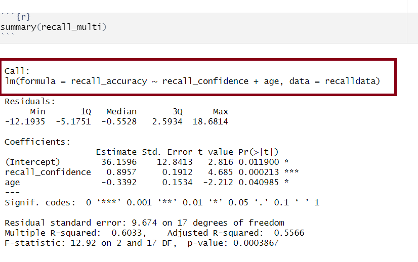
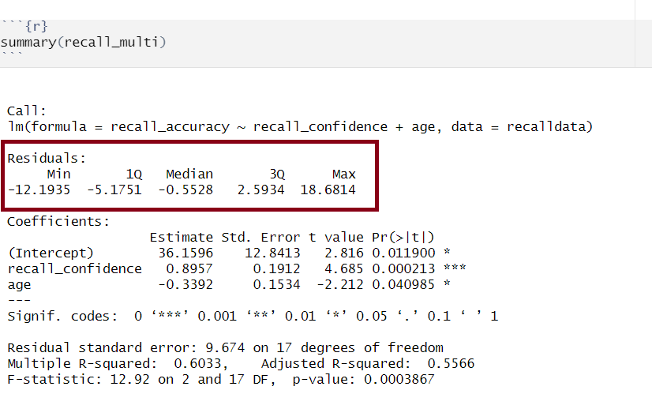
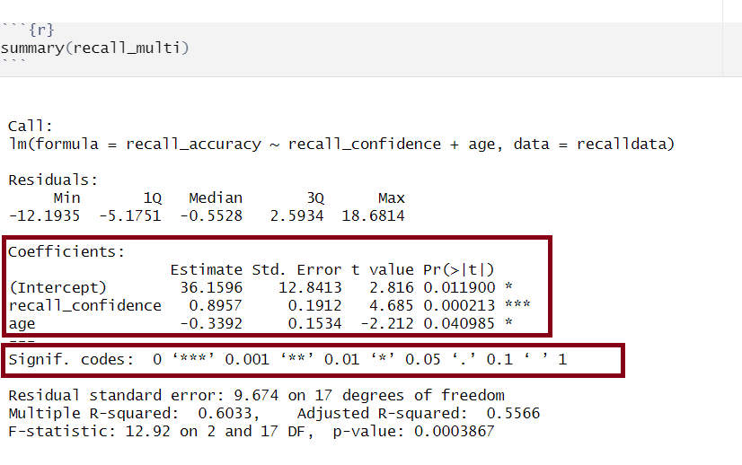
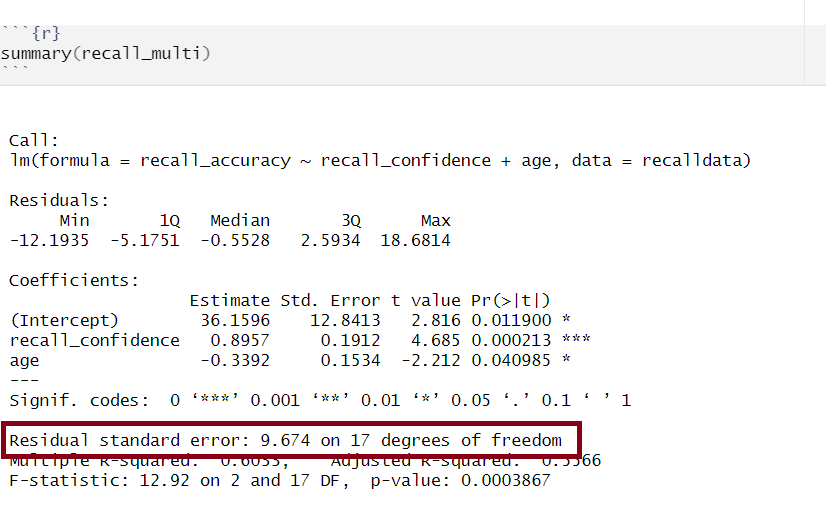

```{r setup, include=FALSE}
source('../assets/setup.R')
library(tidyverse)
```

```{r}
recalldata <- read_csv('https://uoepsy.github.io/data/recalldata.csv')
```

```{r}
recall_multi <- lm(
  recall_accuracy ~ recall_confidence + age,
  data = recalldata
)
```

It is important to have a good grasp of how to understand and interpret the key components of your model `summary()` output, including model coefficients, standard errors, $t$-values, $p$-values, etc., and how these can be used in further calculations (such as confidence intervals). As well as knowing how to extract from `R`, it is necessary to understand how to compute some of these statistics by hand too. 

## Model Call

```{r mlroutputcall, echo=FALSE, fig.cap="Multiple regression output in R, model formula highlighted", fig.align = 'left'}

```

The call section at the very top of the `summary()` output shows us the formula that was specified in `R` to fit the regression model.

In the above, we can see that recall accuracy is our DV, recall confidence and age were our two IVs, and our dataset was named recalldata.

 

<br>

## Residuals 

```{r mlroutputresids, echo=FALSE, fig.cap="Multiple regression output in R, residuals highlighted", fig.align = 'left'}

```
  
Residuals are the difference between the observed values and model predicted values of the DV. 
  
Ideally, for the model to be unbiased, we want our median value (the middle value of the residuals when ordered) to be around 0, as this would show that the errors are random fluctuations around the true line. When this is the case, we know that our model is doing a good job predicting values at the high and low ends of our dataset, and that our residuals were somewhat symmetrical. 

The residuals ($\hat \epsilon_i$) represent the deviations between the actual responses and the predicted responses and can be obtained either as

- `mdl$residuals`
- `resid(mdl)`
- `residuals(mdl)`
- computing them as the difference between the response ($y_i$) and the predicted response ($\hat y_i$)


<br>

## Model Coefficients 

```{r mlroutputcoefs, echo=FALSE, fig.cap="Multiple regression output in R, model coefficients highlighted", fig.align = 'left'}

```


### Coef estimates

Our model estimates help us to build our best fitting equation of the line that represents the association between our DV and our IV(s). 

In the above example, we can build our equation for our model from this information:

$$
\text{Recall Accuracy}_i = \beta_0 + \beta_1 \cdot \text{Recall Confidence}_i + \beta_2 \cdot \text{Age}_i + \epsilon_i
$$
$$
\widehat{\text{Recall Accuracy}} = 36.16 + 0.90 \cdot \text{Recall Confidence} - 0.34 \cdot \text{Age} 
$$


#### Calculate coefs by hand

Let's apply to a straightforward example to try by-hand. Suppose you have a simple linear regression model (i.e., with only one IV) where you have the following data points:


| Observed   $x_i$   | Observed   $y_i$   |
|--------------------|--------------------|
|         1          |           5        |
|         2          |           7        |
|         3          |           8        |
|         4          |           6        |
|         5          |           9        |


**Step 1: Calculate mean of both $x$ and $y$**

$\bar x = {\frac{1+2+3+4+5}{5}} = 3$

$\bar y = {\frac{5+7+8+6+9}{5}} = 7$

**Step 2: Calculate $\beta_0$ and $\beta_1$**

We need to calculate the slope first, as we need to know the value of $\beta_1$ in order to calculate $\beta_0$

__Slope ($\beta_1$)__   

$$
\begin{align}
& \hat \beta_1 = \frac{SP_{xy}}{SS_x} \\  
\\ 
\\ 
& \text{Where}: \\ 
& \text{SP}_\text{xy} = \text{sum of cross-products:} \\
& \text{SP}_\text{xy} = \sum_{i = 1}^{n}(x_i - \bar{x})(y_i - \bar{y}) \\  
& \text{and} \\ 
& \text{SS}_\text{x} = \text{sums of squared deviations of x:} \\    
& \text{SS}_\text{x} = \sum_{i = 1}^{n}(x_i - \bar{x})^2 \\  
\end{align}
$$


$$
\begin{align}
&\text{SP}_\text{xy} =\sum_{i = 1}^{n}(x_i - \bar{x})(y_i - \bar{y}) = \\
& (1-3)(5-7) + (2-3)(7-7) + (3-3)(8-7) + (4-3)(6-7) + (5-3)(9-7) = \\
& 4 + 0 + 0 + (-1) + 4 = \\
& 7 \\
\\  
& \text{SS}_\text{x}= \sum_{i = 1}^{n}(x_i - \bar{x})^2 = \\
& (1-3)^2 + (2-3)^2 + (3-3)^22 + (4-3)^2 + (5-3)^2 = \\
& 4 + 1 + 0 + 1 + 4 = \\
& 10 \\
\\  
& \hat \beta_1 = \frac{SP_{xy}}{SS_x} = \frac{7}{10} = 0.7 \\
\end{align}
$$

__Intercept ($\beta_0$)__ 

$$
\begin{align}
&\hat \beta_0 = \bar{y} - \hat \beta_1 \bar{x} \\
&\hat \beta_0 = 7 - 0.7 \cdot 3 \\
&\hat \beta_0 = 7 - 2.1 \\
&\hat \beta_0 = 4.9
\end{align}
$$

#### Obtain coefs in R

There are numerous equivalent ways to obtain the estimated regression coefficients --- that is, $\hat \beta_0$, $\hat \beta_1$, ...., $\hat \beta_k$ --- from the fitted model (for this below example, our fitted model has been named `mdl`):

- `mdl`
- `mdl$coefficients`
- `coef(mdl)`
- `coefficients(mdl)`


### Std. Error

The standard error of the coefficient is an estimate of the standard deviation of the coefficient (i.e., how much uncertainty there is in our estimated coefficient).

#### Calculate SE by hand

The formula for the standard error of the slope is:

$$
\begin{align}
& SE(\hat \beta_j) = \sqrt{\frac{\text{SS}_\text{Residual}/(n-k-1)}{\sum(x_{ij} - \bar{x_{j}})^2(1-R_{xj}^2)}} \\  
\\  
& \text{Where}: \\  
\\  
& \text{SS}_\text{Residual} = \text{ residual sum of squares} \\  
& n = \text{ sample size} \\  
& k = \text{ number of predictors} \\  
& x_{ij} = \text{ the observed value of a predictor (j) for an individual (i)} \\  
& \bar{x_{j}} = \text{the mean of a predictor (j)} \\  
& R_{xj}^2 = \text{the multiple correlation coefficient of the predictors} \\  
\end{align}
$$

Let's apply to a straightforward example. Suppose you have a simple linear regression model (i.e., with only one IV, which means that $R_{xj}^2 = 0$ since there is only one predictor) and the following data points:


| Observed   $x_i$   | Observed   $y_i$   |
|--------------------|--------------------|
|         1          |           5        |
|         2          |           7        |
|         3          |           8        |
|         4          |           6        |
|         5          |           9        |


There are a number of steps you need to take to calculate by hand:

1. Calculate sum of the squared residuals  
    1. Calculate predicted values  
    2. Calculate residuals (i.e., the difference between the observed value ($y_i$) and the predicted value ($\hat{y}_i$) for each observation)  
    3. Square the residuals   
    4. Calculate the Sum of Squared Residuals  
2. Calculate the sum of squared deviations of the ($x$) values from their mean
3. Use values from 1 & 2 to calculate $SE(\hat \beta_j)$

**Step 1.1: Calculate predicted values**

Using $\hat{y}_i = \beta_0 + \beta_1 \cdot x_i$ and our model coefficients $\beta_0 = 4.9$ and $\beta_1 = 0.7$:


| Observed  ($x_i$)  | Observed  ($y_i$)  | Predicted ($\hat{y}_i$) |
|--------------------|--------------------|-------------------------|
|         1          |           5        |  4.9 + (0.7*1) = 5.6    |
|         2          |           7        |  4.9 + (0.7*2) = 6.3    |
|         3          |           8        |  4.9 + (0.7*3) = 7      |
|         4          |           6        |  4.9 + (0.7*4) = 7.7    |
|         5          |           9        |  4.9 + (0.7*5) = 8.4    |


**Step 1.2: Calculate residuals**

+ $\epsilon_1 = 5 − 5.6 = -0.6$
+ $\epsilon_2 = 7 - 6.3 = 0.7$
+ $\epsilon_3 = 8 - 7 = 1$
+ $\epsilon_4 = 6 - 7.7 = -1.7$
+ $\epsilon_5 = 9 − 8.4 = 0.6$

**Step 1.3: Square the residuals**

+ $\epsilon_1^2 = -0.6^2 = 0.36$
+ $\epsilon_2^2 = 0.7^2 = 0.49$
+ $\epsilon_3^2 = 1^2 = 1$
+ $\epsilon_4^2 = -1.7^2 = 2.89$
+ $\epsilon_5^2 = 0.6^2 = 0.36$

**Step 1.4: Calculate the Sum of Squared Residuals**

$$
\sum \epsilon_i^2 = 0.36 + 0.49 + 1 + 2.89 + 0.36 = 5.1
$$

**Step 2. Calculate the sum of squared deviations of the ($x$) values from their mean**

The mean of $x$ can be calculated as: $\bar x = {\frac{1+2+3+4+5}{5}} = 3$. Using this, we can then calculate the sum of squared deviations of $x$:

$$
\begin{align}
& \sum_{i = 1}^{n}(x_i - \bar{x})^2 = \\
& (1-3)^2 + (2-3)^2 + (3-3)^22 + (4-3)^2 + (5-3)^2 = \\
& 4 + 1 + 0 + 1 + 4 = \\
& 10 \\
\end{align}
$$

**Step 3: Calculate $SE(\hat \beta_j)$** 

From this, we can finally calculate $SE(\hat \beta_j)$:

$$
\begin{align}
& SE(\hat \beta_j) = \sqrt{\frac{\text{SS}_\text{Residual}/(n-k-1)}{\sum(x_{ij} - \bar{x_{j}})^2(1-R_{xj}^2)}} \\  
& SE(\hat \beta_j) = \sqrt{\frac{5.1/(5-1-1)}{10 \cdot (1-0)}} \\ 
& SE(\hat \beta_j) = \sqrt{\frac{5.1/3}{10}} \\ 
& SE(\hat \beta_j) = \sqrt{\frac{1.7}{10}} \\ 
& SE(\hat \beta_j) = \sqrt{0.17} \\ 
& SE(\hat \beta_j) = 0.4207
\\
\end{align}
$$


#### Obtain SE in R

If you wanted to obtain just the standard error for each estimated regression coefficient, you could do the following (for this below example, our fitted model has been named `mdl`):

- `summary(mdl)$coefficients[,2]` 


### t value

The t-statistic is the $\beta$ coefficient divided by the standard error: 

$$
t = \frac{\hat \beta_j - 0}{SE(\hat \beta_j)}
$$

which follows a $t$-distribution with $n-k-1$ degrees of freedom (where $k$ = number of predictors and $n$ = sample size).

With this, we can test the the null hypothesis $H_0: \beta_j = 0$. 

Generally speaking, you want your model coefficients to have large $t$-statistics as this would indicate that the standard error was small in comparison to the coefficient. The larger our $t$-statistic, the more confident we can be that the coefficient is not 0. 

#### Calculate t value by hand

We can calculate the test statistic $t$ for $\beta_\text{Age}$ (or $\beta_2$) by hand from our `recall_multi` model as follows:

$$
\begin{align}
\\
& t = \frac{\hat \beta_j - 0}{SE(\hat \beta_j)} \\  
\\  
& t = \frac{-0.3392 - 0}{0.1534} \\ 
\\  
& t = -2.211213 \\  
\\  
& t = -2.21 \\  
\end{align}
$$

We then need to calculate $t^*$:

```{r}
n <- nrow(recalldata)
k <- 2
tstar <- qt(0.975, df = n - k - 1)
tstar
```

And finally compare $|t|$ to $t^*$. Since $|t|$ is larger than $t^*$ (-2.21 > 2.11), we can reject the null hypothesis. 


#### Obtain t values in R

If you wanted to obtain just the $t$-values for each estimated regression coefficient, you could use the following:

- `coef(summary(mdl))[, "t value"]`
- `summary(mdl)$coefficients[,3]` 

For example:

```{r}
coef(summary(recall_multi))[, "t value"]
```

```{r}
summary(recall_multi)$coefficients[,3]
```


### Pr(>|t|), aka p-value

From our $t$-value, we can compute our $p$-value. The $p$-value help us to understand whether our coefficient(s) are statistically significant (i.e., that the coefficient is statistically different from 0). The $p$-value of each estimate indicates the probability of observing a $t$-value at least as extreme as, or more extreme than, the one calculated from the sample data when assuming the null hypothesis to be true.

In Psychology, a $p$-value < .05 is usually used to make statements regarding statistical significance (it is important that you always state your $\alpha$ level to help your reader understand any statements regarding statistical significance).

The number of asterisks marks corresponds with the significance of the coefficient (see the 'Signif. codes' legend just under the coefficients section). 

**In R**

If you wanted to obtain just the $p$-values for each estimated regression coefficient, you could do the following (for this below example, our fitted model has been named `mdl`):

- `summary(mdl)$coefficients[,4]` 


<br>

## Confidence Intervals (CIs)

Using the estimate and standard error of a given $\beta$ coefficient, we can create confidence intervals to estimate a plausible range of values for the true population parameter. Recall the formula for obtaining a confidence interval for the population slope is:

$$
\hat \beta_j \pm t^* \cdot SE(\hat \beta_j)
$$

where $t^*$ denotes the critical value chosen from $t$-distribution with $n-k-1$ degrees of freedom (where $k$ = number of predictors and $n$ = sample size) for a desired $\alpha$ level of confidence. 

###  Calculate CIs by hand

To calculate by hand for $\hat \beta_\text{Age}$ from our `recall_multi` model, we first need to calculate $t^*$:

```{r}
n <- nrow(recalldata)
k <- 2
tstar <- qt(0.975, df = n - k - 1)
tstar
```

For 95% confidence intervals, we  use $t^* = 2.1098$, and can simply substitute into the formula:

$$
\begin{align}
& \text{Lower CI} = \hat \beta_\text{Age} - t^* \cdot SE(\hat \beta_\text{Age}) \\  
& \text{Lower CI} = -0.3392 - (2.1098 \cdot 0.1534) \\  
& \text{Lower CI} = -0.6628433 \\
& \text{Lower CI} = -0.663 \\
\\    
& \text{Upper CI} = \hat \beta_\text{Age} + t^* \cdot SE(\hat \beta_\text{Age}) \\  
& \text{Upper CI} = -0.3392 + (2.1098 \cdot 0.1534) \\ 
& \text{Upper CI} = -0.01555668 \\
& \text{Upper CI} = -0.016 \\
\end{align}
$$


### Obtain CIs in R

We can obtain the confidence intervals for the regression coefficients using the command `confint()`.

```{r}
confint(recall_multi)
```

Or alternatively use `R` to compute using the manual process (though it makes more sense to use `confint()` given it is less prone to typos!):

```{r}
tibble(
  b2_LowerCI = round(-0.3392 - (qt(0.975, n-3) * 0.1534), 3),
  b2_UpperCI = round(-0.3392 + (qt(0.975, n-3) * 0.1534), 3)
)
```


<br>

## $\sigma$ 

```{r mlroutputresideror, echo=FALSE, fig.cap="Multiple regression output in R, model standard deviation of the errors highlighted", fig.align = 'left'}

```

The standard deviation of the errors, denoted by $\sigma$, is an important quantity that our model estimates. It represents how much individual data points tend to deviate above and below the regression line - in other words, it tells us how well the model fits the data. 

A small $\sigma$ indicates that the points hug the line closely and we should expect fairly accurate predictions, while a large $\sigma$ suggests that, even if we estimate the line perfectly, we can expect individual values to deviate from it by substantial amounts.

The *estimated* standard deviation of the errors is denoted $\hat \sigma$, and is estimated by essentially averaging squared residuals (giving the variance) and taking the square-root: 

$$
\begin{align}
& \hat \sigma = \sqrt{\frac{\text{SS}_\text{Residual}}{n - k - 1}} \\
\qquad \\
& \text{Where:}  \\
& \text{SS}_\text{Residual} = \textrm{Sum of Squared Residuals} = \sum_{i=1}^n{(\epsilon_i)^2} \\
\\  
\\  
& \text{and so, equivalently:} \\  
\\  
& \hat \sigma = \sqrt{\frac{\sum_{i=1}^{n}(y_i - \hat{y}_i)^2}{n - k - 1}} \\
\end{align}
$$
  
  
### Calculate $\sigma$ by hand

There are a number of steps you need to take to calculate by hand:

1. Calculate predicted values
2. Calculate residuals (i.e., the difference between the observed value ($y_i$) and the predicted value ($\hat{y}_i$) for each observation)  
3. Square the residuals  
4. Calculate the Sum of Squared Residuals  
5. Determine the Residual Standard Deviation ($\sigma$)  

Let's apply to a straightforward example. Suppose you have a simple linear regression model (i.e., with only one IV) and the following data points:

| Observed  ($x_i$)  | Observed  ($y_i$)  |
|--------------------|--------------------|
|         1          |           5        |
|         2          |           7        |
|         3          |           8        |
|         4          |           6        |
|         5          |           9        |

**Step 1: Calculate predicted values**

Using $\hat{y}_i = \beta_0 + \beta_1 \cdot x_i$ and our model coefficients $\beta_0 = 4.9$ and $\beta_1 = 0.7$:


| Observed  ($x_i$)  | Observed  ($y_i$)  | Predicted ($\hat{y}_i$) |
|--------------------|--------------------|-------------------------|
|         1          |           5        |  4.9 + (0.7*1) = 5.6    |
|         2          |           7        |  4.9 + (0.7*2) = 6.3    |
|         3          |           8        |  4.9 + (0.7*3) = 7      |
|         4          |           6        |  4.9 + (0.7*4) = 7.7    |
|         5          |           9        |  4.9 + (0.7*5) = 8.4    |


**Step 2: Calculate residuals**

+ $\epsilon_1 = 5 − 5.6 = -0.6$
+ $\epsilon_2 = 7 - 6.3 = 0.7$
+ $\epsilon_3 = 8 - 7 = 1$
+ $\epsilon_4 = 6 - 7.7 = -1.7$
+ $\epsilon_5 = 9 − 8.4 = 0.6$

**Step 3: Square the residuals**

+ $\epsilon_1^2 = -0.6^2 = 0.36$
+ $\epsilon_2^2 = 0.7^2 = 0.49$
+ $\epsilon_3^2 = 1^2 = 1$
+ $\epsilon_4^2 = -1.7^2 = 2.89$
+ $\epsilon_5^2 = 0.6^2 = 0.36$

**Step 4: Calculate the Sum of Squared Residuals**

$$
\sum \epsilon_i^2 = 0.36 + 0.49 + 1 + 2.89 + 0.36 = 5.1
$$

**Step 5: Determine the Residual Standard Deviation ($\sigma$)**

$$
\begin{align}
& \hat \sigma = \sqrt{\frac{\text{SS}_\text{Residual}}{n - k - 1}} \\  
\\   
& \hat \sigma = \sqrt{\frac{5.1}{5 - 1 - 1}}  \\  
\\   
& \hat \sigma = \sqrt{\frac{5.1}{3}}  \\  
\\   
& \hat \sigma = \sqrt{1.70}  \\    
\\  
& \hat \sigma = 1.304  \\  
\end{align}
$$

### Obtain $\sigma$ in R

There are a couple of equivalent ways to obtain the estimated standard deviation of the errors --- that is, $\hat \sigma$ --- from the fitted model (for this example, our fitted model has been named `mdl`):

- `sigma(mdl)`
- `summary(mdl)`
