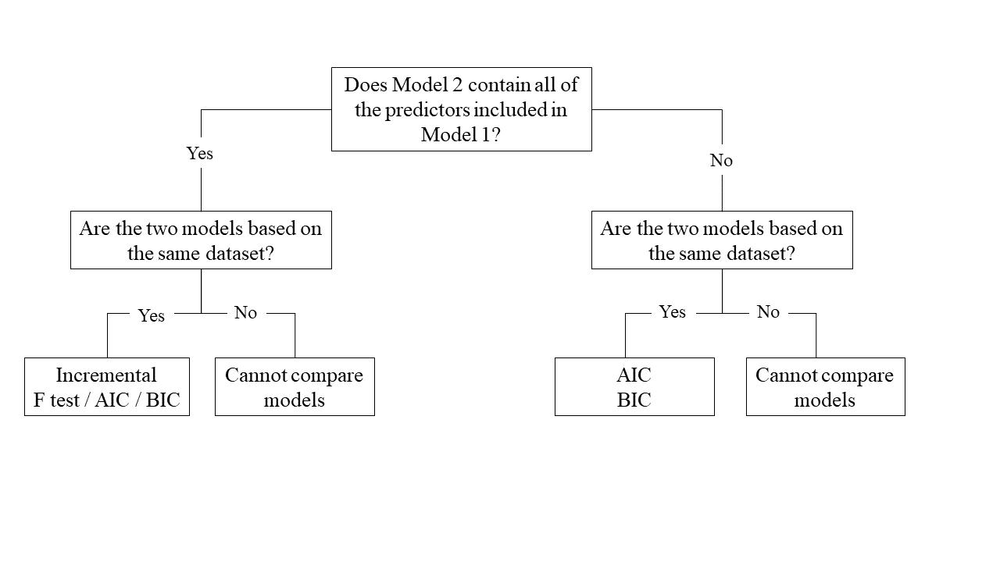
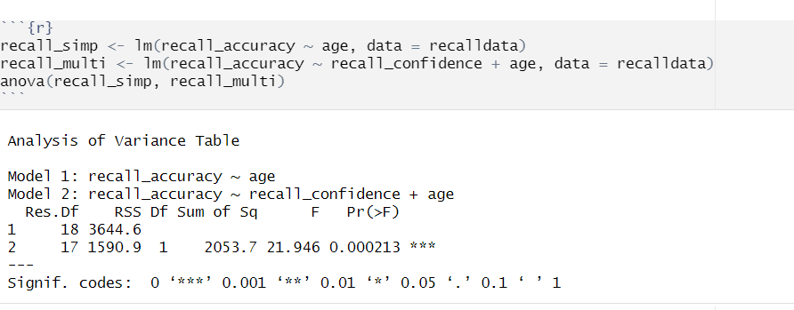
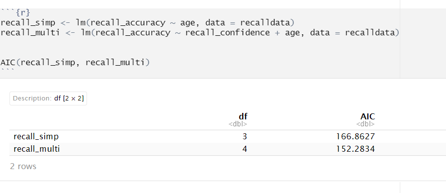
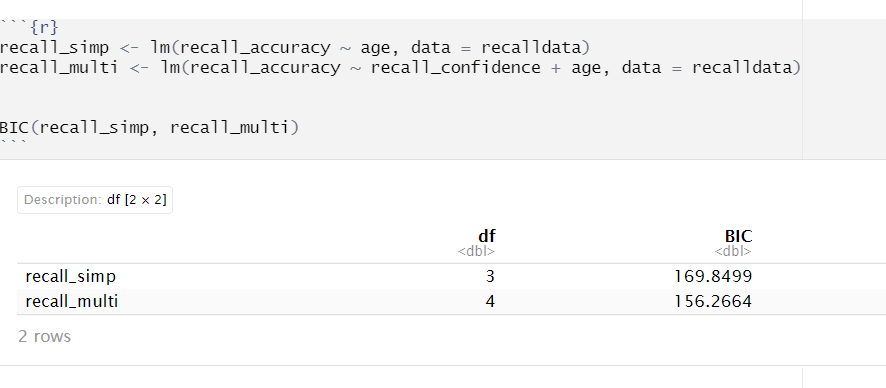

```{r setup, include=FALSE}
source('../assets/setup.R')
```


One useful thing we might want to do is compare our models with and without some predictor(s). There are numerous ways we can do this, but the method chosen depends on the models and underlying data:

```{r comparisons_chart, echo=FALSE, fig.align = 'left', out.width = "100%"}

```

## Nested vs Non-Nested Models

**Nested Models**

Consider that you have two regression models where Model 1 contains a subset of the predictors contained in the other Model 2 and is fitted to the same data. More simply, Model 2 contains all of the predictors included in Model 1, **plus** additional predictor(s). This means that Model 1 is *nested* within Model 2, or that Model 1 is a *submodel* of Model 2. These two terms, at least in this setting, are interchangeable - it might be easier to think of Model 1 as your null and Model 2 as your alternative.

**Non-Nested Models**

Consider that you have two regression models where Model 1 contains different variables to those contained in Model 2, where both models are fitted to the same data. More simply, Model 1 and Model 2 contain unique variables that are not shared. This means that Model 1 and Model 2 are **not** nested.


<br>

## Incremental F-test

If (*and only if*) two models are __nested__, can we compare them using an __incremental F-test__.  

This is a formal test of whether the additional predictors provide a better fitting model.  
Formally this is the test of:  

+ $H_0:$ coefficients for the added/omitted variables are all zero.

+ $H_1:$ at least one of the added/omitted variables has a coefficient that is not zero. 

The $F$-ratio for comparing the residual sums of squares between two models can be calculated as:

$$
F_{(df_R-df_F),~df_F} = \frac{(SSR_R-SSR_F)/(df_R-df_F)}{SSR_F / df_F} \\
\quad \\
$$
$$
\begin{align}
& \text{Where:} \\
\\
& SSR_R = \text{residual sums of squares for the restricted model} \\
& SSR_F = \text{residual sums of squares for the full model} \\
& df_R = \text{residual degrees of freedom from the restricted model} \\
& df_F = \text{residual degrees of freedom from the full model} \\
\end{align}
$$

:::blue
**In R**

We can conduct an incremental $F$-test to compare two models by fitting both models using `lm()`, and passing them to the `anova()` function:

```{r, eval = FALSE}

model1 <- lm( ... )
model2 <- lm( ... )
anova(model1, model2)

```

If we wanted to, for example, compare a model with just one predictor, $x1$, to a model with 2 predictors: $x1$, and $x2$, we can assess the extent to which the variable $x2$ improves model fit:

```{r, eval = FALSE}

model1 <- lm(y ~ x1, data = data_name)
model2 <- lm(y ~ x1 + x2, data = data_name)
anova(model1, model2)

```
  
    
For example:

```{r mlrincF, echo=FALSE, fig.cap="Model Comparisons using Incremental F-test", fig.align = 'left'}

```

:::

::: {.callout-important icon=false appearance="minimal"}

**Example Interpretation**

Recall confidence explained a significant amount of variance in recall accuracy beyond age $(F(1, 17) = 21.95, p < .001)$. 

:::


<br>

## AIC & BIC

AIC (Akaike Information Criterion) and BIC (Bayesian Information Criterion) combine information about the sample size, the number of model parameters, and the residual sums of squares ($SS_{residual}$). Models do not *need* to be nested to be compared via AIC and BIC, __but__ they need to have been fit to the same dataset.    

AIC can be calculated as:  
  
$$
\begin{align}
& AIC = n\,\text{ln}\left( \frac{SS_{residual}}{n} \right) + 2k \\
\end{align}
\quad \\
$$


BIC can be calculated as:   
  
$$
\begin{align}
& BIC = n\,\text{ln}\left( \frac{SS_{residual}}{n} \right) + k\,\text{ln}(n) \\
\end{align}
\quad \\
$$
  
Where for both AIC and BIC:  
  
$$
\begin{align}
& SS_{residual} = \text{sum of squares residuals} \\
& n = \text{sample size} \\
& k = \text{number of explanatory variables} \\
& \text{ln} = \text{natural log function} 
\end{align}
$$
  
   
For both of these fit indices, lower values are better, and both include a penalty for the number of predictors in the model (although BIC's penalty is harsher). 

So how do we determine whether there is a statistical difference between two models? To evaluate our model comparisons, we need to look at the difference ($\Delta$) between the two values:  
  
+ **AIC**: There are no specific thresholds to suggest how big a difference in two models is needed to conclude that one is substantively better than the other  
    
    
+ **BIC**: Using the following $\Delta BIC$ cutoffs (Raftery, 1995):

  
| Value             | Interpretation of Difference between Models  |
|-------------------|----------------------------------------------|
| $\Delta < 2$      | No evidence                                  |
| $2 > \Delta < 6$  | Positive evidence                            |
| $6 > \Delta < 10$ | Strong evidence                              |
| $\Delta > 10$     | Very strong evidence                         |


:::blue
**In R**

We can calculate AIC and BIC by using the `AIC()` and `BIC()` functions respectively:

```{r, eval = FALSE}
#AIC
AIC(modelname)

#BIC
BIC(modelname)
```
  
  
For example, with AIC:  
  
```{r mlraic, echo=FALSE, fig.cap="Model Comparisons using AIC", fig.align = 'left'}

```
  
and BIC:
  
```{r mlrbic, echo=FALSE, fig.cap="Model Comparisons using BIC", fig.align = 'left'}

```

:::

::: {.callout-important icon=false appearance="minimal"}

**Example Interpretation**

Based on both AIC and BIC, the model predicting recall accuracy that included both recall confidence and age was better fitting $(\text{AIC} = 152.28; \text{BIC} = 156.27)$ than the model with age alone $(\text{AIC} = 166.86; \text{BIC} = 169.85)$. 

:::