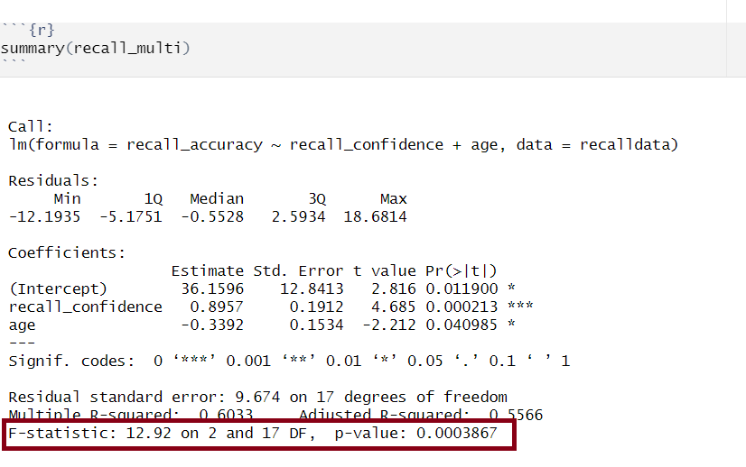
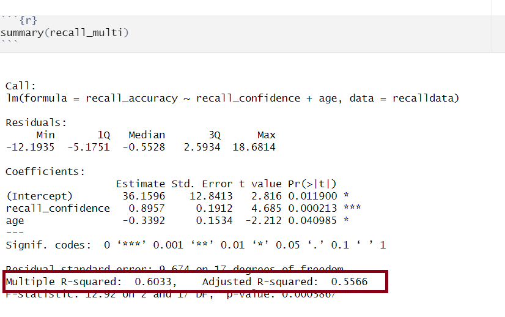

```{r setup, include=FALSE}
source('../assets/setup.R')
library(tidyverse)
```

```{r}
recalldata <- read_csv('https://uoepsy.github.io/data/recalldata.csv')

recall_multi <- lm(
  recall_accuracy ~ recall_confidence + age,
  data = recalldata
)
```


Assessing model fit involves examining metrics like the sum of squares to measure variability explained by the model, the $F$-ratio to evaluate the overall significance of the model by comparing explained variance to unexplained variance, and $R$-squared / Adjusted $R$-squared to quantify the proportion of variance in the dependent variable explained by the independent variable(s).

## Sums of Squares

To quantify and assess a model’s utility in explaining variance in an outcome variable, we can split the total variability of that outcome variable into two terms: the variability explained by the model plus the variability left unexplained in the residuals.

The sum of squares measures the deviation or variation of data points away from the mean (i.e., how spread out are the numbers in a given dataset). We are trying to find the equation/function that best fits our data by varying the least from our data points. 

##### Total Sum of Squares

**Formula**: 

$$
\text{SS}_\text{Total} = \sum_{i=1}^{n}(y_i - \bar{y})^2
$$
Can also be derived from:

$$
\text{SS}_\text{Total} = \text{SS}_\text{Model} + \text{SS}_\text{Residual}
$$

**In words**: 

Squared distance of each data point from the mean of $y$.

**Description**: 

How much variation there is in the DV.

**Example:**

Let's apply to a straightforward example to try by-hand. Suppose you have a simple linear regression model (i.e., with only one IV) where you have the following data points:


| Observed   $x_i$   | Observed   $y_i$   |
|--------------------|--------------------|
|         1          |           5        |
|         2          |           7        |
|         3          |           8        |
|         4          |           6        |
|         5          |           9        |

Steps:  
  
1. Calculate the mean of $y$ ($\bar y$)  
2. Calculate for each observation $y_i$  - $\bar y$  
3. Square each of the obtained $y_i$  - $\bar y$ values  
4. Sum squared values  

*Step 1: Calculate the mean of $y_i$*

$\bar y = {\frac{5+7+8+6+9}{5}} = 7$

*Step 2 & 3: Calculate for each observation $y_i$ - $\bar y$ & square values*


| Observed   $y_i$    | $y_i$ -  $\bar y$  | $(y_i -  \bar y)^2$ |
|--------------------|---------------------|-------------------------|
|         5          |      5 - 7 = -2     |          $-2^2 = 4$     |
|         7          |      7 - 7 = 0      |          $0^2 = 0$      |
|         8          |      8 - 7 = 1      |          $1^2 = 1$      |
|         6          |      6 - 7 = -1     |          $-1^2 = 1$     |
|         9          |      9 - 7 = 2      |          $2^2 = 4$      |

*Step 4: Calculate sum squared values*

$\text{SS}_\text{Total} = 4 + 0 + 1 + 1 + 4 = 10$

##### Residual Sum of Squares

**Formula**: 

$$
\text{SS}_\text{Residual} = \sum_{i=1}^{n}(y_i - \hat{y}_i)^2
$$

**In words**: 

Squared distance of each point from the predicted value.

**Description**: 

How much of the variation in the DV the model did not explain - a measure that captures the unexplained variation in your regression model. Lower residual sum of squares suggests that your model fits the data well, and higher suggests that the model poorly explains the data (in other words, the lower the value, the better the regression model). If the value was zero here, it would suggest the model fits perfectly with no error.

**Example:**

Let's apply to a straightforward example to try by-hand. Suppose you have a simple linear regression model (i.e., with only one IV) where you have the following data points:


| Observed   $x_i$   | Observed  $y_i$    |
|--------------------|--------------------|
|         1          |           5        |
|         2          |           7        |
|         3          |           8        |
|         4          |           6        |
|         5          |           9        |


Steps:   
  
1. Calculate predicted values ($\hat{y}_i$)     
2. Calculate residuals (i.e., the difference between the observed value ($y_i$) and the predicted value ($\hat{y}_i$) for each observation)  
3. Square the residuals   
4. Sum squared values  

*Step 1: Calculate predicted values*

Using $\hat{y}_i = \beta_0 + \beta_1 \cdot x_i$ and our model coefficients $\beta_0 = 4.9$ and $\beta_1 = 0.7$:


| Observed  $x_i$    | Observed   $y_i$   | Predicted ($\hat{y}_i$)   |
|--------------------|--------------------|---------------------------|
|         1          |           5        |  $4.9 + (0.7*1) = 5.6$    |
|         2          |           7        |  $4.9 + (0.7*2) = 6.3$    |
|         3          |           8        |  $4.9 + (0.7*3) = 7$      |
|         4          |           6        |  $4.9 + (0.7*4) = 7.7$    |
|         5          |           9        |  $4.9 + (0.7*5) = 8.4$    |


*Step 2: Calculate residuals*

+ $\epsilon_1 = 5 − 5.6 = -0.6$
+ $\epsilon_2 = 7 - 6.3 = 0.7$
+ $\epsilon_3 = 8 - 7 = 1$
+ $\epsilon_4 = 6 - 7.7 = -1.7$
+ $\epsilon_5 = 9 − 8.4 = 0.6$

*Step 3: Square the residuals*

+ $\epsilon_1^2 = -0.6^2 = 0.36$
+ $\epsilon_2^2 = 0.7^2 = 0.49$
+ $\epsilon_3^2 = 1^2 = 1$
+ $\epsilon_4^2 = -1.7^2 = 2.89$
+ $\epsilon_5^2 = 0.6^2 = 0.36$

*Step 4: Calculate sum of squared values*

$\text{SS}_\text{Residual} = 0.36 + 0.49 + 1 + 2.89 + 0.36 = 5.1$


##### Model Sum of Squares

**Formula**: 

$$
\text{SS}_\text{Model} = \sum_{i=1}^{n}(\hat{y}_i - \bar{y})^2
$$

Can also be derived from:

$$
\text{SS}_\text{Model} = \text{SS}_\text{Total} - \text{SS}_\text{Residual}
$$

**In words**: 

The deviance of the predicted scores from the mean of $y$.

**Description**: 

How much of the variation in the DV your model explained - like a measure that captures how well the regression line fits your data.

**Example:**

Let's apply to a straightforward example to try by-hand. Suppose you have a simple linear regression model (i.e., with only one IV) where you have the following data points:


| Observed   $x_i$   | Observed   $y_i$   |
|--------------------|--------------------|
|         1          |           5        |
|         2          |           7        |
|         3          |           8        |
|         4          |           6        |
|         5          |           9        |


Steps:     
  
1. Calculate mean of $y$ ($\bar y$)   
2. Calculate predicted values ($\hat{y}_i$)   
3. Calculate for each observation $\hat{y}_i  - \bar y$    
4. Squaring each of the obtained $\hat{y}_i  - \bar y$ values     
5. Sum squared values   

*Step 1: Calculate the mean of $y_i$ *

$\bar y = {\frac{5+7+8+6+9}{5}} = 7$

*Step 2: Calculate predicted values*

Using $\hat{y}_i = \beta_0 + \beta_1 \cdot x_i$ and our model coefficients $\beta_0 = 4.9$ and $\beta_1 = 0.7$:


| Observed  ($x_i$)  | Observed  ($y_i$)  | Predicted ($\hat{y}_i$)   |
|--------------------|--------------------|---------------------------|
|         1          |           5        |  $4.9 + (0.7*1) = 5.6$    |
|         2          |           7        |  $4.9 + (0.7*2) = 6.3$    |
|         3          |           8        |  $4.9 + (0.7*3) = 7$      |
|         4          |           6        |  $4.9 + (0.7*4) = 7.7$    |
|         5          |           9        |  $4.9 + (0.7*5) = 8.4$    |


*Step 3 & 4: Calculate for each observation $\hat{y}_i$  - $\bar y$  & square values*


| $\hat{y}_i$  - $\bar y$  | $(\hat{y}_i  - \bar y)^2$       |
|--------------------------|---------------------------------|
|    $5.6 - 7 = -1.4$      |      $(-1.4)^2 = 1.96$          |
|    $6.3 - 7 = -0.7$      |      $(-0.7)^2 = 0.49$          |
|    $7 - 7 = 0$           |      $(0)^2 = 0$                |
|    $7.7 - 7 = 0.7$       |      $(0.7)^2 = 0.49$           |        
|    $8.4 - 7 = 1.4$       |      $(1.4)^2 = 1.96$           |       


*Step 5: Calculate sum of squared values*

$\text{SS}_\text{Model} = 1.96 + 0.49 + 0 + 0.49 + 1.96 = 4.9$


*Alternatively:*

$$
\begin{align}
& \text{SS}_\text{Model} = \text{SS}_\text{Total} - \text{SS}_\text{Residual} \\ 
& \text{SS}_\text{Model} = 10 - 5.1 \\  
& \text{SS}_\text{Model} = 4.9 \\  
\end{align}
$$


<br> 

## F-ratio

**Overview:**

We can perform a test to investigate if a model is ‘useful’ — that is, a test to see if our explanatory variable explains more variance in our outcome than we would expect by just some random chance variable.  

With one predictor, the $F$-statistic is used to test the null hypothesis that the regression slope for that predictor is zero:

$$
H_0: \text{the model is ineffective, }b_1 = 0 \\  
$$
$$
H_1 : \text{the model is effective, }b_1  \neq 0 \\  
$$

In multiple regression, the logic is the same, but we are now testing against the null hypothesis that **all** regression slopes are zero. Our test is framed in terms of the following hypotheses:

$$ 
H_0: \text{the model is ineffective, }b_1,...., b_k = 0 \\    
$$

$$
H_1 : \text{the model is effective, }b_1,...., b_k  \neq 0 \\  
$$

The relevant test-statistic is the $F$-statistic, which uses “Mean Squares” (these are Sums of Squares divided by the relevant degrees of freedom). We then compare that against (you guessed it) an $F$-distribution! $F$-distributions vary according to two parameters, which are both degrees of freedom.

**Formula:** 

$$
\text{F}_{(df_{model},~df_{residual})} = \frac{\text{MS}_\text{Model}}{\text{MS}_\text{Residual}} = \frac{\text{SS}_\text{Model}/\text{df}_\text{Model}}{\text{SS}_\text{Residual}/\text{df}_\text{Residual}} \\
\quad \\
$$

$$
\begin{align}
& \text{Where:} \\
& df_{model} = k \\
& df_{residual} = n-k-1 \\
& n = \text{sample size} \\
& k  = \text{number of explanatory variables} \\
\end{align}
$$


**Description:**

To test the significance of an overall model, we can conduct an $F$-test. The $F$-test compares your model to a model containing zero predictor variables (i.e., the intercept only model), and tests whether your added predictor variables significantly improved the model.

It is called the $F$-ratio because it is the ratio of the how much of the variation is explained by the model (per parameter) versus how much of the variation is unexplained (per remaining degrees of freedom). 

The $F$-test involves testing the statistical significance of the $F$-ratio.   

**Q:** What does the $F$-ratio test?  
**A:** The null hypothesis that all regression slopes in a model are zero (i.e., explain no variance in your outcome/DV). The alternative hypothesis is that **at least one of the slopes is not zero**. 


The $F$-ratio you see at the bottom of `summary(model)` is actually a comparison between two models: your model (with some explanatory variables in predicting $y$) and the *null model*. 

In regression, the null model can be thought of as the model in which all explanatory variables have zero regression coefficients. It is also referred to as the __intercept-only model__, because if all predictor variable coefficients are zero, then we are only estimating $y$ via an intercept (which will be the mean - $\bar y$). 

**Interpretation:** 

Alongside viewing the $F$-ratio, you can see the results from testing the null hypothesis that all of the coefficients are $0$ (the alternative hypothesis is that at least one coefficient is $\neq 0$. Under the null hypothesis that all coefficients = 0, the ratio of explained:unexplained variance should be approximately 1)

If your model predictors do explain some variance, the $F$-ratio will be significant, and you would reject the null, as this would suggest that your predictor variables included in your model improved the model fit (in comparison to the intercept only model).


*Points to note:*

- The larger your $F$-ratio, the better your model
- The $F$-ratio will be close to 1 when the null is true (i.e., that all slopes are zero)


**How to calculate $F$-ratio**

::: {.panel-tabset}

### By Hand

Steps:     
  
1. Calculate model sum of squares 
2. Calculate residual sum of squares 
3. Calculate total sum of squares 
4. Calculate $df_{model}$   
5. Calculate $df_{residual}$   

  
*Step 1, 2, & 3*
  
Follow steps above in the Sums of Squares flashcard:

$$
\begin{align}
& \text{SS}_\text{Total} = 10  \\ 
& \text{SS}_\text{Residual} = 5.1 \\  
& \text{SS}_\text{Model} = 4.9 \\  
\end{align}
$$
  
*Step 4: Calculate $df_{model}$*

$$
\begin{align}
&df_{model} = k  \\  
&df_{model} = 1 
\end{align}
$$

*Step 5: Calculate $df_{residual}$*

$$
\begin{align}
&df_{residual} = n-k-1   \\  
&df_{residual} = 5-1-1  \\  
&df_{residual} = 3  
\end{align}
$$


$$
\begin{align}
&\text{F}_{(df_{model},~df_{residual})} = \frac{\text{MS}_\text{Model}}{\text{MS}_\text{Residual}} = \frac{\text{SS}_\text{Model}/\text{df}_\text{Model}}{\text{SS}_\text{Residual}/\text{df}_\text{Residual}} \\  
\\  
&\text{F}_{(df_{model},~df_{residual})} = \frac{4.9/1}{5.1/3} \\  
\\  
&\text{F}_{(df_{model},~df_{residual})} = \frac{4.9}{1.7} \\  
\\  
&\text{F}_{(df_{model},~df_{residual})} = 2.88  
\end{align}
$$

### Using R
:::blue

In **R**

We can see the $F$-statistic and associated $p$-value at the bottom of the output of `summary(<modelname>)`:

```{r mlroutputf, echo=FALSE, fig.cap="Multiple regression output in R, F statistic highlighted", fig.align = 'left'}

```


Alternatively, you can extract this information as it is stored in the `summary()` of the model:

```{r}
#F-Statistic
summary(recall_multi)$fstatistic

#P-Value
pf(summary(recall_multi)$fstatistic[1], 
   summary(recall_multi)$fstatistic[2], 
   summary(recall_multi)$fstatistic[3], 
   lower.tail = FALSE)
```

:::

:::

::: {.callout-important icon=false appearance="minimal"}

**Example Interpretation**

The linear model with recall confidence and age explained a significant amount of variance in recall accuracy beyond what we would expect by chance $F(2, 17) = 12.92, p < .001$. 

:::


<br> 

## R-squared and Adjusted R-squared

**Overview:**

$R^2$ represents the proportion of variance in $Y$ that is explained by the model predictor variables. 

**Formula:**

The $R^2$ coefficient is defined as the proportion of the total variability in the outcome variable which is explained by our model:
  
$$
R^2 = \frac{SS_{Model}}{SS_{Total}} = 1 - \frac{SS_{Residual}}{SS_{Total}}
$$

The Adjusted $R^2$ coefficient is defined as:
  
$$
\hat R^2 = 1 - \frac{(1 - R^2)(n-1)}{n-k-1}
\quad \\
$$

$$
\begin{align}
& \text{Where:} \\
& n = \text{sample size} \\
& k = \text{number of explanatory variables} \\
\end{align}
$$

<br>

**When to report Multiple $R^2$ vs. Adjusted $R^2$:**

The Multiple $R^2$ value should be reported for a simple linear regression model (i.e., one predictor).   

Unlike $R^2$, Adjusted-$R^2$ does not necessarily increase with the addition of more explanatory variables, by the inclusion of a penalty according to the number of explanatory variables in the model. Since Adjusted-$R^2$ is adjusted for the number of predictors in the model, this should be used when there are 2 or more predictors in the model. As a side note, the Adjusted-$R^2$ should always be less than or equal to $R^2$.


**How to calculate Multiple $R^2$ & Adjusted $R^2$**

::: {.panel-tabset}

### By Hand

Using the information calculated above in the Sums of Squares flashcard above, we can simply substitute values into the formula for $R^2$:

$$
\begin{align}  
& R^2 = \frac{\text{SS}_{\text{Model}}}{\text{SS}_{\text{Total}}} = 1 - \frac{\text{SS}_{\text{Residual}}}{\text{SS}_{\text{Total}}} \\
\\  
& R^2 = \frac{4.9}{10} = 1 - \frac{5.1}{10} \\  
\\  
& R^2 = 0.49 = 0.49
\end{align}  
$$

And for Adjusted-$R^2$:

$$
\begin{align}  
& \text{Adjusted-R}^2 = 1 - \frac{(1 - R^2)(n-1)}{n-k-1} \\
& \quad \\  
& \text{Adjusted-R}^2 = 1 - \frac{(1 - 0.49)(5-1)}{5-1-1} \\
& \quad \\  
& \text{Adjusted-R}^2 = 1 - \frac{(0.51)(4)}{3} \\  
& \quad \\  
& \text{Adjusted-R}^2 = 1 - \frac{2.04}{3} \\
& \quad \\  
& \text{Adjusted-R}^2 = 1 - 0.68 \\
& \quad \\  
& \text{Adjusted-R}^2 = 0.32 \\
\end{align} 
$$
  
### Using R
  
:::blue

In **R**

We can see both $R^2$ and Adjusted-$R^2$ in the second bottom row of the `summary(<modelname>)`:

```{r mlroutputr, echo=FALSE, fig.cap="Multiple regression output in R, R^2 statistic highlighted", fig.align = 'left'}

```
  
  
Alternatively, you can extract this information as it is stored in the `summary()` of the model:
  
```{r}
#R-Squared
summary(recall_multi)$r.squared

#Adjusted R-Squared
summary(recall_multi)$adj.r.squared
```

:::

:::

::: {.callout-important icon=false appearance="minimal"}

**Example Interpretation**

Together, recall confidence and age explained approximately 55.66% of the variance in recall accuracy. 

:::