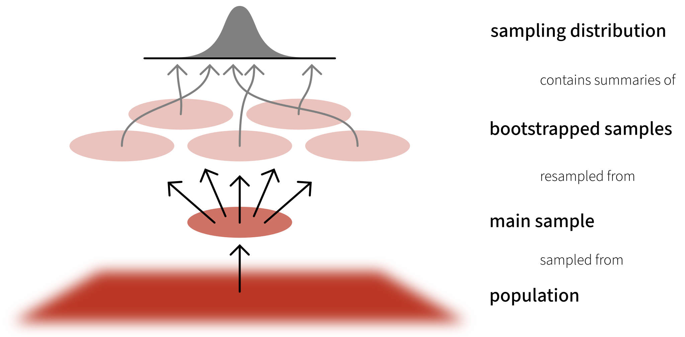

```{r setup, include=FALSE}
source('../assets/setup.R')
library(tidyverse)
```

The bootstrap method is an alternative non-parametric method of constructing a standard error. Instead of having to rely on calculating the standard error with a formula and potentially applying fancy mathematical corrections, bootstrapping involves mimicking the idea of “repeatedly sampling from the population”. It does so by repeatedly **re**sampling with **replacement** from our original sample.

What this means is that we don’t have to rely on any assumptions about our model residuals, because we actually generate an actual distribution that we can take as an approximation of our sampling distribution, meaning that we can actually look at where 95% of the distribution falls, without having to rely on any summing of squared deviations.

**Note, the bootstrap may provide us with an alternative way of conducting inference, but our model may still be mis-specified. It is also very important to remember that bootstrapping is entirely reliant on utilising our original sample to pretend that it is a population (and mimic sampling from that population). If our original sample is not representative of the population that we’re interested in, bootstrapping doesn’t help us at all.**

The _bootstrap_ is a general approach to assessing whether the sample results are statistically significant or not, and allows us to draw inferences to the population from a regression model. This method is assumption-free and does not rely on conditions such as normality of the residuals.

It is based on sampling repeatedly with replacement (to avoid always getting the original sample exactly) from the data at hand, and then computing the regression coefficients from each re-sample. We will equivalently use the word "bootstrap sample" or "resample" (for **sample** with **re**placement).

## Overview

The basic principle is:

<center>
__The population is to the original sample__

__as__

__the original sample is to the bootstrap samples.__

</center>


Because we only have one sample of size $n$, and we do not have access to the data for the entire population, we consider our original sample as our best approximation to the population. 

To be more precise, we assume that the population is made up of many, many copies of our original sample. Then, we take multiple samples each of size $n$ from this assumed population. This is equivalent to sampling _with replacement_ from the original sample.

```{r echo=FALSE, out.width = '90%'}

```


## Terminology

- A _parameter_ is a numerical summary for the population, e.g. the population slope $\beta_1$.
- A _statistic_ is a numerical summary calculated from the sample data, e.g. the estimated slope in the sample $\widehat \beta_1$. We use the sample statistic as a best guess, or estimate, for the unknown population parameter.
- A _bootstrap sample_ is chosen with replacement from an existing sample, using the same sample size.
- A _bootstrap statistic_ is a statistic computed for each bootstrap sample.
- A _sampling distribution_ or _bootstrap distribution_ collects bootstrap statistics for many bootstrap samples.


## In R

Follow these steps:

* 1: Load the **car** package.    
  
* 2: Use the `Boot()` function (do not forget the uppercase B!) which takes as arguments:
    - the fitted model
    - `f`, saying which bootstrap statistics to compute on each bootstrap sample. By default `f = coef`, returning the regression coefficients.
    - `R`, saying how many bootstrap samples to compute. By default `R = 999` but this could be any number. To experiment we recommend 1000, when you want to produce results for journals, it is typical to go with 10,000 or more.
    - `ncores`, saying if to perform the calculations in parallel (and more efficiently). However, this will depend on your PC, and you need to find how many cores you have by running `parallel::detectCores()` on your PC. By default the function uses `ncores = 1`.  
     
* 3: Run the code. However, please remember that the `Boot()` function does **not** want a model which was fitted using data with `NAs`. To remove, for example, you could use `na.omit`.  
  
* 4: Look at the `summary()` of the bootstrap results. When doing so the output will show, for each regression coefficient, the value in the original sample in the column `original`, and in the `bootSE` column, the estimate of the variability of the coefficient from bootstrap sample to bootstrap sample. The `bootSE` provides us the bootstrap standard error, or bootstrap SE in short. We can use this to answer the key question of how accurate our estimate is. 
  
* 5: Compute confidence intervals via the `Confint()` function. Use your preferred confidence level (usually, and by default, 95%) by specifying `level = `. If you select 95% confidence intervals, by also specifying the `type = "perc"` argument, `R` will return the values that comprise 95% of all values in between them, i.e. the value with 2.5% of observations below it and the value with 2.5% of observations above it and 97.5% of observations below it.  
  
* 6: Provide interpretation in the context of your research question and report results in APA format. *(Note: the actual estimates are those from our original model, it is just the bounds of the interval that bootstrapping is providing us with)*. 


**In R**

```{r}
recalldata <- read_csv('https://uoepsy.github.io/data/recalldata.csv')

# specify model
recall_mdl <- lm(recall_accuracy ~ recall_confidence + age, data = recalldata)

#step 1: load car package
library(car)

#step 2/3: bootstrap model (asking to resample 1000 times, i.e., getting a distribution of 1000 values for the coefficients)
bootmymodel <- Boot(recall_mdl, R = 1000)

#step 4: check summary
summary(bootmymodel)

#step 5: confidence intervals
Confint(bootmymodel, level = 0.95, type = "perc")
```


<br> 

::: {.callout-caution collapse="true"}
## Visualise bootstrapped estimates

You can visualise the uncertainty in the estimates by plotting histograms using the built-in function from the **car** package, which simply takes the bootstrap results `bootmymodel`. The bootstrap distribution should appear to be normal, and if non-normal, results are likely untrustworthy (note the distribution can be somewhat ambiguous with a small number of resamples). 

```{r eval}
hist(bootmymodel, ci = "perc", legend = "separate")
```

:::
