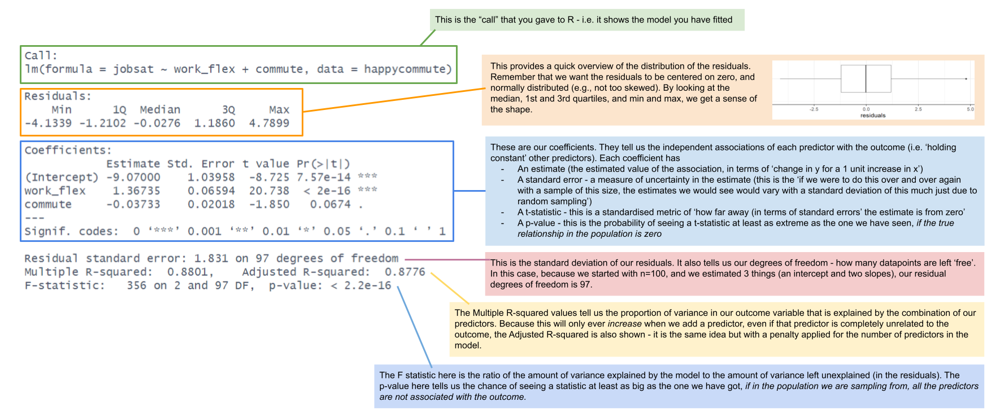
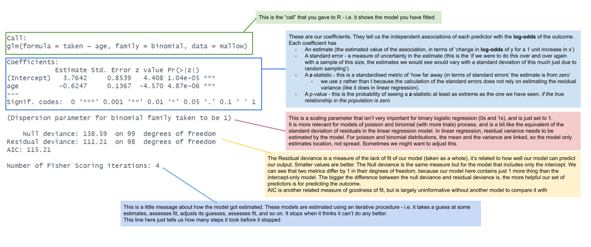

```{r setup, include=FALSE}
source('../assets/setup.R')
```

## `lm()` summary, annotated

(You may want to open the image in a new tab to zoom in)

```{r}
#| echo: false

```

<br>

## `glm()` summary, annotated

(You may want to open the image in a new tab to zoom in)

```{r}
#| echo: false

```

