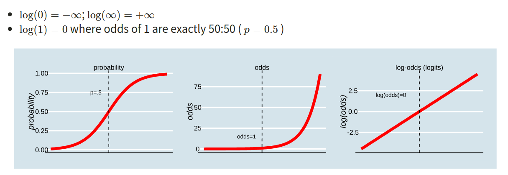

```{r setup, include=FALSE}
source('../assets/setup.R')
library(tidyverse)
library(sjPlot)
```


## Probability, Odds, Log-Odds

-   The **probability** $p$ ranges from 0 to 1.

-   The **odds** $\frac{p}{1-p}$ ranges from 0 to $\infty$.

-   The **log-odds** (sometimes called “logits”) $\ln \left( \frac{p}{1-p} \right)$ ranges from $-\infty$ to $\infty$. 

::: callout-note
In the labs, we sometimes used "log" to denote log-odds. In the lectures, and above, you will have seen this denoted as "ln". 
:::

```{r plodd, echo=FALSE, out.width = '95%', fig.cap="Probability, Odds and Log-odds"}

```

**Conversions**

Between probabilities, odds and log-odds ("logit"):    

$$
\begin{align}
&\text{for probability p of Y for observation i:}\\
\qquad \\
odds_i & = \frac{p_i}{1-p_i} \\
\qquad \\
logit_i &= ln(odds_i) = ln(\frac{p_i}{1-p_i}) \\
\qquad \\
p_i & = \frac{odds_i}{1 + odds_i} = \frac{e^{logit_i}}{(1+e^{logit_i})}
\end{align}
$$

In order to understand the connections among these concepts, lets work with an example where the *probability $(p)$* of an event occurring is 0.2:

-   Odds of event occurring:

$$
\text{odds} \quad = \quad (\frac{0.2}{1-0.2}) \quad = \quad (\frac{0.2}{0.8}) \quad = \quad 0.25
$$

-   Log-odds of the event occurring:

$$
\text{logit} \quad = \quad ln(\frac{0.2}{1-0.2}) \quad = \quad ln(\frac{0.2}{0.8}) \quad = \quad -1.3863
$$

<center>
**OR**
</center>

$$
ln(0.25) \quad = \quad -1.3863
$$

-   Probability can be reconstructed as:

$$
\text{p} \quad = \quad (\frac{0.25}{1+0.25}) \quad = \quad 0.2 
$$
<center>
**OR**
</center>

$$
\text{p} \quad = \quad \frac{e^{-1.3863}}{1+e^{-1.3863}} \quad = \quad \frac{0.25}{1.25} \quad = \quad 0.2
$$

::: blue
In **R**

-   Odds of event occurring:

    `odds <- 0.2 / (1 - 0.2)`

-   Log-odds of the event occurring:

    `log_odds <- log(0.25)`
    
     **OR**

    `log_odds <- qlogis(0.2)`

-   obtain the probability from the odds

    `prob_O <- odds / (1 + odds)`

-   obtain the probability from the log-odds

    `prob_LO <- exp(log_odds) / (1 + exp(log_odds))`

     **OR**

    `prob_LO <- plogis(log_odds)`

:::


<br> 

## Non-Continuous Outcome Variables (DVs)

There are lots of outcome variables that we typically assess within Psychology that are not captured on a continuous scale. For example:

**Binary Variables**

+ Failure vs success
+ No vs yes
+ Fail vs pass
+ Unemployed vs employed
+ Not depressed vs depressed 
   
For binary variables, values can only take one of two values, which we often encode as 0 or 1. Values can’t be 0.5, -2, or 1.3, they can only be 0 or 1.

**Count Variables**

+ Number of times a person experiences a panic attack in a week
+ Number of passes
+ Frequency of negative thoughts reported by an individual
  
For count data, values can’t take any real number, they can only take integers (0, 1, 2, 3, …).

Neither type of outcome (i.e., binary or count) is continuous, and therefore a linear regression model is not suitable. If we were to incorrectly fit a linear model to an outcome variable measured on a non-continuous scale, then the model would likely return estimated values that are simply impossible to observe, and we'd likely be violating a few assumptions too (e.g., constant variance).


<br>

## Generalized Linear Models

The generalized linear model allows us to be able to talk about linear associations between predictors and the log-odds of an event (or between predictors and log-counts).

In its general form, the GLM looks pretty similar to the standard LM. We can write it as:  

$$
\text{g(}\text{y)}\ \quad = \quad b_0 + b_1 \cdot x_1 + ... + b_p \cdot x_p
$$
The difference is that $\text{g()}$ is a function (like log, or logit) that links the expected value of $\text{y}$ to the linear prediction of $b_0 + b_1 \cdot x_1 + ... + b_p \cdot x_k$. 

It's important to note that when specifying a generalized linear model, just like with a linear model, the predictors can either be continuous and/or categorical.

:::blue
**In R**

In order to fit these models in `R`, we need to use the `glm()` function. This is a generalized form of the `lm()` function we have used elsewhere in the course. The only difference is that we need to also tell the function the `family` of the outcome variable, and the “`link` function”.

The family argument takes (the name of) a family function which specifies the link function and variance function (as well as a few other arguments not entirely relevant to the purpose of this course).

The exponential family functions available in **R** are:

-   `binomial` (link = "logit")
-   `gaussian` (link = "identity")
-   `poisson` (link = "log")
-   `Gamma` (link = "inverse")
-   `inverse.gaussian` (link = "1/mu2")

See `?glm` for other modeling options. See `?family` for other allowable link functions for each family.

:::

There are three key components to consider when selecting the family function to use when fitting GLMs:

-   Random component / probability distribution - The distribution of the response/outcome variable. Can be from any family of distributions as listed above
-   Systematic component / linear predictor - the explanatory/predictor variable(s) 
-   Link function - specifies the link between a random and systematic components  


<br>

## Binary Logistic Regression

When a response $(y)$ is binary coded (i.e., 0/1) we must use logistic regression.

Outcome $y$ is binary, $y \in [0,1]$  

$$
\begin{align}
{ln \left( \frac{p}{1-p} \right) } &= b_0 + b_1 \cdot x_1 + ... + b_p \cdot x_p \\
\qquad \\
\text{where } {p} &= \text{probability of event }y\\
\end{align}
$$

:::blue
**In R**

The outcome (in our example below, `binary_y`) can either be 0s and 1s, or coded as a factor with 2 levels.

```{r, eval=FALSE}
glm(binary_y ~ x1 + x2, data = df, family = binomial(link="logit"))
```

**OR**

```{r, eval=FALSE}
glm(binary_y ~ x1 + x2, data = df, family = binomial)
```

As just putting `family = binomial`  will also work (as it will by default use the “logit” link)

:::


<br>

## Interpretation of Coefficients

::: {.panel-tabset}

### Interpretation Steps

To interpret the fitted coefficients, we first exponentiate the model:
$$
\begin{aligned}
\log \left( \frac{p_x}{1-p_x} \right) &= \beta_0 + \beta_1 x \\
e^{ \log \left( \frac{p_x}{1-p_x} \right) } &= e^{\beta_0 + \beta_1 x } \\
\frac{p_x}{1-p_x} &= e^{\beta_0} \ e^{\beta_1 x}
\end{aligned}
$$

and recall that the probability of success divided by the probability of failure is the odds of success

$$
\frac{p_x}{1-p_x} = \text{odds}
$$


When we exponentiate coefficients from a model fitted to the log-odds, the resulting association is referred to as an “odds ratio” $(OR)$. There are various ways of describing odds ratios:

- "for a 1 unit increase in $x$ the odds of $y$ change by _a ratio_ of `exp(b)`"   
- "for a 1 unit increase in $x$ the odds of $y$ are multiplied by `exp(b)`"  
- "for a 1 unit increase in $x$ there are `exp(b)` increased/decreased odds of $y$"  

Instead of thinking of a coefficient of 0 as indicating "no association", in odds ratios this when the $OR = 1$. 

- __OR = 1__ : equal odds ($1 \times odds = odds \text{ don't change}$)   
- __OR < 1__ : decreased odds ($0.5 \times odds = odds \text{ are halved}$)  
- __OR > 1__ : increased odds ($2 \times odds = odds \text{ are doubled}$)  


::: blue
**In R**

To translate log-odds to odds in order to aid interpretation, we can exponentiate (i.e., by using `exp()`) the coefficients from a model using `R` via the following command:

```{r, eval = FALSE}
exp(coef(sen_mdl1))
```

We can also use `R` to extract predicted probabilities from our models.

-   Calculate the predicted log-odds (probabilities on the logit scale): `predict(model, type="link")`
-   Calculate the predicted probabilities: `predict(model, type="response")`
:::

### Common Interpretation Mistakes

**OR are not "exp(b) times more likely"** 

Often you will hear people interpreting odds ratios as "$y$ is `exp(b)` times as likely". Although it is true that increased odds is an increased likelihood of $y$ occurring, double the odds does not mean you will see _twice_ as many occurrences of $y$ - i.e. it does not translate to doubling the probability.  

Here's a little more step-by-step explanation to explain:  

```{r}
#| echo: false
mallow <- read_csv("https://uoepsy.github.io/data/mallow.csv")
mallowmod <- glm(taken ~ age, data = mallow, family=binomial)
cc = round(coef(mallowmod),2)
ec = round(exp(coef(mallowmod)),2)

tibble(coefficient=c("(Intercept)","age"),b=round(coef(mallowmod),2),`exp(b)`=round(exp(coef(mallowmod)),2)) %>% gt::gt()
```

1. For children aged 2 years old the log-odds of them taking the marshmallow are `r paste0(cc[1]," + ", cc[2],"*2")` = `r cc %*% c(1,2)`.  
2. Translating this to odds, we exponentiate it, so the odds of them taking the marshmallow are $e^{(`r paste0(cc[1]," + ", cc[2],"*2")`)} = e^{`r cc %*% c(1,2)`} = `r round(exp(cc %*% c(1,2)),2)`$.   
(This is the same^[$e^{a+b} = e^a \times e^b$. For example: $2^2 \times 2^3 = 4 \times 8 = 32 = 2^5 = 2^{2+3}$] as $e^{`r cc[1]`} \times e^{`r paste0(cc[2],"*2")`}$)   
3. These odds of `r round(exp(cc %*% c(1,2)),2)` means that (rounded to nearest whole number) if we take 13 children aged 2 years, we would expect 12 of them to take the marshmallow, and 1 to not take it.  
4. If we consider how the odds change for every extra year of age (i.e. for 3 year old as opposed to 2 year old children):
    - the log-odds of taking the marshmallow decrease by `r round(cc[2],2)`.  
    - the odds of taking the marshmallow are multiplied by `r round(ec[2],2)`.  
    - so for a 3 year old child, the odds are $`r round(exp(cc %*% c(1,2)),2)` \times `r round(ec[2],2)` = `r round(exp(cc %*% c(1,3)),2)`$.  
    (And we can also calculate this as $e^{`r round(cc %*% c(1,2),2)` + `r round(cc[2],2)`}$)  
5. So we have gone from odds of 12.4-to-1 for 2 year olds, and 6.7-to-1 for 3 year olds. The odds have been multiplied by `r round(ec[2],2)`.    
But those odds, when converted to probability, these are 0.93 and 0.87. So $0.54 \times odds$ is not $0.54 \times probability$.  


### Converting to Probability

**The intercept (but not slopes) can be converted to a probability**

Because our intercept is at a single point (it's not an _association_), we can actually convert this to a probability. Remember that $odds = \frac{p}{1-p}$, which means that $p = \frac{odds}{1 + odds}$. So the probability of taking the marshmallow for a child aged zero is $\frac{`r round(exp(coef(mallowmod))[1],2)`}{1 + `r round(exp(coef(mallowmod))[1],2)`} = `r round(round(exp(coef(mallowmod))[1],2)/(1+round(exp(coef(mallowmod))[1],2)),2)`$.  


Unfortunately, we can't do the same for any slope coefficients. This is because while the intercept is "odds", the slopes are "odds ratios" (i.e. changes in odds), and changes in odds are different at different levels of probability.  

Consider how when we multiply odds by 2, the increase in probability is not constant:  

| Odds     | Probability |
| ----------- | ----------- |
| 0.5   | $\frac{1}{1+0.5} = 0.33$  |
| 1   | $\frac{1}{1+1} = 0.5$  |
| 2   | $\frac{2}{1+2} = 0.66$  |
| 4   | $\frac{4}{1+4} = 0.8$  |
| 8   | $\frac{8}{1+8} = 0.88$  |


:::


<br> 

#### Example

> **Research Question** 
>
> Does the probability of having senility symptoms change as a function of WAIS score?  

## Overview

A small sample ($n$ = 54) of elderly people were given a psychiatric examination to determine if symptoms of senility were present (`senility`: 0 = not present; 1 = present). Other measurements taken at the same time included the score on a subset of the Wechsler Adult Intelligence Scale (`wais`).

```{r}
sendata <- read_csv("https://uoepsy.github.io/data/SenilityWAIS.csv")
```


<br>

## Visualise Data

We can superimpose (i.e., add) a line of best fit by including the argument `+ geom_smooth()`. Since we want to fit an S-shaped logistic curve, we want to use `method = "glm"`. GLMs require that we specify the error distribution, so we need to tell R to model probabilities correctly by specifying `method.args = list(family = binomial)`.


```{r}
sendata |>
  ggplot(aes(x = wais, y = senility)) +
  ylab("p(senility)") +
  geom_jitter(size = 2) +
  geom_smooth(method = "glm", method.args = list(family = binomial))
```


<br>

## Model Specification

$$
\begin{aligned}
\qquad \log \left( \frac{p}{1 - p}\right) = \beta_0 + \beta_1 \cdot \text{WAIS Score}
\end{aligned}
$$

$$
\begin{aligned}
\text{where}~{p}~ &=~ \text{probability of having senility symptoms}
\end{aligned}
$$


<br>

## Model Building

```{r}
#build glm model
sen_mdl1 <- glm(senility ~ wais, family = "binomial", data = sendata)

#examine summary
summary(sen_mdl1)

#convert to odds ratio
exp(coef(sen_mdl1))

#get confidence intervals
exp(confint(sen_mdl1))
```


<br>

## Results Interpretation

::: {.panel-tabset}

## `(Intercept)`  


$\beta_0$ = `(Intercept)` = `r round(coef(sen_mdl1)[1],2)`  

+ **Log-odds**: The intercept estimate of `r round(coef(sen_mdl1)[1],2)` is in log-odds
    - The log-odds of having senility symptoms for individuals with a WAIS score of 0 were `r round(coef(sen_mdl1)[1],2)`
    
+ **Odds**: To convert from log-odds to odds, we exponentiate ($odds = e^{log-odds}$)  
    - The odds of having senility symptoms for individuals with a WAIS score of 0 were $e^{2.4040} = 11.06736$.

+ **Probability**: To convert odds back to probability, we calculate $\frac{odds}{1+odds}$  
    - The probability of having senility symptoms for individuals with a WAIS score of 0 was 92% ($\frac{11.06736}{1 + 11.06736} = 0.9171318$)
    

## `wais`   

$\beta_1$ = `wais` = `r round(coef(sen_mdl1)[2],2)` 

+ **Log-odds**: The slope estimate of `r round(coef(sen_mdl1)[2],2)` is in log-odds
    - A one point increase in WAIS score was associated with a 0.32 decrease in the log-odds of experiencing senility symptoms 
    
+ **Odds**: To convert from log-odds to odds, we exponentiate ($odds = e^{log-odds}$)  
    - The odds of having senility symptoms for individuals with a WAIS score of 0 were $e^{-0.3235} = 0.72359$
    - For every one point increase in WAIS score, the odds of individuals experiencing senility symptoms were multiplied by 0.72
    - In other words, for every additional point scored on the WAIS, the odds of having senility symptoms decreased by a factor of 0.72

:::


<br>

## Model Visualisation

We can simply display the predicted probability across values of some predictor. To do so, we need to use the `effect()` function from the **effects** package. 

In terms of of specification, it might be useful to look up the helper function (i.e., `?effect`). As a quick guide:

Within `effect()`:   

+ `term = `:   
+ `mod`: the name of the fitted model  
+ `xlevels = `: return X number of evenly spaced fitted values across the predictor (in the below example, we are asking for 20)        
    
        
Within `ggplot()`:      
+  `x = `: predictor on x-axis        
+  `y`: predicted outcome on y-axis       
+  `ymin = `: lower CI bound      
+  `ymax = `: upper CI bound      
+  `geom_line()`: predicted effect line (i.e., how the DV varies as a function of the continuous IV)              
+  `geom_pointrange()`: predicted probability for each group (i.e., how the DV differs across categorical IV)                 
+  `geom_ribbon() `: shaded band representing the confidence interval                        
    
        
        
```{r}
library(effects)

effect(term = "wais", mod = sen_mdl1, xlevels = 20) |>
  as.data.frame() |>
  ggplot(aes(x=wais,y=fit,ymin=lower,ymax=upper))+
  geom_line()+
  geom_ribbon(alpha=.3)
```

<br>

Using `plot_model()` from the **sjPlot** package, we can visualise the model odds ratios and confidence intervals. To get our estimates, we need to specify `type = "est"`.

```{r}
plot_model(sen_mdl1,
           type = "est")
```


