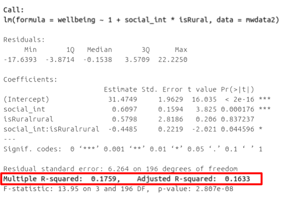
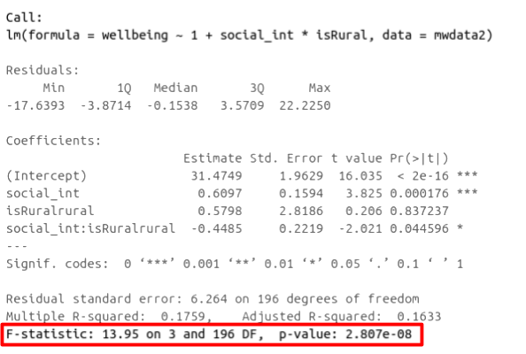

```{r setup, include=FALSE}
source('assets/setup.R')
```


:::red
**PRE-LAB ACTIVITIES**

Before attempting the lab please read ?.
:::

:::lo
**LEARNING OBJECTIVES**

1. Understand measures of model fit using $R^2$ and F.  
2. Understand the principles of model selection and how to compare models via $R^2$ and F tests. 
3. Understand AIC and BIC.
4. Understand the basics of Backward elimination, Forward selection and stepwise regression. 

:::

# Model Fit 


:::frame
## Adjusted $R^2$  

We know from our work on simple linear regression that the R-squared can be obtained as:
$$
R^2 = \frac{SS_{Model}}{SS_{Total}} = 1 - \frac{SS_{Residual}}{SS_{Total}}
$$

However, when we add more and more predictors into a multiple regression model, $SSE$ cannot increase, and may decrease by pure chance alone, even if the predictors are unrelated to the outcome variable. Because $SSTotal$ is constant, the calculation $1-\frac{SSE}{SSTotal}$ will increase by chance alone. 

An alternative, the Adjusted-$R^2$, does not necessarily increase with the addition of more explanatory variables, by including a penalty according to the number of explanatory variables in the model. It is not by itself meaningful, but can be useful in determining what predictors to include in a model. 
$$
Adjusted{-}R^2=1-\frac{(1-R^2)(n-1)}{n-k-1} \\
\quad \\
\begin{align}
& \text{Where:} \\
& n = \text{sample size} \\
& k = \text{number of explanatory variables} \\
\end{align}
$$

---

**In R,** you can view the mutiple and adjusted $R^2$ at the bottom of the output of `summary(<modelname>)`:

```{r mlroutputrsq, echo=FALSE, fig.cap="Multiple regression output in R, summary.lm(). R-squared highlighted",fig.align = 'left'}

```

:::  

:::frame  
## F-ratio  

As in simple linear regression, the F-ratio is used to test the null hypothesis that all regression slopes are zero.  

It is called the F-ratio because it is the ratio of the how much of the variation is explained by the model (per paramater) versus how much of the variation is unexplained (per remaining degrees of freedom). 

$$
F_{df_{model},df_{residual}} = \frac{MS_{Model}}{MS_{Residual}} = \frac{SS_{Model}/df_{Model}}{SS_{Residual}/df_{Residual}} \\
\quad \\
\begin{align}
& \text{Where:} \\
& df_{model} = k \\
& df_{error} = n-k-1 \\
& n = \text{sample size} \\
& k  = \text{number of explanatory variables} \\
\end{align}
$$

---

**In R,** at the bottom of the output of `summary(<modelname>)`, you can view the F ratio, along with an hypothesis test against the alternative hypothesis that the at least one of the coefficients $\neq 0$ (under the null hypothesis that all coefficients = 0, the ratio of explained:unexplained variance should be approximately 1):

```{r mlroutputrf, echo=FALSE, fig.cap="Multiple regression output in R, summary.lm(). F statistic highlighted", fig.align = 'left'}

```
  
:::


`r qbegin(1)`
Run the code below. It reads in the wellbeing/rurality study data, and creates a new binary variable which specifies whether or not each participant lives in a rural location.  

```{r}
library(tidyverse)
mwdata2<-read_csv("data/wellbeing_rural.csv")
mwdata2 <- 
  mwdata2 %>% mutate(
  isRural = ifelse(location=="rural","rural","notrural")
)
head(mwdata2)
```


Fits the following model, and assign it the name "wb_mdl1".

+ $\text{Wellbeing} = \beta_0 + \beta_1 \cdot \text{Social Interactions} + \beta_2 \cdot \text{IsRural} + \epsilon$  

Does the model provide a better fit to the data than a model with no explanatory variables? (i.e., test against the alternative hypothesis that at least one of the explanatory variables significantly predicts wellbeing scores). 

`r qend()`
`r solbegin(show=params$SHOW_SOLS)`

```{r}
wb_mdl1 <- lm(wellbeing ~ social_int + isRural, data=mwdata2)
```

:::int
```{r echo=FALSE}
mdl1<-wb_mdl1
```
Weekly social interactions and location (rural vs not rural) explained `r paste0(round(summary(mdl1)$adj.r.squared*100,1),"%")` of the variance (adjusted $R^2$ =`r round(summary(mdl1)$adj.r.squared,3)`, $F$(`r paste(summary(mdl1)$fstatistic[2:3],collapse=",")`)=`r round(summary(mdl1)$fstatistic,1)[1]`, p`r map_chr(pf(summary(mdl1)$fstatistic[1],summary(mdl1)$fstatistic[2],summary(mdl1)$fstatistic[3], lower.tail = FALSE), ~ifelse(.<001,"<.001",paste0("=",round(.,2))))`)
:::
  
`r solend()`


# Model Comparison 


:::frame
## Incremental F-test  

:::yellow
If (*and only if*) two models are __nested__ (one model contains all the predictors of the other and is fitted to the same data), we can compare them using an __incremental F-test.__  

This is a formal test of whether the additional predictors provide a better fitting model.  
Formally this is the test of:  

+ $H_0:$ coefficients for the added/ommitted variables are all zero.
+ $H_1:$ at least one of the added/ommitted variables has a coefficient that is not zero. 
:::

The F-ratio for comparing the residual sums of squares between two models can be calculated as:

$$
F_{(df_R-df_F),df_F} = \frac{(SSR_R-SSR_F)/(df_R-df_F)}{SSR_F / df_F} \\
\quad \\
\begin{align}
& \text{Where:} \\
& SSR_R = \text{residual sums of squares for the restricted model} \\
& SSR_F = \text{residual sums of squares for the full model} \\
& df_R = \text{residual degrees of freedom from the restricted model} \\
& df_F = \text{residual degrees of freedom from the full model} \\
\end{align}
$$

---

**In R,** we can conduct an incremental F-test by constructing two models, and passing them to the `anova()` function: `anova(model1, model2)`. 

:::


`r qbegin(2)`
The F-ratio you see at the bottom of `summary(model)` is actually a comparison between two models: your model (with some explanatory variables in predicting $y$) and __the null model.__ In regression, the null model can be thought of as the model in which all explanatory variables have zero regression coefficients. It is also referred to as the __intercept-only model__, because if all predictor variable coefficients are zero, then the only we are only estimating $y$ via an intercept (which will be the mean - $\bar y$).  

Use the code below to fit the null model.  
Then, use the `anova()` function to perform a model comparison between your earlier model (**wb_mdl1**) and the null model.  
Check that the F statistic is the same as that which is given at the bottom of `summary(wb_mdl1)`.  

```{r}
null_model <- lm(wellbeing ~ 1, data = mwdata2)
```

`r qend()`
`r solbegin(show=params$SHOW_SOLS)`

```{r}
# fit the null model
null_model <- lm(wellbeing ~ 1, data = mwdata2)

# model comparison null vs wb_mdl1
anova(null_model, wb_mdl1)

# extract f statistic from summary of wb_mdl1
summary(wb_mdl1)$fstatistic
# we can retrieve the p-value:
fstat = summary(wb_mdl1)$fstatistic[1]
df_1 = summary(wb_mdl1)$fstatistic[2]
df_2 = summary(wb_mdl1)$fstatistic[3]
pf(fstat, df_1, df_2, lower.tail = FALSE)
```
`r solend()`


`r qbegin(3)`
Fit the model specified below, and assign it the name "wb_mdl2"

+ $\text{Wellbeing} = \beta_0 + \beta_1 \cdot \text{Social Interactions} + \beta_2 \cdot \text{IsRural} + \beta_3 \cdot \text{Outdoor time} +  \epsilon$ 

Which model, **wb_mdl1** or **wb_mdl2**, explains more of the variation in Wellbeing scores?  
Does **wb_mdl2** provide a significantly better fit of the data compared to **wb_mdl1**?  

`r qend()`
`r solbegin(show=params$SHOW_SOLS)`
```{r}
wb_mdl2 <- lm(wellbeing ~ 1 + social_int + isRural + outdoor_time, data=mwdata2)

summary(wb_mdl1)$adj.r.squared
summary(wb_mdl2)$adj.r.squared

anova(wb_mdl1, wb_mdl2)
```

`r solend()`

:::frame 
# Incremental validity - A caution  

A common goal for researchers is to determine which variables matter (and which do not) in contributing to some outcome variable. A common approach to answer such questions is to consider whether some variable $X$'s contribution remains significant _after_ controlling for variables $Z$.  

The reasoning:   
<center>If our measure of $X$ correlates significantly with outcome $Y$ _even when controlling for our measure of $Z$, then $X$ contributes to $y$ over and above the contribution of $Z$.</center>

In multiple regression, we might fit the model $Y = \beta_0 + \beta_1 \cdot X + \beta_2 \cdot Z + \epsilon$ and conclude that $X$ is a useful predictor of $Y$ over and above $Z$ based on the the estimate $\hat \beta_1$.  

__Toy Example:__  
Suppose we have monthly data over a seven year period which captures the number of shark attacks on swimmers each month, and the number of ice-creams sold by beach vendors each month.  
Consider the relationship between the two:  
```{r echo=FALSE}
read_csv("data/sharks.csv") %>%
ggplot(.,aes(x=ice_cream_sales,y=shark_attacks))+geom_point()+stat_smooth(method="lm")
```

We can fit the linear model and see a significant relationship between ice cream sales and shark attacks:  
```{r}
sharkdata <- read_csv("data/sharks.csv")
shark_mdl <- lm(shark_attacks ~ ice_cream_sales, data = sharkdata)
summary(shark_mdl)
```

`r qbegin()`
Does the relationship between ice cream sales and shark attacks make sense? What might be missing from our model? 
`r qend()`
`r solbegin(show=TRUE, toggle=FALSE)`
You might quite rightly suggest that this relationship is actually being driven by temperature - when it is hotter, there are more ice cream sales _and_ there are more people swimming (hence more shark attacks). 
`r solend()`


`r qbegin()`
Is $X$ (the number of ice-cream sales) a useful predictor of $Y$ (numbers of shark attacks) over and above $Z$ (temperature)?  
<br>
We might answer this with a multiple regression model including both temperature and ice cream sales as predictors of shark attacks: 
```{r}
shark_mdl2 <- lm(shark_attacks ~ ice_cream_sales + temperature, data = sharkdata)
summary(shark_mdl2)
```

What do you conclude? 

`r qend()`
`r solbegin(show=TRUE, toggle=FALSE)`
It appears that numbers of ice cream sales is _not_ a significant predictor of sharks attack numbers over and above the temperature.  
`r solend()`

In psychology, we can rarely observe and directly measure the constructs which we are interested in (for example, personality traits, intelligence, emotional states etc.). We rely instead on measurements of, e.g. behavioural tendencies, as a proxy for personality traits.  

Let's suppose that instead of including temperature in degrees celsius, we asked a set of people to self-report on a scale of 1 to 7 how hot it was that day. This measure should hopefully correlate well with the _actual_ temperature, however, there will likely be some variation: 
```{r}
ggplot(data = sharkdata, aes(x = temperature, y = sr_heat)) + 
  geom_point() + 
  labs(title = paste0("r = ",round(cor(sharkdata$temperature, sharkdata$sr_heat),2)))
```

`r qbegin()`
Is $X$ (the number of ice-cream sales) a useful predictor of $Y$ (numbers of shark attacks) over and above $Z$ (temperature - measured on our self-reported heat scale)?  
<br>
```{r}
shark_mdl2a <- lm(shark_attacks ~ ice_cream_sales + sr_heat, data = sharkdata)
summary(shark_mdl2a)
```

What do you conclude? 
`r qend()`

Moral of the story: be considerate of what exactly it is that you are measuring. 
<br>
This example was adapted from [Westfall and Yarkoni, 2020](https://onlinelibrary.wiley.com/doi/full/10.1111/pere.12309) which provides a much more extensive discussion of incremental validity and type 1 error rates. 


:::


AIC and BIC

## model selection
https://link.springer.com/article/10.1007/s10463-009-0234-4

step/drop1
http://joshualoftus.com/post/model-selection-bias-invalidates-significance-tests/


