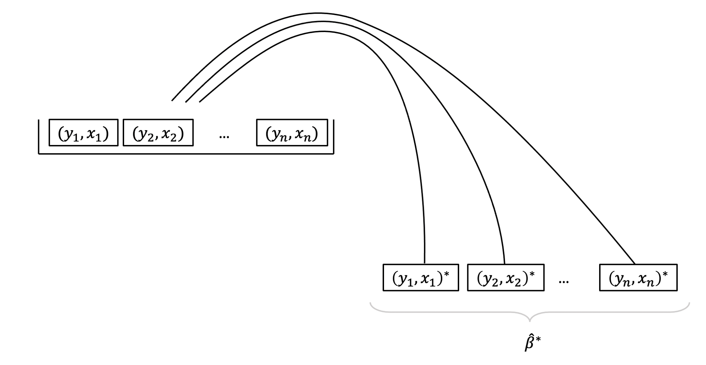

```{r setup, include=FALSE}
source('assets/setup.R')
```

```{r echo=FALSE}
knitr::opts_chunk$set(cache = TRUE)
set.seed(3)
```

This week we examine another technique for drawing inferences to the population from a regression model. This method is, known as bootstrapping, is assumptions-free and does not rely on conditions such as normality of the residuals.


:::yellow
**Bootstrap Terminology**

- A _bootstrap sample_ is chosen with replacement from an existing sample, using the same sample size.
- A _bootstrap statistic_ is a statistic computed for each bootstrap sample.
- A _bootstrap distribution_ collects bootstrap statistics for many bootstrap samples.
:::


# Age, Knowledge and Attitudes About Science

This week's lab explores whether attitudes towards science and faith can be modelled as a linear function of a person’s age and knowledge about science, from the 2005 Eurobarometer 63.1 survey. The research question guiding this example is:

> Is age and knowledge about science associated with attitudes towards science and faith?

We can also state this in the form of two hypotheses:

- There is no linear relationship between people's age and their attitudes to science and faith after accounting for their scientific knowledge.
- There is no linear relationship between people's scientific knowledge and their attitudes to science and faith after accounting for their age.


# The Data
This example uses three variables from the Eurobarometer 63.1 survey:

- `kstot`: Score on a science “quiz” composed of 13 true/false items.
- `toomuchscience`: Attitude to science and faith (question wording: "We rely too much on science and not enough on faith"; responses on a 5-point scale from strongly disagree to strongly agree).
- `age`: Age measured in years.

The science knowledge quiz has a range of 0 to 13. Its mean is about 8.7. The attitude to science and faith question has five categories, ranging from 0 to 4, with a mean of about 2.5. Age has a range of 15–93, with a mean of about 45. This is formally an ordinal variable but, in line with common practice in applied research, we regard it as continuous, as we do the other two variables as well.


`r qbegin(1)`
- Read the data into R, and call the data `ebsurvey`.

- How many observations and how many variables are there?

- Today we will be only using the `kstot`, `age`, and `toomuchscience` columns. Subset the data to only have those 3 columns.

- Is there any missing values? If yes, remove the rows with missing values.
`r qend()`
`r solbegin(show=params$SHOW_SOLS, toggle=params$TOGGLE)`
```{r}
library(tidyverse)

# Read the data
ebsurvey <- read_csv('dataset-eb631-2005-subset2.csv')
# Inspect top 6 rows
head(ebsurvey)
# Check data dimensions
dim(ebsurvey)
```

Today we will be only using the `kstot`, `age`, and `toomuchscience` columns. We can subset the data
```{r}
ebsurvey <- ebsurvey %>%
    select(kstot, age, toomuchscience)
```

Are there any NA values in the data?
```{r}
anyNA(ebsurvey)
# Omit them
ebsurvey <- na.omit(ebsurvey)
# Check new data dimensions
dim(ebsurvey)
```
`r solend()`


<br>

Before producing multiple regression models, it is a good idea to look at each variable separately.


`r qbegin()`
Give the variables more meaningful names.

Rename `kstot` to `science_knowledge` and rename `toomuchscience` to `attitude`.
`r qend()`
`r solbegin(show=params$SHOW_SOLS, toggle=params$TOGGLE)`
```{r}
ebsurvey <- ebsurvey %>%
    rename(science_knowledge = kstot,
           attitude = toomuchscience)
head(ebsurvey)
```

`r solend()`

`r qbegin()`
Explore the distribution of age in years, `age`.
`r qend()`
`r solbegin(show=params$SHOW_SOLS, toggle=params$TOGGLE)`
```{r}
ggplot(ebsurvey, aes(x = age)) +
    geom_histogram(color = 'white', binwidth = 5) +
    labs(x = 'Age (years)', 
         y = 'Frequency')
```

We can obtain summary statistics as follows:
```{r}
library(kableExtra)

ebsurvey %>%
    summarise(Min = min(age),
              Median = quantile(age, 0.5),
              IQR = IQR(age),
              Mean = mean(age),
              SD = sd(age),
              Max = max(age)) %>%
    kable(digits = 2, 
          caption = 'Descriptive statistics of age') %>%
    kable_styling(full_width = FALSE)
```

The mean age in the sample is about 45 years with a standard deviation of just over 17 years. The distribution looks approximately normal, with a slight positive skew.

`r solend()`


`r qbegin()`
Explore the distribution of science knowledge quiz scores.
`r qend()`
`r solbegin(show=params$SHOW_SOLS, toggle=params$TOGGLE)`
An histogram of science knowledge quiz scores is provided below:
```{r}
ggplot(ebsurvey, aes(x = science_knowledge)) +
    geom_histogram(binwidth = 1, color = 'white') +
    labs(x = 'Science knowledge quiz scores', 
         y = 'Frequency')
```

We can obtain summary statistics as follows:
```{r}
ebsurvey %>%
    summarise(Min = min(science_knowledge),
              Median = quantile(science_knowledge, 0.5),
              IQR = IQR(science_knowledge),
              Mean = mean(science_knowledge),
              SD = sd(science_knowledge),
              Max = max(science_knowledge)) %>%
    kable(digits = 2, 
          caption = 'Descriptive statistics of science knowledge scores') %>%
    kable_styling(full_width = FALSE)
```

The histogram shows that the majority of values on the science knowledge quiz score cluster between about 5 and 11. There is a slight negative skew to the distribution. Overall there is little reason for concern as to the appropriateness of the variable for inclusion.
`r solend()`


`r qbegin()`
Explore the distribution of science attitude scores.
`r qend()`
`r solbegin(show=params$SHOW_SOLS, toggle=params$TOGGLE)`
```{r}
ggplot(ebsurvey, aes(x = attitude)) +
    geom_bar() +
    labs(x = 'We rely too much on science and not enough on faith', 
         y = 'Frequency')
```

We can obtain summary statistics as follows:
```{r}
ebsurvey %>%
    summarise(Min = min(attitude),
              Median = quantile(attitude, 0.5),
              IQR = IQR(attitude),
              Mean = mean(attitude),
              SD = sd(attitude),
              Max = max(attitude)) %>%
    kable(digits = 2, 
          caption = 'Descriptive statistics of science attitude') %>%
    kable_styling(full_width = FALSE)
```

The mean score on the science and faith attitude variable is just over 2. There are only 5 discrete values possible in the distribution, based on the response options available, but OLS regression is relatively robust to violations of the assumption of normality, and in fact the distribution looks approximately normal, with a slight negative skew.

`r solend()`


`r qbegin()`
Visualise the pairwise relationships between your variables and explore the possible correlations.
`r qend()`
`r solbegin(show=params$SHOW_SOLS, toggle=params$TOGGLE)`
```{r fig.width=12, fig.height=4, out.width = '95%'}
library(patchwork)

p1 <- ggplot(ebsurvey, aes(age, science_knowledge)) +
    geom_point() +
    labs(x = 'Age (years)',
         y = '')

p2 <- ggplot(ebsurvey, aes(age, attitude)) +
    geom_point() +
    labs(x = 'Age (years)',
         y = 'Science attitude')

p3 <- ggplot(ebsurvey, aes(science_knowledge, attitude)) +
    geom_point() +
    labs(x = 'Science knowledge quiz scores',
         y = 'Science attitude')

p1 | p2 | p3
```

It does not appear like there is a strong marginal linear dependence of science attitude age and science knowledge.

Correlation matrix:
```{r}
cor(ebsurvey)
```

In this case, the Pearson correlation coefficient between `age` and `science_knowledge` is -0.12. The correlation is relatively small in absolute terms, and we therefore have little concern about multicollinearity influencing this regression analysis.

The correlation between `attitude` and `age` is 0.05, while with `science_knowledge` it is -0.17. So, overall there is a very weak linear relationship.

`r solend()`


Now that we have explored each variable by itself, we can estimate the multiple regression model. 

$$
\texttt{attitude}_i
= \beta_0 
+ \beta_1 \ \texttt{science_knowledge}_i
+ \beta_2 + \texttt{age}_i
+ \epsilon_i
$$

Regression results are often presented in a table that reports the coefficient estimates, their estimated standard errors, t-scores, and levels of statistical significance.


`r qbegin()`
- Fit the model specified above using R
- Check for violations of the model assumptions.
`r qend()`
`r solbegin(show=params$SHOW_SOLS, toggle=params$TOGGLE)`
```{r}
mdl <- lm(attitude ~ science_knowledge + age, data = ebsurvey)
```

```{r}
par(mfrow = c(2,2))
plot(mdl)
```
`r solend()`


If you are doubting that the model assumptions are satisfied, don't throw your PC up in the air, but rather keep reading!

# The Bootstrap

The _bootstrap_ is a general approach to assessing whether the sample results are statistically significance or not, which does not rely on specific distributional assumptions such as normality of the errors.
It is based on resampling repeatedly from the data at hand (with replacement, to avoid always getting the original sample exactly)and computing the regression coefficients from each resample.


The basic principle is:

:::frame
<center>
__The population is to the sample__

__as__

__the sample is to the bootstrap samples.__
</center>
:::

Because we only have one sample of size $n$, and we do not have access to the data for the entire population, we consider our original sample as our best approximation to the population. 
To be more precise, we assume that the population is made up of many, many copies of our original sample. Then, we take multiple samples each of size $n$ from this assumed population. This is equivalent to sampling _with replacement_ from the original sample.

```{r echo=FALSE, out.width = '90%'}

```


We will explain, without loss of generality, the bootstrap for regression in the simple case where our sample data consist of measurements on a response $y$ and predictor $x$ for a sample of $n$ individuals (or units):

$$
\begin{matrix}
\text{Individual, }i & \text{Response, }y & \text{Predictor, }x \\
1 & y_1 & x_1 \\
2 & y_2 & x_2 \\
\vdots & \vdots & \vdots\\
n & y_n & x_n \\
\end{matrix}
$$

We can write this in compact form by saying that we have sample data comprising $n$ pairs of (response, predictor) data. This is our _original sample_:
$$
(y_1, x_1), (y_2, x_2), \dots, (y_n, x_n)
$$

To obtain one _bootstrap sample_ from the original sample, sample $n$ pairs with replacement from the original sample. Denote the new $n$ pairs with an asterisk. Noet that we can have repetitions of pairs from the original sample:
$$
(y_1, x_1)^*, (y_2, x_2)^*, \dots, (y_n, x_n)^*
$$

Then, we can fit the linear model to the data in the bootstrap sample, and compute the regression coefficients in the bootstrap sample, $\widehat \beta_0^*$ and $\widehat \beta_1^*$. These two regression coefficients are examples of _bootstrap statistics_. We call _bootstrap statistic_ any numerical summary of the _bootstrap sample_, in the same way that a statistic is a numerical summary of a sample.

$$
\widehat \beta_0^* \\ \widehat \beta_1^*
$$

Now, imagine doing this many times. That is, taking many bootstrap samples (say $R = 1,000$), each of size $n = 4$ individuals, and computing the regression intercept and slope for each bootstrap sample.
You will obtain $R$ bootstrap intercepts and $R$ bootstrap slopes. Denote by $\widehat \beta_{0}^{(5)}$ the bootstrap intercept in the 5th bootstrap sample. Similarly, $\widehat \beta_{1}^{(5)}$ is the bootstrap slope in the 5th bootstrap sample.
$$
\widehat \beta_{0}^{(1)}, \ 
\widehat \beta_{0}^{(2)}, \dots, \ 
\widehat \beta_{0}^{(R)} \\
\widehat \beta_{1}^{(1)}, \ 
\widehat \beta_{1}^{(2)}, \dots, \ 
\widehat \beta_{1}^{(R)}
$$
You can visualise the distribution of the $R = 1,000$ bootstrap intercepts and slopes with histograms:
```{r echo = FALSE, fig.height = 4, fig.width = 10, out.width = '90%'}
par(mfrow = c(1,2), mar=c(4,5,1,1), mgp=c(2.5,.5,0))
hist(rnorm(1000, 8, 0.2), xlab = expr(hat(beta)[0]^'*'), main = '', 
     cex = 1.2, cex.lab = 1.2)
hist(rnorm(1000, -0.1, 0.1), xlab = expr(hat(beta)[1]^'*'), main = '', 
     cex = 1.2, cex.lab = 1.2)
```


`r optbegin('This is way too much math... Make it more concrete please!', FALSE)`
Ok, this is more applied. Consider this as the original sample of $n = 4$ individuals:

$$
\begin{matrix}
\text{Individual, }i & \text{Response, }y & \text{Predictor, }x \\
1 & 10.2 & 7 \\
2 & 5.7  & 4 \\
3 & 8.0  & 5 \\
4 & 9.1  & 3 \\
\end{matrix}
$$

or, more compactly, the original sample is:

$$
(10.2, 7), (5.7, 4), (8.0, 5), (9.1, 3)
$$

A bootstrap sample is obtained by sampling 4 pairs from the original sample, with replacement. One such bootstrap sample could be:
$$
(8.0, 5), (5.7, 4), (8.0, 5), (9.1, 3)
$$

Then, fitting the linear model to these data, we can obtain a bootstrap intercept and bootstrap slope
```{r}
y <- c(8, 5.7, 8, 9.1)
x <- c(5, 4, 5, 3)
coef(lm(y ~ x))
```

$$
\widehat \beta_0 = 8.94 \qquad \widehat \beta_1 = -0.29
$$

Now, imagine doing this many times. That is, taking many bootstrap samples (say $R = 1,000$), each of size $n = 4$ individuals, and computing the regression intercept and slope for each bootstrap sample.
You will obtain $R$ bootstrap intercepts and $R$ bootstrap slopes.

You can visualise the distribution of the bootstrap intercept and slopes with histograms:
```{r echo = FALSE}
par(mfrow = c(1,2))
hist(rnorm(1000, 8, 0.2), xlab = expr(beta[0]^'*'), main = '')
hist(rnorm(1000, -0.1, 0.1), xlab = expr(beta[1]^'*'), main = '')
```

`r optend()`


<br>

That was nice! But how do I actually do this in R?

It's super easy! Follow these steps:

Step 1. Load the `car` library
```{r}
library(car)
```

Step 2. Use the `Boot()` function, which takes as arguments:

- the fitted model
- `f`, saying which bootstrap statistics to compute on each bootstrap sample. By default `f = coef`, returning the regression coefficients.
- `R`, saying how many bootstrap samples to compute. By default `R = 999`.
- `ncores`, saying if to perform the calculations in parallel (and more efficiently). However, this will depend on your PC, and you need to find how many cores you have by running `parallel::detectCores()` on your PC. By default the function uses `ncores = 1`.

Step 3. Run the code. However, please remember that the `Boot()` function does **not** want a model which was fitted using data with NAs. In our case we are fine because we already removed them with `na.omit`.
```{r}
boot_mdl <- Boot(mdl, R = 999)
```

Step 4. Look at the summary of the bootstrap results:
```{r}
summary(boot_mdl)
```


The above output shows, for each regression coefficient, the value in the original sample in the column `original`, and then we will focus on the `bootSE` column, which estimates the variability of the coefficient from bootstrap sample to bootstrap sample. The `bootSE` provides us the bootstrap standard error, or bootstrap SE in short.

Step 5. Compute the confidence interval

```{r}
Confint(boot_mdl, type = "perc")
```

If you want to make it into a nice table:
```{r}
Confint(boot_mdl, type = "perc") %>%
    kable(digits = 3, caption = 'Bootstrap 95% CIs') %>%
    kable_styling(full_width = FALSE)
```

We are 95% confident that the population intercept is between 2.67 and 2.89.
We are 95% confident that the population slope for science knowledge is between -0.09 and -0.07.
We are 95% confident that the population slope  for age is between 0.001 and 0.004.


We can visualise the distributions  and confidence intervals with:
```{r, out.width = '95%'}
hist(boot_mdl, ci = "perc", legend = "separate")
```


The results in confidence intervals table above report an estimate of the intercept (or constant) as equal to approximately 2.8. 
The constant of a multiple regression model can be interpreted as the average expected value of the dependent variable when all of the independent variables equal zero. In this case, the independent variable science knowledge has only a handful of respondents that score zero, and no one is aged zero, so the constant by itself does not tell us much. Researchers do not often have predictions based on the intercept, so it often receives little attention.

The estimated value for the slope coefficient linking knowledge to attitude is estimated to be approximately -0.08. This represents the average marginal effect of knowledge on attitude, and can be interpreted as the expected change in the dependent variable on average for a one-unit increase in the independent variable, controlling for age. In this example, every increase in quiz score by one point is associated with a decrease in attitude score of about –0.08, adjusted for age. 
Bearing in mind the valence of the question wording, this means that those who are more knowledgeable tend to be more favourable towards science – i.e. disagreeing with the statement.

The slope coefficient linking age to attitude is estimated to be approximately 0.002. This represents the average marginal effect of each additional year on attitude, and can be interpreted as the expected change in the dependent variable on average for a one-unit increase in the independent variable, controlling for science knowledge. For this example, that means that for every year older a person is, their attitude score is expected to increase by 0.002, controlling for science knowledge. This may seem like a very small effect, but remember that this is the effect of only one additional year. Bearing in mind the valence of the question wording, this means that older people tend to be less favourable towards science – i.e. agreeing with the statement. 
The bootstrap confidence intervals table also reports that the 95% confidence intervals for both slope estimates do not include 0. This leads us to reject both null hypotheses at the 5% significance level, and conclude that there appear to be relationships for both age and science knowledge with attitudes. 


```{r}
summary(mdl)
```

The R-squared for the model is 0.031, which means that approximately 3% of the variance in attitude is explained by science knowledge and age.


# Presenting results

The results of the multiple regression can be presented as follows:

We used a subset of data from the 2005 Eurobarometer 63.1 survey to investigate whether:

- There is no linear relationship between people’s age and their attitudes to science and faith after accounting for their scientific knowledge.
- There is no linear relationship between people’s scientific knowledge and their attitudes to science and faith after accounting for their age.

```{r echo=FALSE}
Confint(boot_mdl, type = "perc") %>%
    kable(digits = 3, caption = 'Table 1. Bootstrap 95% CIs') %>%
    kable_styling(full_width = FALSE)
```

The data include 10503 individual respondents. Results presented in Table 1 show that there is a negative and statistically significant relationship between knowledge and attitudes. Specifically, the results show that for every additional correct quiz answer people give, we would expect a decline in attitude score of about 0.08. For age, the effect is in the opposite direction. For every additional year older a person is, they are expected to score .002 more on the attitude scale. The R-squared for the model is 0.032, which means that approximately 3% of the variance in attitude is explained by science knowledge and age. This leaves the majority of variation in attitudes unexplained by our model. Thus we conclude that respondents with greater knowledge about science also tend to be more positive about it, regardless of their age, while older people are slightly less positive, irrespective of their level of knowledge. Further diagnostic tests should be explored to evaluate the robustness of this finding.


<!-- Formatting -->

<div class="tocify-extend-page" data-unique="tocify-extend-page" style="height: 0;"></div>
