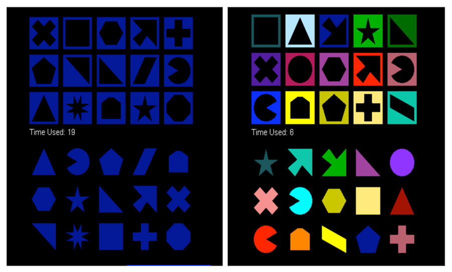

# Data codebook {-}

```{r include=FALSE}
knitr::opts_chunk$set(message=FALSE)

library(kableExtra)
```


<div class="blue">
**IMPORTANT**

Always remember that, in order to use functions such as `read_csv()` or `read_tsv`, you need to import them from the `tidyverse` library using the command
```{r}
library(tidyverse)
```

Typically, this should be placed at the beginning of your code file.
It is enough to run that line of code once per session in order to have the functions from the `tidyverse` library available during that session.
</div>


## handheight.xlsx {-#dc-handheight}

### Download link {-}

[Download the data here](https://raw.githubusercontent.com/uoepsy/dapr2/master/dapr2_labs/data/handheight.xlsx)


### Description {-}

The data set records the height and handspan reported by a random sample of 167 students as part of a class survey [@Utts2015].


### Preview {-}

The first six rows of the data are:

```{r echo=FALSE}
library(readxl)

handheight <- read_excel('data/handheight.xlsx')

kable(head(handheight), align = 'c') %>%
  kable_styling(full_width = FALSE) %>%
  column_spec(1:2, width = '10em')
```


---


## perfection.csv {-#dc-perfection}

### Download link {-}

[Download the data here](https://raw.githubusercontent.com/uoepsy/dapr2/master/dapr2_labs/data/perfection.csv)

### Description {-}

The data in this file were collected by @Kuiper2012 to investigate what is known as the *Stroop effect* [@Stroop1935]. 

The goal of the study was to answer the following research question: *Do distracting colours influence reaction times?*

In a paper published in 1935, John Stroop tested the reaction time of undergraduate students in identifying ink colours. He found that students took a longer time identifying colours of ink when the ink was used to spell a different colour. For example, if the word <span style="color:blue;">"green"</span> was printed in blue ink, students took longer to identify the blue ink because they automatically read the word "green". 

Even though students were told only to identify the ink colour, the automatized behaviour of reading interfered with the task and slowed their reaction time. Automatized behaviours are behaviours that can be done automatically without carefully thinking through each step in the process. Stroop's work, demonstrating that automatized behaviours can interfere with other desired behaviours, is so well known that it is often called the Stroop effect.

A group of university students wanted to develop a final project that would look at distracters and response time. They decided to conduct a study to determine if students at their university would perform differently when a distracting colour was incorporated into a computerised version of the Perfection game. Perfection is a popular game in which a person is expected to place an assortment of shaped pegs into the appropriate spaces within a short time period.
Since it was not possible to force university students to be involved in this study, these researchers randomly selected students from an online university directory until they had 40 students that were willing to play the game.


Before any data were collected, these students developed a clear set of procedures.

- 40 students would be randomly selected from the college.
- 20 students would be assigned to the standard Perfection game and 20 would be as-
signed to a Perfection game with a colour distracter. The student researchers would 
flip a coin to randomly assign subjects to a treatment. Once 20 subjects are assigned to either group, the rest would automatically be assigned to play the other game.
- Subjects would see a picture of the game and have the rules clearly explained to them before they played the game. An example is shown in Figure \@ref(fig:dc-perfection-image).
- Subjects would play the game in the same area with similar background noise to control for other possible distractions.
- The response variable would be the time in seconds from when the participant pressed the "start game" button to when they won the game.

```{r dc-perfection-image, echo=FALSE, out.width='80%', fig.cap='Electronic Perfection game with and without colour distracters. The instructions for the game were to click and drag each peg to the space with the matching shape.'}

```


The variables included:

- `student_id`: Student identifier
- `type`: type of game played
- `time`: time to completion (in seconds)


### Preview {-}

The first six rows of the data are:

```{r echo=FALSE}
perfection <- read_csv('data/perfection.csv')

kable(head(perfection), align='c') %>% kable_styling(full_width = FALSE)
```


<!-- ## weight_loss_incentive_4.csv {-} -->

<!-- ### Download link {-} -->

<!-- [Download the data here](https://raw.githubusercontent.com/uoepsy/dapr2/master/dapr2_labs/data/weight_loss_incentive_4.csv) -->

<!-- ### Description {-} -->

<!-- A group of researchers [@Volpp2008] investigated whether financial incentives would help people lose weight more successfully. -->
<!-- Some participants in the study were randomly assigned to a treatment group that offered financial incentives for achieving weight-loss goals, while others were assigned to a control group that did not use financial incentives. -->
<!-- All participants were monitored over a four-month period, and the net weight change (Before – After, in pounds) was recorded for each individual. -->
<!-- Note that a positive value corresponds to weight loss and a negative value indicates weight gain. -->

<!-- ### Preview {-} -->

<!-- The first six rows of the data are: -->

<!-- ```{r echo=FALSE} -->
<!-- weight_loss <- read_csv('data/weight_loss_incentive_4.csv') -->

<!-- kable(head(weight_loss), align='c') %>% kable_styling(full_width = FALSE) -->
<!-- ``` -->


---

## riverview.csv {-#dc-riverview}

### Download link {-}

[Download the data here](https://raw.githubusercontent.com/uoepsy/dapr2/master/dapr2_labs/data/riverview.csv)

### Description {-}

The data in `riverview.csv` come from @Lewis-Beck2015 and contain five attributes collected from a random sample of $n=32$ employees working for the city of Riverview, a hypothetical midwestern city in the US. The attributes include:

- `education`: Years of formal education
- `income`: Annual income (in thousands of U.S. dollars)
- `seniority`: Years of seniority
- `gender`: Employee's gender
- `male`: Dummy coded gender variable (0 = Female, 1 = Male)
- `party`: Political party affiliation


### Preview {-}

The first six rows of the data are:

```{r echo=FALSE}
riverview <- read_csv('data/riverview.csv')

kable(head(riverview), align='c') %>% kable_styling(full_width = FALSE)
```


---

## keith_gpa.csv {-}

### Download link {-}

[Download the data here](https://raw.githubusercontent.com/uoepsy/dapr2/master/dapr2_labs/data/keith_gpa.csv)

### Description {-}

This data, stored in `keith_gpa.csv` includes three attributes on n=100 8th-grade students. These data come from @Keith2014. The attributes are:

- `gpa`: Overall Grade-point average (GPA) in all subjects (on a standard 100-point scale)
- `homework`: Average time spent on homework per week across all subjects (in hours)
- `parent_ed`: Education-level (in years of schooling) for the parent with the highest level of education

### Preview {-}

The first six rows of the data are:

```{r echo=FALSE}
keith <- read_csv('data/keith_gpa.csv')

kable(head(keith), align='c') %>% kable_styling(full_width = FALSE)
```

