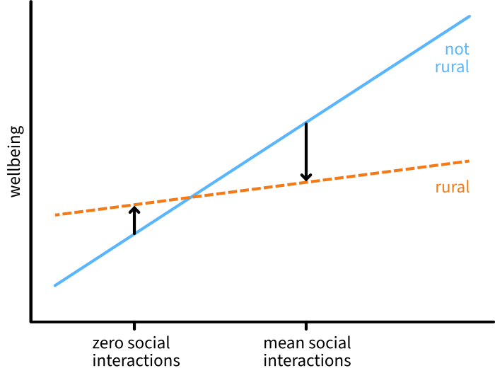

<!-- when rendering in RStudio / not production profile (tutor-facing):      SHOW_SOLS: TRUE  -->
<!-- when rendering in terminal / with production profile (student-facing):  SHOW_SOLS: FALSE -->

```{r}
#| label: setup
#| include: false

source('../assets/setup.R')
# source('assets/setup.R')

library(tidyverse)
library(interactions)

qcounter <- function(){
  if(!exists("qcounter_i")){
    qcounter_i <<- 1
  }else{
    qcounter_i <<- qcounter_i + 1
  }
  qcounter_i
}
```

This week, you'll fit an model that includes an interaction between a numeric predictor and a categorical predictor.
You'll also see what happens when you mean-centre that numeric predictor and fit the same model again.

:::{.callout-note}
### Get set up

1. Open RStudio.
1. Create a new .Rmd file for this week's exercises.
1. Save it somewhere you can find it again.
1. Give it a clear name (for example, `dapr2_lab11.Rmd`).
1. In the first code chunk, load the packages you'll need this week (and install them if you don't have them already):
    - `tidyverse`
    - `interactions`
   
:::

---

:::frame

RQ: **Does the association between mental wellbeing and the number of social interactions differ between rural and non-rural residents?**

Data dictionary:

```{r echo=FALSE, message=FALSE, warning=FALSE}
ruraldata  <- read_csv("https://uoepsy.github.io/data/wellbeing_location_rural.csv")
tibble(
variable = names(ruraldata),
description = c("Age in years of respondent","Self report estimated number of hours per week spent outdoors", "Self report estimated number of social interactions per week (both online and in-person)", "Binary 1=Yes/0=No response to the question 'Do you follow a daily routine throughout the week?'", "Warwick-Edinburgh Mental Wellbeing Scale (WEMWBS), a self-report measure of mental health and well-being. The scale is scored by summing responses to each item, with items answered on a 1 to 5 Likert scale. The minimum scale score is 14 and the maximum is 70", "Location of primary residence (Rural, Not Rural)")
) %>% gt::gt()
```
  
:::{.callout-note collapse='true'}
### More detail about this dataset

Researchers were specifically interested in how the number of social interactions influenced mental health and wellbeing differently for those living in rural communities compared to those in non rural locations. They wanted to assess whether the effect of social interactions on wellbeing _was moderated by_ (depends upon, interacts with) whether or not a person lived in a rural area.

From the Edinburgh & Lothians, 100 non-rural (e.g., city/suburb) residences and 100 rural residences were chosen at random and contacted to participate in the study. The Warwick-Edinburgh Mental Wellbeing Scale (WEMWBS), was used to measure mental health and well-being. 

Participants filled out a questionnaire including items concerning: estimated average number of hours spent outdoors each week, estimated average number of social interactions each week (whether on-line or in-person), and whether a daily routine is followed (yes/no).  
  
The data in `wellbeing_location_rural.csv` contain six attributes collected from a random sample of $n=200$ hypothetical residents over Edinburgh & Lothians.

:::

:::

# Set up, describe, and plot the data

# q1

`r qbegin(qcounter())`

Read in the data from <https://uoepsy.github.io/data/wellbeing_location_rural.csv> and store it in a variable named `rural_data`.

`r qend()`
`r solbegin(show=params$SHOW_SOLS, toggle=params$TOGGLE)`

```{r}
rural_data <- read_csv("https://uoepsy.github.io/data/wellbeing_location_rural.csv")
```

`r solend()`


# q2

`r qbegin(qcounter())`

Let's use tidyverse's `group_by()` and `summarise()` functions to make a descriptives table that summarises the continuous variables (`social_int` and `wellbeing`) for each level of the categorical variable (`isRural`).
Specifically, display the mean and SD of each continuous variable.

:::{.callout-tip collapse='true'}
### Code hint

Replace `...` with the appropriate values.

```{r eval=F}
... |>
    group_by(...) |>
    summarise(
        ... = ...(...),
        ... = ...(...),
        ... = ...(...),
        ... = ...(...)
    )
```

:::


:::red
🗂️
See [TODO](TODO){target="_blank"} flash card.
:::

`r qend()`
`r solbegin(show=params$SHOW_SOLS, toggle=params$TOGGLE)`

```{r}
rural_data |>
    group_by(isRural) |>
    summarise(
        Wellbeing_M = mean(wellbeing),
        Wellbeing_SD = sd(wellbeing),
        SocialInt_M = mean(social_int),
        SocialInt_SD = sd(social_int)
    )
```

<br>

And to pretty-print the table for reports, load the library `kableExtra` and run:

```{r}
library(kableExtra)

rural_data |>
    group_by(isRural) |>
    summarise(
        Wellbeing_M = mean(wellbeing),
        Wellbeing_SD = sd(wellbeing),
        SocialInt_M = mean(social_int),
        SocialInt_SD = sd(social_int)
    ) |>
    kable(
        caption = "Descriptive statistics for wellbeing scores and number of social interactions in rural and non-rural groups", 
        digits = 2
    ) |>
    kable_styling(full_width = FALSE)
```

`r solend()`


# q3 

`r qbegin(qcounter())`

Visualise the association between `social_int` and `wellbeing` for each level of `isRural`.

:::red
🗂️
See [TODO](TODO){target="_blank"} flash card.
:::

`r qend()`
`r solbegin(show=params$SHOW_SOLS, toggle=params$TOGGLE)`

One option, colouring by `isRural`:

```{r}
rural_data |>
    ggplot(aes(x = social_int, y = wellbeing, colour = isRural)) +
    geom_point() +
    geom_smooth(method = 'lm', formula = 'y~x', se = F)
```

Another option, facetting by `isRural`:

```{r}
rural_data |>
    ggplot(aes(x = social_int, y = wellbeing)) +
    geom_point() +
    geom_smooth(method = 'lm', formula = 'y~x', se = F) +
    facet_wrap(~isRural)
```


(In general, if in doubt about what kind of plot to choose, pick the one that most clearly communicates the story you want to tell with your data.)

`r solend()`


# Set up the model

# q4

`r qbegin(qcounter())`

`isRural` will be treatment-coded, and let's say that we want the reference level to be `not rural`.

Run whatever code you need to run so that the following line of code will generate the output shown below:

```{r include=F}
rural_data <- rural_data |>
    mutate(
        isRural = factor(isRural)
    )
```

```{r}
contrasts(rural_data$isRural)
```


:::red
🗂️
See [TODO](TODO){target="_blank"} flash card.
:::

`r qend()`
`r solbegin(show=params$SHOW_SOLS, toggle=params$TOGGLE)`

Currently `isRural` is not a factor, so `contrasts()` will throw an error.
So we definitely need to convert it to a factor.

Do we need to reorder the factor levels at the same time?
No!
`not rural` comes alphabetically before `rural` (N before R), so the default alphabetical ordering is fine.

So here's all we need to run:

```{r}
rural_data <- rural_data |>
  mutate(
    isRural = factor(isRural)
  )
```


(If we DID need to manually order factor levels within `factor()`, here's the code that would do it.)

```{r eval=F}
rural_data <- rural_data |>
  mutate(
    isRural = factor(isRural, levels = c('not rural', 'rural'))
  )
```

Now:

```{r}
contrasts(rural_data$isRural)
```


`r solend()`


# q5

`r qbegin(qcounter())`

Write the mathematical model formulation for a model predicting `wellbeing` as a function of `social_int`, `isRural`, and their interaction.

:::red
🗂️
See [TODO](TODO){target="_blank"} flash card.
:::

`r qend()`
`r solbegin(show=params$SHOW_SOLS, toggle=params$TOGGLE)`

$$
\text{wellbeing} = \beta_0 + 
(\beta_1 \cdot \text{social\_int}) + 
(\beta_2 \cdot \text{isRural}_\text{rural}) + 
(\beta_3 \cdot \text{social\_int} \cdot \text{isRural}_\text{rural}) + 
\epsilon
$$

Write:

```
$$
\text{wellbeing} = \beta_0 + 
(\beta_1 \cdot \text{social\_int}) + 
(\beta_2 \cdot \text{isRural}_\text{rural}) + 
(\beta_3 \cdot \text{social\_int} \cdot \text{isRural}_\text{rural}) + 
\epsilon
$$
```

`r solend()`

# q6

`r qbegin(qcounter())`

What null hypothesis does our research question want us to test?

Write the null and alternative hypotheses in words and in formal mathematical notation.

:::red
🗂️
See [TODO](TODO){target="_blank"} flash card.
:::

`r qend()`
`r solbegin(show=params$SHOW_SOLS, toggle=params$TOGGLE)`

In words, you might write something like:

- The null hypothesis is that there is no difference in how social interaction is associated with wellbeing in rural and non-rural environments.
- The alternative hypothesis is that there IS a difference in how social interaction is associated with wellbeing in rural and non-rural environments.

Or, a bit closer to the math (but meaning the same thing as above), you might write:

- The null hypothesis is that the interaction coefficient $\beta_3$ is equal to zero.
- The alternative hypothesis is that the interaction coefficient $\beta_3$ is not equal to zero.

Formally:

$$
\begin{align}
H_0 &: \beta_3 = 0 \\
H_1 &: \beta_3 \neq 0\\
\end{align}
$$

`r solend()`

# Fit and interpret the model

# q7

`r qbegin(qcounter())`

Fit the linear model defined above and name the output `rural_m1`.

:::red
🗂️
See [TODO](TODO){target="_blank"} flash card.
:::

`r qend()`
`r solbegin(show=params$SHOW_SOLS, toggle=params$TOGGLE)`

One option:

```{r}
rural_m1 <- lm(wellbeing ~ social_int * isRural, data = rural_data)
```

Another equivalent option:

```{r eval=F}
rural_m1 <- lm(
  wellbeing ~ social_int + isRural + social_int:isRural, 
  data = rural_data
)
```


`r solend()`

# q8

`r qbegin(qcounter())`

Generate the model summary and write one or two sentences to interpret each of the model coefficients.

It can sometimes be tricky to interpret interactions by just looking at the numbers.
Looking at a plot at the same time can help you out.
So if you like, you can also run the following code to show the model-fitted lines associating `social_int` with `wellbeing` for each level of `isRural`:

```{r eval=F}
interact_plot(
  rural_m1, 
  pred = 'social_int', 
  modx = 'isRural', 
  interval = T
)
```


:::red
🗂️
See [TODO](TODO){target="_blank"} flash card.
:::

`r qend()`
`r solbegin(show=params$SHOW_SOLS, toggle=params$TOGGLE)`


```{r}
interact_plot(
  rural_m1, 
  pred = 'social_int', 
  modx = 'isRural', 
  interval = T
)
```


```{r}
summary(rural_m1)
```

- `(Intercept)`:
    - The estimated average wellbeing score for people with zero social interactions in a non-rural environment is 31.00 points.

- `social_int`:
    - Specifically for people in a non-rural environment, one additional social interaction is associated with an increase in wellbeing of 0.65 points.
        - [Note: With multiple regression models, you learned to write something like "holding rurality constant", but for interaction models, that is no longer true. **For interaction models, we must constrain our interpretation of slope coefficients specifically to when all other predictors are equal to zero.**]
    - This estimate is significantly different from zero ($p$ < .001).

- `isRuralrural`:
    - For people with zero social interactions, changing from a non-rural environment to a rural environment is associated with an increase in wellbeing of 1.39 points.
        - [Note: **not** "holding social interactions constant"; see above.]
    - This estimate is not significantly different from zero ($p$ = 0.500).
    
- `social_int:isRuralrural`:
    - Changing from a non-rural to a rural environment decreases the association between social interactions and wellbeing by 0.52 points.
    - This estimate is significantly different from zero ($p$ = 0.002).


`r solend()`


# Model again with mean-centered `social_int`

# q9

`r qbegin(qcounter())`

Mean-centre `social_int` and name the new variable `social_int_c`.

Then fit the same interaction model again, now using `social_int_c` instead of `social_int`.

Call the output `rural_m2`.

:::red
🗂️
See [TODO](TODO){target="_blank"} flash card.
:::

`r qend()`
`r solbegin(show=params$SHOW_SOLS, toggle=params$TOGGLE)`

```{r}
rural_data <- rural_data |>
  mutate(
    social_int_c = social_int - mean(social_int)
  )
```

Check that the mean is zero:

```{r}
mean(rural_data$social_int_c) |> round()
```


Fit the new model:

```{r}
rural_m2 <- lm(wellbeing ~ social_int_c * isRural, data = rural_data)
```

`r solend()`

# q10

`r qbegin(qcounter())`

Generate the model summary of `rural_m2` and compare the coefficient values to those of `rural_m1`.
(Use `interact_plot()` again if you like, too!)

Challenge: For each coefficient, try to write a sentence or two to explain why it has or has not changed between the two models.

:::red
🗂️
See [TODO](TODO){target="_blank"} flash card.
:::

`r qend()`
`r solbegin(show=params$SHOW_SOLS, toggle=params$TOGGLE)`


::::{.columns}
:::{.column width="48%"}
```{r}
summary(rural_m1)
```

:::
:::{.column width="4%"}

:::
:::{.column width="48%"}

```{r}
summary(rural_m2)
```

:::
::::

- `(Intercept)`: The estimated mean wellbeing when all predictors are equal to zero has changed (from 31.00 to 38.83), because what "zero" means for social interactions has changed. In `rural_m1`, it meant zero social interactions, while in `rural_m2`, it means the average number of social interactions.

- `social_int_c`: This parameter is 0.65 in both models, because the slope of the line associating social interactions with wellbeing when `isRural = not rural` (i.e., the blue line) is the same, whether we're moving from 0 interactions to 1 interaction (in `rural_m1`) or from the mean number of interactions to the mean+1 interactions (in `rural_m2`).

- `isRuralrural`: 
When the social interaction predictor is equal to zero, changing from non-rural to rural environments increases wellbeing by 1.39 in `rural_m1` and decreases it by 4.86 in `rural_m2`. Huh?
    - In `rural_m1`, `social_int = 0` meant zero social interactions, at which point (outside the range of observed data), rural people are estimated to have higher wellbeing than non-rural people. In other words, at this point the orange `rural` line is above the blue `not rural` line—hence the positive change.
    - In contrast, in `rural_m2`, `social_int_c = 0` means the average social interactions, at which point non-rural people are estimated to have higher wellbeing than rural people. In other words, at ths point the orange `rural` line is below the blue `not rural` line—hence the negative change.
To illustrate:

{width="50%" fig-align="center"}    
    
    
    
- `social_int_c:isRuralrural`: This parameter is the same in both models at –0.52, because the relationship between the slopes of the two lines is the same in both models: it's true for both models that changing from a non-rural to a rural environment decreases the association between social interaction and wellbeing by 0.52 points.


`r solend()`
