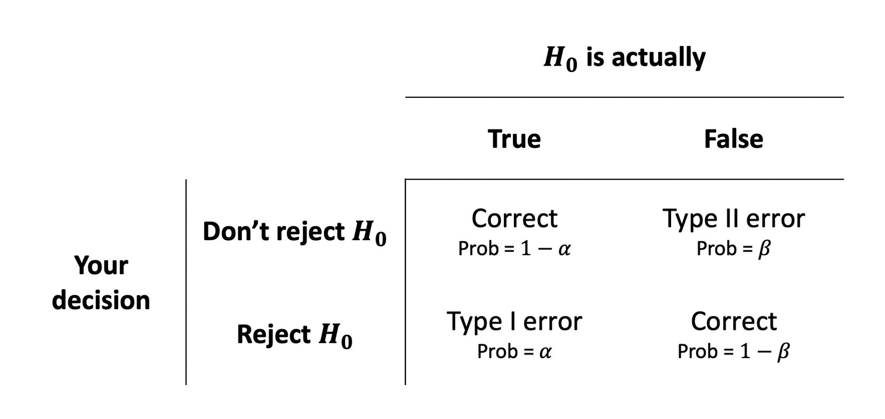

```{r setup, include=FALSE}
source('assets/setup.R')
library(tidyverse)
library(kableExtra)
library(patchwork)
```


Sometimes you might wonder, "how many subjects do I need for my study?". Other times, you might hear the question in a similar fashion: "if I have x people, is the study worth at all doing?".

Power analysis lets you determine the sample size required to detect an effect of a given size with a specified confidence level.
It also allows you to determine the probability of detecting an effect of a given size with a given level of confidence, under sample size constraints. If the probability is unacceptably low, you should consider the experiment design and change it, or even abandon the experiment.


# Recap of hypothesis testing


## Variability of statistics

> Fact: Statistics vary from sample to sample

For simplicity, we will outline the details for a simple linear regression model 
$$y= \beta_0 + \beta_1 x_1 + \epsilon$$
but the concepts will generalise easily to the case of multiple predictor variables $x_1, ..., x_k$.

A parameter is a numerical summary of the entire population. For example, imagine fitting a regression line to the population data, the slope of the line is a parameter. Parameters are typically unknown, as we often cannot measure the entire population due to time or money constraints.

A statistic is a numerical summary of a sample. An example is the slope of the regression line fitted to the sample data.

Typically, our data are collected from a sample of units from a bigger population. We can fit a linear regression model to the sample data and obtain the estimated coefficients $\widehat \beta_0$ and $\widehat \beta_1$. A numerical summary of the sample, such as the slope, is a statistic and is our best guess (based on the collected sample) of the unknown population parameter.

https://astools.datadesk.com/bvss.html

If we obtained a new sample, those estimated coefficients would be different. The following figure shows the population (grey dots) and three possible samples (red dots) along with the fitted line for each sample. Each line has its own slope, see the title of each plot.

```{r echo=FALSE, fig.height=5, fig.width=12, out.width = '100%'}
library(tidyverse)

set.seed(20)

N = 500
pop = tibble(
    x = runif(N, 0, 20),
    y = 40 + 3.1 * x + rnorm(N, 0, 30)
)

n = 20
s1 = sample_n(pop, n)
s2 = sample_n(pop, n)
s3 = sample_n(pop, n)

lm1 = lm(y ~ x, data = s1)
lm2 = lm(y ~ x, data = s2)
lm3 = lm(y ~ x, data = s3)

par(mfrow = c(1,3), cex.lab = 2, cex.axis = 2, cex.main = 2)

myplot = function(S, IDX, LM) {
    MAIN = sprintf('Sample %d: slope = %.2f', IDX, coef(LM)[2])
    plot(y ~ x, data = pop, col = 'darkgrey', pch = 21,
         xlab = 'x', ylab = 'y', main = MAIN, frame.plot = FALSE)
    points(y ~ x, data = S, pch = 21, col = 'red', bg = alpha('red', 0.5))
    abline(LM, col = 'red', lwd = 2)
}

myplot(s1, 1, lm1)
myplot(s2, 2, lm2)
myplot(s3, 3, lm3)

```


Now, imagine doing this 1000 times. You would obtain many slopes, and you could plot them as a histogram.

```{r echo=FALSE}
fcn = function(i) {
    data = sample_n(pop, size = 20, replace = FALSE)
    fit = lm(y ~ x, data = data)
    beta = coef(fit)[2]
    return(unname(beta))
}
betas = sapply(1:1000, fcn)
hist(betas, nclass = 20, main = '', xlab = 'Slopes')
```

We want to test whether the population slope is zero. This is done by specifying two competing statistical hypotheses about the population parameter $\beta$. The null hypothesis is denoted $H_0$ while the alternative $H_1$:

$$
H_0: \beta_1 = 0 \\
H_1: \beta_1 \neq 0
$$

## Test statistic

We decide whether or not to reject the null hypothesis by measuring how many standard deviations away from the mean the sample slope is:
$$
t_{\widehat \beta_1} = \frac{\widehat \beta_1}{SE(\widehat \beta_1)}
$$

```{r}
sobs = sample_n(pop, 20, replace = FALSE)
obs_slope = coef(lm(y ~ x, data = sobs))[2]
```

Suppose that the actual observed sample we have leads to a slope of `r round(obs_slope, 2)`. Clearly, this value is not equal to zero, but we know that statistics vary from sample to sample, hence we want to check how many standard errors away from the hypothesised value our observed slope is.

This is because approximately 95% of the values will lie between


---


When testing an hypothesis, we reach to one of the following decisions

- not rejecting $H_0$ as the evidence against it is not sufficient
- rejecting $H_0$ as we have enough evidence against it

However, irrespectively of our decision, the underlying truth can either be that

- $H_0$ is actually false
- $H_0$ is actually true

We can commit 2 types of errors:

```{r}

```


Fuel emission and asthma rates


<!-- Formatting -->

<div class="tocify-extend-page" data-unique="tocify-extend-page" style="height: 0;"></div>


