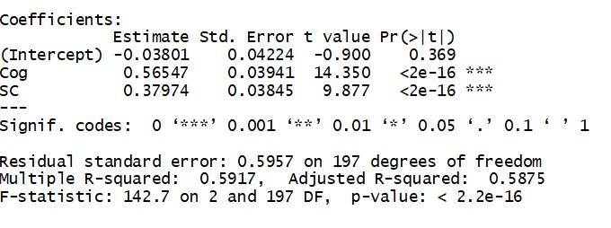

```{r setup, include=FALSE}
options(htmltools.dir.version = FALSE)
```

```{r xaringan-themer, include = FALSE}
library(xaringanthemer)
style_mono_accent(
  #base_color = "#0F4C81", # DAPR1
   base_color = "#BF1932", # DAPR2
  # base_color = "#88B04B", # DAPR3 
  # base_color = "#FCBB06", # USMR
  # base_color = "#a41ae4", # MSMR
  header_color = "#000000",
  header_font_google = google_font("Source Sans Pro"),
  header_font_weight = 400,
  text_font_google = google_font("Source Sans Pro", "400", "400i", "600", "600i"),
  code_font_google = google_font("Source Code Pro")
)
```

# Instructions
+ There will now be a small set of questions. 

--

+ Pause the video to think about them and write your answers down. 

--

+ The answers will be shown immediately afterwards.

--

+ This is to check learning and is not assessed.

---
# Question 1

Write an interpretation of the each slope coefficient in the model below. This is a linear model with multiple predictors using standardized scores.`Cog` = cognitive ability, `SC` = self-control, and the outcome is academic performance.


```{r, echo=FALSE}

```


---
# Question 1: Answer

+ Controlling for self-control, for every SD unit increase in cognitive ability, there is a 0.57 SD unit increase in academic performance

+ Controlling for cognitive ability, for every SD unit increase in self-control, there is a 0.38 SD unit increase in academic performance 


---
# The end.

+ If you are happy with your answers, move on to the next video/task.

+ If you are unclear on anything, either pop along to office hours, or post a question on the discussion board. 