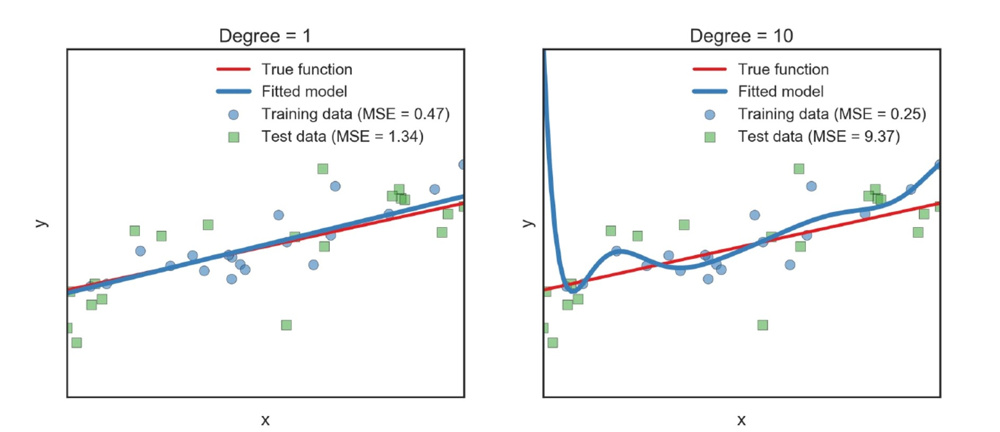
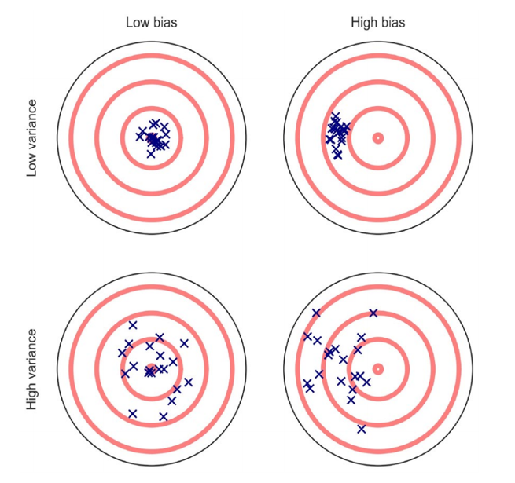
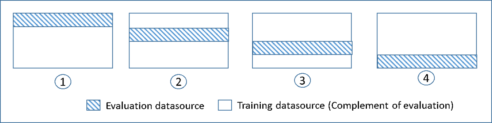
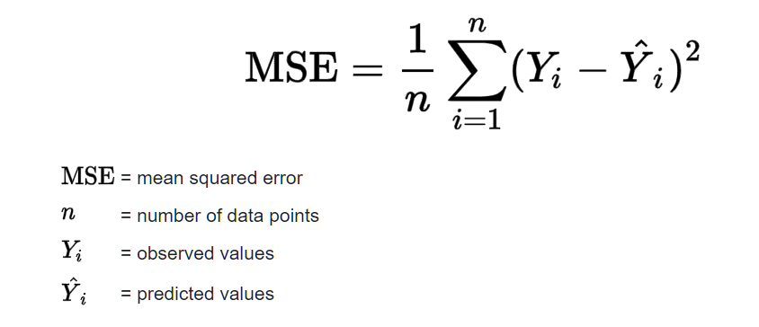

```{r setup, include=FALSE}
options(htmltools.dir.version = FALSE)

library(tidyverse)
library(gridExtra)
library(tidytext)
library(rtweet)
library(tidyr)
library(tidytext)
library(stringr)
library(textdata)
```

```{r xaringan-themer, include = FALSE}
library(xaringanthemer)
style_mono_accent(
  extra_css = list(".scroll-ouput" = list("height" = "90%", "overflow-y"="scroll")),
  #base_color = "#0F4C81", # DAPR1
   base_color = "#BF1932", # DAPR2
  # base_color = "#88B04B", # DAPR3 
  # base_color = "#FCBB06", # USMR
  # base_color = "#a41ae4", # MSMR
  header_color = "#000000",
  header_font_google = google_font("Source Sans Pro"),
  header_font_weight = 400,
  text_font_google = google_font("Source Sans Pro", "400", "400i", "600", "600i"),
  code_font_google = google_font("Source Code Pro")
)
```


# Learning Objectives

- Some exploratory situations

  - I have a hypothesis but I'm not quite sure how to test it with the variables I have

  - I think some variables could be relevant to a DV but I'm not sure which ones

- Working through an example


---
# The Issues: 

  - We're often interested in the relationship between variables but don't have clear predictions about how they're related

   - For example, I might be interested in why some tweets go viral and others don't
  
  - The number of possible predictors related to this question is huge and it's not obvious which ones will be most important
  
    - Includes a photo? Humor? Many, many possible predictors 
  
---
# The Issues: 
  
  
- Sometimes I might have a hypothesis, but it could be tested in multiple ways and I'm not sure how best to test it.
  
  - For example, I think a tweet including a photo will be retweeted more. What kind of photo though? Any photo? Happy photos?


---

# Exploratory Analyses

- The context I've describe above is a case of exploratory analysis.

- Exploratory analyses can take many forms, but they share in common the fact that you, the researcher, don't have extremely specific predictions about the relationship between your independent variable and your dependent variable

- The exploratory phase of data analysis is a great way to learn a lot about your data, but you also need to be on-guard that you don't think you've detected signal when you've actually detected noise.

  - More on this in a bit


---

# Exploratory analyses done wrong

- "You cannot find your starting hypothesis in your final results. It makes the stats go all wonky." - Ben Goldacre

- If you treat an exploratory result as if you had that hypothesis from the start, then it can cause problems. You will trick yourself.

---

# Exploratory analyses done wrong

- Exploratory analyses done poorly: Measure many variables (gender, personality characteristics, age, etc.) and only report those that yield a statistically significant result (stargazing)

  - Include in your paper only those experiments that produced the  desired outcome, 
  
  - Treat experiments or initial analyses that didn't turn out favorably as "pilots" 

- Why is this problematic? 

- In a word, this will lead to model overfitting.


---

# Overfitting

- Overfitting is the tendency for statistical models to mistakenly fit sample-specific noise as if it were signal
  
  - In a sample of N = 50 with 20 uncorrelated predictors, each correlated 0.1 with the DV, the observed (and overfitted) R2 value will, on average, be 0.45
  
   - Gives the impression that one could predict values of the DV rather successfully. 
  
  - True R2 in this situation is only 0.07. Even worse, the average out-of-sample test value of R2 is only 0.02!
  
---
# R Squared is very optimistic


---


# Overfitting continued


- Don't trust estimates of model performance if those estimates are obtained by "testing" the model on the same data on which it was originally trained

- We need a method for doing exploratory analyses without tricking ourselves. 

---

# An aside: The link between p-hacking and overfitting


- p-hacking is a special case of overfitting. Specifically, it is procedural overfitting (Yarkoni and Westfall, 2018). It takes place prior to (or in parallel with) model estimation

  - For example, during data cleaning, model selection, or choosing which analyses to report

---

# We often want to explore though. How do we do that in a principled way? 

- First, need to distinguish bias and variance 

  - Bias: the tendency for a model to consistently produce answers that are wrong in a particular direction (e.g., estimates that are consistently too high). 

  - Variance: the extent to which a model's fitted parameters will tend to deviate from their central tendency across different datasets.
  
---

---
# Bias-Variance Tradeoff

- Liberal, flexible data analysis is a low-bias but high-variance approach 

  - Almost any pattern in data can potentially be detected, at the cost of a high rate of spurious identifications

  - This is exploratory data analysis
 

- An approach that favors strict adherence to a fixed set of procedures as a high bias, low-variance approach 

  - Only a limited range of patterns can be identified, but the risk of pattern hallucination is low

  - This is confirmatory data analysis 


---

# What to do? Consider lots of possibilities but focus on minimizing prediction error (no stargazing!)

- What's required to do exploratory data analysis that gives you *information* on which you can do confirmatory research?

  - Datasets large enough to support training models

  - Accurately estimate prediction error to assess performance and improve model 

  - Exert control over the bias-variance tradeoff when appropriate
  
  
---
# Cross-validation

- All of these are directly related to cross-validation and replication

  - To assess our models, we need to quantify out-of-sample prediction error
  
  - Cross-validation: vaious techniques involved in training and testing a model on different samples of data

---

# Cross-validation

- Canonical cross-validation 

  - The classical replication study, where a model is trained on one dataset and then tested on a completely independent dataset. Most typical of experimental research. Less common in correlational research.


---

# Cross-validation

- Sometimes you can't collect more data though

  - One giant study you want to analyze was run once

  - There is a limited population 
  
  - Limited funds to collect more data

---

# Recycle your dataset. 

- Don't assign each observation exclusively to either the training or the test datatsets - do both!
  
  - Known as K-Folding where *K* is the number of folds 
  
  - In one "fold" (essentially a subset of your data), one half of the data is used for training and the other half is for testing
  
  - In a second fold, the datasets are reversed, and the training set and test sets exchange roles. 
  
  - Typical number of folds is 10




--- 
# Confirmatory research

- The confirmatory phase of research is characterized by the fact that you specify prior to data collection the exact statistical analyses you intend to run, and your expectations about the relationships between the variables 

  - For example, "x1 will positively predict dv1 with an effect size of approximately Cohen's d = .2 I will test this by fitting the model y ~ x1 + x2")
  
---


---
# Read data into R

```{r}
Exploredf <- read_csv("df1.csv")
head(Exploredf)
```

---


```{r}
Exploredf1 <- Exploredf%>%
  mutate(Postnumber = 1:n())%>%
  select(-c(...1))

sentiment <- Exploredf1 %>% 
  unnest_tokens(output = "word", input = "text")
```

---

```{r}
sentiment_dictionary1 <- get_sentiments("bing")
head(sentiment_dictionary1)

```

---

```{r}
sentiment_dictionary2 <- get_sentiments("afinn")
head(sentiment_dictionary2)
```

---

```{r}
sentiment_dictionary3 <- get_sentiments("nrc")
head(sentiment_dictionary3)
```

---

```{r}
sentiment1df <- merge(sentiment, sentiment_dictionary1, by = "word")
head(sentiment1df)
```

---

```{r}

library(summarytools)
view(dfSummary(sentiment1df))

```

---


```{r, fig.height = 6, fig.width = 8}
ggplot(Exploredf1)+
  geom_point(aes(y=retweet_count, x = favorite_count), shape=1)+
  theme_bw(20)

```

---

```{r, fig.height = 6, fig.width = 8}
ggplot(Exploredf1)+
  geom_point(aes(y=log(retweet_count), x = log(favorite_count)), shape=1)+
  theme_bw(20)

```

---

```{r, fig.height = 6, fig.width = 10}
ggplot(Exploredf1)+
  geom_point(aes(y=log(retweet_count), x = log(favorite_count), colour=media_type), shape=1)+
  theme_bw(20)

```

---


```{r, fig.height = 6, fig.width = 10}
ggplot(sentiment1df)+
  geom_point(aes(y=log(retweet_count), x = log(favorite_count), colour=sentiment), shape=1)+
  theme_bw(20)

```

---

```{r}

m1 <- lm(retweet_count ~ media_type, data = sentiment1df)
summary(m1)

```

---

```{r}
m2 <- lm(retweet_count ~ media_type + sentiment, data=sentiment1df)
summary(m2)

```

---

```{r}

library(purrr)
library(modelr)

cv  <- crossv_kfold(sentiment1df, k = 10)

cv

```

---

```{r}

models0  <- map(cv$train, ~lm(retweet_count ~ 1, data = .))
models1  <- map(cv$train, ~lm(retweet_count ~ media_type, data = .))
models2  <- map(cv$train, ~lm(retweet_count ~ media_type + sentiment, data = .))

```

---

# How does map function work?

```{r}
my_list <- list(
  c(1,2,6),
  c(4,7,1),
  c(9,1,5)
)
```

---

```{r}
my_list 

my_list[[1]]

my_list[[1]] %>% mean()

my_list[[2]] %>% mean()

my_list[[3]] %>% mean()
```

---

```{r}
my_list

my_list %>% map(mean)

map(my_list, mean)
```

---


```{r}
# gives a vector of dbl

my_list %>% map_dbl(mean)

# anonymous function 
# ~ creation function with no specific name in tidyverse
# . every element in the list


my_list %>% map(~ . * 2)
```

---

```{r}
get_pred  <- function(model, test_data){
  data  <- as.data.frame(test_data)
  pred  <- add_predictions(data, model)
  return(pred)
}

pred0  <- map2_df(models0, cv$test, get_pred, .id = "Run")
pred1  <- map2_df(models1, cv$test, get_pred, .id = "Run")
pred2  <- map2_df(models2, cv$test, get_pred, .id = "Run")

```

---

# Mean Squared Error to assess model fit



- To find the MSE, take the observed value, subtract the predicted value, and square that difference. Repeat that for all observations. Then, sum all of those squared values and divide by the number of observations.

---

# Interpretting Mean Squared Error

- An MSE of zero, meaning that the estimator $\hat{\theta}$ predicts observations of the parameter $\theta$  with perfect accuracy.

- Two or more statistical models may be compared using their MSEs as a measure of how well they explain a given set of observations.

- Mean squared error has the disadvantage of heavily weighting outliers. This property, undesirable in many applications, has led researchers to use alternatives such as the mean absolute error.

---

```{r}

MSE0  <- pred0 %>% group_by(Run) %>%
  summarise(MSE = mean((retweet_count - pred)^2))

MSE0

```

---

```{r}

MSE1  <- pred1 %>% group_by(Run) %>%
  summarise(MSE = mean( (retweet_count - pred)^2))

MSE1

```

---

```{r}

MSE2  <- pred2 %>% group_by(Run) %>%
  summarise(MSE = mean( (retweet_count - pred)^2))

MSE2

```

---


```{r}

mean(MSE0$MSE)
mean(MSE1$MSE)
mean(MSE2$MSE)
```

---

```{r}
Confirmdf <- read_csv("df2.csv")
head(Confirmdf)
```

---

# Similar computations as on Exploredf
---


```{r}

Confirmdf <- Confirmdf%>%
  mutate(Postnumber = 1:n())%>%
  select(-c(...1))

confirmsentiment <- Confirmdf %>% 
  unnest_tokens(output = "word", input = "text")

```

---

```{r}
sentiment_dictionary1 <- get_sentiments("bing")
head(sentiment_dictionary1)

```

---

```{r}
sentiment_dictionary2 <- get_sentiments("afinn")
head(sentiment_dictionary2)
```

---

```{r}
sentiment_dictionary3 <- get_sentiments("nrc")
head(sentiment_dictionary3)
```

---

```{r}
confirmsentiment1df <- merge(confirmsentiment, sentiment_dictionary1, by = "word")
head(confirmsentiment1df)
```

---


```{r, fig.height = 6, fig.width = 10}
ggplot(confirmsentiment1df)+
  geom_point(aes(y=log(retweet_count), x = log(favorite_count), colour=sentiment), shape=1)+
  theme_bw(20)

```


---
# Issues though...

```{r}
predictedvalues <- predict(m1, data=sentiment1df, interval="prediction")
View(predictedvalues)
```

---

```{r}

v1 <- c(19.76, -156, 196)
v2 <- c(68.95279, -107, 245)
v3 <- c("Nophoto", "Photo")

smalldf <- rbind(v1,v2)

smalldf <- as.data.frame(smalldf)%>%
  rename("meanretweet" = "V1",
         "lower" = "V2",
         "upper" = "V3")

smalldf <- cbind(smalldf, v3)

smalldf <- smalldf %>%
  rename("media_type" = "v3")

sampleConfirmdf <- confirmsentiment1df %>%
  sample_n(400)

```

---
# What's wrong with this picture?

```{r, fig.width =4, fig.height = 4}

  ggplot()+
  geom_jitter(data=sampleConfirmdf, aes(x = media_type, y = retweet_count), width = .05, height=.01, shape = 1, alpha = .1)+
  geom_point(data=smalldf, aes(x= media_type, y= meanretweet), shape = 1, colour = "blue")+
  geom_errorbar(data=smalldf, aes(x= media_type, ymin = lower,ymax=upper), width=.1, colour = "blue")+
  scale_y_continuous(limits = c(-200,500))+
  theme_bw(20)
```

---
# Impossible values in our error bars 

  - Need a GLM that takes into account the data are counts!

```{r}
m1poss <- glm(retweet_count ~ media_type, data = Confirmdf, family = "poisson")
summary(m1poss)
```

---

```{r, fig.width =6, fig.height = 4}

sampleConfirmdf %>%
  group_by(media_type)%>%
  summarise(meanrt = mean(retweet_count),
            medianrt = median(retweet_count))%>%
  ggplot()+
  geom_jitter(data=sampleConfirmdf, aes(x = media_type, y = retweet_count), width = .05, height=.01, shape = 1, alpha = .1)+
  geom_point(aes(x= media_type, y= meanrt), shape = 1, colour = "blue")+
  geom_point(aes(x= media_type, y= medianrt), shape = 5, colour = "green")+
  scale_y_continuous(limits = c(0,200))+
  theme_bw(20)
```

---

```{r}
m2poss <- glm(retweet_count ~ media_type + sentiment , data = sentiment1df, family = "poisson")
summary(m2poss)

```

---


