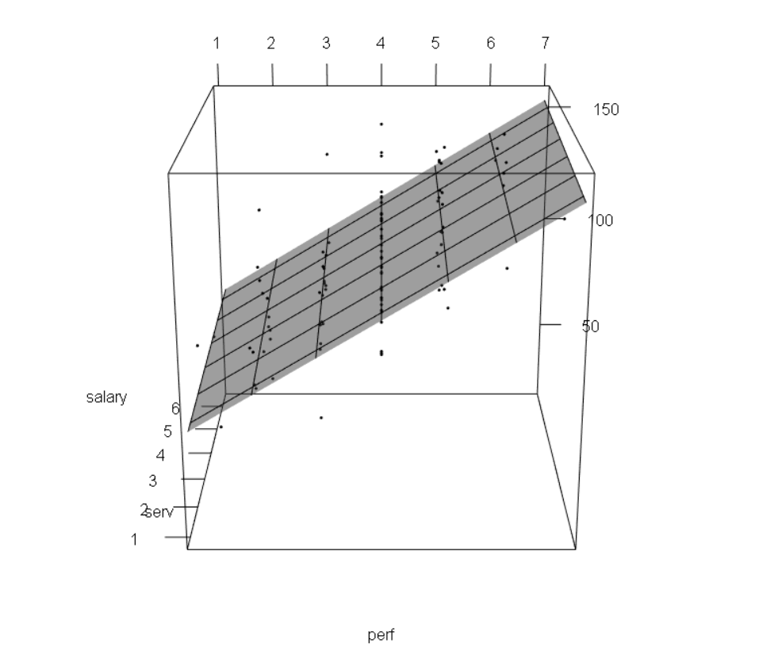

```{r}
#| label: setup
#| include: false

library(tidyverse)
library(patchwork)
library(kableExtra)
library(simglm)

dapr2red <- "#BF1932" 

theme_set(
  theme_minimal(
    base_size = 28
  )
)

```

# Course overview {background-color="white" style="font-size:60%;"}

TODO

## This Week's Learning Objectives

1. Be able to interpret the coefficients from a simple linear model

2. Understand how and why we standardise coefficients and how this impacts interpretation

3. Understand how these interpretations change when we add more predictors


# Part 1: Recap & Coefficient Interpretation


## Linear Model

+ Last week we introduced the linear model:

$$y_i = \beta_0 + \beta_1 x_{i} + \epsilon_i$$

+ Where:
  + $y_i$ is our measured outcome variable
  + $x_i$ is our measured predictor variable
  + $\beta_0$ is the model intercept
  + $\beta_1$ is the model slope
  + $\epsilon_i$ is the residual error (difference between the model predicted and the observed value of $y$)

+ We spoke about calculating by hand, and also the key concept of **residuals**


## `lm` in R

+ You also saw the basic structure of the `lm()` function:

```{r}
#| eval: false

lm(DV ~ IV, data = datasetName)
```
<br> 
  
+ And we ran our first model:

```{r}
#| echo: false

test <- tibble(
  student = paste(rep("ID",10),1:10, sep=""),
  hours = seq(0.5,5,.5),
  score = c(1,3,1,2,2,6,3,3,4,8)
)
```

```{r}
lm(score ~ hours, data = test)
```
<br>
  
+ This week, we are going to focus on the interpretation of our model, and how we extend it to include more predictors 

## `lm` in R

```{r}
summary(lm(score ~ hours, data = test))
```

## Interpretation {.smaller}

:::: {.columns}

::: {.column width="55%"}

```{r, fig.height = 7, fig.width = 7}
#| echo: false
#| message: false

(p <- ggplot(test, aes(hours, score)) +
   geom_point(size = 3) + 
   geom_smooth(method='lm', se=F, colour = dapr2red) +
   scale_y_continuous(breaks=seq(0, 8, 1), limits = c(0, 8)) +
   scale_x_continuous(limits=c(0, 5)) +
   geom_vline(xintercept = 0) +
   geom_hline(yintercept = 0) +
   theme(panel.grid.y.minor = element_blank()) +
   NULL
)
```

:::{style="font-size:80%;"}

```{r echo=F}
cat(paste0(capture.output(
  summary(lm(score ~ hours, data = test))
), '\n')[9:12])
```

:::

:::


::: {.column width="45%"}

+ **`(Intercept)` = the expected outcome value Y when the predictor X is 0**
  + X = 0 represents zero hours of studying (`hours` = 0)
  + As the intercept is 0.400, we conclude that a student who does not study would be expected to score 0.40 on the test 
  
<br>

:::{.fragment}

+ **`hours` = slope = how much the outcome Y increases, on average, when the predictor X increases by one unit**
  + Unit of Y = 1 point on the test  
  + Unit of X = 1 hour of study  
  + As the slope for `hours` is 1.055, we conclude that for every hour of study, test score increases on average by 1.055 points  
  
:::
  
:::

::::


## Note of Caution on Interpreting Intercepts

+ In our example, 0 has a meaning
    + It is a student who has studied for 0 hours
    
+ But it is not always the case that 0 is meaningful

+ Suppose our predictor variable was not hours of study, but age


**If the predictor was `age`, how would we interpret an intercept of 0.4? What does `age = 0` mean?**

<br>

. . .

This is a general lesson about interpreting statistical tests:

+ The interpretation is always in the context of the constructs and how we have measured them


## Practice with Scales of Measurement (1)

Imagine a model looking at the association between an employee's salary $y$ and their duration of employment $x$: 

$$y_i = \beta_0 + \beta_1 x_{i} + \epsilon_i$$

  
+ $x$ = unit is 1 year
+ $y$ = unit is £1000
+ $\beta_1$ = 0.4
  
. . .

::::{.columns}
:::{.column width="50%"}
+ **In this context, what does each coefficient mean?**
  + $\beta_0$?  
  + $\beta_1$?


:::
:::{.column width="50%"}
:::{.dapr2callout style="font-size:90%;"}
**For reference/hint:**

+ $\beta_0$ = intercept = expected value of Y when X is 0

+ $\beta_1$ = slope = how many units Y increases, on average, for a unit increase in X

:::
:::
::::


## Practice with Scales of Measurement (2)


Imagine a model looking at the association between the length of cats' tails $y$ and their weight $x$:

$$y_i = \beta_0 + \beta_1 x_{i} + \epsilon_i$$
  
+ $x$ = unit is 1kg
+ $y$ = unit is 1cm
+ $\beta_1$ = -3.2

. . .

::::{.columns}
:::{.column width="50%"}
+ **In this context, what does each coefficient mean?**
  + $\beta_0$?  
  + $\beta_1$?


:::
:::{.column width="50%"}
:::{.dapr2callout style="font-size:90%;"}
**For reference/hint:**

+ $\beta_0$ = intercept = expected value of Y when X is 0

+ $\beta_1$ = slope = how many units Y increases, on average, for a unit increase in X

:::
:::
::::


## Practice with Scales of Measurement (3)

Imagine a model looking at the association between healthy eating habits $y$ and conscientiousness $x$:

$$y_i = \beta_0 + \beta_1 x_{i} + \epsilon_i$$
   
+ $x$ = unit is 1 increment on a Likert scale ranging from 1 to 5 measuring conscientiousness
+ $y$ = unit is 1 increment on a healthy eating scale
+ $\beta_1$ = 0.25

. . .

::::{.columns}
:::{.column width="50%"}
+ **In this context, what does each coefficient mean?**
  + $\beta_0$?  
  + $\beta_1$?


:::
:::{.column width="50%"}
:::{.dapr2callout style="font-size:90%;"}
**For reference/hint:**

+ $\beta_0$ = intercept = expected value of Y when X is 0

+ $\beta_1$ = slope = how many units Y increases, on average, for a unit increase in X

:::
:::
::::


# Part 2: Standardisation

## Unstandardised vs Standardised Coefficients

- So far we have interpreted the coefficients using the units in which they were originally measured
  - We interpreted the slope as the change in $y$ units for a unit change in $x$ , where the unit is determined by how we have measured our variables  
  - We call these coefficients **unstandardised**

+ However, sometimes these units are not helpful for interpretation  
  + We can then perform **standardisation** to aid interpretation  

## Standardised Units

Why might standard units be useful?

. . .

+ **If the scales of our variables are arbitrary**
  + Example: A sum score of questionnaire items answered on a Likert scale.
  + A unit here would equal moving from e.g. a 2 to 3 on one item
  + This is not especially meaningful (and actually has A LOT of associated assumptions)

. . .

+ **If we want to compare the effects of variables on different scales**
  + If we want to say something like  "the effect of $x_1$ is stronger than the effect of $x_2$", we need a common scale


## Option 1: Standardising the coefficients after fitting the model

+ After calculating a $\hat \beta_1$, it can be standardised by:


$$\hat{\beta_1^*} = \hat \beta_1 \frac{s_x}{s_y} = \text{unstandardised coef} \times \frac{\text{SD of predictor}~x}{\text{SD of outcome}~y}$$

Defining each variable:

  + $\hat{\beta_1^*}$ = standardised beta coefficient
  + $\hat \beta_1$ = unstandardised beta coefficient
  + $s_x$ = standard deviation of $x$
  + $s_y$ = standard deviation of $y$

## Implementing in R

+ **Step 1: Obtain coefficients from the model**

```{r}
m1 <- lm(score ~ hours, data = test)
summary(m1)$coefficients
```

<br>

. . .

+ **Step 2: Take the slope coefficient and standardise it**

```{r}
round(1.054545 * (sd(test$hours)/sd(test$score)),3)
```


## Option 2: Standardising the variables before fitting the model {.smaller}

+ Another option is to transform continuous predictor and outcome variables to $z$-scores (mean=0, SD=1) prior to fitting the model
+ If both $x$ and $y$ are standardised, our model coefficients (betas) are standardised too

+ $z$-score for $x$:

$$z_{x_i} = \frac{x_i - \bar{x}}{s_x} = \frac{\text{observed value of}~x~\text{minus mean of}~x}{\text{SD of}~x}$$

+ and the $z$-score for $y$:

$$z_{y_i} = \frac{y_i - \bar{y}}{s_y} = \frac{\text{observed value of}~y~\text{minus mean of}~y}{\text{SD of}~y}$$

+ That is, we divide each observation's deviation from the mean by the standard deviation

  
## Implementing in R {.smaller}

+ **Step 1: Convert predictor and outcome variables to z-scores by subtracting the mean and dividing the difference by the SD**

```{r}
test <- test |>
  mutate(
    score_z = (score - mean(score)) / sd(score),
    hours_z = (hours - mean(hours)) / sd(hours)
  )
```

<br> 


. . .

+ **Step 2: Run model on z-scored variables**

```{r}
m2 <- lm(score_z ~ hours_z, data = test) 
round(summary(m2)$coefficients, 3)
```


## Interpreting Standardised Coefficients

:::: {.columns}

::: {.column width="50%"}

**Unstandardised**

:::{style="font-size:55%;"}
```{r echo=F}
summary(m1)
```
:::

:::

::: {.column width="50%"}

**Standardised**

:::{style="font-size:55%;"}
```{r echo=F}
summary(m2)
```
:::

:::

::::


##  Interpreting Standardised Coefficients  

<!-- + $R^2$ , $F$ and $t$-test and their corresponding $p$-values remain the same for the standardised coefficients as for unstandardised coefficients -->

`(Intercept)`:

+ The intercept is always zero when all variables are standardised (because their means all become zero). The math, if you're interested:

$$
\begin{align}
\hat \beta_0 &= \bar{y}-\hat \beta_1\bar{x} \\
  &= 0 - \hat \beta_1  0 \\
  &= 0
\end{align}
$$


Slope:

+ The interpretation of the slope coefficient(s) becomes the increase in $y$ in standard deviation units for every standard deviation increase in $x$

+ So, in our example:

>**For every standard deviation increase in hours of study, test score increases by `r round(summary(m2)$coefficients[2], 2)` standard deviations**


##  Which Should we use? 

+ Unstandardised regression coefficients are often more useful when the variables are on  meaningful scales
	+ E.g. X additional hours of exercise per week adds Y years of healthy life

+ Sometimes it's useful to obtain standardised regression coefficients
	+ When the scales of variables are arbitrary
	+ When there is a desire to compare the effects of variables measured on different scales	

+ Cautions
	+ Just because you can put regression coefficients on a common metric doesn't mean they can be meaningfully compared
	+ The SD is a poor measure of spread for skewed distributions, therefore, be cautious of their use with skewed variables

## Relationship to Correlation ( $r$ )

+ **If a linear model has a single, continuous predictor,** then the standardised slope ( $\hat \beta_1^*$ ) is actually exactly the same as the correlation coefficient ( $r$ ) between the predictor and the outcome!

<br>

+ For example:

```{r}
round(lm(score_z ~ hours_z, data = test)$coefficients, 2)
```

<br>

```{r}
round(cor(test$hours, test$score),2)
```

## Relationship to Correlation ( $r$ )

+ They are equivalent:
  + $r$ is a standardised measure of linear association
  + $\hat \beta_1^*$ is a standardised measure of the linear slope

+ Similar idea for linear models with multiple predictors
  + Slopes are now equivalent to the *part correlation coefficient*


# Part 3: Multiple Regression

## Multiple Predictors

+ The aim of a linear model is to explain variance in an outcome

+ In simple linear models, we have a single predictor, but the model can accommodate (in principle) any number of predictors

+ If we have multiple predictors for an outcome, those predictors may be correlated with each other

+ A linear model with multiple predictors finds the optimal prediction of the outcome from several predictors, **taking into account their redundancy with one another**


##  Uses of Multiple Regression

+ **For prediction:** multiple predictors may lead to improved prediction

+ **For theory testing:** often our theories suggest that multiple variables together contribute to variation in an outcome

+ **For covariate control:** we might want to assess the effect of a specific predictor, controlling for the influence of others
	+ E.g., effects of personality on health after removing the effects of age and gender


##  Extending the Regression Model 

+ Our model for a single predictor:

$$y_i = \beta_0 + (\beta_1 \cdot x_{1i}) + \epsilon_i$$ 

+ is extended to include additional $x$'s:

$$y_i = \beta_0 + (\beta_1 \cdot x_{1i}) + (\beta_2 \cdot x_{2i}) + (\beta_3 \cdot x_{3i}) + \epsilon_i$$  

+ For each $x$, we have an additional $\beta$
  + $\beta_1$ is the slope coefficient for the first predictor
  + $\beta_2$ for the second etc.


##  Interpreting Coefficients in Multiple Regression 

$$y_i = \beta_0 + (\beta_1 \cdot x_{1i}) + (\beta_2 \cdot x_{2i}) + ~~ ... ~ + (\beta_j \cdot x_{ji}) + \epsilon_i$$

+ Given that we have additional variables, our interpretation of the regression coefficients changes a little

+ $\beta_0$ = the predicted value for $y$ when **all** $x$ are 0
	
+ Each $\beta_j$ is now a **partial regression coefficient**
	+ It captures the change in $y$ for a one unit change in $x$ **when all other x's are held constant**
	
What does "holding constant" mean?

## What Does "Holding Constant" Mean? 

+ Refers to finding the effect of the predictor when the values of the other predictors are fixed

+ With multiple predictors `lm` isolates the effects and estimates the unique contributions of predictors

You might also hear the same idea referred to with other language, e.g.:

- "**controlling for** other predictors"  $\leftarrow$ we'll use this one mostly!
- "**adjusting for** other predictors"
- "**partialling out** other predictors"
- "**residualising for** other predictors"


##  Visualising Models

:::: {.columns}
                                  
::: {.column width="50%"}

A linear model with one continuous predictor: **two-dimensional line.**

```{r fig.width = 6, fig.height = 6}
#| echo: false
#| message: false
#| warning: false

df <- read_csv("../data/salary2.csv")
m1 <- lm(salary ~ perf, data = df)
m2 <- lm(salary ~ perf + serv, data = df)

ggplot(df, aes(x=perf, y=salary)) +
  geom_point() +
  geom_smooth(method = "lm")+
  xlab("") +
  ylab("")

```

:::

::: {.column width="50%"}

A linear model with two continuous predictors: **three-dimensional plane!**

```{r}
#| echo: false


```

:::

::::

##  Example: `lm` with 2 Predictors 

```{r}
#| echo: false
#| message: false
#| warning: false

set.seed(7284) 

sim_arguments <- list(
  formula = y ~ 1 + hours + motivation,
  fixed = list(hours = list(var_type = 'ordinal', levels = 0:15),
               motivation = list(var_type = 'continuous', mean = 0, sd = 1)),
  error = list(variance = 20),
  sample_size = 150,
  reg_weights = c(0.6, 1.4, 1.5)
)

df <- simulate_fixed(data = NULL, sim_arguments) %>%
  simulate_error(sim_arguments) %>%
  generate_response(sim_arguments)

test_study2 <- df %>%
  dplyr::select(y, hours, motivation) %>%
  mutate(
    ID = paste("ID", 101:250, sep = ""),
    score = round(y+abs(min(y))),
    motivation = round(motivation, 2)
  ) %>%
  dplyr::select(ID, score, hours, motivation)

```


+ Imagine we extend our study of test scores

+ We sample 150 students taking a multiple choice Biology exam (max score 40)

+ We give all students a survey at the start of the year measuring their school motivation 
  + We standardise this variable so the mean is 0, negative numbers are low motivation, and positive numbers high motivation
  
+ We then measure the hours they spent studying for the test, and record their scores on the test

## Data

```{r}
head(test_study2)
```


## Mathematical model specification and `lm` code

$$\text{Score}_i = \color{blue}{\beta_0} + \color{blue}{\beta_1} \cdot \color{orange}{\text{Hours}_{i}} + \color{blue}{\beta_2} \cdot \color{orange}{\text{Motivation}_{i}} + \color{blue}{\epsilon_i}$$

- [parameters of the linear model (coefficients)]{.blue}

- [values _we_ provide (inputs)]{.orange}

<br>

Multiple predictors are separated by `+` in the model specification:

```{r}
m3 <- lm(
  score ~ hours + motivation,  # y ~ x1 + x2
  data = test_study2
)
```


## Identifying coefficients from model summary

$$\text{Score}_i = \color{blue}{\beta_0} + \color{blue}{\beta_1} \cdot \color{orange}{\text{Hours}_{i}} + \color{blue}{\beta_2} \cdot \color{orange}{\text{Motivation}_{i}} + \color{blue}{\epsilon_i}$$

::::{.columns}
:::{.column width="70%"}
:::{style="font-size:60%;"}

```{r}
summary(m3)
```

:::

:::
:::{.column width="30%"}

$\color{blue}{\beta_0} = `r round(m3$coefficients[1], 2)`$

$\color{blue}{\beta_1} = `r round(m3$coefficients[2], 2)`$

$\color{blue}{\beta_2} = `r round(m3$coefficients[3], 2)`$

:::
::::

<br>

::::{.columns}
:::{.column width="70%"}
:::{style="font-size:60%;"}

```{r}
round(residuals(m3)[1],2)
```

:::

:::
:::{.column width="30%"}

$\color{blue}{\epsilon} = `r round(residuals(m3)[1],2)`$

:::
::::


##  Multiple Regression Coefficients {.smaller}

```{r include=F}
res <- summary(m3)
```


```{r}
round(summary(m3)$coefficients,2)
```

<br>

What is the interpretation (i.e., the meaning) of the...

. . .

intercept coefficient?

. . .

   + **A student who did not study, and who has average school motivation would be expected to score `r round(res$coefficients[[1,1]],2)` on the test**
   
. . .

slope over `hours`?  
  
. . .

  + **Controlling for students' level of motivation [or: Holding motivation level constant], for every additional hour studied, there is a `r round(res$coefficients[[2,1]],2)` points increase in test score**

. . .

slope over `motivation`?

. . .

  + **Controlling for hours of study [or: Holding hours of study constant], for every SD unit increase in motivation, there is a `r round(res$coefficients[[3,1]],2)` points increase in test score**


## Using the model for prediction

Predicting (in this case, reconstructing) the score of individual `ID101`:

```{r}
test_study2[1,]
```

<br>

::::{.columns}
:::{.column width="50%"}
$\color{blue}{\beta_0} = `r round(m3$coefficients[1], 2)`$

$\color{blue}{\beta_1} = `r round(m3$coefficients[2], 2)`$

$\color{blue}{\beta_2} = `r round(m3$coefficients[3], 2)`$
:::
:::{.column width="50%"}
$\color{orange}{y} = 7$

$\color{orange}{x_1} = 2$

$\color{orange}{x_2} = -1.42$
:::
::::

$$
\begin{align}
\text{Score}_{ID101} &= \color{blue}{\beta_0} + \color{blue}{\beta_1} \cdot \color{orange}{\text{Hours}_{ID101}} + \color{blue}{\beta_2} \cdot \color{orange}{\text{Motivation}_{ID101}} + \color{blue}{\epsilon_{ID101}} \\
  &= 6.87 + (1.38 \times 2) + (0.92 \times -1.42) + (-1.32) \\
  &= 6.87 + 2.76 - 1.31 -1.32 \\
  &= 7
\end{align}
$$


## Summary

+ We run linear models using `lm()` in R  
+ The intercept is the value of $Y$ when $X$ = 0  
+ The slope is the unit change in $Y$ for each unit change in $X$  
+ In certain cases, we may standardise our variables; this will affect their interpretation  
+ We can easily add more predictors to our model  
+ When we do, our interpretations of the coefficients are when all other predictors are held constant  

# Back matter

## This week {.smaller}

<br>

::::{.columns}
:::{.column width="50%"}
**Tasks:**

<br>

{width=80px style="margin:10px;margin-bottom:-50px"} Work on exercises in labs

<br>

{width=80px style="margin:10px;margin-bottom:-45px"} Complete the weekly quiz 


:::

:::{.column width="50%"}
**Get support:**

<br>

{width=80px style="margin:10px;margin-bottom:-30px"}
Consult the [flash cards](https://uoepsy.github.io/dapr2/2627/flashcards/){target="_blank"}

<br>

{width=80px style="margin:10px;margin-bottom:-50px"}
Ask questions anonymously on Piazza

<br>

{width=80px style="margin:10px;margin-bottom:-40px"} 
We really like seeing you in office hours!

:::
::::
