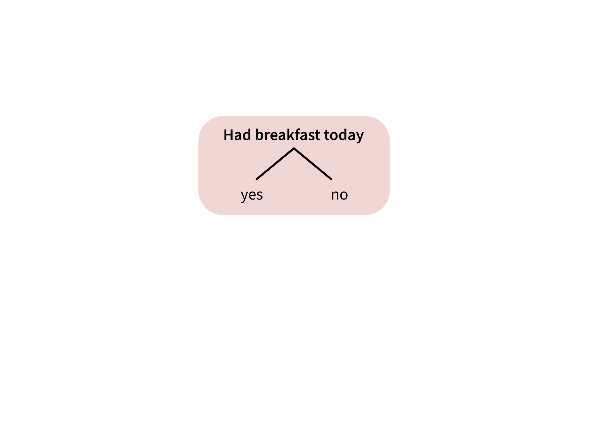
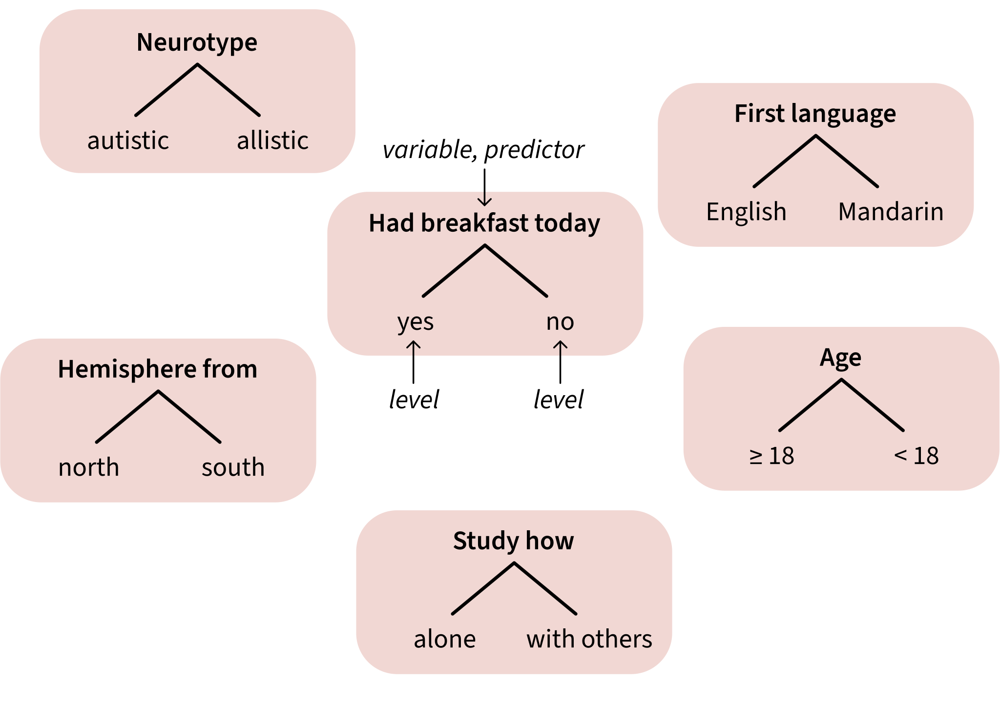
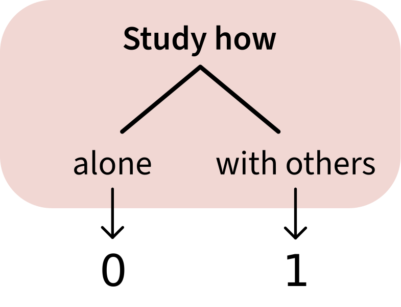
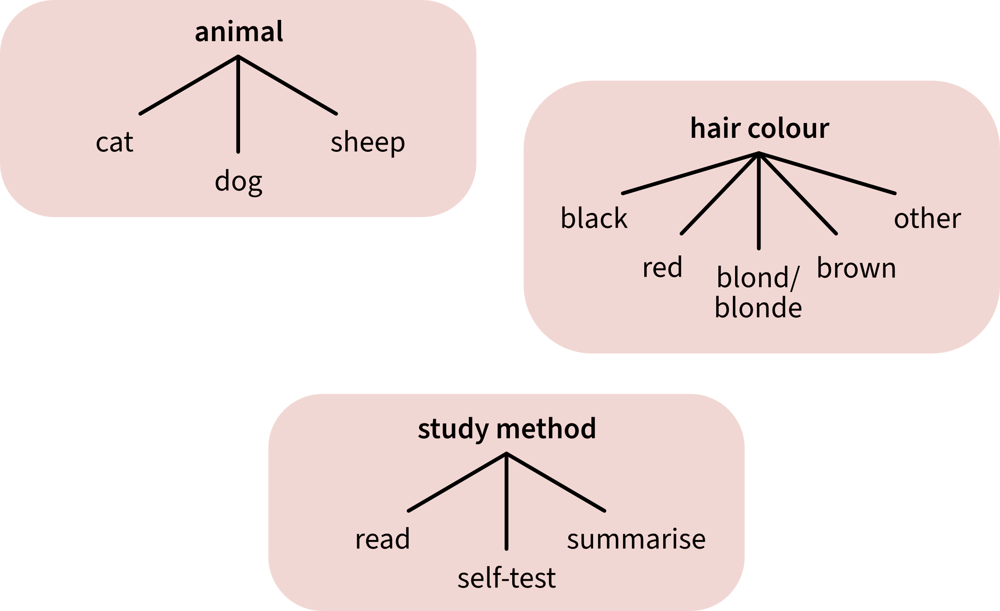

```{r setup, include=F}
library(tidyverse)
library(patchwork)
library(emmeans)
library(simglm)
library(sjPlot)
library(latex2exp)  # for betas in ggplots
source('../_theme/theme_quarto.R')

dapr2red <- "#BF1932" 
pal <- c("#3173c9", "#ff94b0", "#51b375")
```


```{r message=F, warning=F, include=F}
# simulate the data

set.seed(3119) 

sim_arguments <- list(
  formula = y ~ 1 + hours + motivation + study + method,
  fixed = list(hours = list(var_type = 'ordinal', levels = 0:15),
               motivation = list(var_type = 'continuous', mean = 0, sd = 1),
               study = list(var_type = 'factor', 
                            levels = c('alone', 'others'),
                            prob = c(0.53, 0.47)),
               method = list(var_type = 'factor', 
                            levels = c('read', 'summarise', 'self-test'),
                            prob = c(0.3, 0.4, 0.3))),
  error = list(variance = 20),
  sample_size = 250,
  reg_weights = c(0.6, 1.4, 1.5, 6, 6, 2)
)

df3 <- simulate_fixed(data = NULL, sim_arguments) %>%
  simulate_error(sim_arguments) %>%
  generate_response(sim_arguments)

score_data <- df3 %>%
  dplyr::select(y, hours, motivation, study, method) %>%
  mutate(
    ID = paste("ID", 101:350, sep = ""),
    score = round(y+abs(min(y))),
    motivation = round(motivation, 2),
    study = factor(study),
    method = factor(method)
  ) %>%
  dplyr::select(ID, score, hours, motivation, study, method)

score_data <- score_data |>
  mutate(study_num = ifelse(study == 'alone', 0, 1))

# get group means
mean_alone <- filter(score_data, study == 'alone')$score |> mean()
sd_alone <- filter(score_data, study == 'alone')$score |> sd()
mean_others <- filter(score_data, study == 'others')$score |> mean()
sd_others <- filter(score_data, study == 'others')$score |> sd()
```


# Course overview {background-color="white"}

TODO


## Warm-up activity: Line drawing

Draw each of the lines that's defined by the given intercept and slope.

<br>

:::: {.columns}
::: {.column width="33%"}
**Line 1:**

- Intercept is **0**
- Slope is **1**

<!-- Equation: y = b + mx -->

```{r echo=F, fig.asp=1, fig.width=6}
xy_plane <- tibble(
  x = seq(-2, 2),
  y = seq(-2, 2)
) |>
  ggplot(aes(x=x, y=y)) +
  # geom_blank()
  scale_x_continuous(limits = c(-2, 2), expand = c(0, 0)) +
  scale_y_continuous(limits = c(-2, 2), expand = c(0, 0)) +
  geom_segment(x = -2, xend = 2, y = 0, yend = 0,
               arrow = arrow(ends = 'both', length = unit(12, 'pt')), colour = 'black', linewidth = 1.5) +
  geom_segment(x = 0, xend = 0, y = -2, yend = 2, 
               arrow = arrow(ends = 'both', length = unit(12, 'pt')), colour = 'black', linewidth = 1.5) +
  theme(plot.margin = margin(1,1,0,0, "cm")) +
  # geom_abline(intercept = 0, slope = 1, colour = 'blue', linewidth = 2) +
  NULL
xy_plane
```


:::
::: {.column width="33%"}
**Line 2:**

- Intercept is **1**
- Slope is **–1** 

```{r echo=F, fig.asp=1, fig.width=6}
xy_plane +
  # geom_abline(intercept = 1, slope = -1, colour = 'blue', linewidth = 2) +
  NULL
```

:::
::: {.column width="33%"}
**Line 3:**

- Intercept is **–1**
- Slope is **2** 

```{r echo=F, fig.asp=1, fig.width=6}
xy_plane +
  # geom_abline(intercept = -1, slope = 2, colour = 'blue', linewidth = 2) +
  NULL
```

:::
::::


## This week's learning objectives

<br>

::: {.fragment}
::: {.dapr2callout style="font-size: 125%;"}
How can we include categorical variables as predictors in a linear model?
:::
:::

::: {.fragment}
::: {.dapr2callout style="font-size: 125%;"}
When we use a categorical predictor, how do we interpret the linear model’s coefficients?
:::
:::

::: {.fragment}
::: {.dapr2callout style="font-size: 125%;"}
What hypotheses are tested by the default way that R represents categorical predictors?
:::
:::

::: {.fragment}
::: {.dapr2callout style="font-size: 125%;"}
What is "contrast coding"?
:::
:::


<!-- ======================================== -->

# Categorical predictors with two levels

## Categorical predictors with two levels <br> aka binary predictors

{fig-align="center" height="600"}


## Categorical predictors with two levels <br> aka binary predictors

{fig-align="center" height="600"}


## Categorical predictors with two levels <br> aka binary predictors

{fig-align="center" height="600"}

:::{.fragment}

But: linear models can only deal with input in number form.

So we need a way to represent the levels of these variables as numbers.

The way we'll learn about today: **treatment coding**.

:::


## Treatment coding represents one level as 0, and the other level as 1

<br>


:::: {.columns}
::: {.column width="40%"}

**Schematic:**

{fig-align="center"}

- Studying `alone` is coded as 0.

- Studying with `others` is coded as 1.


:::
::: {.column width="10%"}
:::
::: {.column width="50%"}
**In the data:**

:::{ style="font-size: 100%;" }

```{r df head}
score_data |>
  select(ID, study, study_num) |>
  head(10)
```


:::
:::
::::


## What does it mean to represent levels as 0 or 1?

To illustrate: Here are test scores from students who studied either `alone` (blue) or with `others` (pink).

:::: {.columns}
::: {.column width="50%"}

```{r fig.width = 8, fig.asp=1, fig.align='center'}
#| code-fold: true

set.seed(1)
p_viol_bin <- score_data |>
  ggplot(aes(x = study, y = score, fill = study, colour = study)) +
  geom_violin(alpha = 0.5) +
  geom_jitter(alpha = 0.5, size = 5, width = 0.3) +
  theme(
    legend.position = 'none',
    panel.grid.minor = element_blank()
    ) +
  stat_summary(fun = mean, geom = 'point', colour = 'black', size = 8, show.legend = FALSE) +

  scale_colour_manual(values = pal) +
  scale_fill_manual(values = pal) +
  NULL
p_viol_bin
```
:::

::: {.column width="50%"}
```{r fig.width = 8, fig.asp=1, fig.align='center'}
#| code-fold: true

xlim_lower <- -2.2
xlim_upper <-  2.2
ylim_lower <- -15
ylim_upper <-  55

set.seed(1)  # seed for constant jitter
p_xy_study <- score_data |>
  ggplot(aes(x = study_num, y = score)) +
  geom_jitter(aes(colour = study), alpha = 0.25, width = 0.1, size = 5) +
  scale_x_continuous(limits = c(xlim_lower, xlim_upper), expand = c(0, 0)) +
  scale_y_continuous(limits = c(ylim_lower, ylim_upper), expand = c(0, 0)) +
  geom_segment(x = xlim_lower, xend = xlim_upper, y = 0, yend = 0,
               arrow = arrow(ends = 'both', length = unit(12, 'pt')), colour = 'black') +
  geom_segment(x = 0, xend = 0, y = ylim_lower, yend = ylim_upper, 
               arrow = arrow(ends = 'both', length = unit(12, 'pt')), colour = 'black') +
  stat_summary(fun = mean, geom = 'point', colour = 'black', size = 8, show.legend = FALSE) +

  scale_colour_manual(values = pal) +
  theme(
    panel.grid.minor = element_blank(),
    legend.position = 'bottom'
  ) +
  labs(
    x = 'study (in numeric space)'
  ) +
 guides(colour = guide_legend(override.aes = list(alpha = 1))) + 
  NULL

p_xy_study
```

:::
::::


## What does it mean to represent levels as 0 or 1?

To illustrate: Here are test scores from students who studied either `alone` (blue) or with `others` (pink).

:::: {.columns}
::: {.column width="50%"}

```{r fig.width = 8, fig.asp=1, fig.align='center'}
#| code-fold: true
set.seed(1)
p_viol_bin +
  # stat_summary(colour = 'black', fun = mean, geom = 'point', size = 2) +
  # geom_segment(aes(x = 'alone', xend = 'others', y = mean_alone, yend = mean_others), colour = 'black') +
  NULL
```
:::

::: {.column width="50%"}
```{r fig.width = 8, fig.asp=1, fig.align='center'}
#| code-fold: true

set.seed(1)  # seed for constant jitter
p_xy_study <- p_xy_study +
  geom_abline(slope = mean_others - mean_alone, intercept = mean_alone, colour = 'black', linewidth = 2) +
  NULL
p_xy_study
```

:::
::::

A linear model will fit a line to this data.

The line's intercept will be the same as the mean of either **alone** or **others**. Which one?
Why?

TODO WOO

## How do we describe this line?

:::: {.columns}

::: {.column width="50%"}
Using our mathematical toolkit:

$$
\text{score} = \beta_0 + (\beta_1 \cdot \text{study}_{\text{others}}) + \epsilon
$$

<br>

**$\beta_0$:** intercept, mean of `alone` (the level represented as 0, which we call the **reference level**):

```{r}
mean_alone
```

<br>

**$\beta_1$:** slope, the difference between mean of `others` (represented as 1) and mean of `alone` (represented as 0):

```{r}
mean_others - mean_alone
```

<br>

**$\epsilon_i$:** error for each individual data point $i$

:::


::: {.column width="50%"}

```{r plot xy with betas, echo=F, fig.width=8, fig.asp=1}
gm <- mean(mean_alone, mean_others)

set.seed(1)  # seed for constant jitter
p_xy_study +
  # right triangle
  geom_segment(x = 0, xend = 1, y = mean_alone, yend = mean_alone,
               colour = dapr2red, linewidth = 2, linetype = 'dotted') +
  geom_segment(x = 1, xend = 1, y = mean_alone, yend = mean_others,
               colour = dapr2red, linewidth = 2) +
  # arrows
  geom_segment(x = -.8, xend = -.15, y = mean_alone+13, yend = mean_alone+3, arrow = arrow(), colour = dapr2red) +
  geom_segment(x = 1.7, xend = 1.1, y = gm, yend = gm, arrow = arrow(), colour = dapr2red) +
  # betas
  geom_label(x = -1, 
             y = mean_alone+13, 
             label = TeX('${\\beta}_0$'), 
             size = 12, 
             col = dapr2red) +
  geom_label(x = 1.8, 
             y = gm, 
             label = TeX('${\\beta}_1$'), 
             size = 12, 
             col = dapr2red) +
  NULL
```

:::

::::


# Testing differences between levels

## Testing differences between levels

<br>

We can find  parameters values all on our own, without a linear model.

But we need a linear model to answer research questions like:

**Do students who study with others score significantly better than students who study alone?**

<br>

To answer this question, we'll fit a model that predicts score as a function of study patterns.

<!-- my instinct is to want students to do some predictions here, see what param estimates would be consistent with each outcome. but I think they don't know yet what hyps are being tested by each param. so it might be premature. we can do it later.-->

$$
\text{score} = \beta_0 + (\beta_1 \cdot \text{study}_\text{others}) + \epsilon
$$

<br>

```{r}
m1 <- lm(score ~ study, data = score_data)
```


## Modelling `score ~ study` 

```{r}
summary(m1)
```

<br>

:::{.fragment  style="font-size: 120%;" }
**Those coefficient estimates look familiar...**

:::: {.columns}
::: {.column width="50%"}
```{r}
mean_alone
```
:::
::: {.column width="50%"}
```{r}
mean_others - mean_alone
```

:::
::::

:::


## Model evaluation works the same as before

<br>

**$R^2$:**

- Still tells us how much variance in the data is accounted for by the model.

```{r echo=F}
cat(capture.output(summary(m1))[17])
```

<br>

**$F$-ratio (aka $F$-statistic):**

- Still tells us the ratio of explained variance to unexplained variance.
- Still tests the hypothesis that all regression slopes in the model = 0.

```{r echo=F}
cat(capture.output(summary(m1))[18])
```

<br>

(Revisit Lecture 4 for a refresher!)


## What hypotheses are being tested for each coefficient? Same as always: that the estimate equals zero.

```{r echo=F}
summary(m1)$coefficients
```

<br> 

:::{.fragment}


**`(Intercept)` aka $\beta_0$:**

- Null hypothesis (aka H0): the intercept is equal to zero (aka $\beta_0 = 0$).
- $p$-value (aka `Pr(>|t|)`): the probability of observing an intercept of 22.85 (or even more extreme), assuming that the true value of the intercept is zero.

:::

:::{.fragment}


**`studyothers` aka $\beta_1$:**

- Null hypothesis (aka H0): the difference between levels is equal to zero (aka $\beta_1 = 0$).
- $p$-value: the probability of observing a difference of `r round(mean_others-mean_alone, 2)` (or even more extreme), assuming that the true value of the difference is zero.
:::

<br>

:::{.fragment}

Our research question was about how studying alone or with others is associated with test score.

**Are both of these hypothesis tests relevant to our research question?**

:::


## Visualising the model's predictions

`plot_model()` from `sjPlot` works OK for categorical data too:

```{r fig.align='center'}
plot_model(
  m1,                 # which model?
  type = 'eff',       # what kind of plot?
  terms = 'study',    # what predictor?
  colors = 'black',   # what colour to use?
  show.data = TRUE,   # show data points as well as mean + 95% CI?
  jitter = TRUE       # jitter the data points to show them more clearly?
)
```

# Changing the reference level

## Changing the reference level 

:::: {.columns}
::: {.column width="50%"}

If reference level = `alone`:

```{r plot xy ref alone, echo = F, fig.width=8, fig.asp = 1}
set.seed(1)
p_xy_study +
  geom_abline(slope = coef(m1)[['studyothers']], intercept = mean_alone, colour = 'black', linewidth = 2) +
  NULL
```

:::
::: {.column width="50%"}

If reference level = `others`:

```{r plot xy ref others, echo=F, fig.width = 8, fig.asp = 1}
score_data |>
  mutate(study_num = ifelse(study == 'others', 0, 1)) |>
  ggplot(aes(x = study_num, y = score)) +
  geom_jitter(aes(colour = study), alpha = 0.25, width = 0.1, size = 5) +
  scale_x_continuous(limits = c(xlim_lower, xlim_upper), expand = c(0, 0)) +
  scale_y_continuous(limits = c(ylim_lower, ylim_upper), expand = c(0, 0)) +
  geom_segment(x = xlim_lower, xend = xlim_upper, y = 0, yend = 0,
               arrow = arrow(ends = 'both', length = unit(12, 'pt')), colour = 'black') +
  geom_segment(x = 0, xend = 0, y = ylim_lower, yend = ylim_upper, 
               arrow = arrow(ends = 'both', length = unit(12, 'pt')), colour = 'black') +
  stat_summary(fun = mean, geom = 'point', colour = 'black', size = 8, show.legend = FALSE) +

  scale_colour_manual(values = pal) +
  theme(
    panel.grid.minor = element_blank(),
    legend.position = 'bottom'
  ) +
  labs(
    x = 'study (in numeric space)'
  ) +
  guides(colour = guide_legend(override.aes = list(alpha = 1))) + 
  geom_abline(slope = -coef(m1)[['studyothers']], intercept = mean_others, colour = 'black', linewidth = 2) +
  NULL
```

:::
::::

When `others` is the reference level (that is, the level represented as 0):

- What does the intercept represent?
- What does the slope represent?
- Why is the slope negative now, when before it was positive?

TODO WOO


## How to change reference level in R?

The function `contrasts()` shows us how a categorical predictor will be coded.
(You'll get error messages if the variable is not stored as a factor.)

The original treatment coding:

```{r}
contrasts(score_data$study)
```

<br>

Reorder factor levels in `study`, putting our desired reference level first:

```{r}
score_data <- score_data |>
  mutate(
    study = factor(study, levels = c('others', 'alone'))
  )
```

<br>

Now check the contrasts. **How can we tell that `others` is now the reference level?**

```{r}
contrasts(score_data$study)
```

## Fit a new model

Before:

$$
\text{score} = \beta_0 + (\beta_1 \cdot \text{study}_{\text{others}}) + \epsilon
$$

<br>

Now:

$$
\text{score} = \beta_0 + (\beta_1 \cdot \text{study}_{\text{alone}}) + \epsilon
$$

<br>

In R syntax, the model formula stays the same: `score ~ study`.

```{r}
m2 <- lm(score ~ study, data = score_data)
```


## Old model vs. new model

:::: {.columns}
::: {.column width="50%"}
**Reference level = `alone` (old model):**

::: {style="font-size:79%;"}
```{r}
summary(m1)
```
:::

:::
::: {.column width="50%"}
**Reference level = `others` (new model):**

::: {style="font-size:79%;"}
```{r}
summary(m2)
```
:::

:::
::::

<br>

In the `others` model (`m2`, on the right), **what hypotheses are being tested for each coefficient?**

TODO WOO


## How to choose appropriate reference level?

<br>

In treatment coding,

- the intercept will always be the estimated mean outcome for the reference level (the level coded as 0).
- the slope will always be the estimated difference between the non-reference level (coded as 1) and the reference level (coded as 0).

So how do you decide which level should be the reference level?

<br>

**Useful reference levels might be:**

- The control group in a study (because then all the comparisons will be to various experimental treatments)
- The group expected to have the lowest score on the outcome (because then all the comparisons will be positive)
- The largest group (because then the intercept estimate will be more precise)


<!-- ======================================== -->

# Categorical predictors <br> with >2 levels

## Examples of categorical predictors with >2 levels

<br>

{fig-align="center" height="600"}


## New data: Study method

```{r include=F}
mean_read <- filter(score_data, method == 'read')$score |> mean()
sd_read <- filter(score_data, method == 'read')$score |> sd()
mean_self <- filter(score_data, method == 'self-test')$score |> mean()
sd_self <- filter(score_data, method == 'self-test')$score |> sd()
mean_summ <- filter(score_data, method == 'summarise')$score |> mean()
sd_summ <- filter(score_data, method == 'summarise')$score |> sd()
```

:::{.r-stack}
```{r fig.width = 10, fig.height = 5, fig.align = 'center'}
#| code-fold: true
set.seed(1)
p_viol <- score_data |>
  ggplot(aes(x = method, y = score, fill = method, colour = method)) +
  geom_violin(alpha = 0.5) +
  geom_jitter(alpha = 0.5, width = 0.2, size = 5) +
  theme(legend.position = 'none') +
  scale_fill_manual(values = pal) +
  scale_colour_manual(values = pal) +
  stat_summary(fun = mean, geom = 'point', colour = 'black', size = 5) +
  NULL

p_viol
```
:::{.fragment data-fragment-index="1"}
```{r fig.width = 10, fig.height = 5, fig.align = 'center'}
#| code-fold: true
set.seed(1)
p_viol_lines <- p_viol +
  # line from read to self-test:
  geom_segment(colour = 'black', aes(x = 'read', xend = 'self-test', y = mean_read, yend = mean_self), linewidth = 1) +
  # line from read to summarise:
  geom_segment(colour = 'black', aes(x = 'read', xend = 'summarise', y = mean_read, yend = mean_summ), linewidth = 1) +
  NULL
p_viol_lines
```
:::
:::

**How do we fit a line to data from _three_ groups?**

:::{.fragment data-fragment-index="1"}
- It's impossible to draw one single straight line through all three group means.
- The smallest number of straight lines that connect all three group means is **two**.
- For this reason, we're going to use **two** predictors. These two predictors are called **"dummy variables"**.
- In general, for a categorical predictor with $k$ levels, we'll use $k-1$ dummy variables.
:::


## Dummy variables let us extend treatment coding to >2 levels

<br>

:::: {.columns}
::: {.column width="50%"}

```{r echo=F, fig.width = 8, fig.height = 5, fig.align = 'center'}
set.seed(1)
p_viol_lines
```


:::
::: {.column width="50%"}

<br>

Both dummy variables have the same reference level: `read`.

- The first dummy variable will compare `self-test` back to `read`.
- The second dummy variable will compare `summarise` back to `read`.

:::
::::

## Dummy variables let us extend treatment coding to >2 levels 

:::: {.columns}
::: {.column width="50%"}

First dummy variable: `self-test` vs. `read`.

```{r xy dummy 1, echo=F, fig.width=7, fig.asp=1}
#| code-fold: true
xlim_lower <- -2.2
xlim_upper <-  2.2
ylim_lower <- -25
ylim_upper <-  55

set.seed(1)
p1 <- score_data |> 
  filter(method %in% c('read', 'self-test')) |>
  mutate(method_num = ifelse(method == 'read', 0, 1)) |>
  ggplot(aes(x = method_num, y = score, colour = method)) +
  geom_jitter(alpha = 0.3, width = 0.1, size = 5) +
  scale_x_continuous(limits = c(xlim_lower, xlim_upper), expand = c(0, 0)) +
  scale_y_continuous(limits = c(ylim_lower, ylim_upper), expand = c(0, 0)) +
  geom_segment(x = xlim_lower, xend = xlim_upper, y = 0, yend = 0, arrow = arrow(ends = 'both', length = unit(12, 'pt')), colour = 'black') +
  geom_segment(x = 0, xend = 0, y = ylim_lower, yend = ylim_upper, arrow = arrow(ends = 'both', length = unit(12, 'pt')), colour = 'black') +
  stat_summary(fun = mean, geom = 'point', colour = 'black', size = 8, show.legend = FALSE) +

  # geom_segment(x = 0, xend = 1, y = mean_read, yend = mean_self, colour = 'black') +
  # geom_segment(x = 0, xend = 1, y = mean_read, yend = mean_read, colour = 'red', linewidth = 2) +
  # geom_segment(x = 1, xend = 1, y = mean_read, yend = mean_self, colour = 'red', linewidth = 2) +
  labs(
    x = 'method (in numeric space)'
  ) +
  theme(legend.position = 'bottom') +
  scale_colour_manual(values = c(pal[1], pal[2])) +
  guides(colour = guide_legend(override.aes = list(alpha = 1))) +
  geom_abline(slope = (mean_self - mean_read), intercept = mean_read, linewidth = 2) +
  NULL
p1
```
:::
::: {.column width="50%"}

Second dummy variable: `summarise` vs. `read`.

```{r xy dummy 2, echo=F, fig.width=7, fig.asp=1}
#| code-fold: true
set.seed(1)
p2 <- score_data |> 
  filter(method %in% c('read', 'summarise')) |>
  mutate(method_num = ifelse(method == 'read', 0, 1)) |>
  ggplot(aes(x = method_num, y = score, colour = method)) +
  geom_jitter(alpha = 0.3, width = 0.1, size = 5) +
  scale_x_continuous(limits = c(xlim_lower, xlim_upper), expand = c(0, 0)) +
  scale_y_continuous(limits = c(ylim_lower, ylim_upper), expand = c(0, 0)) +
  geom_segment(x = xlim_lower, xend = xlim_upper, y = 0, yend = 0, arrow = arrow(ends = 'both', length = unit(12, 'pt')), colour = 'black') +
  geom_segment(x = 0, xend = 0, y = ylim_lower, yend = ylim_upper, arrow = arrow(ends = 'both', length = unit(12, 'pt')), colour = 'black') +
  stat_summary(fun = mean, geom = 'point', colour = 'black', size = 8, show.legend = FALSE) +

  # geom_segment(x = 0, xend = 1, y = mean_read, yend = mean_summ, colour = 'black') +
  # geom_segment(x = 0, xend = 1, y = mean_read, yend = mean_read, colour = 'red', linewidth = 2) +
  # geom_segment(x = 1, xend = 1, y = mean_read, yend = mean_summ, colour = 'red', linewidth = 2) +
  labs(
    x = 'method (in numeric space)'
  ) +  
  theme(legend.position = 'bottom') +
  scale_colour_manual(values = c(pal[1], pal[3])) +
  guides(colour = guide_legend(override.aes = list(alpha = 1))) +
  geom_abline(slope = (mean_summ - mean_read), intercept = mean_read, linewidth = 2) +
  NULL
p2
```

:::
::::

<!-- :::{.incremental} -->
<!-- 1. Is the slope of the first dummy variable **positive or negative**?    -->
<!-- 2. Is the slope of the second dummy variable **positive or negative**?    -->
<!-- 3. Is the **slope** of the first dummy variable **bigger** than the slope of the second dummy variable?    -->
<!-- 4. Is the **intercept** of the first dummy variable **bigger** than the intercept of the second dummy variable?   -->
<!-- ::: -->


## How do we know that a model will use *these* particular dummy variables? 

<br>

Use `contrasts()`:

```{r}
contrasts(score_data$method)
```

<br>


**How to read this output:**

- Each **column** contains one dummy variable.
  1. `self-test` compares `self-test` (the 1 in that column) to `read`.
  2. `summarise` compares `summarise` (the 1 in that column) to `read`.

- We know that the reference level is `read` because **in BOTH dummy variables, `read` is coded as 0.**


## Modelling `score ~ method` 

The linear expression:

$$
\text{score}_i = \beta_0 + 
(\beta_1 \cdot \text{method}_{\text{summarise}}) + 
(\beta_2 \cdot \text{method}_{\text{self-test}}) +
\epsilon_i
$$

:::{.fragment}
In R:

```{r}
m3 <- lm(score ~ method, data = score_data)

summary(m3)
```
:::

## What does each coefficient mean? (1)

::::{.columns}
:::{.column width="60%"}
```{r echo=F, fig.width = 7, fig.height = 5}
set.seed(1)
p_viol
```


:::{style="font-size:80%;"}

```{r echo = F}
cat(paste0(capture.output(summary(m3)), '\n')[9:13])
```

:::

:::
:::{.column width="40%"}

**`(Intercept)` aka $\beta_0$:**
The mean score for the reference level (`read`) is 23.41 points.

<br>

```{r}
mean_read
```

<br>

- Null hypothesis: The mean score for the reference level (`read`) is equal to zero.
- $p$-value: the probability of observing an intercept of `r mean_read` (or more extreme), assuming that the true intercept is zero.


:::{.fragment}
**Can we reject this null hypothesis?** 

 
:::

<br>

:::{.fragment}
**If we care about differences between study methods, is this null hypothesis interesting?**

 
:::

:::
::::


## What does each coefficient mean? (2)

::::{.columns}
:::{.column width="60%"}
```{r echo=F, fig.width = 7, fig.height = 5}
set.seed(1)
p_viol
```


:::{style="font-size:80%;"}

```{r echo = F}
cat(paste0(capture.output(summary(m3)), '\n')[9:13])
```

:::

:::
:::{.column width="40%"}

**`methodsummarise` aka $\beta_1$:**
The difference between the estimated average score for `summarise` and the estimated average score for `read` is 4.78 points.

<br>

```{r}
mean_summ - mean_read
```

<br>

- Null hypothesis: This difference is equal to zero.
- $p$-value: the probability of a difference of 4.78 (or more extreme), assuming that the true difference is zero.


:::{.fragment}
**Can we reject this null hypothesis?** 

 
:::

<br>

:::{.fragment}
**If we care about differences between study methods, is this null hypothesis interesting?**

 
:::

:::
::::

## What does each coefficient mean? (3)

::::{.columns}
:::{.column width="60%"}
```{r echo=F, fig.width = 7, fig.height = 5}
set.seed(1)
p_viol
```


:::{style="font-size:80%;"}

```{r echo = F}
cat(paste0(capture.output(summary(m3)), '\n')[9:13])
```

:::

:::
:::{.column width="40%"}
**`methodself-test` aka $\beta_2$:**
The difference between the estimated average score for `self-test` and the estimated average score for `read` is 0.16 points.

<br>

```{r}
mean_self - mean_read
```

<br>

- Null hypothesis: This difference is equal to zero.
- $p$-value: the probability of a difference of 0.16 (or more extreme), assuming that the true difference is zero.


:::{.fragment}
**Can we reject this null hypothesis?** 

 
:::

<br>

:::{.fragment}
**If we care about differences between study methods, is this null hypothesis interesting?**

 
:::

:::
::::


# Changing the reference level

<!-- ## What happens if we change the reference level? -->

<!-- <br> -->


<!-- Before, the reference level of `method` was `read`, and the non-reference levels were `self-test` and `summarise`. -->

<!-- **Now, the reference level of `method` is `summarise`**, and the non-reference levels are `read` and `self-test`. -->

<!-- - Would you expect **the model coefficients** to be the same or different? -->
<!-- - Would you expect **the p-values of each model coefficient** to be the same or different? -->


## How to change reference level in R?


The original dummy variables:

```{r}
contrasts(score_data$method)
```


<br>

<!-- ```{r} -->
<!-- contrasts(score_data$method) <- contr.treatment( -->
<!--   c('read', 'self-test', 'summarise'),  # could also just be "3", for 3 levels -->
<!--   base = 3 -->
<!-- ) -->
<!-- ``` -->

Reorder factor levels in `method`, putting our desired reference level first:

```{r}
score_data <- score_data |>
  mutate(
    method = factor(method, levels = c('summarise', 'read', 'self-test'))
  )
```

<br>

Now check the contrasts. **How can we tell that `summarise` is now the reference level?**

```{r}
contrasts(score_data$method)
```


## Visualising the new dummy variables

:::: {.columns}
::: {.column width="50%"}

First new dummy variable:

`read` vs. `summarise`.


```{r xy dummy relevel 1, echo=F, fig.width=7.5, fig.asp=1}
set.seed(1)
p3 <- score_data |> 
  filter(method %in% c('read', 'summarise')) |>
  mutate(method_num = ifelse(method == 'summarise', 0, 1)) |>
  ggplot(aes(x = method_num, y = score, colour = method)) +
  geom_jitter(alpha = 0.3, width = 0.1, size = 5) +
  scale_x_continuous(limits = c(xlim_lower, xlim_upper), expand = c(0, 0)) +
  scale_y_continuous(limits = c(ylim_lower, ylim_upper), expand = c(0, 0)) +
  geom_segment(x = xlim_lower, xend = xlim_upper, y = 0, yend = 0, arrow = arrow(ends = 'both', length = unit(12, 'pt')), colour = 'black') +
  geom_segment(x = 0, xend = 0, y = ylim_lower, yend = ylim_upper, arrow = arrow(ends = 'both', length = unit(12, 'pt')), colour = 'black') +
  stat_summary(fun = mean, geom = 'point', colour = 'black', size = 8, show.legend = FALSE) +
  labs(
    x = 'method (in numeric space)'
  ) +
  theme(legend.position = 'bottom') +
  scale_colour_manual(values = c(pal[3], pal[1])) +
  guides(
    colour = guide_legend(override.aes = list(alpha = 1), nrow = 2,byrow = TRUE)
    ) + 
  geom_abline(slope = (mean_read - mean_summ), intercept = mean_summ, linewidth = 2) +
  NULL
p3
```
:::

::: {.column width="50%"}

Second new dummy variable:

`self-test` vs. `summarise`.

```{r xy dummy relevel 2, echo=F, fig.width=7.5, fig.asp=1}
set.seed(1)
p4 <- score_data |> 
  filter(method %in% c('self-test', 'summarise')) |>
  mutate(method_num = ifelse(method == 'summarise', 0, 1)) |>
  ggplot(aes(x = method_num, y = score, colour = method)) +
  geom_jitter(alpha = 0.3, width = 0.1, size = 5) +
  scale_x_continuous(limits = c(xlim_lower, xlim_upper), expand = c(0, 0)) +
  scale_y_continuous(limits = c(ylim_lower, ylim_upper), expand = c(0, 0)) +
  geom_segment(x = xlim_lower, xend = xlim_upper, y = 0, yend = 0, arrow = arrow(ends = 'both', length = unit(12, 'pt')), colour = 'black') +
  geom_segment(x = 0, xend = 0, y = ylim_lower, yend = ylim_upper, arrow = arrow(ends = 'both', length = unit(12, 'pt')), colour = 'black') +
  stat_summary(fun = mean, geom = 'point', colour = 'black', size = 8, show.legend = FALSE) +
  labs(
    x = 'method (in numeric space)'
  ) +  
  theme(legend.position = 'bottom') +
  scale_colour_manual(values = c(pal[3], pal[2])) +
  guides(
    colour = guide_legend(override.aes = list(alpha = 1), nrow = 2,byrow = TRUE)
    ) +
  geom_abline(slope = (mean_self - mean_summ), intercept = mean_summ, linewidth = 2) +
  NULL
p4
```

:::
::::

:::{.incremental}

1. Is the slope of the first dummy variable **positive or negative**?   
2. Is the slope of the second dummy variable **positive or negative**?   
3. Will the coefficient estimates be **the same or different** compared to our previous model?   

:::

## Old model vs. new model


```{r}
m4 <- lm(score ~ method, data = score_data)
```

<br>

:::: {.columns}
::: {.column width="50%"}
**Reference level = `read` (old model):**

::: {style="font-size:75%;"}
```{r}
summary(m3)
```
:::

:::
::: {.column width="50%"}
**Reference level = `summarise` (new model):**

::: {style="font-size:75%;"}
```{r}
summary(m4)
```
:::

:::
::::

<br>

What hypotheses does each model test?
What hypotheses does each model *not* test?


# Back matter


## Revisiting this week's learning objectives

::: {.dapr2callout}
**How can we include categorical variables as predictors in a linear model?**

- Represent the variable numerically, for example using treatment coding (also called treatment coding).
- In treatment coding, the reference level (also called baseline level) is represented ("coded") as 0, and the non-reference level is coded as 1.
- For categorical predictors with >2 levels, treatment coding uses "dummy variables" to individually compare each non-reference level to the same reference level.

:::

::: {.dapr2callout}
**When we use a categorical predictor, how do we interpret the linear model's coefficients?**

- Intercept (also written as $\beta_0$): The mean outcome for the reference level.
- Slope (also written as $\beta_1$, $\beta_2$, etc., or for short, $\beta_j$): The difference between (1) the mean outcome for the non-reference level and (2) the mean outcome for the reference level (when all other predictors are at zero).

:::

## Revisiting this week's learning objectives

::: {.dapr2callout}
**What hypotheses are tested by the default way that R represents categorical predictors?**

- By default, R uses treatment coding/treatment coding. And by default, the reference level is the level that comes first in the alphabet.
- The intercept's hypothesis test: The mean outcome for the reference level is different from zero.
- The slope's hypothesis test: The difference between the (1) mean outcome for the non-reference level and (2) the mean outcome for the reference level is different from zero.
:::

::: {.dapr2callout}
**What is "contrast coding"?**

- "Contrast coding" is a general term that refers to representing categorical predictors as numbers.
- One specific example of a contrast coding scheme is treatment coding (which uses 0s and 1s).
- Another example of a contrast coding scheme is sum coding aka effects coding (which uses –1 and 1). We'll get to know sum coding next week.
:::


## This week 

<br>

::::{.columns}
:::{.column width="50%"}
**Tasks:**

<br>

{width=80px style="margin:10px;margin-bottom:-50px"} Work on exercises in labs

<br>

{width=80px style="margin:10px;margin-bottom:-45px"} Complete the weekly quiz 


:::

:::{.column width="50%"}
**Get support:**

<br>

{width=80px style="margin:10px;margin-bottom:-30px"}
Consult the [flash cards](https://uoepsy.github.io/dapr2/2627/flashcards/){target="_blank"}

<br>

{width=80px style="margin:10px;margin-bottom:-50px"}
Ask questions anonymously on Piazza

<br>

{width=80px style="margin:10px;margin-bottom:-40px"} 
We really like seeing you in office hours!

:::
::::


# Appendix {.appendix}


## Prediction equations: `score ~ study` <br> (two levels) 

The linear expression that the model assumes has generated each data point $i$ (the reference level is `alone`:

$$
score_i = \beta_0 + (\beta_1 \cdot study) + \epsilon_i
$$

A little hat over the variable means that that's an estimated value, so the model will estimate:

$$
\widehat{score} = \hat{\beta_0} + (\hat{\beta_1} \cdot study)
$$

With simple algebra, we can work out how the $\beta$ coefficients relate to the estimated score of each group.

:::: {.columns}
::: {.column width="50%"}
**Studying alone is represented as `study = 0`.**

$$
\begin{align}
\widehat{score}_{alone} &= \hat{\beta_0} + (\hat{\beta_1} \cdot study) \\
\widehat{score}_{alone} &= \hat{\beta_0} + (\hat{\beta_1} \cdot 0) \\
\widehat{score}_{alone} &= \hat{\beta_0} + 0 \\
\widehat{score}_{alone} &= \hat{\beta_0} \\
\end{align}
$$

:::
::: {.column width="50%"}

**Studying with others is represented as `study = 1`.**


$$
\begin{align}
\widehat{score}_{others} &= \hat{\beta_0} + (\hat{\beta_1} \cdot study) \\
\widehat{score}_{others} &= \hat{\beta_0} + (\hat{\beta_1} \cdot 1) \\
\widehat{score}_{others} &= \hat{\beta_0} + \hat{\beta_1} \\
\end{align}
$$

:::
::::


## Prediction equations: `score ~ method` <br> (three levels) 

The linear expression that the model assumes has generated each data point $i$ (the reference level is `read`):

$$
score_i = \beta_0 + (\beta_1 \cdot method_{self-test}) + (\beta_2 \cdot method_{summarise}) + \epsilon_i
$$

A little hat over the variable means that that's an estimated value, so the model will estimate:

$$
\widehat{score} = \beta_0 +  (\hat{\beta_1} \cdot method_{self-test}) + (\hat{\beta_2} \cdot method_{summarise})
$$

With simple algebra and with the help of the `contrasts()` function, we can work out how the $\beta$ coefficients relate to the estimated score of each group.

:::: {.columns}
::: {.column width="40%"}

<br>

```{r include=F}
score_data <- score_data |>
  mutate(
    method = factor(method, levels = c('read', 'self-test', 'summarise'))
  )
```

```{r}
contrasts(score_data$method)
```


:::
::: {.column width="60%"}

First: **Studying by reading is represented as $method_{self-test} = 0$ and $method_{summarise} = 0$.**
We get these numbers from the `read` row of the contrast matrix from `contrasts()`.


$$
\begin{align}
\widehat{score}_{read} &= \hat{\beta_0} +(\hat{\beta_1} \cdot method_{self-test}) + (\hat{\beta_2} \cdot method_{summarise}) \\
\widehat{score}_{read} &= \hat{\beta_0} +(\hat{\beta_1} \cdot 0) + (\hat{\beta_2} \cdot 0) \\
\widehat{score}_{read} &= \hat{\beta_0} + 0 + 0 \\
\widehat{score}_{read} &= \hat{\beta_0} \\
\end{align}
$$

:::
::::


## Prediction equations: `score ~ method` <br> (three levels) 

The linear expression that the model assumes has generated each data point $i$ (the reference level is `read`):

$$
score_i = \beta_0 + (\beta_1 \cdot method_{self-test}) + (\beta_2 \cdot method_{summarise}) + \epsilon_i
$$

A little hat over the variable means that that's an estimated value, so the model will estimate:

$$
\widehat{score} = \beta_0 +  (\hat{\beta_1} \cdot method_{self-test}) + (\hat{\beta_2} \cdot method_{summarise})
$$

With simple algebra and with the help of the `contrasts()` function, we can work out how the $\beta$ coefficients relate to the estimated score of each group.

:::: {.columns}
::: {.column width="40%"}

<br>

```{r}
contrasts(score_data$method)
```


:::
::: {.column width="60%"}

Second: **Studying by self-testing is represented as $method_{self-test} = 1$ and $method_{summarise} = 0$.**
We get these numbers from the `self-test` row of the contrast matrix from `contrasts()`.


$$
\begin{align}
\widehat{score}_{self} &=  \hat{\beta_0} +(\hat{\beta_1} \cdot method_{self-test}) + (\hat{\beta_2} \cdot method_{summarise}) \\
\widehat{score}_{self} &=  \hat{\beta_0} +(\hat{\beta_1} \cdot 1) + (\hat{\beta_2} \cdot 0) \\
\widehat{score}_{self} &=  \hat{\beta_0} + \hat{\beta_1} + 0 \\
\widehat{score}_{self} &=  \hat{\beta_0} + \hat{\beta_1}\\
\end{align}
$$

:::
::::


## Prediction equations: `score ~ method` <br> (three levels) 

The linear expression that the model assumes has generated each data point $i$ (the reference level is `read`):

$$
score_i = \beta_0 + (\beta_1 \cdot method_{self-test}) + (\beta_2 \cdot method_{summarise}) + \epsilon_i
$$

A little hat over the variable means that that's an estimated value, so the model will estimate:

$$
\widehat{score} = \beta_0 +  (\hat{\beta_1} \cdot method_{self-test}) + (\hat{\beta_2} \cdot method_{summarise})
$$

With simple algebra and with the help of the `contrasts()` function, we can work out how the $\beta$ coefficients relate to the estimated score of each group.

:::: {.columns}
::: {.column width="40%"}

<br>

```{r}
contrasts(score_data$method)
```


:::
::: {.column width="60%"}

Third: **Studying by summarising is represented as $method_{self-test} = 0$ and $method_{summarise} = 1$.**
We get these numbers from the `summarise` row of the contrast matrix from `contrasts()`.


$$
\begin{align}
\widehat{score}_{summ} &=  \hat{\beta_0} +(\hat{\beta_1} \cdot method_{self-test}) + (\hat{\beta_2} \cdot method_{summarise}) \\
\widehat{score}_{summ} &=  \hat{\beta_0} +(\hat{\beta_1} \cdot 0) + (\hat{\beta_2} \cdot 1) \\
\widehat{score}_{summ} &=  \hat{\beta_0} + 0 + \hat{\beta_2} \\
\widehat{score}_{summ} &=  \hat{\beta_0} + \hat{\beta_2} \\
\end{align}
$$

:::
::::


## Why bother with a reference level?  

Why can't we just compare each group individually to the overall mean? 

Such a model might look something like this:

$$
score_i = \beta_0 + (\beta_1 \cdot read) + (\beta_2 \cdot selftest) +  (\beta_3 \cdot summarise) + \epsilon_i
$$

Each score is given by an intercept plus the difference between that intercept and each group's scores.
The mean $\mu$ of each group would be:

$$
\begin{align}
\mu_{read} &= \beta_0 + (\beta_1 \cdot read)\\
\mu_{selftest} &= \beta_0 + (\beta_2 \cdot selftest)\\
\mu_{summarise} &= \beta_0 + (\beta_3 \cdot summarise)\\
\end{align}
$$

**For technical reasons, we cannot model this data this way.**

We are trying to estimate three group means: $\mu_{read}$,  $\mu_{selftest}$,  $\mu_{summarise}$.
And for mathematical reasons, that means we can only have three parameters in our model.
But the model above has four: $\beta_0$,  $\beta_1$, $\beta_2$, $\beta_3$.

In technical terms, we say the model above is **overparameterised**.

<br>

Treatment coding with a reference level is one way to achieve **three parameters for three group means**: one intercept for the reference level and two differences between groups for the other two levels.


<!-- :::: {.columns} -->
<!-- ::: {.column width="50%"} -->
<!-- a -->
<!-- ::: -->
<!-- ::: {.column width="50%"} -->
<!-- b -->
<!-- ::: -->
<!-- :::: -->


<!-- style="font-size: 70%;" -->

 <!--  -->
 <!--  -->