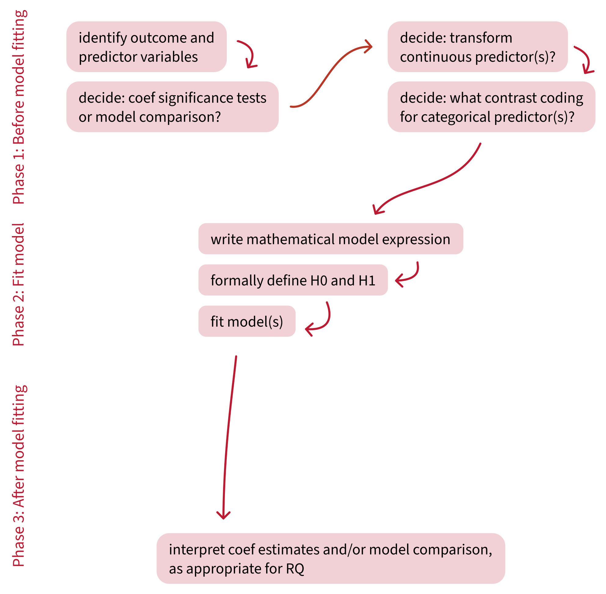
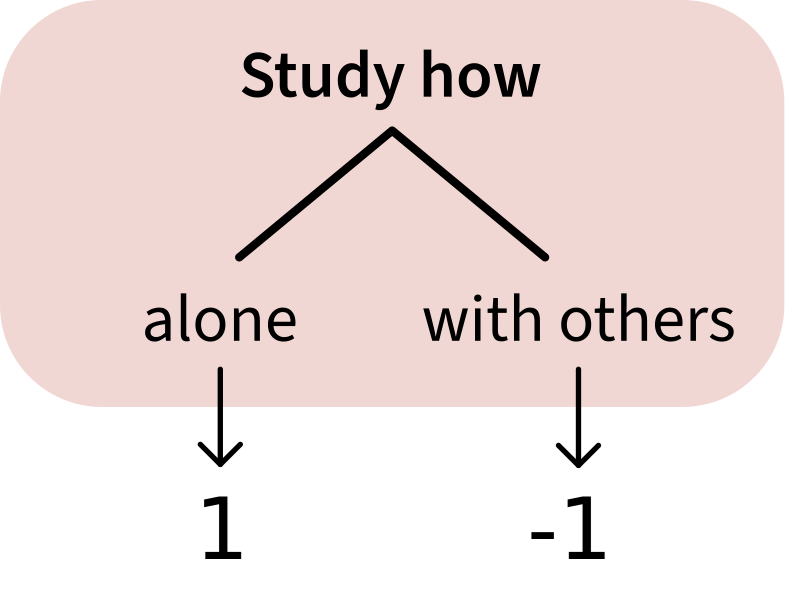

```{r setup, include = F}
library(tidyverse)
library(patchwork)
library(emmeans)
library(simglm)
source('../_theme/theme_quarto.R')

dapr2red <- "#BF1932" 
pal <- c("#3173c9", "#ff94b0", "#51b375")
```

```{r, echo=FALSE, message=FALSE, warning=FALSE}
set.seed(3119) 

sim_arguments <- list(
  formula = y ~ 1 + hours + motivation + study + method,
  fixed = list(hours = list(var_type = 'ordinal', levels = 0:15),
               motivation = list(var_type = 'continuous', mean = 0, sd = 1),
               study = list(var_type = 'factor', 
                            levels = c('alone', 'others'),
                            prob = c(0.53, 0.47)),
               method = list(var_type = 'factor', 
                            levels = c('read', 'summarise', 'self-test'),
                            prob = c(0.3, 0.4, 0.3))),
  error = list(variance = 20),
  sample_size = 250,
  reg_weights = c(0.6, 1.4, 1.5, 6, 6, 2)
)

df3 <- simulate_fixed(data = NULL, sim_arguments) %>%
  simulate_error(sim_arguments) %>%
  generate_response(sim_arguments)

score_data <- df3 %>%
  dplyr::select(y, hours, motivation, study, method) %>%
  mutate(
    ID = paste("ID", 101:350, sep = ""),
    score = round(y+abs(min(y))),
    motivation = round(motivation, 2),
    study = factor(study),
    method = factor(method)
  ) %>%
  dplyr::select(ID, score, hours, motivation, study, method)

score_data <- score_data |>
  mutate(
    study_dum = ifelse(study == 'alone', 0, 1),
    study_sum = ifelse(study == 'alone', 1, -1),
    )

# get group means
mean_alone <- filter(score_data, study == 'alone')$score |> mean()
sd_alone <- filter(score_data, study == 'alone')$score |> sd()
mean_others <- filter(score_data, study == 'others')$score |> mean()
sd_others <- filter(score_data, study == 'others')$score |> sd()

mean_read <- filter(score_data, method == 'read')$score |> mean()
sd_read <- filter(score_data, method == 'read')$score |> sd()
mean_self <- filter(score_data, method == 'self-test')$score |> mean()
sd_self <- filter(score_data, method == 'self-test')$score |> sd()
mean_summ <- filter(score_data, method == 'summarise')$score |> mean()
sd_summ <- filter(score_data, method == 'summarise')$score |> sd()
```


# Course overview {background-color="white"}

TODO


## Retrieval practice: Coefficients and <br> null hypotheses (H0s) in treatment coding

<br>

Answer the questions in this table as thoroughly as you can **FROM MEMORY.**

(It's extremely OK and normal to not remember everything.)

<br>

|  | Intercept $\beta_0$ |  | Slope $\beta_j$ |  |
|---|---|---|---|---|
|  | **Meaning** | **H0** | **Meaning** | **H0** |
| Treatment coding | *What does the intercept mean?* | *What null hypothesis is tested for the intercept?* | *What does the slope coefficient mean?* | *What hypothesis is tested for the slope coefficient?* |
|  |  |  |  |  |


Once you've written down everything you can remember, look at your notes and fill in the gaps.

<br>

<!-- :::{.dapr2callout} -->
<!-- Retrieving information from memory is a good study strategy too. According to [Brown et al. (2014)](https://www.hup.harvard.edu/file/feeds/PDF/9780674729018_sample.pdf), if you test your memory first and only afterward look up the information, you'll end up remembering things much better than if you look up the information without testing yourself first. -->
<!-- ::: -->


## This week's learning objectives

<br>


::: {style="font-size: 125%;"}

::: {.fragment}
::: {.dapr2callout}
The most common contrast coding scheme is treatment coding.
What is another common contrast coding scheme, and how is it different from treatment coding?
:::
:::

::: {.fragment}
::: {.dapr2callout}
When we code predictors using this other coding scheme, how do we interpret the linear model's coefficients?
:::
:::

::: {.fragment}
::: {.dapr2callout}
In this other coding scheme, what hypotheses are tested for each coefficient?
:::
:::

:::

<!-- ======================================== -->


## Building an analysis workflow

{fig-align="center"}


## Coefficients and null hypotheses (H0s)

<br>

|  | Intercept $\beta_0$ |  | Slope $\beta_j$ |  |
|---|---|---|---|---|
|  | **Meaning** | **H0** | **Meaning** | **H0** |
| Treatment coding | Estimated mean outcome of reference level | Estimated mean outcome of ref. level = 0 | Difference between non-ref. level and ref. level | Difference between non-ref. level and ref. level = 0 |
| Sum coding |  |  |  |  |
|  |  |  |  |  |

<!-- | Sum coding / Sum to zero coding | Mean of all group means (aka grand mean) | Grand mean = 0 | Difference between grand mean and the mean of group j | Diff = 0 | -->

<br>


# Sum coding for binary predictors

## Sum coding: Another way to represent categorical predictors as numbers

<br>

:::: {.columns}
::: {.column width="50%"}
**Treatment coding:**

{fig-align="center" height="300"}

- Studying `alone` is coded as 0.
- Studying with `others` is coded as M1.

In general, the alphabetically first level is coded as 0.

:::
::: {.column width="50%"}

**Sum coding:**

{fig-align="center" height="300"}

- Studying `alone` is coded as 1.
- Studying with `others` is coded as –1.

In general, the alphabetically first level is coded as 1.
:::
::::

## Same data as last week: Two study patterns

```{r echo=F, fig.width = 10, fig.height = 7, fig.align = 'center'}
#| code-fold: true
set.seed(1)
score_data |>
  ggplot(aes(x = study, y = score, fill = study, colour = study)) +
  geom_violin(alpha = 0.5) +
  geom_jitter(alpha = 0.5, width = 0.2, size = 5) +
  theme(legend.position = 'none') +
  scale_fill_manual(values = pal) +
  scale_colour_manual(values = pal) +
  stat_summary(fun = mean, geom = 'point', colour = 'black', size = 5) +
  NULL
```


## Same data represented as different numbers

:::: {.columns}
::: {.column width="50%"}

Treatment coding (from last week) uses 0 and 1.

```{r plot xy study dummy, echo=F, fig.width = 7.5, fig.asp=.9, fig.align='center'}
#| code-fold: true
xlim_lower <- -2.2
xlim_upper <-  2.2
ylim_lower <- -15
ylim_upper <-  55

set.seed(1)  # seed for constant jitter
p_xy_study_dummy <- score_data |>
  ggplot(aes(x = study_dum, y = score)) +
  geom_jitter(aes(colour = study), alpha = 0.25, width = 0.1, size = 5) +
  scale_x_continuous(limits = c(xlim_lower, xlim_upper), expand = c(0, 0)) +
  scale_y_continuous(limits = c(ylim_lower, ylim_upper), expand = c(0, 0)) +
  geom_segment(x = xlim_lower, xend = xlim_upper, y = 0, yend = 0,
               arrow = arrow(ends = 'both', length = unit(12, 'pt')), colour = 'black') +
  geom_segment(x = 0, xend = 0, y = ylim_lower, yend = ylim_upper, 
               arrow = arrow(ends = 'both', length = unit(12, 'pt')), colour = 'black') +
  stat_summary(fun = mean, geom = 'point', colour = 'black', size = 8, show.legend = FALSE) +

  scale_colour_manual(values = pal) +
  theme(
    panel.grid.minor = element_blank(),
    legend.position = 'bottom'
  ) +
  labs(
    x = 'study (in numeric space,\ntreatment coded)'
  ) +
 guides(colour = guide_legend(override.aes = list(alpha = 1))) + 
  NULL

p_xy_study_dummy
```

:::
::: {.column width="50%"}

Sum coding (this week) uses 1 and –1.

```{r plot xy study effect, echo=F, fig.width = 7.5, fig.asp=.9, fig.align='center'}
#| code-fold: true
set.seed(1)  # seed for constant jitter
p_xy_study_eff <- score_data |>
  ggplot(aes(x = study_sum, y = score)) +
  geom_jitter(aes(colour = study), alpha = 0.25, width = 0.1, size = 5) +
  scale_x_continuous(limits = c(xlim_lower, xlim_upper), expand = c(0, 0)) +
  scale_y_continuous(limits = c(ylim_lower, ylim_upper), expand = c(0, 0)) +
  geom_segment(x = xlim_lower, xend = xlim_upper, y = 0, yend = 0,
               arrow = arrow(ends = 'both', length = unit(12, 'pt')), colour = 'black') +
  geom_segment(x = 0, xend = 0, y = ylim_lower, yend = ylim_upper, 
               arrow = arrow(ends = 'both', length = unit(12, 'pt')), colour = 'black') +
  stat_summary(fun = mean, geom = 'point', colour = 'black', size = 8, show.legend = FALSE) +

  scale_colour_manual(values = pal) +
  theme(
    panel.grid.minor = element_blank(),
    legend.position = 'bottom'
  ) +
  labs(
    x = 'study (in numeric space,\nsum coded)'
  ) +
 guides(colour = guide_legend(override.aes = list(alpha = 1))) + 
  NULL

p_xy_study_eff
```


:::
::::

:::{.dapr2callout .fragment}
Sum coding still fits a line through both group means.

- What will this line's **intercept** represent?
- What will this line's **slope** represent?
:::


## Defining sum coding in R

<br>


R uses treatment coding by default.

```{r}
contrasts(score_data$study)
```


<br>

So to make sure that our predictor is sum-coded, we use the function `contr.sum()`.

```{r}
contrasts(score_data$study) <- contr.sum(2)  # 2 because there are 2 levels
contrasts(score_data$study)
```


## Model `score ~ study`

$$
\text{score} = \beta_0 + (\beta_1 \cdot \text{study}) + \epsilon
$$

```{r}
m1 <- lm(score ~ study, data = score_data)
```

:::{.fragment}
```{r}
summary(m1)
```
:::

```{r include = F}
m1_int <- summary(m1)$coefficients['(Intercept)', 'Estimate']
m1_slp <- summary(m1)$coefficients['study1', 'Estimate']
```


:::{.dapr2callout .fragment}
- Does your prediction about the **intercept** make sense, given the estimate of `r m1_int`?

- Does your prediction about the **slope** make sense, given the estimate of `r m1_slp`?
:::


## What does each coefficient represent?

:::: {.columns}
::: {.column width="50%"}
```{r echo=F, fig.align = 'center', fig.asp = 1}
set.seed(1)
p_xy_study_eff
```
:::
::: {.column width="50%" style='font-size:85%;'}
```{r echo=F}
# cat(paste0(capture.output(summary(m1)), '\n')[10:12])
summary(m1)$coefficients
```

:::
::::


## What does each coefficient represent?

:::: {.columns}
::: {.column width="50%"}
```{r echo=F, fig.align = 'center', fig.asp = 1}
set.seed(1)
p_xy_study_eff +
  geom_abline(intercept = m1_int, slope = m1_slp, linewidth = 2)
```
:::
::: {.column width="50%" style='font-size:85%;'}
```{r echo=F}
# cat(paste0(capture.output(summary(m1)), '\n')[10:12])
summary(m1)$coefficients
```

<br>

:::
::::


## What does each coefficient represent?

:::: {.columns}
::: {.column width="50%"}
```{r echo=F, fig.align = 'center', fig.asp = 1}
set.seed(1)
library(latex2exp)

gm <- m1_int

p_xy_study_eff +
  geom_abline(intercept = m1_int, slope = m1_slp, linewidth = 2) +
  # right triangle
  geom_segment(x = 0, xend = 1, y = gm, yend = gm,
               colour = dapr2red, linewidth = 2, linetype = 'dotted') +
  geom_segment(x = 1, xend = 1, y = gm, yend = mean_alone,
               colour = dapr2red, linewidth = 2) +
  # arrows
  geom_segment(x = -.5, xend = -.1, y = gm+13, yend = gm+2, arrow = arrow(), colour = dapr2red) +
  geom_segment(x = 1.7, xend = 1.1, y = gm-1, yend = gm-1, arrow = arrow(), colour = dapr2red) +
  # betas
  geom_label(x = -.5, 
             y = gm+13, 
             label = '(Intercept)',
             size = 10, 
             col = dapr2red) +
  geom_label(x = 1.8, 
             y = gm-1, 
             label = 'study1',
             size = 10, 
             col = dapr2red) +
  NULL
```


:::
::: {.column width="50%"}
:::{style='font-size:85%;'}
```{r echo=F}
# cat(paste0(capture.output(summary(m1)), '\n')[10:12])
summary(m1)$coefficients
```
:::

<br>

:::{.fragment  data-fragment-index="1"}
**`(Intercept)` aka $\beta_0$:**

- `r round(m1_int, 2)` is the **grand mean**: the mean of the group means.

```{r}
(m1_grand_mean <- mean(
  c(mean_others, mean_alone))
 )
```

:::


<br>

:::{.fragment  data-fragment-index="2"}
**`study1` aka $\beta_1$:**

- `r round(m1_slp, 2)` is the difference between the level coded as 1, `alone`, and the grand mean.

```{r}
mean_alone - m1_grand_mean
```
:::


:::
::::


## Coefficients and null hypotheses (H0s)

<br>

|  | Intercept $\beta_0$ |  | Slope $\beta_j$ |  |
|---|---|---|---|---|
|  | **Meaning** | **H0** | **Meaning** | **H0** |
|  Treatment coding | Mean outcome of reference level | Mean outcome of ref. level = 0 | Difference between non-ref. level and ref. level | Difference between non-ref. level and ref. level = 0 |
| Sum coding | Grand mean (mean of all group mean outcomes) |  | Difference between mean of level coded as 1 and grand mean |  |
|  |  |  |  |  |

<!-- | Sum coding / Sum to zero coding | Mean of all group means (aka grand mean) | Grand mean = 0 | Difference between grand mean and mean of level coded as 1 | Diff = 0 | -->


## What hypotheses does sum coding test?

<br>

```{r echo=F}
cat(paste0(capture.output(summary(m1)), '\n')[10:12])
```


<br>

:::{.fragment}
**`(Intercept)`:**

- Null hypothesis: The grand mean is equal to zero.
- $p$-value: the probability of observing a grand mean of `r m1_int` (or a value more extreme), assuming that the true grand mean is zero.

**Can we reject this null hypothesis?**    
:::

<br> 

:::{.fragment}
**`study1`:**

- Null hypothesis: The difference between the mean score of `alone` and the grand mean is equal to zero.
- $p$-value: the probability of observing a difference of `r m1_slp` (or a value more extreme), assuming that the true difference is zero.

**Can we reject this null hypothesis?**    
:::

## Coefficients and null hypotheses (H0s)

<br>

|  | Intercept $\beta_0$ |  | Slope $\beta_j$ |  |
|---|---|---|---|---|
|  | **Meaning** | **H0** | **Meaning** | **H0** |
| Treatment coding | Mean outcome of reference level | Mean outcome of ref. level = 0 | Difference between non-ref. level and ref. level | Difference between non-ref. level and ref. level = 0 |
| Sum coding | Grand mean (mean of all group mean outcomes) | Grand mean = 0 | Difference between  mean of level coded as 1 and grand mean | Difference between mean of level coded as 1 and grand mean = 0 |
|  |  |  |  |  |

<br>

**In general, the H0 being tested for a given parameter is always "this parameter is equal to 0".**


<!-- ======================================== -->

# Sum coding for >2 levels

## Same data as last week: Three study methods

```{r fig.width = 10, fig.height = 7, fig.align = 'center'}
#| code-fold: true
set.seed(1)
p_viol_method <- score_data |>
  ggplot(aes(x = method, y = score, fill = method, colour = method)) +
  geom_violin(alpha = 0.5) +
  geom_jitter(alpha = 0.5, width = 0.2, size = 5) +
  theme(legend.position = 'none') +
  scale_fill_manual(values = pal) +
  scale_colour_manual(values = pal) +
  stat_summary(fun = mean, geom = 'point', colour = 'black', size = 5) +
  NULL
p_viol_method
```


## Sum coding has dummy variables too

```{r}
contrasts(score_data$method) <- contr.sum(3)
contrasts(score_data$method)
```

<br>

Like in treatment coding, each **column** contains one dummy variable.

  1. Column `1` compares `read` (the 1 in that column) to the grand mean.
  2. Column `2` compares `summarise` (the 1 in that column) to the grand mean.


<br>

Naming the dummy variables "1" and "2" isn't really helpful, so here's an R trick to rename those columns more informatively:

```{r}
dimnames(contrasts(score_data$method))[[2]] <- c('read', 'summ')
contrasts(score_data$method)
```

<br>

**Important: There is no such thing as a "reference level" for sum coding.**


## The mathematical model formulation for a sum coded predictor

```{r}
contrasts(score_data$method)
```

<br>

Like in treatment coding, each dummy variable gets its own $\beta$:

$$
\text{score} = \beta_0 + (\beta_1 \cdot \text{method}_\text{read}) + (\beta_2 \cdot \text{method}_\text{summ}) + \epsilon
$$


## Challenge: Guess the coefficients TODO WOO

<!-- :::{.dapr2callout .fragment} -->
<!-- Here's what the coefficients mean in sum coding: -->

<!-- - Intercept = Grand mean (mean of all group mean outcomes) -->
<!-- - Slope = Difference between mean of level coded as 1 and grand mean (i.e., group mean – grand mean)  -->
<!-- ::: -->


<!-- :::: {.columns} -->

<!-- ::: {.column width="30%"} -->
<!-- :::{.dapr2callout .fragment} -->
<!-- Mean of `read`: -->

<!-- ```{r} -->
<!-- mean_read -->
<!-- ``` -->


<!-- Mean of `self-test`: -->

<!-- ```{r} -->
<!-- mean_self -->
<!-- ``` -->


<!-- Mean of `summarise`: -->

<!-- ```{r} -->
<!-- mean_summ -->
<!-- ``` -->
<!-- ::: -->
<!-- ::: -->
<!-- ::: {.column width="70%"} -->

<!-- :::{.dapr2callout .fragment} -->
<!-- ```{r} -->
<!-- contrasts(score_data$method) -->
<!-- ``` -->

<!-- ::: -->

<!-- ::: {.dapr2callout  .fragment style="background: #FDEDEF;"} -->
<!-- **This slide has all the information you need to guess the coefficient values for the model `score ~ method`.** -->

<!-- Work individually or with your neighbour(s). -->

<!-- - What's the value of the intercept? -->
<!-- - There'll be a predictor called `method1`. What is its value? -->
<!-- - There'll also be a predictor called `method2`. What is its value? -->
<!-- ::: -->
<!-- ::: -->
<!-- :::: -->

<!-- ## Challenge: Guess the coefficients -->

<!-- :::{.dapr2callout} -->
<!-- Here's what the coefficients mean in sum coding: -->

<!-- - Intercept = Grand mean (mean of all group mean outcomes) -->
<!-- - Slope = Difference between mean of level coded as 1 and grand mean (i.e., group mean – grand mean)  -->
<!-- ::: -->


<!-- :::: {.columns} -->

<!-- ::: {.column width="30%"} -->
<!-- :::{.dapr2callout} -->
<!-- Mean of `read`: -->

<!-- ```{r} -->
<!-- mean_read -->
<!-- ``` -->


<!-- Mean of `self-test`: -->

<!-- ```{r} -->
<!-- mean_self -->
<!-- ``` -->


<!-- Mean of `summarise`: -->

<!-- ```{r} -->
<!-- mean_summ -->
<!-- ``` -->
<!-- ::: -->
<!-- ::: -->
<!-- ::: {.column width="70%"} -->

<!-- :::{.dapr2callout} -->
<!-- ```{r} -->
<!-- contrasts(score_data$method) <- contr.sum(3) -->
<!-- contrasts(score_data$method) -->
<!-- ``` -->

<!-- ::: -->

<!-- ::: {.dapr2callout style="background: #FDEDEF;"} -->
<!-- - Intercept: grand mean, so -->

<!-- ```{r} -->
<!-- (m2_grand_mean <- (mean_read + mean_self + mean_summ)/3) -->
<!-- ``` -->

<!-- - `method1`: in column 1 of contrast matrix, `read` = 1, so -->

<!-- ```{r} -->
<!-- mean_read - m2_grand_mean -->
<!-- ``` -->


<!-- - `method2`: in column 2 of contrast matrix, `self-test` = 1, so -->

<!-- ```{r} -->
<!-- mean_self - m2_grand_mean -->
<!-- ``` -->

<!-- ::: -->
<!-- ::: -->
<!-- :::: -->

```{r include=F}
m2_grand_mean <- (mean_read + mean_self + mean_summ)/3
```


## Model `score ~ method`

```{r}
m2 <- lm(score ~ method, data = score_data)
summary(m2)
```


## Interpret coefficients

::::{.columns}
:::{.column width="60%"}

```{r echo=F, fig.width = 8, fig.height = 5, fig.align = 'center'}
set.seed(1)
p_viol_method
```

:::{style="font-size:80%;"}

```{r echo=F}
cat(paste0(capture.output(summary(m2)), '\n')[10:13])
```

<br>

```{r}
confint(m2)
```

:::

:::
:::{.column width="40%"}

- `(Intercept)`: 
  - The grand mean score across all study methods is 25.06 points.
  
<br>

- `methodread`:
  - Studying by reading is associated with a score 1.65 points below the grand mean.
  - This difference is significantly different from zero ($b$ = –1.65, 95% CI [–3.07, –0.23], $p$ = 0.02).

<br>

- `methodsumm`:
  - Studying by summarising is associated with a score 3.13 points above the grand mean.
  - This difference is significantly different from zero ($b$ = 3.13, 95% CI [1.75, 4.52], $p$ = 0.02).
:::
::::


# When to do treatment coding vs. sum coding

## When to do treatment coding vs. sum coding

<br>

The choice of contrast coding scheme depends on your RQ and the hypotheses you want to test.

- If you are interested in **how one level of a categorical predictor differs from another:** use treatment coding.
- If you are interested in **how one level of a categorical predictor differs from the grand mean:** use sum coding.

<!-- ## What hypotheses are being tested? -->

<!-- <br> -->

<!-- |  | Intercept $\beta_0$ |  | Slope $\beta_j$ |  | -->
<!-- |---|---|---|---|---| -->
<!-- |  | **Meaning** | **H0** | **Meaning** | **H0** | -->
<!-- | Treatment coding | Mean outcome of reference level | Mean outcome of ref. level = 0 | Difference between non-ref. level and ref. level | Difference between non-ref. level and ref. level = 0 | -->
<!-- | Sum coding | Grand mean (mean of all group mean outcomes) | Grand mean = 0 | Difference between  mean of level coded as 1 and grand mean | Difference between mean of level coded as 1 and grand mean = 0 | -->
<!-- |  |  |  |  |  | -->

<!-- <br> -->


## Building an analysis workflow

{fig-align="center"}


# Back matter


## Revisiting this week's learning objectives

::: {.dapr2callout}
**The most common contrast coding scheme is treatment coding. What is another common contrast coding scheme, and how is it different from treatment coding?**

- Sum coding, sometimes also called "effects coding".
- Treatment coding uses 0/1, and one level of the predictor (the one coded as 0) is the reference level.
- Sum coding uses –1/1, and there is no reference level.
:::


::: {.dapr2callout}
**When we code predictors using this other coding scheme, how do we interpret the linear model's coefficients?**

- Intercept: The grand mean of the outcome (grand mean = the mean of every group's mean).
- Slope: The difference between (1) the mean of a group and (2) the grand mean, when all other predictors are at zero.
:::


::: {.dapr2callout}
**In this other coding scheme, what hypotheses are tested for each coefficient?**

- The intercept's hypothesis test: The grand mean of the outcome is different from zero.
- The slopes' hypothesis tests: The difference between (1) the mean of each individual group and (2) the grand mean is different from zero.
:::


## This week 

<br>

::::{.columns}
:::{.column width="50%"}
**Tasks:**

<br>

{width=80px style="margin:10px;margin-bottom:-50px"} Work on exercises in labs

<br>

{width=80px style="margin:10px;margin-bottom:-45px"} Complete the weekly quiz 


:::

:::{.column width="50%"}
**Get support:**

<br>

{width=80px style="margin:10px;margin-bottom:-30px"}
Consult the [flash cards](https://uoepsy.github.io/dapr2/2627/flashcards/){target="_blank"}

<br>

{width=80px style="margin:10px;margin-bottom:-50px"}
Ask questions anonymously on Piazza

<br>

{width=80px style="margin:10px;margin-bottom:-40px"} 
We really like seeing you in office hours!

:::
::::


# Appendix {.appendix}


## Prediction equations: Sum coding, three levels

The linear expression telling us model predictions:

$$
\widehat{\text{outcome}}= \hat{\beta_0} + (\hat{\beta_1} \cdot \text{Predictor1}) + (\hat{\beta_2} \cdot \text{Predictor2})
$$
<br>

We can combine the estimated betas to compute the means of each level.
To do this, we plug in the values for `Predictor1` and `Predictor2` that correspond to each level of the three-level variable.
We get these values from the rows of our our coding matrix.

<br>

:::: {.columns}
::: {.column width="20%"}

```{r}
contr.sum(3)
```

:::
::: {.column width="5%"}
:::
::: {.column width="75%"}

**Level 1** is represented as `Predictor1 = 1`, `Predictor2 = 0` <br> (first row of contrast matrix). 

$$
\begin{align}
\widehat{\text{outcome}}_{\text{level 1}} &= \hat{\beta_0} + (\hat{\beta_1} \cdot \text{Predictor1}) + (\hat{\beta_2} \cdot \text{Predictor2})\\
&= \hat{\beta_0} + (\hat{\beta_1} \cdot 1) + (\hat{\beta_2} \cdot 0)\\
&= \hat{\beta_0} + \hat{\beta_1}\\
\end{align}
$$

:::
::::


## Prediction equations: Sum coding, three levels

:::: {.columns}
::: {.column width="20%"}

```{r}
contr.sum(3)
```

:::
::: {.column width="5%"}
:::
::: {.column width="75%"}

**Level 2** is represented as `Predictor1 = 0`, `Predictor2 = 1` <br> (second row of contrast matrix). 

$$
\begin{align}
\widehat{\text{outcome}}_{\text{level 2}} &= \hat{\beta_0} + (\hat{\beta_1} \cdot \text{Predictor1}) + (\hat{\beta_2} \cdot \text{Predictor2})\\
&= \hat{\beta_0} + (\hat{\beta_1} \cdot 0) + (\hat{\beta_2} \cdot 1)\\
&= \hat{\beta_0} + \hat{\beta_2}\\
\end{align}
$$


<br>

**Level 3** is represented as `Predictor1 = -1`, `Predictor2 = -1` <br> (third row of contrast matrix). 

$$
\begin{align}
\widehat{\text{outcome}}_{\text{level 3}} &= \hat{\beta_0} + (\hat{\beta_1} \cdot \text{Predictor1}) + (\hat{\beta_2} \cdot \text{Predictor2})\\
&= \hat{\beta_0} + (\hat{\beta_1} \cdot -1) + (\hat{\beta_2} \cdot -1)\\
&= \hat{\beta_0} - \hat{\beta_1} - \hat{\beta_2}\\
&= \hat{\beta_0} - (\hat{\beta_1} + \hat{\beta_2})\\
\end{align}
$$

:::
::::


## Visualise sum coding with >2 levels

```{r}
contrasts(score_data$method)
```

```{r echo=F, fig.asp = .5, fig.width = 18}
xlim_lower <- -2.2
xlim_upper <-  2.2
ylim_lower <- -25
ylim_upper <-  55

p1 <- score_data |> 
  filter(method %in% c('summarise', 'read')) |>
  mutate(method_num = ifelse(method == 'summarise', -1, 1)) |>
  ggplot(aes(x = method_num, y = score, fill = method, colour = method)) +
  geom_jitter(alpha = 0.2, width = 0.1, size = 5) +
  scale_x_continuous(limits = c(xlim_lower, xlim_upper), expand = c(0, 0)) +
  scale_y_continuous(limits = c(ylim_lower, ylim_upper), expand = c(0, 0)) +
  # xy vectors
  geom_segment(aes(x = xlim_lower, xend = xlim_upper, y = 0, yend = 0), arrow = arrow(ends = 'both', length = unit(12, 'pt')), colour = 'black') +
  geom_segment(aes(x = 0, xend = 0, y = ylim_lower, yend = ylim_upper), arrow = arrow(ends = 'both', length = unit(12, 'pt')), colour = 'black') +
  # group means
  stat_summary(fun = mean, geom = 'point', colour = 'black', size = 5, show.legend = FALSE) +
  # line between group means
  geom_segment(aes(x = -1, xend = 1, y = mean_summ, yend = mean_read), colour = 'black', linetype = 'dotted') +
  # slope lines
  geom_segment(aes(x = 0, xend = 1, y = m2_grand_mean, yend = m2_grand_mean), colour = dapr2red, linewidth = 2) +
  geom_segment(aes(x = 1, xend = 1, y = m2_grand_mean, yend = mean_read), colour = dapr2red, linewidth = 2) +
  # grand mean
  geom_point(x = 0, y = m2_grand_mean, colour = 'black', size = 8, show.legend = F, shape = 4) +
  labs(
    x = 'method (in numeric space,\n first predictor)'
  ) +
  theme(legend.position = 'bottom') +
  scale_colour_manual(values = c(pal[1], pal[3])) +
  guides(colour = guide_legend(override.aes = list(alpha = 1), nrow = 2, byrow = TRUE)) +
  NULL

p2 <- score_data |> 
  filter(method %in% c('summarise', 'self-test')) |>
  mutate(method_num = ifelse(method == 'summarise', -1, 1)) |>
  ggplot(aes(x = method_num, y = score, fill = method, colour = method)) +
  geom_jitter(alpha = 0.2, width = 0.1, size = 5) +
  scale_x_continuous(limits = c(xlim_lower, xlim_upper), expand = c(0, 0)) +
  scale_y_continuous(limits = c(ylim_lower, ylim_upper), expand = c(0, 0)) +
  # xy vectors
  geom_segment(aes(x = xlim_lower, xend = xlim_upper, y = 0, yend = 0), arrow = arrow(ends = 'both', length = unit(12, 'pt')), colour = 'black') +
  geom_segment(aes(x = 0, xend = 0, y = ylim_lower, yend = ylim_upper), arrow = arrow(ends = 'both', length = unit(12, 'pt')), colour = 'black') +
  # group means
  stat_summary(fun = mean, geom = 'point', colour = 'black', size = 5, show.legend = FALSE) +
  # line between group means
  geom_segment(aes(x = -1, xend = 1, y = mean_summ, yend = mean_self), colour = 'black', linetype = 'dotted') +
  # slope lines
  geom_segment(aes(x = 0, xend = 1, y = m2_grand_mean, yend = m2_grand_mean), colour = dapr2red, linewidth = 2) +
  geom_segment(aes(x = 1, xend = 1, y = m2_grand_mean, yend = mean_self), colour = dapr2red, linewidth = 2) +
  # grand mean
  geom_point(x = 0, y = m2_grand_mean, colour = 'black', size = 8, show.legend = F, shape = 4) +
  labs(
    x = 'method (in numeric space,\nsecond predictor)'
  ) +
  theme(legend.position = 'bottom') +
  scale_colour_manual(values = c(pal[2], pal[3])) +
  guides(colour = guide_legend(override.aes = list(alpha = 1), nrow = 2, byrow = TRUE)) +
  NULL

p1 + p2
```

The $\times$ shows the grand mean = the model's intercept.

**Once sum coding uses >2 levels, the line between group means does not give us the correct intercept or slope.**

