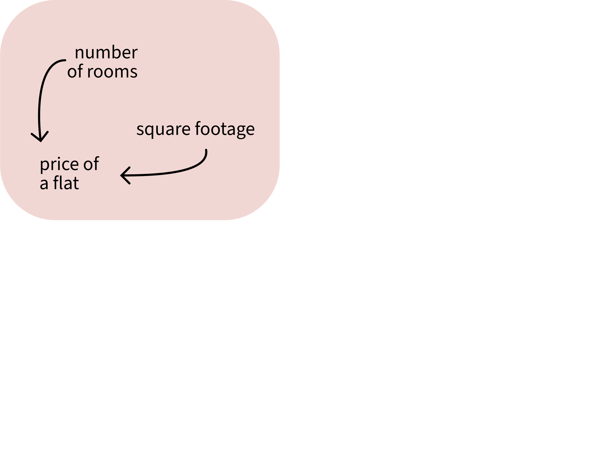
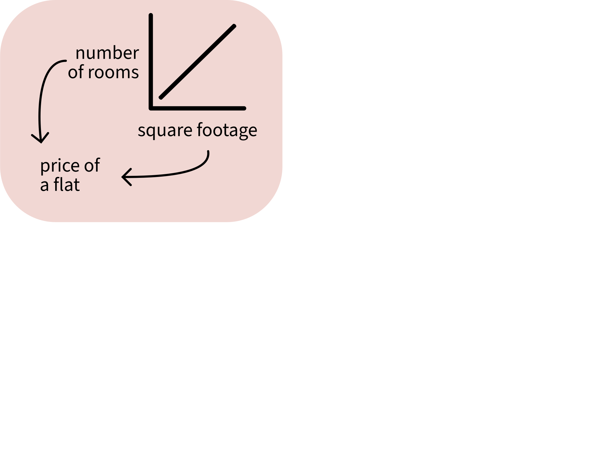
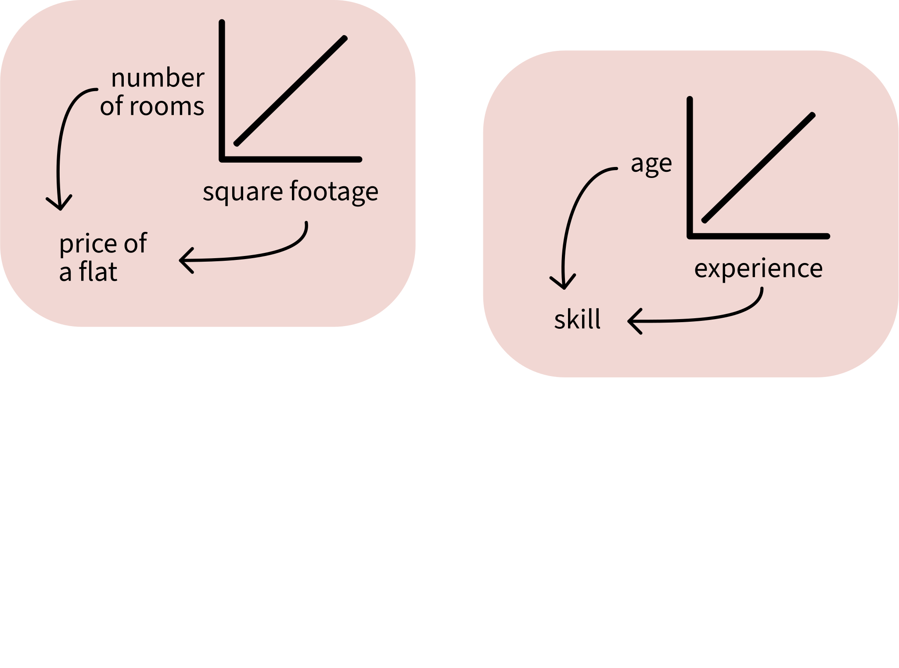
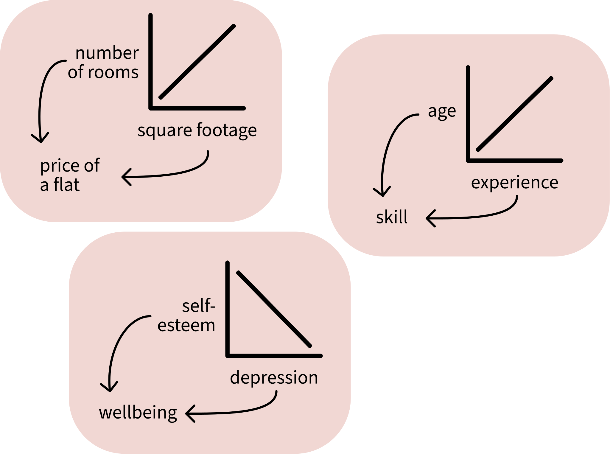

```{r setup, include = F}
library(tidyverse)
library(patchwork)
library(emmeans)
library(simglm)
source('../_theme/theme_quarto.R')

dapr2red <- "#BF1932" 
pal <- c("#3173c9", "#ff94b0", "#51b375")
```


# Course overview {background-color="white"}

TODO


## This week's learning objectives

<br>

::: {style="font-size: 125%;"}

::: {.fragment}
::: {.dapr2callout}
What does a linear model assume is true about the data that it models? (Four assumptions)
:::
:::

::: {.fragment}
::: {.dapr2callout}
What property of a single data point might affect a linear model's estimates? 
How can we diagnose it?
:::
:::

::: {.fragment}
::: {.dapr2callout}
What relationship between predictors do we want to avoid? How can we diagnose it?
:::
:::

:::

# Big picture: Why does a model make assumptions?

## Why does a model make assumptions?

<br>

{fig-align="center" height="100"}

<br>

When we use any statistical model, we are saying **"This model is the process that I think the world used to generate my data."**

<br>

**Linear models are constrained in certain ways:** for example, associations between predictors and outcomes can only be modelled as straight lines.
We cannot change this within the linear model machinery.

<br>

These constraints are the **assumptions** that the linear model makes about how the data was generated.

If our data does not match the assumptions, then a linear model is a bad way to analyse the data.
**So we have to check whether the assumptions are met before we interpret our model's results.**


# Assumptions

## What a linear model assumes about the data

```{=html}
<table>
  <tr>
    <td></td>
    <td><b>Assumption</b></td>
    <td><b>Looks fine</b></td>
    <td><b>Suspicious</b></td>
  </tr>
  <tr>
    <td style="vertical-align: middle"><b>L</b></td>
    <td style="vertical-align: middle; visibility: hidden;"><b>Linearity:</b> The association between predictor and outcome is a straight line.</td>
    <td style="visibility: hidden;"></td>
    <td style="visibility: hidden;"></td>
  </tr>
  <tr>
    <td style="vertical-align: middle"><b>I</b></td>
    <td style="visibility: hidden;"><b>Independence:</b> Every data point's error is independent of every other data point's error. (Until DAPR3, we'll assume this is true as long as we have between-participant data.)</td>
    <td style="visibility: hidden;"></td>
    <td style="visibility: hidden;"></td>
  </tr>
  <tr>
    <td style="vertical-align: middle"><b>N</b></td>
    <td style="vertical-align: middle; visibility: hidden;"><b>Normally-distributed errors:</b> The differences between fitted line and each data point (i.e., the residuals) follow a normal distribution.</td>
    <td style="visibility: hidden;"></td>
    <td style="visibility: hidden;"></td>
  </tr>
  <tr>
    <td style="vertical-align: middle;"><b>E</b></td>
    <td style="vertical-align: middle; visibility: hidden;"><b>Equal variance of errors:</b> The differences between fitted line and each data point (i.e., the residuals) are dispersed by a similar amount across the whole range of the predictor.</td>
    <td style="visibility: hidden;"></td>
    <td style="visibility: hidden;"></td>
  </tr>
</table>
```

 <!-- visibility: hidden; in style tag-->
 
# L is for linear association

## **L**: The association between predictor and outcome is linear

<br>

```{r fig nonlin, message = FALSE, warning=F, echo=F, fig.asp = .5, fig.width = 12}
set.seed(221020)
quadr <- function(x, a, b, c){ a + b*x + c*x^2  }

x <- seq(-2, 2, length.out = 101)

df_nonlin <- tibble(
  y = abs(quadr(x + 0.5, 1, 0, 1) + rnorm(101, 0, 1)),
  x1 = abs(1 + (3 * y) + rnorm(101, 0, 1)),
  x2 = x
)
# pairs(df_nonlin)

p_good <- df_nonlin %>%
  ggplot(aes(x=x1, y=y)) +
  geom_point(size = 3) +
  geom_smooth(method = 'lm', se = FALSE, linewidth=2) +
  labs(
    title = 'Linear (straight line)'
  ) +
  theme(
    axis.text = element_blank(),
    axis.ticks = element_blank(),
    plot.title = element_text(size = 28),
  ) +
  NULL

p_quad <- df_nonlin |>
  ggplot(aes(x=x2, y=y)) +
  geom_point(size = 3) +
  geom_smooth(method = 'lm', se = FALSE, linewidth=2) +
  labs(
    y = element_blank(),
    title = 'Non-linear'
  ) +
  theme(
    axis.text = element_blank(),
    axis.ticks = element_blank(),
    plot.title = element_text(size = 28),
  ) +
  NULL

p_good + p_quad
```


<!-- ## Checking linearity with one predictor -->

<!-- Make a scatterplot with a straight line and a "LOESS" line (**LO**cally **E**stimated **S**catterplot **S**moothing). -->

<!-- :::: {.columns} -->
<!-- ::: {.column width="50%" style="font-size: 85%;"} -->

<!-- **The linear variable:** -->

<!-- ```{r fig.asp = .7, fig.width = 10, fig.align = 'center', warning=F, message=F} -->
<!-- df_nonlin |> -->
<!--   ggplot(aes(x=x1, y=y)) + -->
<!--   geom_point(size = 5) + -->
<!--   geom_smooth(method = 'lm', -->
<!--               colour = 'blue', se = FALSE, linewidth = 3) + -->
<!--   geom_smooth(method = 'loess', -->
<!--               colour = 'red', se = FALSE, linewidth = 3) -->
<!-- ``` -->


<!-- ::: -->
<!-- ::: {.column width="50%" style="font-size: 85%;"} -->

<!-- **The non-linear variable:** -->

<!-- ```{r fig.asp = .7, fig.width = 10, fig.align='center', warning=F, message=F} -->
<!-- df_nonlin |> -->
<!--   ggplot(aes(x=x2, y=y)) + -->
<!--   geom_point(size = 5) + -->
<!--   geom_smooth(method = 'lm', -->
<!--               colour = 'blue', se = FALSE, linewidth = 3) + -->
<!--   geom_smooth(method = 'loess', -->
<!--               colour = 'red', se = FALSE, linewidth = 3) -->
<!-- ``` -->

<!-- ::: -->
<!-- :::: -->

<!-- You want the LOESS line (`method = 'loess'`, red) to stick close to the straight line (`method = 'lm'`, blue). -->
<!-- Deviations suggest non-linearity. -->


## Checking linearity

Now we have to hold the other predictors constant while we look at each one in turn.

<br>

**The solution: Component+residual plots** (CR plots, aka "partial-residual plots").

- **Component:** The association between one particular predictor and the outcome, with all the other predictors held constant.
  - Think of this as each predictor's individual contribution to the overall linear model.

- **Residual:** The differences between the line the model predicts and the actual observed data points.

<br>

Basically, CR plots can look at the linearity of each association individually, without any of the other predictors getting in the way.


## Checking linearity with >1 predictor

A component-residual plot shows:

- **x axis:** a predictor across its full range
- **y axis:** that predictor's component + each data point's residual
```{r eval=F}
m1 <- lm(y ~ x1 + x2, data = df_nonlin)
car::crPlots(m1)
```


```{r fig.asp = .5, echo=F, fig.align = 'center'}
m1 <- lm(y ~ x1 + x2, data = df_nonlin)

car::crPlots(
  m1,
  cex.axis = 2,
  cex.lab = 1.5,
  cex = 2
  )
```

We want the wobbly pink line to match the straight blue line as closely as possible.
Deviations suggest non-linearity.

**We must decide: is the association linear enough that it's OK to model the association using a straight line?**

This is a judgement call. There is no single correct answer.
You'll develop a clearer sense of this with time and experience.


## What to do if an association is not linear

<br>

In order of increasing spiciness:

<br>

:::: {.columns}
::: {.column width="25%"}


:::
::: {.column width="75%"}
Report the non-linearity in your write-up. A good solution if the deviation isn't huge.
:::
::::

:::: {.columns}
::: {.column width="25%"}
** **
:::
::: {.column width="75%"}
Transform outcome or predictor until their association looks more linear (e.g., what if you take the exponential with `exp()`? the logarithm with `log()`?)
:::
::::

<!-- :::: {.columns} -->
<!-- ::: {.column width="25%"} -->
<!-- **  ** -->
<!-- ::: -->
<!-- ::: {.column width="75%"} -->
<!-- Beyond DAPR3: You can use so-called "higher-order" regression terms, which let you model particular kinds of curves (quadratic functions, cubic functions, etc.). -->
<!-- ::: -->
<!-- :::: -->

<!-- :::: {.columns} -->
<!-- ::: {.column width="25%"} -->
<!-- **  ** -->
<!-- ::: -->
<!-- ::: {.column width="75%"} -->
<!-- Beyond DAPR3: You can capture basically any non-linear relationship using "generalised additive models" (GAMs). -->
<!-- ::: -->
<!-- :::: -->

<br>

**Note: For categorical predictors, we will always just assume that the association is linear and that this assumption is met.**


## What a linear model assumes about the data

```{=html}
<table>
  <tr>
    <td></td>
    <td><b>Assumption</b></td>
    <td><b>Looks fine</b></td>
    <td><b>Suspicious</b></td>
  </tr>
  <tr>
    <td style="vertical-align: middle"><b>L</b></td>
    <td style="vertical-align: middle">
    <p><b>Linearity:</b> The association between predictor and outcome is a straight line.</p>
    </td>
    <td></td>
    <td></td>
  </tr>
  <tr>
    <td style="vertical-align: middle"><b>I</b></td>
    <td style="visibility: hidden;"><b>Independence:</b> Every data point's error is independent of every other data point's error. (Until DAPR3, we'll assume this is true as long as we have between-participant data.)</td>
    <td style="visibility: hidden;"></td>
    <td style="visibility: hidden;"></td>
  </tr>
  <tr>
    <td style="vertical-align: middle"><b>N</b></td>
    <td style="vertical-align: middle; visibility: hidden;"><b>Normally-distributed errors:</b> The differences between fitted line and each data point (i.e., the residuals) follow a normal distribution.</td>
    <td style="visibility: hidden;"></td>
    <td style="visibility: hidden;"></td>
  </tr>
  <tr>
    <td style="vertical-align: middle;"><b>E</b></td>
    <td style="vertical-align: middle; visibility: hidden;"><b>Equal variance of errors:</b> The differences between fitted line and each data point (i.e., the residuals) are dispersed by a similar amount across the whole range of the predictor.</td>
    <td style="visibility: hidden;"></td>
    <td style="visibility: hidden;"></td>
  </tr>
</table>
```


# I is for independence of errors

## **I**: Independence of errors

<br>

<!-- :::: {.columns} -->
<!-- ::: {.column width="50%"} -->

<!-- :::{.hcenter} -->
<!--  -->
<!-- ::: -->

<!-- <br> -->

<!-- **If you roll a 20-sided die at 9 am everyday,** you'll generate a lot of values between 1 and 20. -->

<!-- These values are totally unrelated to each other from one day to the next. -->

<!-- What you roll today is not correlated at all with the number you rolled yesterday. -->


<!-- ::: -->
<!-- ::: {.column width="50%"} -->

<!-- :::{.hcenter} -->
<!--  -->
<!-- ::: -->

<!-- <br> -->

<!-- **If you take the temperature in Edinburgh at 9 am everyday,** you'll also generate values between 1 and 20 (ish). -->

<!-- These values *are* related to each other from one day to the next. -->

<!-- A colder temperature yesterday is more likely to go with a colder temperature today. -->

<!-- This is an example of **autocorrelation**. -->

<!-- ::: -->
<!-- :::: -->

<!-- ## To check for autocorrelation -->

<!-- ```{r include=F} -->
<!-- # simulate dice-rolling data -->
<!-- set.seed(2023) -->
<!-- acf_lo <- sample(1:20, size = 30, replace = TRUE) -->

<!-- # simulate autocorrelated data -->
<!-- # source: https://stackoverflow.com/a/77090029  -->
<!-- acf.negbin <- function(N, mu, size, alpha, max.iter = 100, tol = 1e-5) { -->
<!--   m = length(alpha) -->
<!--   generate = function(){ -->
<!--    x = sort(rnbinom(N,size=size,mu=mu)) -->
<!--    y <- rnorm(length(x)) -->
<!--    x[rank(stats::filter(y, alpha, circular = TRUE))] -->
<!--   } -->
<!--   a = generate() -->
<!--   iter <- 0L -->
<!--   ACF <- function(x) acf(x, lag.max = m - 1, plot = FALSE)$acf[1:m] -->
<!--   SSE <- function(x,alpha) sum((ACF(x) - alpha)^2) -->
<!--   while ((SSE0 <- SSE(a, alpha)) > tol) { -->
<!--     if ((iter <- iter + 1L) == max.iter) break -->
<!--     a1 <- generate() -->
<!--     if(SSE(a1,alpha) < SSE0) a <- a1 -->
<!--   } -->
<!--   return(a) -->
<!-- } -->

<!-- set.seed(2023) -->
<!-- acf_hi <- acf.negbin( -->
<!--   30,           # how many obs to simulate -->
<!--   mu = 10,      # mean of simulated data -->
<!--   size = 5,     # dispersion parameter.  -->
<!--                 # the bigger, the tighter the data will cluster around the mean. -->
<!--   alpha=c(0.9, 0.8, 0.8, 0.8)  # target correl of points with lag = 1, 2, n -->
<!--   ) -->

<!-- autocorr_data <- tibble( -->
<!--   day = 1:30, -->
<!--   d20 = acf_lo, -->
<!--   temp = acf_hi-3 -->
<!-- ) -->
<!-- ``` -->

<!-- :::: {.columns} -->
<!-- ::: {.column width="50%"} -->

<!-- :::{.hcenter} -->
<!--  -->
<!-- ::: -->


<!-- ```{r echo=F} -->
<!-- autocorr_data |> -->
<!--   ggplot(aes(x = day, y = d20)) + -->
<!--   geom_point(size = 5) + -->
<!--   geom_line(linewidth = 2) + -->
<!--   ylim(1, 20) -->
<!-- ``` -->
<!-- ::: -->
<!-- ::: {.column width="50%"} -->

<!-- :::{.hcenter} -->
<!--  -->
<!-- ::: -->

<!-- ```{r echo=F} -->
<!-- autocorr_data |> -->
<!--   ggplot(aes(x = day, y = temp)) + -->
<!--   geom_point(size = 5) + -->
<!--   geom_line(linewidth = 2) + -->
<!--   ylim(1, 20) -->
<!-- ``` -->
<!-- ::: -->
<!-- :::: -->

<!-- ## To check for autocorrelation -->

<!-- The **autocorrelation function** (ACF) quantifies how much each data point is correlated with each data point that came before it. -->

<!-- **Lag**: How many data points are we looking back by? -->

<!-- :::: {.columns} -->
<!-- ::: {.column width="50%"} -->

<!-- ```{r fig.width=8, fig.asp = .7} -->
<!-- acf(autocorr_data$d20,  -->
<!--     cex.axis=1.7, cex.lab=1.6) -->
<!-- ``` -->

<!-- ::: -->
<!-- ::: {.column width="50%"} -->

<!-- ```{r fig.width=8, fig.asp = .7} -->
<!-- acf(autocorr_data$temp,  -->
<!--     cex.axis=1.7, cex.lab=1.6) -->
<!-- ``` -->
<!-- ::: -->
<!-- :::: -->


<!-- This was an illustration using autocorrelated **data points**. -->

<!-- Strictly speaking, the linear model assumes that it's the **errors**, not the data points, that are independent—but where data points are autocorrelated, then often the errors are too. -->


The most common source of non-independence is when multiple observations are gathered from the same source.

<br>

For example:

- many test scores gathered from the same schools,
- many reaction times gathered from the same participants,
- and so on.

<br>


:::{.dapr2callout style='font-size: 120%;' .fragment}
**Until DAPR3,** you can assume that errors are independent **as long as the experimental design is between-subjects** (i.e., as long as each person only contributes data to one experimental condition).
:::


<!-- ## What to do if errors are non-independent -->

<!-- <br> -->

<!-- In order of increasing spiciness: -->

<!-- <br> -->

<!-- :::: {.columns} -->
<!-- ::: {.column width="25%"} -->
<!-- **** -->
<!-- ::: -->
<!-- ::: {.column width="75%"} -->
<!-- Keep the variable as-is and report the non-independence in your write-up. -->
<!-- ::: -->
<!-- :::: -->

<!-- :::: {.columns} -->
<!-- ::: {.column width="25%"} -->
<!-- ** ** -->
<!-- ::: -->
<!-- ::: {.column width="75%"} -->
<!-- In DAPR3, you'll learn how to tell a model that some data points probably behave more like one another than they behave like others by including so-called "random effects". -->
<!-- ::: -->
<!-- :::: -->


## What a linear model assumes about the data

```{=html}
<table>
  <tr>
    <td></td>
    <td><b>Assumption</b></td>
    <td><b>Looks fine</b></td>
    <td><b>Suspicious</b></td>
  </tr>
  <tr>
    <td style="vertical-align: middle"><b>L</b></td>
    <td style="vertical-align: middle;"><b>Linearity:</b> The association between predictor and outcome is a straight line.</td>
    <td></td>
    <td></td>
  </tr>
  <tr>
    <td style="vertical-align: middle"><b>I</b></td>
    <td><b>Independence:</b> Every data point's error is independent of every other data point's error. (Until DAPR3, assume this is true as long as you have between-participant data.)</td>
    <td></td>
    <td></td>
  </tr>
  <tr>
    <td style="vertical-align: middle"><b>N</b></td>
    <td style="vertical-align: middle; visibility: hidden;"><b>Normally-distributed errors:</b> The differences between fitted line and each data point (i.e., the residuals) follow a normal distribution.</td>
    <td style="visibility: hidden;"></td>
    <td style="visibility: hidden;"></td>
  </tr>
  <tr>
    <td style="vertical-align: middle;"><b>E</b></td>
    <td style="vertical-align: middle; visibility: hidden;"><b>Equal variance of errors:</b> The differences between fitted line and each data point (i.e., the residuals) are dispersed by a similar amount across the whole range of the predictor.</td>
    <td style="visibility: hidden;"></td>
    <td style="visibility: hidden;"></td>
  </tr>
</table>
```


# N is for normally-distributed errors

## **N**: Normally-distributed errors

<br>

```{r fig beta, message = FALSE, warning=F, echo=F, fig.asp = .5, fig.width = 12}
# draw errors from a beta distribution, so they're all skewed
set.seed(1)
beta_errors <- rbeta(101, shape1 = 1, shape2 = 50) |> 
  scale(scale = FALSE, center = TRUE) * 50

df_nonnorm <- tibble(
  x = seq(-2, 2, length.out = 101),
  y_norm = abs(4 + (2 * x) + rnorm(101, 0, 1)), 
  y_nonnorm = abs(4 + (2 * x) + beta_errors),
)

p_good <- df_nonnorm |>
  ggplot(aes(x=x, y=y_norm)) +
  geom_point(size = 5) +
  geom_smooth(method = 'lm', se = FALSE, linewidth = 2) +
  labs(
    y = 'y',
    title = 'Normal errors'
    ) +
  theme(title = element_text(size = 32)) +
  NULL

p_beta <- df_nonnorm |>
  ggplot(aes(x=x, y=y_nonnorm)) +
  geom_point(size = 5) +
  geom_smooth(method = 'lm', se = FALSE, linewidth = 2) +
  labs(y = 'y') +
  labs(
    y = element_blank(),
    title = 'Non-normal errors'
    ) +
  theme(title = element_text(size = 32)) +
  NULL

p_good + p_beta
```


The differences between the fitted line and each data point (aka the **residuals**) should be normally-distributed.

Check normality using:

1. **A histogram of residuals**
2. **A Q-Q plot**

```{r include=F}
m_norm <- lm(
  y_norm ~ x, 
  data = df_nonnorm
)

m_nonnorm <- lm(
  y_nonnorm ~ x, 
  data = df_nonnorm
)
```


## 1. To check normality of errors: Histogram

We'll see two examples: one with normal errors (left) and one with non-normal errors (right).

With a histogram of the residuals, we can eyeball how normally-distributed they appear.


:::: {.columns}
::: {.column width="50%"}

**Normally-distributed errors:**

```{r}
tibble(residuals = m_norm$residuals) |> 
  ggplot(aes(x = residuals)) +
  geom_histogram()
```

Matches the bell curve shape pretty well.
:::
::: {.column width="50%"}

**Non-normally-distributed errors:**

```{r}
tibble(residuals=m_nonnorm$residuals) |> 
  ggplot(aes(x = residuals)) +
  geom_histogram()
```

Very right-skewed! This is not a normal distribution.
:::
::::


## 2. To check normality of errors: Q-Q plots

We can compare the model's residuals to what the residuals WOULD look like in a world where they were perfectly normally-distributed.

This is what a "quantile-quantile plot", a Q-Q plot, does.
**The dots should follow the diagonal line.**

:::: {.columns}
::: {.column width="50%"}

**Normally-distributed errors:**

```{r eval=F}
plot(m_norm, which = 2)
```

```{r fig.asp=.7, fig.width=7, echo=F, fig.align = 'center'}
par(mar = c(5, 5, 3, 0))  # bltr
plot(
  m_norm, which = 2, 
  cex.axis = 2,
  cex.lab = 2.5,
  cex.caption = 3,
  cex.id = 2,
  cex = 2
)
```

A few small divergences at the extremes.


:::
::: {.column width="50%"}

**Non-normally-distributed errors:**

```{r eval=F}
plot(m_nonnorm, which = 2)
```

```{r fig.asp=.7, fig.width=7, echo=F, fig.align = 'center'}
par(mar = c(5, 5, 3, 0))  # bltr
plot(
  m_nonnorm, which = 2, 
  cex.axis = 2,
  cex.lab = 2.5,
  cex.caption = 3,
  cex.id = 2,
  cex = 2
)
```

Bottom left and top right diverge a *lot*!

:::
::::

A perfect match to the diagonal is rare.
**We must decide: is the distribution of errors normal enough that it's OK to model them using the linear model machinery?**


## What to do if errors are not normal

:::: {.columns}
::: {.column width="40%"}

<br>

{fig-align="center" width="350"}

:::
::: {.column width="60%"}
<br>

If errors are extremely non-normally distributed, then a model which assumes they *are* will produce weird (aka biased) estimates:

```{r echo=F, fig.align = 'center', fig.height = 6}
mean_beta <- mean(m_nonnorm$residuals)
sd_beta <- sd(m_nonnorm$residuals)

tibble(residuals = m_nonnorm$residuals) |> 
  ggplot(aes(x = residuals)) +
  geom_histogram(fill = 'grey') +
  geom_function(
    fun = function(x) dnorm(x, mean = 0, sd = .95) * 35,
    linewidth = 2
  ) +
  xlim(-4.5, 4.5)
```


:::
::::

Next week: we'll learn how to get around this problem using a method called **bootstrapping**.


## What a linear model assumes about the data

```{=html}
<table>
  <tr>
    <td></td>
    <td><b>Assumption</b></td>
    <td><b>Looks fine</b></td>
    <td><b>Suspicious</b></td>
  </tr>
  <tr>
    <td style="vertical-align: middle"><b>L</b></td>
    <td style="vertical-align: middle;"><b>Linearity:</b> The association between predictor and outcome is a straight line.</td>
    <td></td>
    <td></td>
  </tr>
  <tr>
    <td style="vertical-align: middle"><b>I</b></td>
    <td><b>Independence:</b> Every data point's error is independent of every other data point's error. (Until DAPR3, assume this is true as long as you have between-participant data.)</td>
    <td></td>
    <td></td>
  </tr>
  <tr>
    <td style="vertical-align: middle"><b>N</b></td>
    <td style="vertical-align: middle;"><b>Normally-distributed errors:</b> The differences between fitted line and each data point (i.e., the residuals) follow a normal distribution.</td>
    <td></td>
    <td></td>
  </tr>
  <tr>
    <td style="vertical-align: middle;"><b>E</b></td>
    <td style="vertical-align: middle; visibility: hidden;"><b>Equal variance of errors:</b> The differences between fitted line and each data point (i.e., the residuals) are dispersed by a similar amount across the whole range of the predictor.</td>
    <td style="visibility: hidden;"></td>
    <td style="visibility: hidden;"></td>
  </tr>
</table>
```


# E is for equal variance of errors

## **E**: Equal variance of errors


```{r fig unequal, message = FALSE, warning=F, echo=F, fig.asp = .5, fig.width = 12}
set.seed(1)
inc_errors <- rnorm(101, mean = 0, sd = seq(0.1, 4, length.out = 101))

df_unequal <- tibble(
  x = seq(-2, 2, length.out = 101),
  y_equal = abs(4 + (2 * x) + rnorm(101, 0, 1)), 
  y_unequal = abs(4 + (2 * x) + inc_errors),
)

p_good <- df_unequal |>
  ggplot(aes(x=x, y=y_equal)) +
  geom_point(size = 5) +
  geom_smooth(method = 'lm', se = FALSE, linewidth = 2) +
  labs(
    y = 'y',
    title = 'Errors have\nequal variance'
    ) +
  theme(title = element_text(size = 32)) +
  NULL

p_unequal <- df_unequal |>
  ggplot(aes(x=x, y=y_unequal)) +
  geom_point(size = 5) +
  geom_smooth(method = 'lm', se = FALSE, linewidth = 2) +
  labs(y = 'y') +
  labs(
    y = element_blank(),
    title = 'Errors have\nunequal variance'
    ) +
  theme(title = element_text(size = 32)) +
  NULL

p_good + p_unequal
```

- Equal variance of errors is also called **"homoscedasticity"** or **"homogeneity of errors"**.
- Unequal variance of errors is also called **"heteroscedasticity"** or **"heterogeneity of errors"**.

When errors don't have equal variance, the model is not equally good at estimating the outcome for all values of the predictor.

**Check by plotting the residuals against the fitted (predicted) outcome values.**

```{r include=F}
m_equal <- lm(
  y_equal ~ x, 
  data = df_unequal
)

m_unequal <- lm(
  y_unequal ~ x, 
  data = df_unequal
)
```


## To check equal variance of errors

A plot of residuals vs. predicted values shows:

- **x axis:** the predicted outcome values (aka the "fitted values" across their whole range).
- **y axis:** the residuals of each data point.

:::: {.columns}
::: {.column width="50%"}
**Errors with equal variance**

```{r eval=F}
plot(m_equal, which = 1)
```


```{r fig.asp=.6, fig.width=7, echo=F, fig.align = 'center'}
par(mar = c(5, 5, 3, 0))  # bltr

plot(
  m_equal, which = 1, 
  cex.axis = 2,
  cex.lab = 2.5,
  cex.caption = 3,
  cex.id = 2,
  cex = 2
)
```

:::
::: {.column width="50%"}
**Errors with unequal variance**

```{r eval=F}
plot(m_unequal, which = 1)
```


```{r fig.asp=.6, fig.width=7, echo=F, fig.align = 'center'}
par(mar = c(5, 5, 3, 0))  # bltr

plot(
  m_unequal, which = 1, 
  cex.axis = 2,
  cex.lab = 2.5,
  cex.caption = 3,
  cex.id = 2,
  cex = 2
)
```
:::
::::

We want to see a random-looking cloud of data points with the same vertical distance from 0 across the whole x axis.

**We must decide: is the variance of errors equal enough that it's OK to model the data using the linear model machinery?**

## What to do if errors don't have equal variance

<br>

In order of increasing spiciness:

<br>

:::: {.columns}
::: {.column width="25%"}
****
:::
::: {.column width="75%"}
Keep the variable as-is and report the non-equal variance in your write-up.
:::
::::

:::: {.columns}
::: {.column width="25%"}


:::
::: {.column width="75%"}
Include additional predictors or interaction terms (more on interactions next semester).
These *may* help account for some of that extra variance.
:::
::::

:::: {.columns}
::: {.column width="25%"}


:::
::: {.column width="75%"}
Bootstrap your model estimates (more next week).
:::
::::


## What a linear model assumes about the data

```{=html}
<table>
  <tr>
    <td></td>
    <td><b>Assumption</b></td>
    <td><b>Looks fine</b></td>
    <td><b>Suspicious</b></td>
  </tr>
  <tr>
    <td style="vertical-align: middle"><b>L</b></td>
    <td style="vertical-align: middle;"><b>Linearity:</b> The association between predictor and outcome is a straight line.</td>
    <td></td>
    <td></td>
  </tr>
  <tr>
    <td style="vertical-align: middle"><b>I</b></td>
    <td><b>Independence:</b> Every data point's error is independent of every other data point's error. (Until DAPR3, assume this is true as long as you have between-participant data.)</td>
    <td></td>
    <td></td>
  </tr>
  <tr>
    <td style="vertical-align: middle"><b>N</b></td>
    <td style="vertical-align: middle;"><b>Normally-distributed errors:</b> The differences between fitted line and each data point (i.e., the residuals) follow a normal distribution.</td>
    <td></td>
    <td></td>
  </tr>
  <tr>
    <td style="vertical-align: middle;"><b>E</b></td>
    <td style="vertical-align: middle;"><b>Equal variance of errors:</b> The differences between fitted line and each data point (i.e., the residuals) are dispersed by a similar amount across the whole range of the predictor.</td>
    <td></td>
    <td></td>
  </tr>
</table>
```

<br>

:::{.fragment}

Checking assumptions is not an absolute science, and there are no right/wrong answers.
It relies on intuitions and vibes (sorry!!)

**$\rightarrow$ Look at the plots, motivate your reasoning, and you'll be fine.**
:::


<!-- ================================================== -->

# Diagnostics

## Diagnostics to run on the data

<br>

:::: {.columns}
::: {.column width="50%" style="font-size: 125%;" }

Diagnosing unusual properties of <br> individual data points <br> (aka "case diagnostics"):

- High influence

:::
::: {.column width="50%" style="font-size: 125%;" }

Diagnosing undesirable relationships <br> between predictors:

- Multicollinearity


:::
::::


# High influence

## High influence

A single observation might influence our model's estimates more than it should if 

- it has an unusual value for the outcome variable (i.e., if it's an outlier),
- it has an unusual value for the predictor variable (i.e., if it has high leverage),
- or both.

<br>

::::{.columns}
:::{.column width="33%"}
**Outlier:**


:::
:::{.column width="33%"}
**High leverage:**


:::
:::{.column width="33%"}
**Outlier with high leverage:**


:::
::::


## Influence in two datasets

<br>

```{r fig infl, message = FALSE, warning=F, echo=F, fig.asp = .5, fig.align='center', fig.width = 12}
set.seed(221020)
df_infl <- tibble(
  x = seq(-2, 2, length.out = 101),
  y_good = abs(4 + (2 * x) + rnorm(101, 0, 1)),
  y_infl = y_good,
)

df_infl <- rbind(
  df_infl,
  tibble(
    x = -1, y_good = NA, y_infl = 6.5
  )
)

p_good <- df_infl |>
  ggplot(aes(x=x, y=y_good)) +
  geom_point(size = 5) +
  geom_smooth(method = 'lm', se = FALSE, linewidth = 2) +
  labs(
    y = 'y',
    title = 'No high-infl. points'
    ) +
  theme(title = element_text(size = 32)) +
  NULL

p_infl <- df_infl |>
  ggplot(aes(x=x, y=y_infl)) +
  geom_point(size = 5) +
  geom_smooth(method = 'lm', se = FALSE, linewidth = 2) +
  labs(y = 'y') +
  labs(
    y = element_blank(),
    title = 'One high-infl. point'
    ) +
  theme(title = element_text(size = 32)) +
  NULL

p_good + p_infl
```


**We diagnose high influence using Cook's distance.**

## Diagnose influence using Cook's distance

<br>

Cook's distance measures **the average distance that the predicted outcome values will move, if a given data point is removed.**


Cook's distance is essentially **outlyingness $\times$ leverage** (mathy details in appendix).

<br>

```{=html}
<table>
  <tr>
    <td>small outlyingness</td>
    <td>x</td>
    <td>small leverage</td>
    <td>=</td>
    <td>small influence</td>
  </tr>
  
  <tr>
    <td>small outlyingness</td>
    <td>x</td>
    <td><b>BIG</b> leverage</td>
    <td>=</td>
    <td><b>BIG</b> influence</td>
  </tr>
    
  <tr>
    <td><b>BIG</b> outlyingness</td>
    <td>x</td>
    <td>small leverage</td>
    <td>=</td>
    <td><b>BIG</b> influence</td>
  </tr>

  <tr>
    <td><b>BIG</b> outlyingness</td>
    <td>x</td>
    <td><b>BIG</b> leverage</td>
    <td>=</td>
    <td><b>VERY BIG</b> influence</td>
  </tr>
</table>
```


```{r include=F}
m_infl <- lm(y_infl ~ x, df_infl)
m_good <- lm(y_good ~ x, df_infl)
```

<br>

Compute Cook's distance using `cooks.distance()`:

```{r}
cooks.distance(m_infl) |> head()
```


## Visually check Cook's distance

```{r}
plot(
  m_infl,
  which = 4
)
```

Data point 102 has the greatest influence on the model's estimates.


## Vote: What to do if you find unusual data points

<br>

:::{.fragment}
  &nbsp;  &nbsp; Ignore them and pretend they don't exist?
:::

<br>

:::{.fragment}
  &nbsp; &nbsp; Check if they could be a mistake?
:::

<br>
 
:::{.fragment}
  &nbsp; &nbsp; Delete them?
:::

<br>

:::{.fragment}
 &nbsp; &nbsp; Mention them in your write-up?
:::

<br>

:::{.fragment}
  &nbsp; &nbsp; Replace them with less extreme values?
:::

<br>

:::{.fragment}
  &nbsp; &nbsp; Check how much they influence your conclusions?
:::


# Sensitivity analysis

## Sensitivity analysis

A sensitivity analysis asks: **Do our conclusions change if we leave out the unusual data point(s)?**

- If our conclusions don't change, then the data points don't matter too much.
- If our conclusions DO change, then we need to report that as a big limitation of our analysis.

<br>

:::: {.columns}
::: {.column width="50%"}

We found one very high-influence data point, number 102:

```{r message = FALSE, warning=F, echo=F, fig.align='center', fig.width=7}
p_infl + labs(title='', y = 'y') 
```

:::
::: {.column width="50%"}

Let's remove that data point and re-fit the model.

```{r message = FALSE, warning=F, echo=F, fig.align='center', fig.width = 7}
p_good + labs(title='')
```
:::

::::

## Filter out that high-influence data point

<br>

The Cook's distance plot told us that the influential data point is in row 102, so we can re-fit the model and just remove that one row:

<br>

```{r}
m_infl_sens <- lm(
  y_infl ~ x, 
  data = df_infl[-102,]  # "subtract" row 102 (notation: [rownum, colnum])
)
```


## Compare model summaries

:::: {.columns}
::: {.column width="50%"}
A model fit to the data that contains <br> the high-influence value: 

:::{style="font-size: 80%;"}
```{r}

summary(m_infl)
```
:::
:::

::: {.column width="50%"}
A model fit to the data with the <br> high-influence value **removed**:

:::{style="font-size: 80%;"}
```{r}

summary(m_infl_sens)
```
:::
:::

::::

<br>

The coefficients change slightly, but the significant positive association is still there.

**$\rightarrow$ The high-influence point doesn't affect our conclusions, so it's not a cause for concern.**


# Multicollinearity

## Multicollinearity

::: {.r-stack}
{.fragment height="600" }

{.fragment height="600" }

{.fragment height="600" }

{.fragment height="600" }

:::

:::{.fragment}

When two predictors are correlated, they contain similar information.

**If you know one, you can guess the other.**

The model cannot tell which predictor is contributing what information, so its estimates are less precise.

Technically speaking, **the variance of its estimates increases.**

:::


## Correlated predictors

We have a data set called `corr_df` with an outcome variable `y` and two predictors `x1` and `x2`.

```{r include=F}
set.seed(1)

n_obs <- 101
corr_x1y  <- 0.8
corr_x2y  <- 0.6
# corr_x1x2 <- 0.9  # vif = 5.3
corr_x1x2 <- 0.93   # vif = TBD

corr_df <- MASS::mvrnorm(
  n = n_obs,
  mu = c(0, 0, 0),
  Sigma = matrix(
    c(1, corr_x1y, corr_x2y,
     corr_x1y, 1, corr_x1x2,
     corr_x2y, corr_x1x2, 1),
    nrow = 3),
  empirical = TRUE
  )

colnames(corr_df) <- c('y', 'x1', 'x2')
corr_df <- as_tibble(corr_df)
```


```{r eval=F}
pairs(corr_df)
```

```{r echo=F, fig.align = 'center'}
pairs(corr_df, cex = 2, cex.axis=3, cex.labels=4)
```

In `corr_df`, **`x1` and `x2` are highly correlated.**

The correlation appears as a strong diagonal line.


## Uncorrelated predictors

We have another data set called `uncorr_df`:

```{r include=F}
set.seed(1)

uncorr_x1x2 <- 0.0  # ideally this quantity would be low

uncorr_df <- MASS::mvrnorm(
  n = n_obs,
  mu = c(0, 0, 0),
  Sigma = matrix(
    c(1, corr_x1y, corr_x2y,
     corr_x1y, 1, uncorr_x1x2,
     corr_x2y, uncorr_x1x2, 1),
    nrow = 3),
  empirical = TRUE
  )

colnames(uncorr_df) <- c('y', 'x1', 'x2')
uncorr_df <- as_tibble(uncorr_df)
```

```{r eval=F}
pairs(uncorr_df)
```

```{r echo=F, fig.align = 'center'}
pairs(uncorr_df, cex = 2, cex.axis=3, cex.labels=4)
```

In `uncorr_df`, **`x1` and `x2` are not very correlated.**

The lack of correlation appears as a cloud of data points.


## Diagnosing multicollinearity

<br>

When predictors are correlated, the variance of the model's estimates increases.

We can detect this using the **Variance Inflation Factor** or VIF.

- VIF measures **how much the standard error of a predictor is increased by correlations with other predictors.**
- More precisely: $\sqrt{\text{VIF}}$ = how many times larger the standard error (SE) of each predictor is, compared to a version of the model without the other predictors.

<br> 


Intepreting VIF:

- **Below 5 is low,** no need to worry.
  - $\sqrt{5} = 2.24$, so SE is 2.24 times bigger than it would be if we removed the correlated predictors.
- **Between 5 and 10 is moderate,** a little worrying but OK.
  - $\sqrt{10} = 3.16$, so SE is 3.16 times bigger than it would be if we removed the correlated predictors.
- **More than 10 is big,** cause for lots of concern.


## VIF in R

We calculate the Variance Inflation Factor in R using `vif()` from the package `car`.

:::: {.columns}
::: {.column width="50%"}
**Correlated predictors:**

```{r echo=F, fig.align = 'center', fig.asp = .7}
pairs(corr_df, cex = 2, cex.axis=3, cex.labels=4)
```

```{r}
m_corr <- lm(y ~ x1 + x2, data = corr_df)
car::vif(m_corr)
```

The SE of each predictor is $\sqrt{7.4} = 2.72$ times bigger than it would be without the other predictors.

Slightly worrisome!
:::
::: {.column width="50%"}
**Uncorrelated predictors:**

```{r echo=F, fig.align = 'center', fig.asp = .7}
pairs(uncorr_df, cex = 2, cex.axis=3, cex.labels=4)
```

```{r}
m_uncorr <- lm(y ~ x1 + x2, data = uncorr_df)
car::vif(m_uncorr)
```

The SE of each predictor is $\sqrt{1} = 1$ times bigger—so no different at all.
:::
::::


## What to do if predictors are correlated


<br>

In order of increasing spiciness:

<br>

:::: {.columns}
::: {.column width="25%"}

<!-- lucide-lab--pepper-chilli.svg -->

****
:::
::: {.column width="75%"}
If the correlation isn't too worrying, then leave the model as-is and report the VIFs.
:::
::::

:::: {.columns}
::: {.column width="25%"}
****
:::
::: {.column width="75%"}
If the correlations are large, remove one of the correlated predictors from the model—it's not adding any new information anyway.
:::
::::

:::: {.columns}
::: {.column width="25%"}


:::
::: {.column width="75%"}
In DAPR3: Make a composite predictor that combines the correlated predictors.
For example: a sum, an average, or a cleverer technique like Principal Component Analysis.
:::
::::


## `performance::check_model()`

:::: {.columns}
::: {.column width="40%"}

<br>

These assumption/diagnostic checks are packaged together by `check_model(model)` from the `performance` package.

The plots are slightly different than the ones we looked at today, but it's still a useful tool—use whichever you prefer.

You'll play with `check_model()` in the lab.

:::
::: {.column width="60%"}
```{r fig.align='center', fig.asp = 1.3, fig.width = 7}
performance::check_model(m_corr)
```


:::
::::


# Back matter

## Revisiting this week's learning objectives

::: {.dapr2callout}
**What does a linear model assume is true about the data that it models? (Four assumptions)**

- Linearity: The association between predictor and outcome is a straight line.
- Independence: Every data point is independent of every other data point.
- Normally-distributed errors: The differences between fitted line and each data point (i.e., the residuals) follow a normal distribution.
- Equal variance of errors: The differences between fitted line and each data point (i.e., the residuals) are dispersed by a similar amount across the whole range of the predictor.
:::


::: {.dapr2callout}
**What property of a single data point might affect a linear model's estimates? 
How can we diagnose it?**

- High influence: an unusual value for the outcome and/or the predictor. 
- Diagnose using Cook's Distance.
:::

::: {.dapr2callout}
**What relationship between predictors do we want to avoid? How can we diagnose it?**

- We want to avoid predictors being highly correlated with one another. If they are, we call the situation "multicollinearity".
- When predictors are highly correlated, they contain very similar information, so the model is very uncertain how each one individually is associated with the outcome.
- Diagnose multicollinearity with the Variance Inflation Factor (VIF).
:::


## This week 

<br>

::::{.columns}
:::{.column width="50%"}
**Tasks:**

<br>

{width=80px style="margin:10px;margin-bottom:-50px"} Work on exercises in labs

<br>

{width=80px style="margin:10px;margin-bottom:-45px"} Complete the weekly quiz 


:::

:::{.column width="50%"}
**Get support:**

<br>

{width=80px style="margin:10px;margin-bottom:-30px"}
Consult the [flash cards](https://uoepsy.github.io/dapr2/2627/flashcards/){target="_blank"}

<br>

{width=80px style="margin:10px;margin-bottom:-50px"}
Ask questions anonymously on Piazza

<br>

{width=80px style="margin:10px;margin-bottom:-40px"} 
We really like seeing you in office hours!

:::
::::


# Appendix {.appendix}


## Cook's Distance: The maths

<br>

**Cook's Distance** of a data point $i$:


$$D_i = \frac{(\text{StandardizedResidual}_i)^2}{k+1} \times \frac{h_i}{1-h_i}$$

Where

$$\frac{(\text{StandardizedResidual}_i)^2}{k+1} = \text{Outlyingness}$$

and

$$\frac{h_i}{1-h_i} = \text{Leverage},$$

So 

$$D_i = \text{Outlyingness} \times \text{Leverage}.$$


<!-- :::: {.columns} -->
<!-- ::: {.column width="50%"} -->
<!-- a -->
<!-- ::: -->
<!-- ::: {.column width="50%"} -->
<!-- b -->
<!-- ::: -->
<!-- :::: -->

<!-- style="font-size: 125;" -->

<!--  -->
