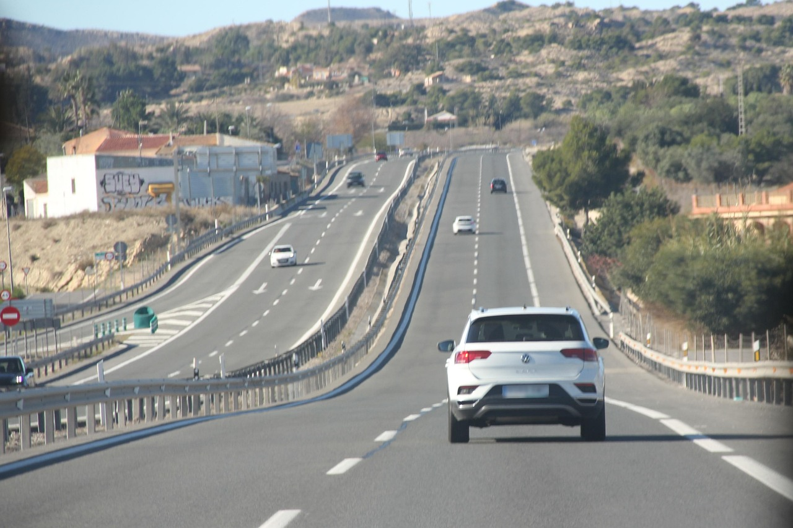

```{r}
#| label: setup
#| include: false
library(tidyverse)
library(interactions)  # for cat_plot()
dapr2red <- "#BF1932" 
source('../_theme/theme_quarto.R')

col_C_CS <- '#DDAA33'
col_C_RR <- '#EE6677'
col_M_CS <- '#4477AA'
col_M_RR <- '#228833'
col_C_DC <- '#AA3377'
col_M_DC <- '#66CCEE'


anx2 <- read_csv('../data/post_travel_anx.csv') |>
  mutate(
    combo_labs = paste0(vehicle, road)
  )
anx1 <- anx2 |> 
  filter(road %in% c('City', 'Rural')) |>
  mutate(
    vehicle = factor(vehicle, levels = c('Car', 'Bike')),
    road = factor(road, levels = c('Rural', 'City')),
  ) 

mean_Bike_City <- filter(anx2, road == 'City', vehicle == 'Bike')$anx |> mean()
mean_Bike_Rural <- filter(anx2, road == 'Rural', vehicle == 'Bike')$anx |> mean()
mean_Bike_DualCarr <- filter(anx2, road == 'DualCarr', vehicle == 'Bike')$anx |> mean()

mean_Car_City <- filter(anx2, road == 'City', vehicle == 'Car')$anx |> mean()
mean_Car_Rural <- filter(anx2, road == 'Rural', vehicle == 'Car')$anx |> mean()
mean_Car_DualCarr <- filter(anx2, road == 'DualCarr', vehicle == 'Car')$anx |> mean()

palette_probe <- c('#4ab8fc', '#ff7b01')
```

# Course overview {background-color="white" style="font-size:80%;"}

<br>

:::: {.columns}
::: {.column width="50%"}

```{r echo = FALSE, results='asis', warning = FALSE}
source('../dapr2_course_outline.R')
source("https://raw.githubusercontent.com/uoepsy/junk/main/R/course_table.R")
course_table(block1_name, block2_name, block1_lecs, block2_lecs, week = 0)
```

:::

::: {.column width="50%"}

```{r echo = FALSE, results='asis', warning = FALSE}
course_table(block3_name, block4_name, block3_lecs, block4_lecs, week = 3)
```

:::
::::


## Tech check and warm-up

<br>

:::{.hcenter style="font-size: 125%;"}

`wooclap.com`, enter code `GECHXE`

:::


## This week's learning objectives

<br>

::::: {style="font-size: 125%;"}

::: {.dapr2callout}
What does the interaction coefficient of a linear model mean?
:::

<!-- ::: {.dapr2callout .fragment} -->
<!-- If we know the contrast coding for two interacting categorical predictors, how do we work out the coding of the interaction term? -->
<!-- ::: -->

::: {.dapr2callout .fragment}
What’s the difference between a “simple slope” and a “simple effect”?
:::

::: {.dapr2callout .fragment}
How can we calculate how many interaction terms a model will have when two categorical predictors interact?
:::

:::::

## Where we are in the analysis plan today

{fig-align="center"}


## What's an interaction again?

An interaction is how we allow a model to estimate that **the association between one predictor and the outcome is different, _depending on_ the value of another predictor**.

<br>

{fig-align="center"}


## Today's data

**Post-travel anxiety ratings for people using two different kinds of `vehicle`:**


:::: {.columns}
::: {.column width="50%"}
`Car`:
<br>
{height="300"}
:::
::: {.column width="50%"}
`Bike`:
<br>
{height="300"}
:::
::::


**on two different `roads`:**

:::: {.columns}
::: {.column width="50%"}
`Rural`:
<br>
{height="300"}


::::{style="font-size:70%"}
(all images from pixabay)
::::

:::
::: {.column width="50%"}
`City`:
<br>
{height="300"}
:::
::::


## Today's data: One way to look at it

<br>

:::: {.columns}
::: {.column width="60%"}
```{r fig.align = 'center', fig.dim = c(10, 8)}
#| code-fold: true
anx1 <- anx1 |>
  mutate(
    combo_labs = paste0(vehicle, road)
  )

set.seed(1)
p_anx1_transfacet <- anx1 |>
  ggplot(aes(x = road, y = anx, colour = combo_labs, fill = combo_labs)) +
  geom_violin(alpha = 0.5) +
  geom_jitter(alpha = 0.5, size = 5) +
  stat_summary(fun = mean, geom = 'point', colour = 'black', size = 8) +
  facet_wrap(~ vehicle) +
  theme(
    legend.position = 'none',
    strip.text = element_text(size = 24)
  ) +
  scale_colour_manual(values = c(col_C_CS, col_C_RR, col_M_CS, col_M_RR)) +
  scale_fill_manual(values = c(col_C_CS, col_C_RR, col_M_CS, col_M_RR)) +
  NULL

p_anx1_transfacet
```
:::

::: {.column width="40%"}

::::{ style="font-size:85%;"}

```{r eval=F}
anx1 |>
  head(12)
```


```{r echo=F}
anx1 |> 
  select(-combo_labs) |>
  head(12)
```

::::

:::

::::

**Does the difference in anxiety after travelling on different road types _depend on_ the kind of vehicle?**

Or, specifically: Is the difference in anxiety after travelling on rural roads vs. city streets different for Cars and Bikes?


## Today's data: Another equivalent way
<br>

:::: {.columns}
::: {.column width="60%"}
```{r fig.align = 'center', fig.dim = c(10, 8)}
#| code-fold: true
set.seed(1)
p_anx1_roadfacet <- anx1 |>
  ggplot(aes(x = vehicle, y = anx, colour = combo_labs, fill = combo_labs)) +
  geom_violin(alpha = 0.5) +
  geom_jitter(alpha = 0.5, size = 5) +
  stat_summary(fun = mean, geom = 'point', colour = 'black', size = 8) +
  facet_wrap(~ road) +
  theme(
    legend.position = 'none',
    strip.text = element_text(size = 24)
  ) +
  scale_colour_manual(values = c(col_C_CS, col_C_RR,  col_M_CS,col_M_RR)) +
  scale_fill_manual(values   = c(col_C_CS, col_C_RR,  col_M_CS,col_M_RR)) +
  NULL
p_anx1_roadfacet
```
:::

```{r include=F, eval=F}
ggsave('figs/anx1_transfacet.svg',p_anx1_transfacet, width = 30, height = 20, units = 'cm')
ggsave('figs/anx1_roadfacet.svg',p_anx1_roadfacet, width = 30, height = 20, units = 'cm')
```


::: {.column width="40%"}

::::{ style="font-size:85%;"}

```{r eval=F}
anx1 |>
  head(12)
```


```{r echo=F}
anx1 |> 
  select(-combo_labs) |>
  head(12)
```

::::

:::

::::

**Does the difference in anxiety after travelling on different road types _depend on_ the kind of vehicle?**

Or, equivalently: Is the difference in anxiety between Cars and Bikes different after travelling on rural roads and on city streets?


# Let's play with the numbers

## How different are the differences between groups?

<br>

:::{.hcenter style="font-size: 125%;"}

`wooclap.com`, enter code `GECHXE`

:::


<!-- | | Rural| City| -->
<!-- |:---------|---------:|----------:| -->
<!-- |<b>Car</b>  |      27.03 |       31.92 | -->
<!-- |<b>Bike</b>   |      27.47  |       40.12 | -->


# Let's model it!

## First: Set up factor levels, check contrast coding

```{r}
anx1 <- anx1 |>
  mutate(
    vehicle = factor(vehicle, levels = c('Car', 'Bike')),
    road = factor(road, levels = c('Rural', 'City')),
  )
```

<br>

The default contrast coding (treatment coding):

```{r}
contrasts(anx1$vehicle)
```

<br>

```{r}
contrasts(anx1$road)
```


## The interaction's contrast is the product of the two interacting contrasts

<br>

In other words: To get the interaction's contrast, we multiply together each pair of coding values from the interacting predictors.

<br>


| vehicle | road  | vehicleBike | roadCity | vehicleBike:roadCity |
| --------- | ---------- | ---------------: | ------------------: | ----------: |
| Car  | Rural  | 0                | 0                   | 0 * 0 = 0   |
| Car  | City | 0                | 1                   | 0 * 1 = 0   |
| Bike   | Rural  | 1                | 0                   | 1 * 0 = 0   |
| Bike   | City | 1                | 1                   | 1 * 1 = 1   |


<!-- ## Before we fit the model, remember our adages about multiple regression -->

<!-- <br> -->

<!-- :::{.dapr2callout style="font-size:100%"} -->
<!-- **For every predictor that goes into your model, know what zero represents.** -->
<!-- ::: -->

<!-- - What does `vehicle = 0` represent? -->
<!-- - What does `road = 0` represent? -->

<!-- <br> -->

<!-- :::{.dapr2callout style="font-size:100%;"} -->

<!-- A model's intercept is the mean outcome **when every predictor in the model is at zero.** -->

<!-- ::: -->

<!-- - What will this model's intercept represent? -->

<!-- <br> -->

<!-- :::{.dapr2callout style="font-size:100%;"} -->

<!-- Each predictor's slope represents the association of the given predictor with the outcome **when every other predictor is at zero.** -->

<!-- ::: -->

<!-- - What will the slope of `vehicle` represent? -->
<!-- - What will the slope of `road` represent? -->


## Think–Pair–Share: Cat/cat interaction coefs

<br>

The interaction model &nbsp; `anx ~ vehicle * road` &nbsp; will have four coefficients:

- `Intercept` (but you're pretty good at interpreting the intercept by now, so we'll spend time on the harder stuff!)
- `vehicleBike`
- `roadCity`
- `vehicleBike:roadCity`

**Without looking ahead, try to figure out: What will each coefficient represent?**


<br>

:::{.dapr2callout style="font-size:100%"}

- **Think** to yourself about each coefficient's meaning. / **Pair** up with your neighbour and think together.

- Then **share** on `wooclap.com`, enter code `GECHXE`

:::


## Fitting the model

$$
\text{anx} = \beta_0 + 
(\beta_1 \cdot \text{vehicle}_\text{Bike}) +
(\beta_2 \cdot \text{road}_\text{City}) +
(\beta_3 \cdot \text{vehicle}_\text{Bike} \cdot \text{road}_\text{City}) +
\epsilon
$$

```{r}
m1 <- lm(anx ~ vehicle * road, data = anx1)
```

:::{.fragment}

```{r}
summary(m1)
```

:::


## Interpreting the model (1)

:::: {.columns}
::: {.column width="65%"}
```{r echo=F, fig.align='center', fig.dim=c(10, 8)}
set.seed(1)
p_anx1_transfacet
```

::::{ style="font-size:85%;"}
```{r echo=F}
cat(paste0(capture.output(summary(m1)), '\n')[10:14])
```
::::
:::
::: {.column width="35%"}

::::{.fragment}

**`Intercept`**

- When `vehicle = 0 = Car` and `road = 0 = Rural`, the estimated average anxiety is 27.03 points.

::::

::::{.fragment}

**`vehicleBike`**

- Specifically when `road = 0 = Rural`, riding a bike is associated with an increase in anxiety of 0.44 points.
- This estimate is not significantly different from zero ($p$ = .842).

::::


::::{.fragment}

**`roadCity`**

- Specifically when `vehicle = 0 = Car`, being on city roads is associated with an increase in anxiety of 4.89 points.
- This estimate is significantly different from zero ($p$ = .030).

::::


:::
::::


## Interpreting the model (2)

:::: {.columns}
::: {.column width="65%"}
```{r echo=F, fig.align='center', fig.dim=c(10, 8)}
set.seed(1)
p_anx1_transfacet
```

::::{ style="font-size:85%;"}
```{r echo=F}
cat(paste0(capture.output(summary(m1)), '\n')[10:14])
```
::::
:::
::: {.column width="35%"}

**`vehicleBike:roadCity`**

- Riding a bike increases the association of `road` with `anx` by 7.76 points.
- This estimate is significantly different from zero ($p$ = .014).
- The association of `road` with `anx` when ...
  - `vehicle = 0 = Car` is 4.89
  - `vehicle = 1 = Bike` is 4.89 + 7.76 = 12.65
  
  
:::{.fragment}
- **Equivalently,** being on city roads increases the association of `vehicle` with `anx` by 7.76 points.
- So, the association of `vehicle` with `anx` when ...
  - `road = 0 = Rural` is 0.44
  - `road = 1 = City` is 0.44 + 7.76 = 8.2
:::  
  
:::
::::


## Visualising the model's estimates (1)

When we had continuous predictors, we used `probe_interaction()` from the `interactions` library.

Now that we have only categorical predictors, we must use `interactions::cat_plot()` instead.

:::: {.columns}
::: {.column width="40%"}
<br>

```{r eval=F}
cat_plot(
  m1,
  pred = vehicle,
  modx = road,
)
```
:::
::: {.column width="60%"}
```{r echo=F, fig.align = "center", fig.dim = c(10, 8)}
cat_plot(
  m1,
  pred = vehicle,
  modx = road,
  # geom = 'line'
) +
  theme(text = element_text(size = 32))
```
:::
::::

If you like to think about interactions in terms of **differences in vertical distances between two groups**, then this way of visualising things might work for you.


## Visualising the model's estimates (2)

`cat_plot()` can also link each group mean with lines, using the argument `geom = "line"`.

:::: {.columns}
::: {.column width="40%"}
<br>

```{r eval=F}
cat_plot(
  m1,
  pred = vehicle,
  modx = road,
  geom = 'line'
)
```
:::
::: {.column width="60%"}
```{r echo=F, fig.align = "center", fig.dim = c(10, 8)}
cat_plot(
  m1,
  pred = vehicle,
  modx = road,
  geom = 'line'
) +
  theme(text = element_text(size = 32))
```


:::
::::

If you like to think about interactions in terms of **differences of slopes between two groups**, then this way of visualising things might work for you.


# Calculating simple effects

## "Simple effects"? "Simple slopes"?

<br>

:::{style = "font-size:125%"}

- **Simple effects:** The association of a *categorical* predictor with the outcome, at a specific value of another predictor.

- **Simple slopes:** The association of a *continuous* predictor with the outcome, at a specific value of another predictor.

:::


## Calculating simple effects by hand

<br>

We need the model's linear expression:

$$
\text{anx} = \beta_0 + 
(\beta_1 \cdot \text{vehicle}_\text{Bike}) +
(\beta_2 \cdot \text{road}_\text{City}) +
(\beta_3 \cdot \text{vehicle}_\text{Bike} \cdot \text{road}_\text{City}) +
\epsilon
$$


And the model's coefficient estimates:

```{r}
coef(m1) |> round(2)
```

<br>

We substitute the coefficient estimates into the linear expression, to give:

$$
\text{anx} = 27.03 + 
(0.44 \cdot \text{vehicle}_\text{Bike}) +
(4.89 \cdot \text{road}_\text{City}) +
(7.76 \cdot \text{vehicle}_\text{Bike} \cdot \text{road}_\text{City}) +
\epsilon
$$


## The simple effect of `vehicle` for rural roads

Rural roads are represented by `road = 0`, so we substitute 0 for $\text{road}$.

\begin{align}
\text{anx} &= 27.03 +  (0.44 \cdot \text{vehicle}) +  (4.89 \cdot \text{road}) +  (7.76 \cdot \text{vehicle} \cdot \text{road}) +  \epsilon \\

\text{anx}_{\text{Rural}} &= 27.03 +  (0.44 \cdot \text{vehicle}) +  (4.89 \cdot 0) +  (7.76 \cdot \text{vehicle} \cdot 0) +  \epsilon \\
\text{anx}_{\text{Rural}} &= 27.03 +  (0.44 \cdot \text{vehicle}) + \epsilon \\
\end{align}

This is the equation for the blue line in this plot:

```{r echo=F, fig.align = "center", fig.dim = c(10, 6)}
cat_plot(
  m1,
  pred = vehicle,
  modx = road,
  geom = 'line'
) +
  theme(text = element_text(size = 32))
```

**When we ask for a "simple effect", we ask for the _slope_ of this line: the difference between groups at a specific level of another predictor. So here, the simple effect is 0.44.**


## The simple effect of `vehicle` for city streets

City streets are represented by `road = 1`, so we substitute 1 for $\text{road}$ below.

\begin{align}
\text{anx} &= 27.03 +  (0.44 \cdot \text{vehicle}) +  (4.89 \cdot \text{road}) +  (7.76 \cdot \text{vehicle} \cdot \text{road}) +  \epsilon \\

\text{anx}_{\text{City}} &= 27.03 +  (0.44 \cdot \text{vehicle}) +  (4.89 \cdot 1) +  (7.76 \cdot \text{vehicle} \cdot 1) +  \epsilon \\
\text{anx}_{\text{City}} &= 27.03 + 4.89 +  (0.44 \cdot \text{vehicle}) + (7.76 \cdot \text{vehicle}) +  \epsilon \\
\text{anx}_{\text{City}} &= 31.92 +  ((0.44 + 7.76) \cdot \text{vehicle}) +  \epsilon \\
\text{anx}_{\text{City}} &= 31.92 +  (8.2 \cdot \text{vehicle}) +  \epsilon \\
\end{align}

This is the equation for the orange line in this plot:

```{r echo=F, fig.align = "center", fig.dim = c(10, 6)}
cat_plot(
  m1,
  pred = vehicle,
  modx = road,
  geom = 'line'
) +
  theme(text = element_text(size = 32))
```

**If we ask for the simple effect of vehicle for city streets, it's the slope of this line: 8.2.**


## What about simple effects of `road`?

Also doable! Those would be the symmetrical simple effects: also true, just a different angle of looking at the same data.

Those simple effects would match the blue and orange slopes in this plot:

```{r echo=F, fig.align = "center", fig.dim = c(10, 5)}
cat_plot(
  m1,
  pred = road,
  modx = vehicle,
  geom = 'line'
) +
  theme(text = element_text(size = 28))
```


<br>

I'll leave calculating those lines to you—it's good practice :)


# Interactions with 2x3 data, treatment-coded

## Interactions with 2x3 data, treatment-coded

**Post-travel anxiety ratings for people using two different kinds of `vehicle`:**

:::: {.columns}
::: {.column width="50%"}
`Car`:
<br>
{height="300"}
:::
::: {.column width="50%"}
`Bike`:
<br>
{height="300"}
:::
::::


**now on _three_ different `roads`:**

:::: {.columns}
::: {.column width="33%"}
`Rural`:
<br>
{height="300"}
:::
::: {.column width="33%"}
`City`:
<br>
{height="300"}
:::

::: {.column width="33%"}
`DualCarr`(iageway):
<br>
{height="300"}
:::
::::


## Visualise the data

```{r fig.align = "center", fig.dim = c(14, 8)}
#| code-fold: true
p_anx2_transfacet <- anx2 |> 
  mutate(
    vehicle = factor(vehicle, levels = c('Car', 'Bike')),
    road = factor(road, levels = c('Rural', 'City', 'DualCarr'))
  ) |>
  ggplot(aes(x = road, y = anx, colour = combo_labs, fill = combo_labs)) +
  geom_violin(alpha = 0.5) +
  geom_jitter(alpha = 0.5, size = 5) +
  stat_summary(fun = mean, geom = 'point', colour = 'black', size = 8) +
  facet_wrap(~ vehicle) +
  theme(
    legend.position = 'none',
    strip.text = element_text(size = 24)
  ) +
  scale_fill_manual(values = c( col_C_CS, col_C_DC, col_C_RR, col_M_CS, col_M_DC, col_M_RR )) +
  scale_colour_manual(values = c( col_C_CS, col_C_DC, col_C_RR, col_M_CS, col_M_DC, col_M_RR )) +
  NULL

p_anx2_transfacet
```

<br>

The data is exactly the same as before, plus the new category of `DualCarr`.


## Set up the data

Factor levels:

```{r}
anx2 <- anx2 |>
  mutate(
    vehicle = factor(vehicle, levels = c('Car', 'Bike')),
    road = factor(road, levels = c('Rural', 'City', 'DualCarr')),
  )
```

<br>

The default contrast coding (treatment coding):

:::: {.columns}
::: {.column width="50%"}
 
```{r}
contrasts(anx2$vehicle)
```

:::
::: {.column width="50%"}

```{r}
contrasts(anx2$road)
```

:::
::::

<br>

Our model of this data will have **two interaction terms**: 

1. `vehicleBike:roadCity` **and**
1. `vehicleBike:roadDualCarr`

## In general, how many interaction terms will a model have?

The number of interaction terms is given by

$$
(r - 1) \times (c - 1)
$$

- $r$ (which stands for "rows") is the number of levels in the first interacting predictor;
- $c$ (which stands for "columns") is the number of levels in the second interacting predictor.

To see why we are talking about "rows" and "columns", imagine the variables arranged like this:

|              | Rural | City | DualCarr |
| ------------ | --- | ---- | ---- |
| <b>Car</b> |     |      |      |   
| <b>Bike</b> |     |      |      |   
|

So in our 2x3 data, where $r=2$ and $c=3$, we have

\begin{align}
 ~& (r - 1) \times (c - 1)\\
=~& (2 - 1) \times (3 - 1)\\
=~& 1 \times 2\\
=~& 2
\end{align}

interaction terms.

<!-- ## Each interaction's contrast is the product of the two interacting contrasts (1) -->

<!-- <br> -->

<!-- **Let's start with `vehicleBike:roadCity`:** -->

<!-- <br> -->

<!-- | vehicle | road | vehicleBike | roadCity | tC:rtCS | -->
<!-- |---|---|--:|--:|--:| -->
<!-- | Car | Rural |  0 |  0 | ? | -->
<!-- | Car | City  |  0 |  1 | ? | -->
<!-- | Car | DualCarr  |  0 |  0 | ? | -->
<!-- | Bike  | Rural |  1 |  0 | ? | -->
<!-- | Bike  | City  |  1 |  1 | ? | -->
<!-- | Bike  | DualCarr  |  1 |  0 | ? | -->

<!-- <br> -->

<!-- :::{.hcenter style="font-size: 125%;"} -->

<!-- `wooclap.com`, enter code `GECHXE` -->

<!-- ::: -->


<!-- ## Each interaction's contrast is the product of the two interacting contrasts (2) -->

<!-- <br> -->

<!-- **Continue on with `vehicleBike:roadDualCarr`:** -->

<!-- <br> -->

<!-- | vehicle | road | vehicleBike | roadDualCarr | tC:rtDC | -->
<!-- |---|---|--:|--:|--:| -->
<!-- | Car | Rural |  0 |  0 | ? | -->
<!-- | Car | City  |  0 |  0 | ? | -->
<!-- | Car | DualCarr  |  0 |  1 | ? | -->
<!-- | Bike  | Rural |  1 |  0 | ? | -->
<!-- | Bike  | City  |  1 |  0 | ? | -->
<!-- | Bike  | DualCarr  |  1 |  1 | ? | -->

<!-- <br> -->


<!-- :::{.hcenter style="font-size: 125%;"} -->

<!-- `wooclap.com`, enter code `GECHXE` -->

<!-- ::: -->


# Model time


## Fit the model

$$
\begin{align}
\text{anx} ~=~& \beta_0 + 
(\beta_1 \cdot \text{vehicle}_\text{Bike}) + 
(\beta_2 \cdot \text{road}_{\text{City}}) + 
(\beta_3 \cdot \text{road}_{\text{DualCarr}}) +  \\
& (\beta_4 \cdot \text{vehicle}_\text{Bike} \cdot \text{road}_{\text{City}}) + 
(\beta_5 \cdot \text{vehicle}_\text{Bike} \cdot \text{road}_{\text{DualCarr}}) + 
\epsilon
\end{align}
$$


```{r}
m2 <- lm(anx ~ vehicle * road, data = anx2)
```

:::{.fragment}

```{r}
summary(m2)
```

:::


## Interpreting the model (1)

:::: {.columns}
::: {.column width="60%"}
```{r echo=F, fig.align='center', fig.dim=c(14, 8)}
set.seed(1)
p_anx2_transfacet
```

::::{ style="font-size:75%;"}
```{r echo=F}
cat(paste0(capture.output(
  summary(m2)
), '\n')[9:16])
```

::::
:::
::: {.column width="40%"}
:::: {style="font-size:90%"}

**`Intercept`** (same as before)

- For cars on rural roads (i.e., at the reference levels of `vehicle` and `road`, where all predictors = 0), the estimated average `anx` is 27.03 points.

**`vehicleBike`** (same as before)

- Specifically at the reference level of `road` (Rural), riding a bike is associated with an increase in anxiety of 0.44 points ($p$ = .845).

**`roadCity`** (same as before)

- Specifically at the reference level of `vehicle` (Car), being on city streets is associated with an increase in anxiety of 4.89 points ($p$ = 0.33).

**`roadDualCarr`** (new!)

- Specifically at the reference level of `vehicle` (Car), being on dual carriageways is associated with an increase in anxiety of 6.02 points ($p$ = .008).

::::

:::
::::


## Interpreting the model (2)

::::{.columns}

:::{.column width="60%"}
```{r echo=F, fig.align='center', fig.dim=c(14, 8)}
set.seed(1)
p_anx2_transfacet
```

::::{ style="font-size:75%;"}
```{r echo=F}
cat(paste0(capture.output(
  summary(m2)
), '\n')[9:16])
```
::::

:::


::: {.column width="40%"}
:::: {style="font-size:90%"}


**`vehicleBike:roadCity`**

- Riding a bike increases the association of `roadCity` with `anx` by 7.76 points ($p$ = .016).
- So, the association of `roadCity` with `anx` when ...
  - `vehicle = 0 = Car` is 4.89
  - `vehicle = 1 = Bike` is 4.89 + 7.76 = 12.65
  
  
- **Equivalently,** being on city streets increases the association of `vehicle` with `anx` by 7.76 points.
- So, the association of `vehicle` with `anx` when ...
  - `roadCity = 0 = Rural` is 0.44
  - `roadCity = 1 = City` is 0.44 + 7.76 = 8.2
  
:::

::::

:::


## Interpreting the model (3)

:::: {.columns}
::: {.column width="60%"}
```{r echo=F, fig.align='center', fig.dim=c(14, 8)}
set.seed(1)
p_anx2_transfacet
```

::::{ style="font-size:75%;"}
```{r echo=F}
cat(paste0(capture.output(
  summary(m2)
), '\n')[9:16])
```
::::

:::

::: {.column width="40%"}
:::: {style="font-size:90%"}

**`vehicleBike:roadDualCarr`**

-  Riding a bike increases the association of `roadDualCarr` with `anx` by about 14.33 points.
- So, the association of `road DualCarr` with `anx` when ...
  - `vehicle = 0 = Car` is 6.02
  - `vehicle = 1 = Bike` is 6.02 + 14.33 = 20.35


  
- **Equivalently,** being on dual carriageways increases the association of `vehicle` with `anx` by 14.33 points.
- So, the association of `vehicle` with `anx` when ...
  - `roadDualCarr = 0 = Rural` is 0.44
  - `roadDualCarr = 1 = DualCarr` is 0.44 + 14.33 = 14.77
  
:::

::::

:::


## Visualising the model's estimates with `cat_plot()`

:::: {.columns}
::: {.column width="30%"}
**One option:**

```{r eval=F}
cat_plot(
  m2,
  pred = vehicle,
  modx = road,
)
```
:::
::: {.column width="70%"}
```{r echo=F, fig.align = "center", fig.dim = c(10, 4)}
cat_plot(
  m2,
  pred = vehicle,
  modx = road,
) +
  theme(text = element_text(size = 32))
```
:::
::::

:::: {.columns}
::: {.column width="30%"}
**Another option:**

```{r eval=F}
cat_plot(
  m2,
  pred = vehicle,
  modx = road,
  geom = 'line'
)
```
:::
::: {.column width="70%"}
```{r echo=F, fig.align = "center", fig.dim = c(10, 4)}
cat_plot(
  m2,
  pred = vehicle,
  modx = road,
  geom = 'line'
) +
  theme(text = element_text(size = 32))
```


:::
::::

## Why do we need more than one interaction term to capture how these predictors interact?

<br>

:::{.hcenter style="font-size: 125%;"}

`wooclap.com`, enter code `GECHXE`

:::


# The big picture: Interactions

## The big picture: Interactions

{fig-align="center"}

Whenever one predictor's association with the outcome depends on another predictor, then we're dealing with interactions.


## Beyond two-way interactions

So far, we've been focusing on **interactions between two predictors, called "two-way interactions".**

But in principle, we could throw another variable into the mix:

Maybe **countries with different amounts of bike infrastructure differ** in the anxiety that cyclists vs. car drivers feel on different kinds of road.


:::: {.columns}
::: {.column width="50%"}
{width="400" fig-align="center"}
:::
::: {.column width="50%"}
{width="400" fig-align="center"}
:::
::::


This would be a **three-way interaction** between country, vehicle, and road type.

:::{.dapr2callout}

My advice to you: **Try not to design studies that involve three-way interactions.**

- They are tricky to interpret.
- The three-way interaction term itself is often a fairly small number, and we usually don't have enough statistical power to reliably detect it.

:::


# Back matter

## Revisiting this week's learning objectives

<br>


::: {.dapr2callout}
**What does the interaction coefficient of a linear model mean?**

- How the slope of one predictor increases or decreases, when the other predictor goes from 0 to 1. (This interpretation applies to all kinds of predictors, both continuous and categorical.)
- The interaction term is _not_ a slope on its own. It is an adjustment value that we _add_ to one of the predictor's slopes.
- If we have two interacting predictors, A and B, then the interaction term tells us
	- how much does the association between A and the outcome (i.e., the slope of A) change, when B goes from 0 to 1?
	- how much does the association between B and the outcome (i.e., the slope of B) change, when A goes from 0 to 1?
:::

<!-- ::: {.dapr2callout} -->
<!-- **If we know the contrast coding for two interacting categorical predictors, how do we work out the coding of the interaction term?** -->

<!-- - Get all combinations of levels in the interacting predictors. -->
<!-- - Multiply each pair of coding values together (i.e., get the product of each pair of values). -->
<!-- - The resulting list of numbers is the coding of the interaction. -->
<!-- ::: -->


## Revisiting this week's learning objectives

<br>


::: {.dapr2callout}
**What's the difference between a "simple slope" and a "simple effect"?**

- The only difference is what kind of predictor we're looking at.
- Simple effects: The association of a _categorical_ predictor with the outcome, at a specific value of another predictor (either categorical or continuous).
- Simple slopes: The association of a _continuous_ predictor with the outcome, at a specific value of another predictor (either categorical or continuous).
:::

::: {.dapr2callout}
**How can we calculate how many interaction terms a model will have when two categorical predictors interact?**

- Based on how many levels each predictor has.

$$
(r - 1) \times (c - 1)
$$

- $r$ is the number of levels in the first interacting predictor.
- $c$ is the number of levels in the second interacting predictor.
:::


## This week 

<br>

::::{.columns}
:::{.column width="50%"}
**Tasks:**

<br>

{width=80px style="margin:10px;margin-bottom:-50px"} Work on exercises in labs

<br>

{width=80px style="margin:10px;margin-bottom:-45px"} Complete the weekly quiz 


:::

:::{.column width="50%"}
**Get support:**

<br>

{width=80px style="margin:10px;margin-bottom:-30px"}
Consult the [flash cards](https://uoepsy.github.io/dapr2/2627/flashcards/){target="_blank"}

<br>

{width=80px style="margin:10px;margin-bottom:-50px"}
Ask questions anonymously on Piazza

<br>

{width=80px style="margin:10px;margin-bottom:-40px"} 
We really like seeing you in office hours!

:::
::::


# Appendix {.appendix} 


## Key insight: The difference between differences is the same both ways

:::: {.columns}
::: {.column width="50%"}
**One way:**

```{r echo=F, echo=F, fig.align = 'center', fig.dim = c(10, 8)}
# Add diff of diff lines
anx1_diffdiff_transfacet <- tibble(
  road = NA,
  combo_labs = NA,
  vehicle = factor(c('Bike', 'Car'), levels = c('Car', 'Bike') ),
  x = 1.5,
  xend = 1.5,
  y = c(mean_Bike_Rural, mean_Car_Rural),
  yend = c(mean_Bike_City, mean_Car_City),
  meany = c(
    mean(c(mean_Bike_Rural, mean_Bike_City)),
    mean(c(mean_Car_Rural, mean_Car_City))
    ),
  labs = c('12.65', '4.89')
)

p_anx1_transfacet_diffdiff <- p_anx1_transfacet +
  ## vertical diff lines
  geom_segment(
    data = anx1_diffdiff_transfacet,
    aes(x = x, xend = xend, y = y, yend = yend),
    colour = 'black',
    linewidth = 3
  ) +
  # labels
  geom_label(
    data = anx1_diffdiff_transfacet,
    aes(x = x+0.05, y = meany, label = labs),
    colour = 'black',
    fill = 'white',
    hjust = 0
  ) +
  theme(text = element_text(size = 32))

# p_anx1_transfacet_diffdiff 
```

```{r echo=F, fig.align='center', fig.dim = c(10, 6)}
p_anx1_transfacet_diffdiff
```

$$
12.65 - 4.89 = 7.76
$$
:::
::: {.column width="50%"}
**Another way:**

```{r echo=F, fig.align = 'center', fig.dim = c(10, 8)}
# Add diff of diff lines
anx1_diffdiff_roadfacet <- tibble(
  road = factor(c('Rural', 'City'), levels = c('Rural', 'City')),
  vehicle = NA,
  combo_labs = NA,
  x = 1.5,
  xend = 1.5,
  y = c(mean_Car_Rural, mean_Car_City),
  yend = c(mean_Bike_Rural, mean_Bike_City),
  meany = c(
    mean(c(mean_Car_Rural, mean_Bike_Rural)),
    mean(c(mean_Car_City, mean_Bike_City))
    ),
  labs = c('0.44', '8.2')
)

p_anx1_roadfacet_diffdiff <- p_anx1_roadfacet +
  geom_segment(
    data = anx1_diffdiff_roadfacet,
    aes(x = x, xend = xend, y = y, yend = yend),
    colour = 'black',
    linewidth = 3
  ) +
  geom_label(
    data = anx1_diffdiff_roadfacet,
    aes(x = x+0.05, y = meany, label = labs),
    colour = 'black',
    fill = 'white',
    hjust = 0
  ) +
  theme(text = element_text(size = 32)) +
  NULL

# p_anx1_roadfacet_diffdiff
```

```{r echo=F, fig.align='center', fig.dim = c(10, 6)}
p_anx1_roadfacet_diffdiff
```

$$
8.2 - 0.44 = 7.76
$$
:::
::::

No matter which angle we look at the interaction data from, **the difference between differences---which appears in the model as the coefficient of the interaction term---is the same.**

As we saw last week: **interactions are symmetrical.**

(In practice, people usually only report the angle that makes the most sense for their research question.)


## Difference of differences 1

:::: {.columns}
::: {.column width="50%"}
```{r echo=F, echo=F, fig.align = 'center', fig.dim = c(10, 8)}
p_anx1_transfacet_diffdiff 
```

*(`Car` and `Rural` are the reference levels)*

:::

::: {.column width="50%"}

Group means:

:::{.hcenter}
```{r include=F}
anx1 |>
  group_by(vehicle, road) |>
  summarise(m = round(mean(anx), 1)) |>
  pivot_wider(names_from = road, values_from = m) |>
  kableExtra::kable()
```

| | Rural| City|
|:---------|---------:|----------:|
|<b>Car</b>  |      27.03 |       31.92 |
|<b>Bike</b>   |      27.47  |       40.12 |
:::

**For Cars,** the difference between city and rural:

$$
\begin{align}
& \text{City}~ - \text{Rural} \\
=~ & 31.92 - 27.03 \\
=~ & 4.89 \\
\end{align}
$$

**For Bikes,** the difference between city and rural:

$$
\begin{align}
& \text{City}~ - \text{Rural} \\
=~ & 40.12 - 27.47 \\
=~ & 12.65 \\
\end{align}
$$

:::
::::


The difference between Bikes' difference and Cars' difference:

$$
\begin{align}
& \text{BikeDiff}~ - \text{CarDiff} \\
=~ & 12.65 - 4.89 \\
=~ & 7.76 \\
\end{align}
$$


## Difference of differences 2

:::: {.columns}
::: {.column width="50%"}
```{r echo=F, fig.align = 'center', fig.dim = c(10, 8)}
p_anx1_roadfacet_diffdiff
```

*(`Car` and `Rural` are the reference levels)*

:::


::: {.column width="50%"}

Group means:

:::{.hcenter}
```{r include=F}
anx1 |>
  group_by(vehicle, road) |>
  summarise(m = round(mean(anx), 1)) |>
  pivot_wider(names_from = road, values_from = m) |>
  kableExtra::kable()
```

| | Rural| City|
|:---------|---------:|----------:|
|<b>Car</b>  |      27.03 |       31.92 |
|<b>Bike</b>   |      27.47  |       40.12 |
:::

**For rural roads,** the difference between Bikes and Cars:

$$
\begin{align}
& \text{Bike}~ - \text{Car} \\
=~ & 27.47 - 27.03 \\
=~ & 0.44 \\
\end{align}
$$

**For city streets,** the difference between Bikes and Cars:

$$
\begin{align}
& \text{Bike}~ - \text{Car} \\
=~ & 40.12 - 31.92 \\
=~ & 8.2 \\
\end{align}
$$

:::
::::


The difference between city streets' difference and rural roads' difference:

$$
\begin{align}
& \text{CitysDiff}~ - \text{RuralsDiff} \\
=~ & 8.2 - 0.44 \\
=~ & 7.76 \\
\end{align}
$$

## Mapping model coefficients to group means

A more formal version of "find the difference of differences". 

**Model coefficients:**

:::{style = "font-size:90%"}
```{r echo=F}
cat(paste0(capture.output(
  summary(m1)
), '\n')[10:14])
```
:::

**Group means:**

| | Rural| City|
|:---------|---------:|----------:|
|<b>Car</b>  |      27.03 |       31.92 |
|<b>Bike</b>   |      27.47  |       40.12 |


**How model coefficients and group means are related:**


| | | |
| :-- | :-- | --: |
| `(Intercept)`| mean(Car, Rural) | **27.03** |
| `vehicleBike` | mean(Bike, Rural) – mean(Car, Rural) | 27.47 – 27.03 = **0.44** |
| `roadCity`| mean(Car, City) – mean(Car, Rural) | 31.92 – 27.03 = **4.89** |
| `tC:rtCS`| [mean(Bike, City) – mean(Car, City)] –  [mean(Bike, Rural) – mean(Car, Rural)] | (40.12 – 31.92) – (27.47 – 27.03) = **7.76** |


## Mapping 2x3 model coefs to group means

:::{style = "font-size:85%"}

:::: {.columns}
::: {.column width="55%"}

**Model coefficients:**

::::{style = "font-size:80%"}

```{r echo=F}
cat(paste0(capture.output(
  summary(m2)
), '\n')[10:16])
```


::::

:::
::: {.column width="45%"}
**Group means:**

|                 | Rural | City | DualCarr |
|  -------------- | --------: | ---------: | ---: |
| <b>Car</b> |  27.03    |    31.92   |  33.05    |   
| <b>Bike</b>  |  27.47    |    40.12   |  47.82    |   

:::
::::


**How model coefficients and group means are related:**

| | | |
| :-- | :-- | --: |
| `(Intercept)`| mean(Car, Rural) | **27.03** |
| `vehicleBike`| mean(Bike, Rural) – mean(Car, Rural) | 27.47 – 27.03 = **0.44** |
| `roadCity`| mean(Car, City) – mean(Car, Rural) | 31.92 – 27.03 = **4.89** |
| `roadDualCarr`| mean(Car, DualCarr) – mean(Car, Rural) | 33.05 – 27.03 = **6.02** |
| `tC:rtCS`| [mean(Bike, City) – mean(Car, City)] –  [mean(Bike, Rural) – mean(Car, Rural)] | (40.12 – 31.92) – (27.47 – 27.03) = **7.76** |
| `tC:rtDC`| [mean(Bike, DualCarr) – mean(Car, DualCarr)] –  [mean(Bike, Rural) – mean(Car, Rural)] | (47.82 – 33.05) – (27.47 – 27.03) = **14.33** |

:::

