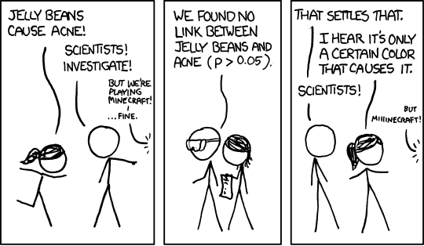
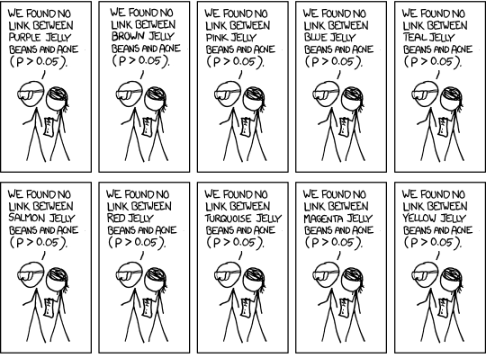
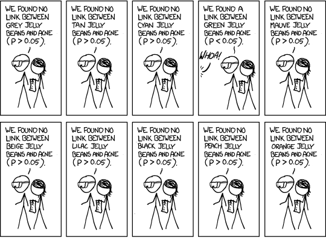
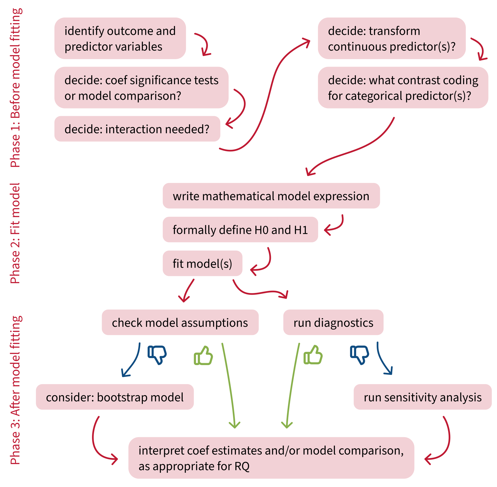

```{r}
#| label: setup
#| include: false

library(tidyverse)
library(emmeans)

dapr2red <- "#BF1932" 

source('../_theme/theme_quarto.R')

hosp <- read_csv("../data/hospital.csv") |>
  mutate(
    Treatment = case_when(
      Treatment == 'TreatA' ~ 'Meds',
      Treatment == 'TreatB' ~ 'EMDR',
      Treatment == 'TreatC' ~ 'CBT',
    ),
    Treatment = factor(Treatment),
    Hospital = factor(Hospital),
  )

# get group means
mean_Meds_1 <- mean(filter(hosp, Treatment == 'Meds', Hospital == 'Hosp1')$SWB)
mean_EMDR_1 <- mean(filter(hosp, Treatment == 'EMDR', Hospital == 'Hosp1')$SWB)
mean_CBT_1  <- mean(filter(hosp, Treatment == 'CBT',  Hospital == 'Hosp1')$SWB)
mean_Meds_2 <- mean(filter(hosp, Treatment == 'Meds', Hospital == 'Hosp2')$SWB)
mean_EMDR_2 <- mean(filter(hosp, Treatment == 'EMDR', Hospital == 'Hosp2')$SWB)
mean_CBT_2  <- mean(filter(hosp, Treatment == 'CBT',  Hospital == 'Hosp2')$SWB)
```


```{r include=F}
library(interactions)

m1 <- lm(SWB ~ Treatment * Hospital, data = hosp)

## test with sim_slopes(); doesn't quite do what we want, doesn't get ALL simple slopes idk why.
## eg no slope for CBT for each hospital? but there is hosp1 and hosp2? so idk what's up there.
# sim_slopes(m1, pred = 'Treatment', modx = 'Hospital', modx.values = c('Hosp1', 'Hosp2'))
# sim_slopes(m1, pred = 'Hospital', modx = 'Treatment', modx.values = c('CBT', 'EMDR', 'Meds'))

pairs(
  emmeans(m1, ~ Treatment * Hospital), 
  simple = 'Hospital'
)

```


# Course overview {background-color="white"}

TODO


## This week's learning objectives

<br>

::::: {style="font-size: 125%;"}

::: {.dapr2callout}
What does it mean to test a simple effect?
:::

::: {.dapr2callout .fragment}
What's the main danger of running multiple statistical tests on the same data?
:::

::: {.dapr2callout .fragment}
What are two common ways that we can correct for running multiple statistical tests on the same data?
:::

::: {.dapr2callout .fragment}
When does the multiple comparisons problem arise?
:::

:::::


# A new 2x3 cat/cat interaction analysis

## Today's data

**The subjective wellbeing (`SWB`) of patients at two different hospitals:**


:::: {.columns}
::: {.column width="50%"}
`Hosp1`:
<br>
{height="300"}
:::
::: {.column width="50%"}
`Hosp2`:
<br>
{height="300"}
:::
::::


**who have undergone one of three different treatments for depression:**

:::: {.columns}
::: {.column width="33%"}
Cognitive Behavioural Therapy (`CBT`)
<br>
{height="300"}
:::
::: {.column width="33%"}
Eye Movement Desensitisation and Reprocessing therapy (`EMDR`)
<br>
{height="300"}
:::

::: {.column width="33%"}
Antidepressant medication <br> (`Meds`):
<br>
{height="300"}
:::
::::


## Visualising the data


<br>

:::: {.columns}
::: {.column width="70%"}
```{r echo=F, fig.align = 'center', fig.dim = c(12, 7)}
hosp |>
  ggplot(aes(x = Treatment, y = SWB, colour = Treatment, fill = Treatment)) +
  geom_violin(alpha = 0.5) +
  geom_jitter(alpha = 0.5, size = 5) +
  facet_wrap(~ Hospital) +
  stat_summary(fun = mean, geom = 'point', colour = 'black', size = 8, show.legend = F) +
  theme(legend.position = 'none') +
  NULL
```
:::

::: {.column width="30%"}

::::{ style="font-size:85%;"}
```{r}
hosp |>
  head(12)
```
::::

:::

::::


## Set up the model

Check on the reference levels:

:::: {.columns}
::: {.column width="50%"}
```{r}
contrasts(hosp$Treatment)
```
:::
::: {.column width="50%"}
```{r}
contrasts(hosp$Hospital)
```
:::
::::

<br>

The model in R syntax:

```{r}
m1 <- lm(SWB ~ Treatment * Hospital, data = hosp)
summary(m1)
```


<br>

On your own time, practice writing out the model's linear expression in mathematical terms, and check the appendix for the solution :)

<!-- TODO WOO -->

<!-- :::{.dapr2callout style="font-size:120%" .hcenter} -->
<!-- `wooclap.com`, code `UBEQCF` -->
<!-- ::: -->


# Testing simple effects

## Retrieval practice: Testing simple effects

<br>

- What's a simple effect?
- If I ask for simple effects of `Hospital` at each level of `Treatment`, what am I looking for?
- What's the difference between simple effects and simple slopes?
- What does it mean to *test* a simple effect?


## Testing simple effects with `pairs()`

<br>

We've seen the math of how to compute simple effects by hand.

But that only gives us the value of the effect, not a test of whether that value is significantly different from zero.

<br>

When we had continuous predictors, we could test simple slopes using `probe_interactions()`.

Now that we have categorical predictors, the best way to test simple slopes is using the R code below (don't worry too much about what the function `emmeans()` is doing, just trust that it works).

<br>

To get the simple effects of `Hospital` at each level of `Treatment`:

```{r eval=F}
pairs(
  emmeans(m1, ~ Treatment * Hospital), 
  simple = 'Hospital'
)
```


## Simple effects of `Hospital` at each level of `Treatment`


:::: {.columns}
::: {.column width="60%"}

```{r}
pairs(
  emmeans(m1, ~ Treatment * Hospital), 
  simple = 'Hospital'
)
```
:::
::: {.column width="40%"}

```{r fig.align = "center", fig.dim = c(7, 7)}
#| code-fold: true
interactions::cat_plot(
  m1,
  pred = Hospital,
  modx = Treatment,
) +
  theme(
    text = element_text(size = 28),
    legend.position = 'bottom'
  )
```

:::
::::

Note on the positive/negative signs:

- `pairs()` computes `Hosp1 – Hosp2` because of how factor levels in the factor `Hospital` are ordered.
- To compute `Hosp2 – Hosp1` instead, we would have to code `Hosp2` as the reference level of `Hospital` before fitting the model.


## Simple effects of `Treatment` for each level of `Hospital`
:::: {.columns}
::: {.column width="60%"}

```{r}
pairs(
  emmeans(m1, ~ Treatment * Hospital), 
  simple = 'Treatment'
)
```
:::
::: {.column width="40%"}

```{r fig.align = "center", fig.dim = c(7, 7)}
#| code-fold: true
interactions::cat_plot(
  m1,
  pred = Treatment,
  modx = Hospital,
) +
  theme(
    text = element_text(size = 28),
    legend.position = 'bottom'
  )
```

:::
::::
<br>

What's this "P value adjustment: tukey method" thing? 

We need a bit of backstory first...


# The multiple comparisons problem

## Let's roll some dice

On a twenty-sided die (a d20), the probability of rolling a 1 (or any other individual number) is 1/20 = 5%.

But if we roll the d20 over and over again, the probability that we'll roll a 1 **at least once** goes up and up and up.

:::: {.columns}
::: {.column width="30%"}
{width="80"}
:::

::: {.column width="20%"}
$.05$
:::

::: {.column width="50%"}
$= 1 – 0.95$
:::
::::


:::: {.columns}
::: {.column width="30%"}
{width="80"}
{width="80"}
:::
::: {.column width="20%"}
$.0975$
:::
::: {.column width="50%"}
$= 1 – (0.95 \times 0.95)$
:::

::::

:::: {.columns}
::: {.column width="30%"}
{width="80"}
{width="80"}
{width="80"}

:::
::: {.column width="20%"}
$.1426$
:::
::: {.column width="50%"}
$= 1 – (0.95 \times 0.95 \times 0.95) = 1 - 0.95^3$
:::

::::

:::{.dapr2callout .fragment}

In general:

$$
P(\text{rolling a 1 in m rolls}) = 1 - (1 - 0.05)^m
$$

:::

:::{.dapr2callout .fragment .hcenter}
**What's the probability that we'll roll a 1 at least once in twenty rolls?**

`wooclap.com`,  code `UBEQCF`

:::


## From dice to statistical tests

<br>

**Why did we spend time rolling those dice?**


- When $\alpha = .05$,
  - we accept the risk that 5% of the time, we'll reject the H0 when actually we shouldn't.
  - (aka that we'll get a false positive result)
  - (aka that we'll make a Type I error)
- **A d20 rolling a 1 happens with the same probability as us rejecting the H0 when actually we shouldn't: one time in twenty.**
- We saw that the probability of rolling a 1 at least once increases, the more dice you roll.
**It's also true that the probability of rejecting the H0 when actually we shouldn't will increase, the more statistical tests we run.**
- So if we run 20 statistical tests, say, then even though we only want to incorrectly reject the H0 one time out of twenty (5% of the time), we would actually reject it with much higher probability.
- The actual level of risk becomes higher than the level of risk that we wanted.


## relevant XKCD (<https://xkcd.com/882/>)



---



---



---


## The more tests you run, the more likely you are to see something unlikely just due to chance

<br>

With $\alpha = 0.05$, we accept the risk that, we will incorrectly reject the null hypothesis 5% of the time.

And if we accept that positive result and ignore all the negative results (green jelly bean style), then we run into **the multiple comparisons problem: we are more than 5% likely to see at least one false positive, the more tests (aka, the more comparisons) we run.**
  
<br>


How much more likely?

Depends on the number of tests.

$$
\begin{align}
P(\text{incorrectly reject H0}) &= \alpha \\
P(\text{correctly reject H0}) &= 1 - \alpha \\
P(\text{correctly reject H0 in} ~m~ \text{tests}) &= (1 - \alpha)^m \\
P(\text{incorrectly reject H0 in} ~m~ \text{tests}) &= 1 - (1 - \alpha)^m \\
\end{align}
$$


## How likely are we to incorrectly reject H0?

<br>

For the green jelly beans scenario:

$$
\begin{align}
P(\text{incorrectly reject H0 in 20 tests}) &= 1 - (1 - 0.05)^{20} \\
 &= 1 - (0.95)^{20} \\
 &= 1 - 0.36 \\
 &= 0.64 \\
\end{align}
$$

We accepted the risk of incorrectly rejecting the null hypothesis 5% of the time.
But if we run 20 tests and accept any positive result, we will risk incorrectly rejecting H0 64% of the time!

<br>

**How do we fix it?**

Lower the $\alpha$ level (aka our accepted level of risk, aka the false positive rate, aka the Type I error rate) to compensate for the increased probability of incorrectly rejecting H0.
 

# Correcting for multiple comparisons

## Common corrections

<br>

- Tukey
- Bonferroni
- Šídák
- Scheffe
- Holm's step-down
- Hochberg's step-up
- ...

<br>

**You only need to know about Tukey and Bonferroni, the two most common.**

<br>

We'll start with Bonferroni, because it's simplest.


## The Bonferroni correction

<br>

The goal is to lower the $\alpha$ level of our tests so that it matches our desired level of risk.

The Bonferroni correction takes our original $\alpha$ level and divides it by the number of tests:

$$
\alpha_{\text{Bonferroni}} = \frac{\alpha}{\text{number of tests}}
$$

<br>

**For the jelly bean scenario, with 20 tests:**

```{r}
0.05 / 20
```


<br>

**For our simple effects of `Treatment` by `Hospital`, with three tests:**

```{r}
0.05 / 3
```


## Bonferroni in action

<br>

```{r}
pairs(
  emmeans(m1, ~ Treatment * Hospital), 
  simple = 'Treatment', 
  adjust = "bonferroni"
)
```


## Tukey's Honest Significant Differences (HSD)

<br>

**Think back to independent-samples t-tests in DAPR1:**

- This kind of t-test compares whether two group means are significantly different from one another.
- The difference between group means is represented as a **t-statistic.**
- The t-statistic is compared to a critical value from the **t-distribution** to decide whether the difference is significant.

**At heart, Tukey's HSD is very similar!**

- Tukey's HSD compares the means of the members of one pair in a pairwise comparison.
- The difference between group means is represented as a **q-statistic.**
- The q-statistic is compared to a critical value from the **studentised range distribution** to decide whether the difference is significant.

<br>

**You do not need to know how to calculate this adjustment by hand!**

If you *want* to know, here's [a YouTube video that walks through the calculation](https://www.youtube.com/watch?v=EBGnAJHs3G4&t=218s){target="_blank"}.
(The main action is between 3:41–7:42.)

## Tukey in action

<br>

```{r}
pairs(
  emmeans(m1, ~ Treatment * Hospital), 
  simple = 'Treatment', 
  adjust = "tukey"
)
```


## When to choose Bonferroni vs. Tukey

<br>

**When to choose Bonferroni:**

- When you're interested in a small number of comparisons.
- When you've got a set of p-values that come from the same data, regardless of what kind of test generated them.

<br>

**When to choose Tukey:**

- When you want to compare the means of levels of a categorical predictor.
- When you're interested in many/all pairwise comparisons between groups.

<br>

Check the [flashcards](https://uoepsy.github.io/dapr2/2526/labs/1_b3_reading.html#multiple-comparisons){target="_blank"} for more details.


# When does the multiple comparisons problem arise?

## When does the multiple comparisons problem arise?

<br>

Anytime you're running multiple statistical tests on the same dataset and using them both to draw conclusions.

<br>

- For example, imagine that for your dissertation one day, you're running a t-test AND a linear model on the same dataset.
  - For example, a t-test addresses RQ1, while the linear model addresses RQ2.
- Because both tests are run on the same data, you'd need to correct all the $p$-values involved. (In this case, Bonferroni is the easiest.)

<br>

Elizabeth's advice to avoid the multiple comparisons problem:

- You can very often address multiple research questions using one single well-designed linear model.
- Only run the statistical tests that are absolutely necessary for addressing your research question(s).
- In general: run as few statistical tests as possible. 
- If in doubt, correct your $p$-values.
  It's never a bad thing to be more conservative about rejecting H0.


# Building an analysis workflow

## Building an analysis workflow

{height="925" fig-align="center"}


# Back matter

## Revisiting this week's learning objectives

::: {.dapr2callout}
**What does it mean to test a simple effect?**

- Test statistically whether the simple effect (or simple slope) is significantly different from zero.
:::

::: {.dapr2callout}
**What's the main danger of running multiple statistical tests on the same data?**

- We'll end up rejecting the H0 at least once in all those tests with a probability much higher than our desired $\alpha$ level.
- This phenomenon is called the "multiple comparisons problem".
- The solution: Make the $\alpha$ level smaller, to compensate for this increased likelihood of rejecting the H0.
:::

::: {.dapr2callout}
**What are two common ways that we can correct for running multiple statistical tests on the same data?**

- Bonferroni correction (a global adjustment to all $\alpha$s).
- Tukey's HSD (an adjustment to each comparison's $\alpha$ based on how different the two group means being compared are).
:::

::: {.dapr2callout}
**When does the multiple comparisons problem arise?**

- Not just when you're testing multiple simple slopes.
- Any time you're running and interpreting more than one statistical test with the same data.
:::

## This week 

<br>

::::{.columns}
:::{.column width="50%"}
**Tasks:**

<br>

{width=80px style="margin:10px;margin-bottom:-50px"} Work on exercises in labs

<br>

{width=80px style="margin:10px;margin-bottom:-45px"} Complete the weekly quiz 


:::

:::{.column width="50%"}
**Get support:**

<br>

{width=80px style="margin:10px;margin-bottom:-30px"}
Consult the [flash cards](https://uoepsy.github.io/dapr2/2627/flashcards/){target="_blank"}

<br>

{width=80px style="margin:10px;margin-bottom:-50px"}
Ask questions anonymously on Piazza

<br>

{width=80px style="margin:10px;margin-bottom:-40px"} 
We really like seeing you in office hours!

:::
::::


# Appendix {.appendix} 

## Linear expression for model

<br>

$$
\begin{align}
\text{SWB} ~=~& \beta_0 +
(\beta_1 \cdot \text{Treatment}_{\text{EMDR}}) +
(\beta_2 \cdot \text{Treatment}_{\text{Meds}}) +
(\beta_3 \cdot \text{Hospital}) ~ + \\
& (\beta_4 \cdot \text{Treatment}_{\text{EMDR}} \cdot \text{Hospital}) +
(\beta_5 \cdot \text{Treatment}_{\text{Meds}} \cdot \text{Hospital}) +
\epsilon
\end{align}
$$
<br>

## Are we adjusting $\alpha$ or p?

If we compare `pairs()` with no correction and with the Bonferroni correction, it's only the p-values that change.

:::: {.columns}
::: {.column width="50%" style="font-size:85%"}
```{r}
pairs( emmeans(m1, ~ Treatment * Hospital), simple = 'Treatment', adjust = 'none')
```
:::
::: {.column width="50%" style="font-size:90%"}
```{r}
pairs( emmeans(m1, ~ Treatment * Hospital), simple = 'Treatment', adjust = 'Bonferroni')
```
:::
::::

So technically, `pairs()` adjusts p, not $\alpha$.
But whichever one is adjusted, the results are equivalent!

**Adjusting $\alpha$ by dividing by 3 is the same as adjusting p by multiplying by 3** (and if the value ends up above 1, setting it equal to 1).

For example, the unadjusted p-value in `Hosp1` for `CBT - Meds`, 0.1847, multiplied by 3 (the number of tests), is the Bonferroni-adjusted p-value, 0.5541.

```{r}
0.1847 * 3
```


<!-- :::: {.columns} -->
<!-- ::: {.column width="50%"} -->
<!-- a -->
<!-- ::: -->
<!-- ::: {.column width="50%"} -->
<!-- b -->
<!-- ::: -->
<!-- :::: -->
