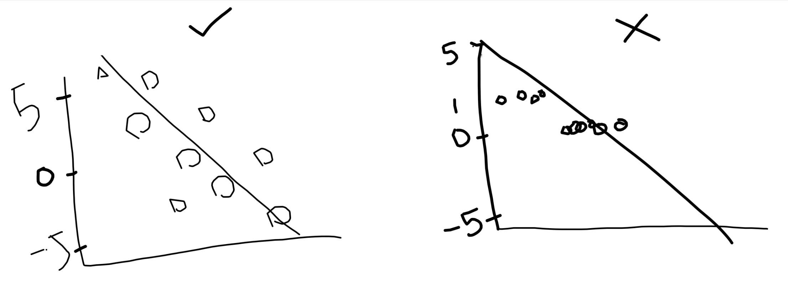
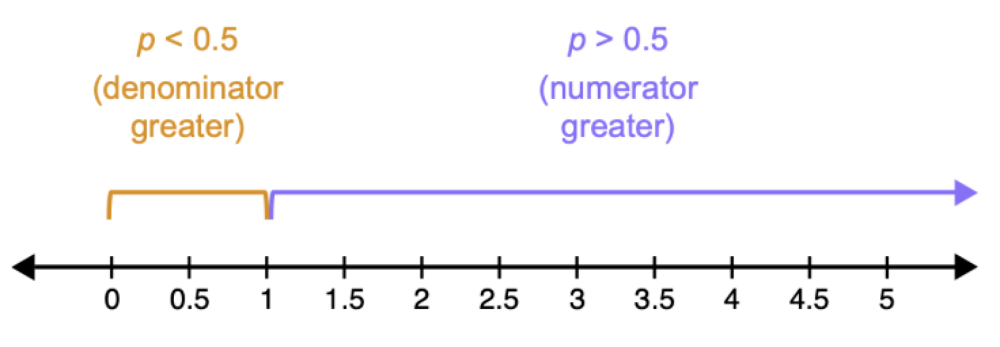
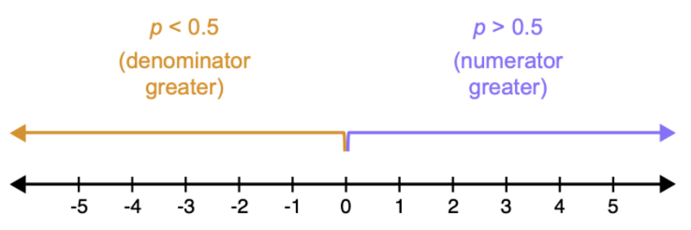
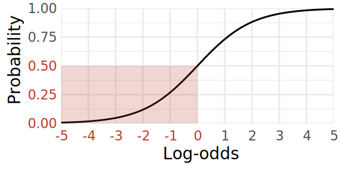
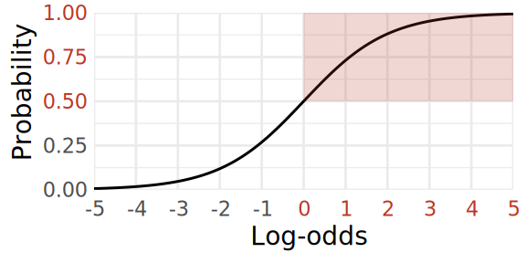
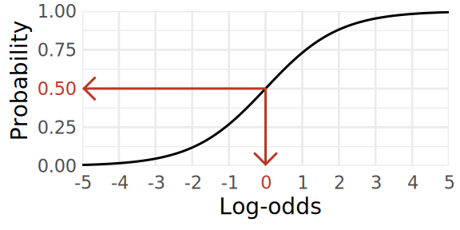
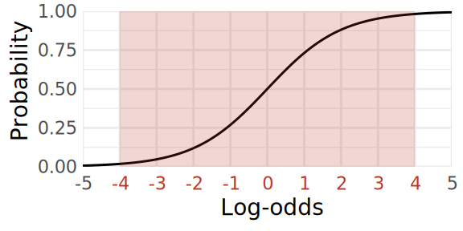

```{r}
#| label: setup
#| include: false

library(tidyverse)
library(emmeans)

dapr2red <- "#BF1932" 

theme_set(
  theme_minimal(
    base_size = 28
  )
)
```


# Course overview {background-color="white" style="font-size:80%;"}

<br>

:::: {.columns}

::: {.column width="50%"}

```{r echo = FALSE, results='asis', warning = FALSE}
block1_name = "Introduction to linear models <br>(with Dr. Patrick Sturt)"
block1_lecs = c("Introduction to linear regression",
                "Interpreting linear models",
                "Testing individual predictors",
                "Model testing and comparison",
                "Simple linear model: Practice analysis")
block2_name = "Extending linear models <br>(with Dr. Elizabeth Pankratz)"
block2_lecs = c("Categorical predictors and treatment coding",
                "Sum coding",
                "Assumptions and diagnostics",
                "Bootstrapping",
                "Categorical predictors: Practice analysis (led by Patrick)")

source("https://raw.githubusercontent.com/uoepsy/junk/main/R/course_table.R")

course_table(block1_name,block2_name,block1_lecs,block2_lecs,week = 0)
```

:::

::: {.column width="50%"}

```{r echo = FALSE, results='asis', warning = FALSE}
block3_name = "Interactions <br>(with Dr. Elizabeth Pankratz)"
block3_lecs = c("Mean-centering and numeric/categorical interactions",
                "Numeric/numeric interactions",
                "Categorical/categorical interactions",
                "Correcting for multiple comparisons",
                "Interactions: Practice analysis <br> (led by Patrick)")
block4_name = "Logistic regression <br>(with Dr. Elizabeth Pankratz)"
block4_lecs = c("Probabilities and log-odds",
                "TODO",
                "TODO",
                "Logistic regression: Practice analysis <br> (led by Patrick)",
                "Course Q&A and exam prep")

source("https://raw.githubusercontent.com/uoepsy/junk/main/R/course_table.R")

course_table(block3_name,block4_name,block3_lecs,block4_lecs,week = 6)
```

:::

::::


## This week's learning objectives

<br>

::::: {style="font-size: 125%;"}

::: {.dapr2callout}
x
:::

:::::

- What are binary outcomes?
- Why does standard linear regression fail when we try to model binary outcomes?
- What are log-odds and why are they useful?
- How do we convert probabilities into log-odds, and log-odds into probabilities?
- Why do *differences* between log-odds not map directly to differences between probabilities?


# What are binary outcomes?

## What are binary outcomes?

**Binary outcomes = the variable you're trying to predict has two levels.**

<br>

For example:

- heads/tails
- yes / no
- employed / unemployed
- anxiety / no anxiety
- failure / success

<br>

For the purposes of analysis, it's common to label one level of the binary outcome as a "success" and represent it numerically as 1.

The "success" outcome doesn't have to be the "good" outcome—it's just a label.

We'll consider the other outcome a "failure" (doesn't have to be the "bad" outcome) and represent it numerically as 0.

<br>

These labels are useful because when we start fitting models next week, **the model will estimate the probability of whichever outcome we label a "success" and represent numerically as 1.**


## What process could have generated binary outcome data?

We assume that there is **some probability $p$ of observing a success.**

<!-- We don't know this probability, so we want to **use the data to estimate it.** -->

<br>

**How can a probability generate binary outcomes?**

- Imagine flipping a coin. The possible outcomes are binary: either you get heads (H) or you get tails (T).
- Imagine flipping a fair coin, where the true probability of heads is $p$ = .5 (we'll call heads the "success").
- If you flip the coin 10 times, you might get the following 10 observations:

:::hcenter
**H  &nbsp; &nbsp; H  &nbsp; &nbsp; T  &nbsp; &nbsp; H  &nbsp; &nbsp; H  &nbsp; &nbsp; T  &nbsp; &nbsp; H  &nbsp; &nbsp; T  &nbsp; &nbsp; T  &nbsp; &nbsp; H**
:::

- Now imagine flipping a coin that is weighted, where the true probability of heads is $p$ = .9.
- This different probability will generate a different pattern of binary observations:

:::hcenter
**H  &nbsp; &nbsp; H  &nbsp; &nbsp; H  &nbsp; &nbsp; H  &nbsp; &nbsp; T  &nbsp; &nbsp; H  &nbsp; &nbsp; H  &nbsp; &nbsp; H  &nbsp; &nbsp; H  &nbsp; &nbsp; H**
:::


<!-- ## Modelling probabilities of successful outcomes -->

<!-- When we model binary outcome data, our goal is to: -->

<!-- - estimate what the probability of success will be (e.g., the probability of heads), and -->
<!-- - estimate how that probability of success might be impacted by some predictor variable(s) (e.g., the kind of coin you're using, whether fair or weighted). -->


## But: how can we model binary outcome data?

So far, we've been using linear models to model outcome data that's continuous and numeric.

But if we try to model probabilities with a standard linear model, we run into problems: they can't cope with bounded outcome data like probabilities.

- A line, in principle, goes on forever in a continuous space.
- But probabilities are bounded between 0 and 1.
- This means we can't fit a line to probabilities directly.




## The solution

The solution: **transform the probabilities into a continuous space and model the transformed version using a linear model.**

- The most common transformation is the **logit function**.
- "Logit" is shortened from "**log**istic un**it**".
- The logit function converts probabilities to units called **log-odds.**
- Log-odds are useful because they can range from $-\infty$ to $\infty$, so they offer a continuous space that a linear model can work with.


# What are log-odds?

## What are log-odds?

<br>

Let's actually start a bit smaller: **What are odds?**


## What are odds?

<br>

It's common to talk about "odds" in everyday language, but **"odds" also has a specific statistical definition:**

$$
\text{odds} = 
\frac{\text{probability of a thing happening}}{\text{probability of the thing not happening}} = 
\frac{p}{1 - p}
$$

<br>

For example, if the probability of rain tomorrow is $p$ = 0.7, then the odds of rain tomorrow are:

$$
\begin{align}
\text{odds}_\text{rain} &= \frac{p}{1 - p} \\[1em]
&= \frac{0.7}{1 - 0.7} \\[1em]
&= \frac{0.7}{0.3} \\[1em]
&= 2.333...
\end{align}
$$

## How odds map to probabilities

```{r}
#| code-fold: true

p_odds <- tibble(
  prob = seq(0, 0.9, length.out = 100),
  odds = prob/(1 - prob)
) |>
  ggplot(aes(x = prob, y = odds)) +
  geom_line() +
  labs(
    y = 'Odds',
    x = 'Probability',
    title = 'From probabilities to odds'
  ) +
  scale_x_continuous(limits = c(0, 1), expand = c(0, 0)) +
  scale_y_continuous(expand = c(0, 0))

p_odds
```


## How odds map to probabilities: Odds of rain

```{r}
#| code-fold: true

odds <- function(p){
  p/(1-p)
}

prob <- 0.7

p_odds +
  # horiz
  geom_segment( x = prob, xend = 0, y = odds(prob), yend = odds(prob), colour = dapr2red, arrow = arrow() ) +
  # vert
  geom_segment( x = prob,  xend = prob,  y = 0, yend = odds(prob), colour = dapr2red, arrow = arrow() ) +
  ggtitle('Prob of 70% = odds of 2.333...')
```


## Not quite continuous numeric yet, <br> because odds are still bounded on one side




## Logarithms to the rescue

The log function takes values between 0 and 1 (the bit that's still squished on the odds scale) and expands them to the range of any negative number between $-\infty$ and 0.

```{r}
#| code-fold: true

p_log <- tibble(
  x = seq(0.002, 2, length.out = 999),
  y = log(x)
) |>
  ggplot(aes(x = x, y = y)) +
  geom_line() +
  labs(
    title = 'log-odds = log(odds)',
    x = 'odds',
    y = 'log-odds'
  ) +
  scale_x_continuous(limits = c(0, 2), expand = c(0, 0)) +
  scale_y_continuous(limits = c(-6.22, 2), expand = c(0, 0)) +
  NULL

p_log
```


## Logarithms to the rescue

The log function takes values between 0 and 1 (the bit that's still squished on the odds scale) and expands them to the range of any negative number between $-\infty$ and 0.

```{r}
#| code-fold: true

odds <- 0.9

p_log +
  # horiz
  geom_segment( x = odds, xend = 0, y = log(odds), yend = log(odds), colour = dapr2red, arrow = arrow() ) +
  # vert
  geom_segment( x = odds,  xend = odds,  y = -6.22, yend = log(odds), colour = dapr2red, arrow = arrow() ) +
  ggtitle(paste0('Odds of ', odds, ' = log-odds of ', round(log(odds), 2) ))
```


## Logarithms to the rescue

The log function takes values between 0 and 1 (the bit that's still squished on the odds scale) and expands them to the range of any negative number between $-\infty$ and 0.

```{r}
#| code-fold: true

odds <- 0.5

p_log +
  # horiz
  geom_segment( x = odds, xend = 0, y = log(odds), yend = log(odds), colour = dapr2red, arrow = arrow() ) +
  # vert
  geom_segment( x = odds,  xend = odds,  y = -6.22, yend = log(odds), colour = dapr2red, arrow = arrow() ) +
  ggtitle(paste0('Odds of ', odds, ' = log-odds of ', round(log(odds), 2) ))
```


## Logarithms to the rescue

The log function takes values between 0 and 1 (the bit that's still squished on the odds scale) and expands them to the range of any negative number between $-\infty$ and 0.

```{r}
#| code-fold: true

odds <- 0.04

p_log +
  # horiz
  geom_segment( x = odds, xend = 0, y = log(odds), yend = log(odds), colour = dapr2red, arrow = arrow() ) +
  # vert
  geom_segment( x = odds,  xend = odds,  y = -6.22, yend = log(odds), colour = dapr2red, arrow = arrow() ) +
  ggtitle(paste0('Odds of ', odds, ' = log-odds of ', round(log(odds), 2) ))
```


## Log-odds (the log of the odds) are continuous and unbounded



<br>

**Take-home message:** log-odds are a transformed version of probabilities (bounded between 0 and 1) that is continuous (can range between $-\infty$ and $\infty$).


## Log-odds and probabilities are linked via the logistic function (hence "logistic regression")

```{r}
#| code-fold: true

p_logistic <- tibble(
  logodds = seq(-5, 5, length.out = 100),
  prob = plogis(logodds)
) |>
  ggplot(aes(x = logodds, y = prob)) +
  geom_line() +
  scale_x_continuous(expand = c(0, 0), breaks = -5:5) +
  scale_y_continuous(expand = c(0, 0), limits = c(0, 1)) +
  labs(
    y = 'Probability',
    x = 'Log-odds'
  ) +
  theme(
    panel.grid.minor.x = element_blank()
  )

p_logistic
```


# Moving between probability space and log-odds space

## From log-odds to probabilities: `plogis()`, <br> the logistic function (aka inverse logit function)

<br>

```{r}
plogis(-1)
```

```{r}
#| code-fold: true

logodds <- -1

p_logistic +
  # vert
  geom_segment( x = logodds, xend = logodds, yend = plogis(logodds), y = 0, colour = dapr2red, arrow = arrow() ) +
  # horiz
  geom_segment( x = logodds,  xend = -5,  y =  plogis(logodds),  yend =  plogis(logodds),  colour = dapr2red, arrow = arrow() ) +
  ggtitle(paste0( logodds, ' log-odds = ', 100 * round(plogis(logodds), 3), '% probability'))
```


## From log-odds to probabilities: `plogis()`, <br> the logistic function (aka inverse logit function)

<br>

```{r}
plogis(0)
```

```{r}
#| code-fold: true

logodds <- 0

p_logistic +
  # vert
  geom_segment( x = logodds, xend = logodds, yend = plogis(logodds), y = 0, colour = dapr2red, arrow = arrow() ) +
  # horiz
  geom_segment( x = logodds,  xend = -5,  y =  plogis(logodds),  yend =  plogis(logodds),  colour = dapr2red, arrow = arrow() ) +
  ggtitle(paste0( logodds, ' log-odds = ', 100 * round(plogis(logodds), 3), '% probability'))
```


## From log-odds to probabilities: `plogis()`, <br> the logistic function (aka inverse logit function)

<br>

```{r}
plogis(2)
```

```{r}
#| code-fold: true

logodds <- 2

p_logistic +
  # vert
  geom_segment( x = logodds, xend = logodds, yend = plogis(logodds), y = 0, colour = dapr2red, arrow = arrow() ) +
  # horiz
  geom_segment( x = logodds,  xend = -5,  y =  plogis(logodds),  yend =  plogis(logodds),  colour = dapr2red, arrow = arrow() ) +
  ggtitle(paste0( logodds, ' log-odds = ', 100 * round(plogis(logodds), 3), '% probability'))
```


## From probabilities to log-odds: `qlogis()`, <br> the logit function

<br>

```{r}
qlogis(0.3)
```

```{r}
#| code-fold: true

prob <- 0.3
p_logistic +
  # horiz
  geom_segment( x = -5, xend = qlogis(prob), y = prob, yend = prob, colour = dapr2red, arrow = arrow() ) +
  # vert
  geom_segment( x = qlogis(prob),  xend = qlogis(prob),  y = prob,  yend = 0,  colour = dapr2red, arrow = arrow() ) +
  ggtitle(paste0(prob*100, '% probability = ', round(qlogis(prob), 2), ' log-odds'))
```


## From probabilities to log-odds: `qlogis()`, <br> the logit function

<br>

```{r}
qlogis(0.5)
```

```{r}
#| code-fold: true

prob <- 0.5
p_logistic +
  # horiz
  geom_segment( x = -5, xend = qlogis(prob), y = prob, yend = prob, colour = dapr2red, arrow = arrow() ) +
  # vert
  geom_segment( x = qlogis(prob),  xend = qlogis(prob),  y = prob,  yend = 0,  colour = dapr2red, arrow = arrow() ) +
  ggtitle(paste0(prob*100, '% probability = ', round(qlogis(prob), 2), ' log-odds'))
```


## From probabilities to log-odds: `qlogis()`, <br> the logit function

<br>

```{r}
qlogis(0.7)
```

```{r}
#| code-fold: true

prob <- 0.7
p_logistic +
  # horiz
  geom_segment( x = -5, xend = qlogis(prob), y = prob, yend = prob, colour = dapr2red, arrow = arrow() ) +
  # vert
  geom_segment( x = qlogis(prob),  xend = qlogis(prob),  y = prob,  yend = 0,  colour = dapr2red, arrow = arrow() ) +
  ggtitle(paste0(prob*100, '% probability = ', round(qlogis(prob), 2), ' log-odds'))
```

```{r include=F, eval=F}
ggsave('figs/p_logistic.svg', p_logistic, width = 8, height = 4)
```


## Some rules of thumb for interpreting log-odds

::::{.columns}
:::{.column width="50%"}
**Log-odds below 0 = below 50% probability**
:::
:::{.column width="50%"}
**Log-odds above 0 = above 50% probability**
:::
::::

::::{.columns}
:::{.column width="50%"}
{fig-align="center" width="100%"}
:::
:::{.column width="50%"}
{fig-align="center" width="100%"}
:::
::::

::::{.columns}
:::{.column width="50%"}
**50% probability = 0 log-odds**
:::
:::{.column width="50%"}
**Although log-odds are infinite, most of the interesting stuff happens between –4 and 4, so expect values in that range**
:::
::::

::::{.columns}
:::{.column width="50%"}
{fig-align="center" width="100%"}
:::
:::{.column width="50%"}
{fig-align="center" width="100%"}
:::
::::


# What can and cannot be transformed from log-odds to probabilities

## What can and cannot be transformed <br> from log-odds to probabilities

<br>

✅
&nbsp;
**Can be transformed:** Standalone log-odds values.

<br>

:::hcenter
1 log-odd &nbsp; **IS EQUAL TO** &nbsp; `plogis(1)` = 73.1% probability
:::

<br>
<br>

❌
&nbsp;
**Cannot be transformed:** *Differences* between two log-odds values.

<br>

:::hcenter
a difference of 1 log-odd &nbsp; **IS NOT EQUAL TO** &nbsp; a difference of 73.1% probability
:::

<br>
<br>


**This is important because it impacts how we'll interpret logistic regression coefficients next week.**

<!-- <br> -->

<!-- Why are differences in log-odds not the same differences in probabilities? -->


## Why are differences in log-odds not the same as differences in probabilities?

<br>

<!-- TODO woo this? -->

**Thought experiment:**

- Imagine we've got two events A and B, and we know A is more probable than B.
- Specifically, we know the log-odds of A happening is 1 log-odd greater than the log-odds of B happening.
- In other words, **the difference between the two scenarios is 1 log-odd.**

<br>

**Scenario 1:**

- Imagine the log-odds of A happening are 1: `plogis(1)` = 73%.
- Then the log-odds of B happening are 0: `plogis(0)` = 50%.
- **The difference in probabilities that corresponds to a 1-log-odd difference is 23%.**

<br>

**Scenario 2:**

- Now imagine that the log-odds of A happening are 4: `plogis(4)` = 98%.
- Then the log-odds of B happening are 3: `plogis(3)` = 95%.
- **Now the difference in probabilities that corresponds to a 1-log-odd difference is just 3%.**


## Visualising the thought experiment

```{r fig.asp = 0.7}
#| code-fold: true
tibble(
  logodds = seq(-5, 5, length.out = 100),
  prob = plogis(logodds)
) |>
  ggplot(aes(x = logodds, y = prob)) +
  scale_y_continuous(expand = c(0, 0), limits = c(0, 1)) +
  scale_x_continuous(expand = c(0, 0), breaks = -4:4) +
  labs(x = 'Log-odds', y = 'Probability') +
  
  theme(
    panel.grid = element_blank(),
    panel.border = element_rect(linewidth = 1)
    ) +
  
  # horiz green
  geom_segment(x = 0, y = plogis(0), xend = -5, yend = plogis(0), colour = '#2B8654') +
  geom_segment(x = 1, y = plogis(1), xend = -5, yend = plogis(1), colour = '#2B8654') +
  geom_text(
    x = -4.8,
    y = 0.62,
    colour = '#2B8654',
    label = paste0('diff: ', 100*round(plogis(1)-plogis(0), 2), '%'),
    hjust = 0,
    size = 6
  ) +
  # vert green
  geom_segment(x = 0, y = 0, xend = 0, yend = plogis(0), colour = '#2B8654') +
  geom_segment(x = 1, y = 0, xend = 1, yend = plogis(1), colour = '#2B8654') +
  geom_text(
    x = 0.5,
    y = 0.15,
    colour = '#2B8654',
    label = paste0('diff:\n 1 log-\nodd'),
    size = 6
  ) +
  
  # horiz pink
  geom_segment(x = 3, y = plogis(3), xend = -5, yend = plogis(3), colour = '#FF6D9A') +
  geom_segment(x = 4, y = plogis(4), xend = -5, yend = plogis(4), colour = '#FF6D9A') +
  geom_text(
    x = -4.8,
    y = 0.91,
    colour = '#FF6D9A',
    label = paste0('^ diff: ', 100*round(plogis(4)-plogis(3), 2), '%'),
    hjust = 0,
    size = 6
  ) +
  # vert pink
  geom_segment(x = 3, y = 0, xend = 3, yend = plogis(3), colour = '#FF6D9A') +
  geom_segment(x = 4, y = 0, xend = 4, yend = plogis(4), colour = '#FF6D9A') +
  geom_text(
    x = 3.5,
    y = 0.15,
    colour = '#FF6D9A',
    label = paste0('diff:\n 1 log-\nodd'),
    size = 6
  ) +

  geom_line() +
  NULL
```


# How to visualise binary outcome data

## Example data: The marshmallow experiment

In the marshmallow experiment, a child is shown a marshmallow.
The child is told that they can take the marshmallow now, but if they wait, they can have two marshmallows later.

**We have data on 100 children's ages and whether they took the marshmallow immediately (0 = no, 1 = yes).**

<br>

::::{.columns}
:::{.column width="30%"}
{fig-align="left" width="100%"}

:::{style="font-size:70%;"}
image from pixabay
:::
:::
:::{.column width="10%"}
:::
:::{.column width="60%"}
```{r include=F}
mallow <- read_csv("https://uoepsy.github.io/data/mallow.csv")
mallow <- mallow |>
  mutate(
    agegroup = factor(
      ifelse(age < 6, 'below 6', '6 or older'),
      levels = c('below 6', '6 or older')
    ), .before = taken
  )
```

```{r}
mallow |> head(16)
```
:::
::::


## Binary outcome ~ continuous variable (1)

::::{.columns}
:::{.column width="52%"}

```{r eval=F}
mallow |>
  ggplot(aes(x = age, y = taken)) +
  geom_point()
```

:::
:::{.column width="48%"}

```{r echo=F, fig.width = 7, fig.height = 7}
mallow |>
  ggplot(aes(x = age, y = taken)) +
  geom_point()
```

:::
::::

## Binary outcome ~ continuous variable (2)

::::{.columns}
:::{.column width="52%"}

```{r eval=F}
mallow |>
  ggplot(aes(x = age, y = taken)) +
  
  # wiggle the points around a little bit 
  # so they don't all overlap
  geom_jitter(height = 0.01)
```

:::
:::{.column width="48%"}

```{r echo=F, fig.width = 7, fig.height = 7}
set.seed(1)

mallow |>
  ggplot(aes(x = age, y = taken)) +
  geom_jitter(height = 0.01) +
  
  NULL
```

:::
::::


## Binary outcome ~ continuous variable (3)

::::{.columns}
:::{.column width="52%"}

```{r eval=F}
mallow |>
  ggplot(aes(x = age, y = taken)) +
  
  # wiggle the points around a little bit 
  # so they don't all overlap
  geom_jitter(height = 0.01) +
  
  # label only 0 and 1 on the y axis
  scale_y_continuous(breaks = c(0, 1))
```

:::
:::{.column width="48%"}

```{r echo=F, fig.width = 7, fig.height = 7}
set.seed(1)

mallow |>
  ggplot(aes(x = age, y = taken)) +
  geom_jitter(height = 0.01) +
  scale_y_continuous(breaks = c(0, 1)) +
  NULL
```

:::
::::


## Binary outcome ~ continuous variable (4)

::::{.columns}
:::{.column width="52%"}

```{r eval=F}
mallow |>
  ggplot(aes(x = age, y = taken)) +
  
  # wiggle the points around a little bit 
  # so they don't all overlap
  geom_jitter(height = 0.01) +
  
  # label only 0 and 1 on the y axis
  scale_y_continuous(breaks = c(0, 1))

  # add curve of best fit
  geom_smooth(
    # glm = "generalised linear model"
    method = "glm",
    # binomial = outcomes are 0s and 1s
    method.args = list(family = binomial),
    # remove standard error ribbon 
    se = FALSE
  ) 
```

:::
:::{.column width="48%"}

```{r echo=F, fig.width = 7, fig.height = 7}
set.seed(1)

mallow |>
  ggplot(aes(x = age, y = taken)) +
  geom_jitter(height = 0.01) +
  scale_y_continuous(breaks = c(0, 1)) +
  geom_smooth(method = "glm", method.args = list(family = binomial), se = F) +
  NULL
```

:::
::::


## Binary outcome ~ continuous variable (5)

::::{.columns}
:::{.column width="52%"}

```{r eval=F}
mallow |>
  ggplot(aes(x = age, y = taken)) +
  
  # wiggle the points around a little bit 
  # so they don't all overlap
  geom_jitter(height = 0.01) +
  
  # label only 0 and 1 on the y axis
  scale_y_continuous(breaks = c(0, 1))

  # add curve of best fit
  geom_smooth(
    # glm = "generalised linear model"
    method = "glm",
    # binomial = outcomes are 0s and 1s
    method.args = list(family = binomial),
    # remove standard error ribbon 
    se = FALSE
  ) +
    
  # add axis labels for reader-friendliness
  labs(
    y = 'Took marshmallow immediately\n(0 = No, 1 = Yes)',
    x = 'Age (years)'
  )
```

:::
:::{.column width="48%"}

```{r echo=F, fig.width = 7, fig.height = 7}
set.seed(1)

mallow |>
  ggplot(aes(x = age, y = taken)) +
  geom_jitter(height = 0.01) +
  scale_y_continuous(breaks = c(0, 1)) +
  geom_smooth(method = "glm", method.args = list(family = binomial), se = F) +
  labs(
    y = 'Took marshmallow immediately\n(0 = No, 1 = Yes)',
    x = 'Age (years)'
  ) +
  NULL
```

:::
::::


## Binary outcome ~ categorical variable (1)

Plot the proportion of each outcome (`taken` = 0 or 1) in each level of the categorical variable `agegroup`.

::::{.columns}
:::{.column width="50%"}
```{r eval=F}
mallow |>
  ggplot(aes(
    x = factor(taken), 
    fill = agegroup)
  ) +
  geom_bar(position = 'fill')
```
:::
:::{.column width="50%"}
```{r echo=F, fig.width = 7, fig.height = 7}
mallow |>
  ggplot(aes(x = factor(taken), fill = agegroup)) +
  geom_bar(position = 'fill') +
  # labs(
  #   y = 'Proportion of children',
  #   x = 'Took marshmallow immediately (0 = No, 1 = Yes)',
  #   fill = 'Age group'
  # )
  NULL
```
:::
::::


## Binary outcome ~ categorical variable (2)

Plot the proportion of each outcome (`taken` = 0 or 1) in each level of the categorical variable `agegroup`.

::::{.columns}
:::{.column width="50%"}
```{r eval=F}
mallow |>
  ggplot(aes(
    x = factor(taken), 
    fill = agegroup)
  ) +
  geom_bar(position = 'fill') +
  
  # update labels ("count" is wrong!)
  labs(
    y = 'Proportion of children',
    x = 'Took marshmallow immediately\n(0 = No, 1 = Yes)',
    fill = 'Age group'
  )
```
:::
:::{.column width="50%"}
```{r echo=F, fig.width = 7, fig.height = 7}
mallow |>
  ggplot(aes(x = factor(taken), fill = agegroup)) +
  geom_bar(position = 'fill') +
  labs(
    y = 'Proportion of children',
    x = 'Took marshmallow immediately\n(0 = No, 1 = Yes)',
    fill = 'Age group'
  )
```
:::
::::


# Back matter

## Revisiting this week's learning objectives

TODO


## This week 

<br>

::::{.columns}
:::{.column width="50%"}
**Tasks:**

<br>

{width=80px style="margin:10px;margin-bottom:-50px"} Work on exercises in labs

<br>

{width=80px style="margin:10px;margin-bottom:-45px"} Complete the weekly quiz 


:::

:::{.column width="50%"}
**Get support:**

<br>

{width=80px style="margin:10px;margin-bottom:-30px"}
Consult the [flash cards](https://uoepsy.github.io/dapr2/2627/flashcards/){target="_blank"}

<br>

{width=80px style="margin:10px;margin-bottom:-50px"}
Ask questions anonymously on Piazza

<br>

{width=80px style="margin:10px;margin-bottom:-40px"} 
We really like seeing you in office hours!


:::
::::


