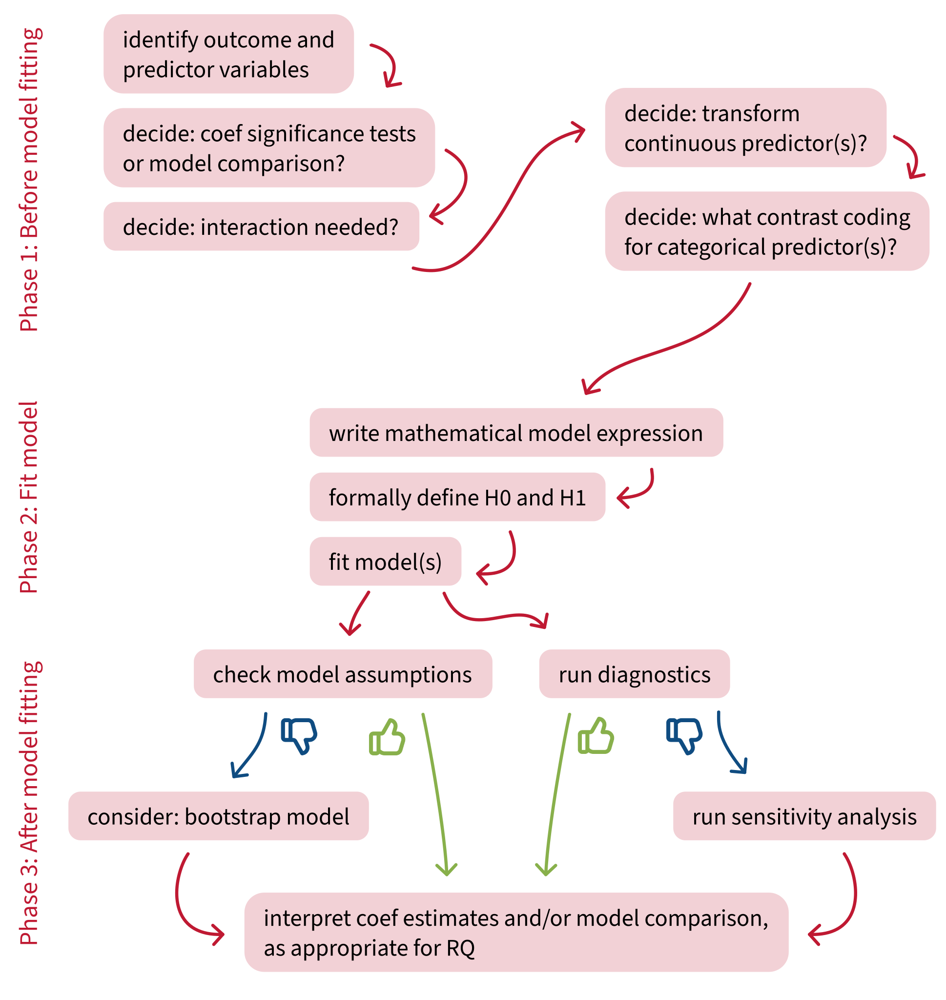
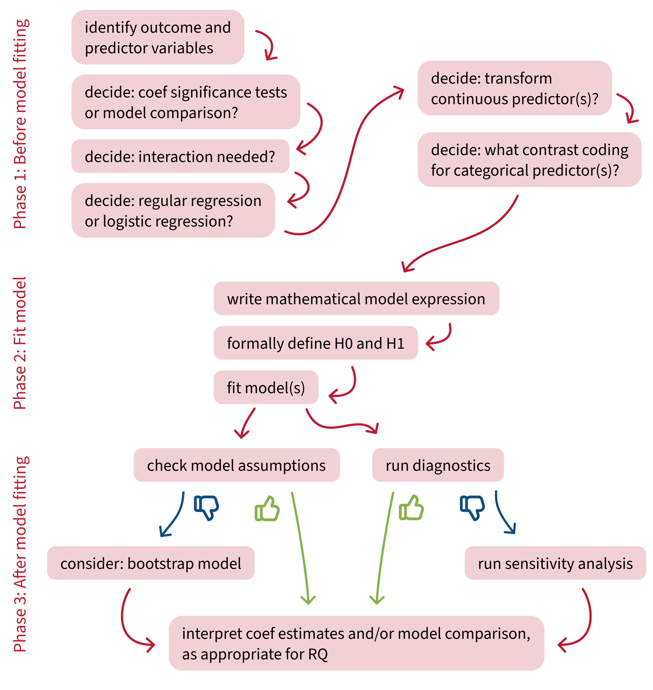

```{r}
#| label: setup
#| include: false

library(tidyverse)

source('../_theme/theme_quarto.R')

dapr2red <- "#BF1932" 
```


# Course overview {background-color="white" style="font-size:80%;"}

<br>

:::: {.columns}
::: {.column width="50%"}

```{r echo = FALSE, results='asis', warning = FALSE}
source('../dapr2_course_outline.R')
source("https://raw.githubusercontent.com/uoepsy/junk/main/R/course_table.R")
course_table(block1_name, block2_name, block1_lecs, block2_lecs, week = 0)
```

:::

::: {.column width="50%"}

```{r echo = FALSE, results='asis', warning = FALSE}
course_table(block3_name, block4_name, block3_lecs, block4_lecs, week = 7)
```

:::
::::


## This week's learning objectives

<br>

::::: {style="font-size: 125%;"}

::: {.dapr2callout}
In logistic regression models, what scale are coefficients estimated on (i.e., what units do the coefficients use)?
:::

::: {.dapr2callout .fragment}
How is interpreting coefficients different in logistic regression compared to standard linear regression?
:::

::: {.dapr2callout .fragment}
How do we use a fitted logistic regression model to predict the probability of "success" for a new data point?
:::

:::::


## Where we are in the analysis plan

{fig-align="center"}


## Where we are in the analysis plan {visibility="uncounted"}

{fig-align="center"}


# Modelling binary outcomes

## Example data: The marshmallow experiment

In the marshmallow experiment, a child is shown a marshmallow.
The child is told that they can take the marshmallow now, but if they wait, they can have two marshmallows later.

**We have data on 100 children's ages and whether they took the marshmallow immediately (0 = no, 1 = yes).**

<br>

::::{.columns}
:::{.column width="30%"}
{fig-align="left" width="100%"}

:::{style="font-size:70%;"}
image from pixabay
:::
:::
:::{.column width="10%"}
:::
:::{.column width="60%"}
```{r include=F}
mallow <- read_csv("https://uoepsy.github.io/data/mallow.csv")
mallow <- mallow |>
  mutate(
    agegroup = factor(
      ifelse(age < 6, 'below 6', '6+'),
      levels = c('below 6', '6+')
    ), .before = taken
  )
```

```{r}
mallow |> head(16)
```
:::
::::


# Example 1: <br> Numeric predictor

## Example 1: Numeric predictor

```{r fig.height = 8, fig.width = 12, fig.align = "center"}
#| code-fold: true

mallow |>
  ggplot(aes(x = age, y = taken)) +
  geom_jitter(height = 0.01, size = 3) +
  scale_y_continuous(breaks = c(0, 1)) +
  geom_smooth(method = "glm", method.args = list(family = binomial), se = F, linewidth = 2) +
  labs(
    y = 'Took marshmallow immediately\n(0 = No, 1 = Yes)',
    x = 'Age (years)'
  ) +
  NULL
```


## Specify the model: <br> Mathematical model formulation

Recall the model formulation for a standard (not logistic) linear model:


$$
y = \beta_0 + (\beta_1 \cdot x) + \epsilon
$$

<br>

In logistic regression, the main new bit appears on the left: we're now modelling the **log-odds of children taking the marshmallow immediately** as a function of age.


$$
\text{logodds(taken)} = \beta_0 + (\beta_1 \cdot \text{age})
$$


The right-hand side has the same structure as always (without the $\epsilon$ error term, for technical reasons to do with how logistic regression models are estimated—you don't need to worry about that).

<br>

**Bonus, if you feel inspired:** You can also define the "logodds" function more explicitly:

$$
\log \Big( \frac{p(\text{taken})}{1 - p(\text{taken})} \Big)
 = \beta_0 + (\beta_1 \cdot \text{age})
$$


## Specify the model: In R

<br>

```{r}
mallow_m1 <- glm(                        # new: use glm() instead of lm()
      
  taken ~ age,                           # define model formula as usual
      
  data = mallow,                         # define data as usual
      
  family = binomial(link = 'logit')      # new: define the type of outcome 
                                         # (0s and 1s = "binomial")
                                         # and the link function we want to use
                                         # ("logit" = inverse logistic function,
                                         # converts probabilities to log-odds)
)
```


## Logistic regression model summary

```{r}
summary(mallow_m1)
```

<br>

```{r}
confint(mallow_m1)
```

<!-- <br> -->

<!-- - **Interpreting model coefficients &nbsp; ← today** -->
<!-- - Interpreting the "null deviance"/"residual deviance" bits &nbsp; ← next week -->
<!-- - The rest: don't worry about it! -->


## Interpreting logistic regression coefficients (1)

::::{.columns}
:::{.column width="50%"}

```{r fig.width = 7, fig.height = 7}
#| code-fold: true

effects::effect(term = "age",  mod = mallow_m1, xlevels = list(age = 0:10)) |>
  as.data.frame(type = 'link') |>
  ggplot(aes(x = age, y = fit)) +
  geom_line(linewidth = 2) +
  geom_ribbon(aes(ymin = lower, ymax = upper), alpha = .3) +
  labs(
    y = 'Log-odds of taking\nthe marshmallow immediately',
    x = 'Age (years)'
  ) +
  scale_x_continuous(breaks = seq(0, 10, 2))
```

:::{style="font-size:75%;"}
```{r echo = F}
cat(paste0(capture.output(
  summary(mallow_m1)
), '\n')[6:9])
```

**All of these estimates ^ are in log-odds units.**
:::


:::
:::{.column width="5%"}

:::
:::{.column width="45%"}

**`(Intercept)`:**

- **For a child aged 0 years, the estimated log-odds of taking the marshmallow immediately are 3.76.**
  - To ease interpretation, we can back-transform the intercept to probability space:
    - For a child aged 0 years, the probability of taking the marshmallow immediately is `plogis(3.76)` = 97.7%.
- **This estimate is significantly different from zero ($p$ < 0.001).**
  - Why are we interpreting the significance of the intercept now, when we never did before?
  - Because on the log-odds scale, being different from zero is actually interesting! 
  - `plogis(0)` = 50% probability = <br> random chance.
  - So being different from zero means **being different from chance.**
  

:::
::::


## Interpreting logistic regression coefficients (2)

::::{.columns}
:::{.column width="50%"}

```{r fig.width = 7, fig.height = 7}
#| code-fold: true

effects::Effect(focal.predictors = "age",  mod = mallow_m1, xlevels = list(age = 0:10)) |>
  as.data.frame(type = 'link') |>
  ggplot(aes(x = age, y = fit)) +
  geom_line(linewidth = 2) +
  geom_ribbon(aes(ymin = lower, ymax = upper), alpha = .3) +
  labs(
    y = 'Log-odds of taking\nthe marshmallow immediately',
    x = 'Age (years)'
  ) +
  scale_x_continuous(breaks = seq(0, 10, 2))
```

:::{style="font-size:75%;"}
```{r echo = F}
cat(paste0(capture.output(
  summary(mallow_m1)
), '\n')[6:9])
```

**All of these estimates ^ are in log-odds units.**
:::


:::
:::{.column width="5%"}

:::
:::{.column width="45%"}

**`age`:**

- **Increasing age by 1 year is associated with a decrease of 0.63 in the log-odds of taking the marshmallow immediately.**
  - We *cannot* back-transform the slope to probability space.
  - Slopes are differences in log-odds, and recall from last week that a given difference in log-odds space can map to lots of various differences in probability space:
  
```{r echo = F, fig.width = 7, fig.height = 3.5, fig.align="right"}
tibble(
  logodds = seq(-5, 5, length.out = 100),
  prob = plogis(logodds)
) |>
  ggplot(aes(x = logodds, y = prob)) +
  scale_y_continuous(expand = c(0, 0), limits = c(0, 1)) +
  scale_x_continuous(expand = c(0, 0), breaks = -4:4) +
  labs(x = 'Log-odds', y = 'Probability') +
  
  theme(
    panel.grid = element_blank(),
    panel.border = element_rect(linewidth = 1),
    plot.margin = margin(t = 10)
    ) +
  
  # horiz green
  geom_segment(x = 0, y = plogis(0), xend = -5, yend = plogis(0), colour = '#2B8654', linewidth=1.5) +
  geom_segment(x = 1, y = plogis(1), xend = -5, yend = plogis(1), colour = '#2B8654', linewidth=1.5) +

  # vert green
  geom_segment(x = 0, y = 0, xend = 0, yend = plogis(0), colour = '#2B8654', linewidth=1.5) +
  geom_segment(x = 1, y = 0, xend = 1, yend = plogis(1), colour = '#2B8654', linewidth=1.5) +
  
  # horiz pink
  geom_segment(x = 3, y = plogis(3), xend = -5, yend = plogis(3), colour = '#FF6D9A', linewidth=1.5) +
  geom_segment(x = 4, y = plogis(4), xend = -5, yend = plogis(4), colour = '#FF6D9A', linewidth=1.5) +

  # vert pink
  geom_segment(x = 3, y = 0, xend = 3, yend = plogis(3), colour = '#FF6D9A', linewidth=1.5) +
  geom_segment(x = 4, y = 0, xend = 4, yend = plogis(4), colour = '#FF6D9A', linewidth=1.5) +

  geom_line() +
  NULL
```
  
- **This estimate is significantly different from zero ($p$ < 0.001).**

:::
::::


## Predicting the probability of different ages taking the marshmallow: By hand

Like always, we can use logistic regression models to predict outcome data for any predictor values we choose.

We start with the linear expression, with coefficients substituted in:

$$
\text{logodds(taken)} = 3.764 + (–0.625 \cdot \text{age})
$$

**Let's predict the probability of a child who's 6 years old taking the marshmallow immediately.**

<br>

First, we'll work out the log-odds of a six-year-old taking the marshmallow immediately.

\begin{align}
\text{logodds(taken)}_\text{age=6} &= 3.764 + (–0.625 \cdot 6) \\
  &= 3.764 - 3.75 \\
  &= 0.014 \\

\end{align}

<br>

Now we can transform this model-predicted log-odds value into probability space using `plogis()`. <br>
(You'll never be expected to do this transformation by hand!)

```{r}
plogis(0.014)
```

**A six-year-old has an estimated probability of taking the marshmallow immediately of 50.3%.**


## Predicting the probability of different ages taking the marshmallow: With `predict()`

All we need to give our old friend `predict()` is a dataframe that specifies the values of our predictor that we want it to make predictions for.

```{r}
ages_to_predict = tibble(age = c(2, 6, 20))

predict(
  mallow_m1,
  type = 'response',  # 'response' means 'show values in probability space'
  newdata = ages_to_predict
)
```

- A 2-year-old has a 92.5% probability of taking the marshmallow immediately.
- A 6-year-old has a 50.4% probability of taking the marshmallow immediately.
- A 20-year-old has a near-0% probability of taking the marshmallow immediately.

<br>

(We can also ask `predict()` to show us the log-odds version with `type = 'link'`.)

```{r}
predict(mallow_m1, type = 'link', newdata = ages_to_predict)
```


## Plotting model-fitted values: Log-odds (1)

The `Effect()` function from the `effects` library will help us here!

```{r}
library(effects)

Effect(
  focal.predictors = 'age',  # the predictor we want on the x axis
  mod = mallow_m1,  # the name of the fitted model
  xlevels = 20      # return log-odds for 20 evenly-spaced `age` values
) |>
  as.data.frame(type = 'link') |> # return values transformed by link function 
                                  # (i.e., in log-odds)
  head(10)
```


## Plotting model-fitted values: Log-odds (2)

::::{.columns}
:::{.column width="50%"}
```{r eval=F}
Effect(focal.predictors = 'age', mod = mallow_m1, xlevels = 20) |>
  as.data.frame(type = 'link') |>
  ggplot(aes(x = age, y = fit)) +
  
  # a line for the model-fitted estimates
  geom_line()
```
:::
:::{.column width="50%"}
```{r echo=F, fig.width = 7, fig.height = 7}
Effect(
  focal.predictors = 'age', mod = mallow_m1, xlevels = 20) |>
  as.data.frame(type = 'link') |>
  ggplot(aes(x = age, y = fit)) +
  geom_line(linewidth=2) +
  # geom_ribbon(aes(ymin = lower, ymax = upper), alpha = .3) +
  # labs(
  #   y = 'Log-odds of taking\nthe marshmallow immediately',
  #   x = 'Age (years)'
  # ) +
  NULL
```
:::
::::


## Plotting model-fitted values: Log-odds (3)

::::{.columns}
:::{.column width="50%"}
```{r eval=F}
Effect(focal.predictors = 'age', mod = mallow_m1, xlevels = 20) |>
  as.data.frame(type = 'link') |>
  ggplot(aes(x = age, y = fit)) +
  
  # a line for the model-fitted estimates
  geom_line() +

  # a ribbon for the 95% CIs
  geom_ribbon(
    aes(
      ymin = lower, 
      ymax = upper
    ), 
    alpha = .3
  )

```
:::
:::{.column width="50%"}
```{r echo=F, fig.width = 7, fig.height = 7}
Effect(
  focal.predictors = 'age', mod = mallow_m1, xlevels = 20) |>
  as.data.frame(type = 'link') |>
  ggplot(aes(x = age, y = fit)) +
  geom_line(linewidth=2) +
  geom_ribbon(aes(ymin = lower, ymax = upper), alpha = .3) +
  # labs(
  #   y = 'Log-odds of taking\nthe marshmallow immediately',
  #   x = 'Age (years)'
  # ) +
  NULL
```

:::
::::


## Plotting model-fitted values: Log-odds (4)

::::{.columns}
:::{.column width="50%"}
```{r eval=F}
Effect(focal.predictors = 'age', mod = mallow_m1, xlevels = 20) |>
  as.data.frame(type = 'link') |>
  ggplot(aes(x = age, y = fit)) +
  
  # a line for the model-fitted estimates
  geom_line() +

  # a ribbon for the 95% CIs
  geom_ribbon(
    aes(
      ymin = lower, 
      ymax = upper
    ), 
    alpha = .3
  ) +

  # axis labels for clarity
  labs(
    y = 'Log-odds of taking\nthe marshmallow immediately',
    x = 'Age (years)'
  ) 
```
:::
:::{.column width="50%"}
```{r echo=F, fig.width = 7, fig.height = 7}
Effect(
  focal.predictors = 'age', mod = mallow_m1, xlevels = 20) |>
  as.data.frame(type = 'link') |>
  ggplot(aes(x = age, y = fit)) +
  geom_line(linewidth=2) +
  geom_ribbon(aes(ymin = lower, ymax = upper), alpha = .3) +
  labs(
    y = 'Log-odds of taking\nthe marshmallow immediately',
    x = 'Age (years)'
  ) +
  NULL
```

:::
::::


<br>

Plots in log-odds space show us what our model has estimated.

But for reporting our results to other humans, we should make plots in probability space instead.


## Plotting model-fitted values: <br> In probability space (1)

The process is exactly the same, except instead of `as.data.frame(type = 'link')`, we just write `as.data.frame()`.

```{r}
Effect(
  focal.predictors = 'age',  # the predictor we want on the x axis
  mod = mallow_m1,    # the name of the fitted model
  xlevels = 20        # return log-odds for 20 evenly-spaced `age` values
) |>
  as.data.frame() |>  # return values in outcome space, 
                      # not transformed by link function 
  head(10)
```


## Plotting model-fitted values: <br> In probability space (2)

::::{.columns}
:::{.column width="50%"}
```{r eval=F}
Effect(
  focal.predictors = 'age', mod = mallow_m1, xlevels = 20) |>
  as.data.frame() |>
  ggplot(aes(x = age, y = fit)) +
  
  # a line for the model-fitted estimates
  geom_line() +

  # a ribbon for the 95% CIs
  geom_ribbon(
    aes(
      ymin = lower, 
      ymax = upper
    ), 
    alpha = .3
  ) +

  # axis labels for clarity
  labs(
    y = 'Probability of taking\nthe marshmallow immediately',
    x = 'Age (years)'
  ) 
```
:::
:::{.column width="50%"}
```{r echo=F, fig.width = 7, fig.height = 7}
Effect(
  focal.predictors = 'age', mod = mallow_m1, xlevels = 20) |>
  as.data.frame() |>
  ggplot(aes(x = age, y = fit)) +
  geom_line(linewidth=2) +
  geom_ribbon(aes(ymin = lower, ymax = upper), alpha = .3) +
  labs(
    y = 'Probability of taking\nthe marshmallow immediately',
    x = 'Age (years)'
  ) +
  NULL
```

:::
::::


Because most people find probabilities more intuitive than log-odds, this is the version of the plot that you'd want to include in a Results section.


# Example 2: <br> Categorical predictor <br> (you'll help me out this time)

## Example 2: Categorical predictor

```{r fig.width = 8, fig.height = 8, fig.align = "center"}
#| code-fold: true

mallow |>
  ggplot(aes(x = factor(taken), fill = agegroup)) +
  geom_bar(position = 'fill') +
  labs(
    y = 'Proportion of children',
    x = 'Took marshmallow immediately\n(0 = No, 1 = Yes)',
    fill = 'Age group'
  )
```


## Specify the model: <br> Mathematical model formulation

Our categorical predictor `agegroup` will be treatment-coded:

```{r}
contrasts(mallow$agegroup)
```

<br>

Therefore we can write the `agegroup` predictor as:

$$
\text{logodds(taken)} = \beta_0 + (\beta_1 \cdot \text{agegroup}_{6+})
$$

<br>

**Prediction activity: What will the two model coefficients mean?**

woo!


## Specify the model: In R

<br>

```{r}
mallow_m2 <- glm(                        # use glm() instead of lm()
      
  taken ~ agegroup,                      # define model formula as usual
      
  data = mallow,                         # define data as usual
      
  family = binomial(link = 'logit')      # define the type of outcome 
                                         # and the link function we want to use
)
```


## Logistic regression model summary

```{r}
summary(mallow_m2)
```

<br>

```{r}
confint(mallow_m2)
```


## Interpret coefficients


::::{.columns}
:::{.column width="50%"}

```{r fig.width = 7, fig.height = 7}
#| code-fold: true

Effect(focal.predictors = 'agegroup', mod = mallow_m2) |>
  as.data.frame(type = 'link') |>
  ggplot(aes(x = agegroup, y = fit)) +
  geom_point(size=5) +
  geom_errorbar(aes(ymin = lower, ymax = upper), width = 0, linewidth=2) +
  labs(
    y = 'Log-odds of taking\nthe marshmallow immediately',
    x = 'Age group'
  ) 
```

:::{style="font-size:80%;"}
```{r echo = F}
cat(paste0(capture.output(
  summary(mallow_m2)
), '\n')[6:9])
```

**All of these estimates ^ are in log-odds units.**
:::

:::
:::{.column width="5%"}

:::
:::{.column width="45%"}

**`(Intercept)`:**

- For children below the age of 6 (the reference level), the estimated log-odds of taking the marshmallow immediately are 0.94. Equivalently, the estimated probability of taking the marshmallow immediately is `plogis(0.94)` = 71.9%.
- This estimate is significantly different from zero ($p$ = 0.003).

<br>

**`agegroup6+`:**

- Moving from children younger than 6 to children aged 6 and above, the log-odds of taking the marshmallow immediately are estimated to decrease by 1.99.
- This estimate is significantly different from zero ($p$ < 0.001).


:::
::::


## Predicting the probability of each age group taking the marshmallow: By hand

Substituting the model-estimated coefficients into the linear expression:

$$
\text{logodds(taken)} = 0.944 + (-1.99 \cdot \text{agegroup}_{6+})
$$

<br>

::::{.columns}
:::{.column width="50%"}
**For children younger than 6 (`agegroup = 0`):**

$$
\begin{align}
\text{logodds(taken)}_{\text{agegroup = 0}} &= 0.944 + (-1.99 \cdot 0) \\
  &= 0.944 \\
\end{align}
$$

<br>
<br>

```{r}
plogis(0.944)
```

<br>

Children younger than six have an estimated 72% probability of taking the marshmallow immediately.

:::
:::{.column width="50%"}
**For children 6 or older (`agegroup = 1`):**


$$
\begin{align}
\text{logodds(taken)}_{\text{agegroup = 1}} &= 0.944 + (-1.99 \cdot 1) \\
  &= 0.944 - 1.99 \\
  &= -1.05 \\
\end{align}
$$

<br>

```{r}
plogis(-1.05)
```

<br>

Children six or older have an estimated 25.9% probability of taking the marshmallow immediately.

:::
::::

It's often nice to present probabilities like this to help the reader really understand what your model predicts.


## Predicting the probability of each age group taking the marshmallow: With `predict()`

We'll define a data frame that contains the two levels of `agegroup` and give it to `predict()`.

<br>

```{r}
agegroups_to_predict = tibble(
  agegroup = levels(mallow$agegroup)   # "below 6" and "6+"
)

predict(
  mallow_m2,
  type = 'response',  # show values in probability space
  newdata = agegroups_to_predict
)
```

<br>

- Children below 6 have an estimated probability of 72% to take the marshmallow immediately.
- Children 6 or older have an estimated probability of 26% to take the marshmallow immediately.


## Plot model-fitted values: Log-odds (1)

Again, we'll use `effects::Effect()`, with `as.data.frame(type = 'link')` so that it gives us values on the log-odds scale (the model scale), rather than the probability scale (the outcome scale).

<br>

```{r}
Effect(
  focal.predictors = 'agegroup',  # the predictor we want on the x axis
  mod = mallow_m2  # the name of the fitted model
) |>
  as.data.frame(type = 'link')
```


## Plot model-fitted values: Log-odds (2)

::::{.columns}
:::{.column width="50%"}

```{r eval=F}
Effect(focal.predictors = 'agegroup', mod = mallow_m2) |>
  as.data.frame(type = 'link') |>
  ggplot(aes(x = agegroup, y = fit)) +
  
  # points for the group mean estimates
  geom_point()
```

:::
:::{.column width="50%"}
```{r echo=F, fig.width = 7, fig.height = 7}
Effect(
  focal.predictors = 'agegroup',  # the predictor we want on the x axis
  mod = mallow_m2     # the name of the fitted model
) |>
  as.data.frame(type = 'link') |>
  ggplot(aes(x = agegroup, y = fit)) +
  geom_point(size=5) +
  # geom_errorbar(aes(ymin = lower, ymax = upper), width = 0) +
  # labs(
  #   y = 'Log-odds of taking\nthe marshmallow immediately',
  #   x = 'Age group'
  # ) +
  NULL
```
:::
::::


## Plot model-fitted values: Log-odds (3)

::::{.columns}
:::{.column width="50%"}

```{r eval=F}
Effect(focal.predictors = 'agegroup', mod = mallow_m2) |>
  as.data.frame(type = 'link') |>
  ggplot(aes(x = agegroup, y = fit)) +
  
  # points for the group mean estimates
  geom_point() +

  # error bars for the 95% CIs
  geom_errorbar(
    aes(
      ymin = lower, 
      ymax = upper), 
    width = 0
  )
```

:::
:::{.column width="50%"}
```{r echo=F, fig.width = 7, fig.height = 7}
Effect(
  focal.predictors = 'agegroup',  # the predictor we want on the x axis
  mod = mallow_m2     # the name of the fitted model
) |>
  as.data.frame(type = 'link') |>
  ggplot(aes(x = agegroup, y = fit)) +
  geom_point(size=5) +
  geom_errorbar(aes(ymin = lower, ymax = upper), width = 0, linewidth=2) +
  # labs(
  #   y = 'Log-odds of taking\nthe marshmallow immediately',
  #   x = 'Age group'
  # ) +
  NULL
```
:::
::::


## Plot model-fitted values: Log-odds (4)

::::{.columns}
:::{.column width="50%"}

```{r eval=F}
Effect(focal.predictors = 'agegroup', mod = mallow_m2) |>
  as.data.frame(type = 'link') |>
  ggplot(aes(x = agegroup, y = fit)) +
  
  # points for the group mean estimates
  geom_point() +

  # error bars for the 95% CIs
  geom_errorbar(
    aes(
      ymin = lower, 
      ymax = upper), 
    width = 0
  ) +
    
  # axis labels for clarity
  labs(
    y = 'Log-odds of taking\nthe marshmallow immediately',
    x = 'Age group'
  ) 
```

:::
:::{.column width="50%"}
```{r echo=F, fig.width = 7, fig.height = 7}
Effect(
  focal.predictors = 'agegroup',  # the predictor we want on the x axis
  mod = mallow_m2     # the name of the fitted model
) |>
  as.data.frame(type = 'link') |>
  ggplot(aes(x = agegroup, y = fit)) +
  geom_point(size=5) +
  geom_errorbar(aes(ymin = lower, ymax = upper), width = 0, linewidth=2) +
  labs(
    y = 'Log-odds of taking\nthe marshmallow immediately',
    x = 'Age group'
  ) +
  NULL
```
:::
::::


## Plot model-fitted values: Probabilities

Exact same code except `as.data.frame()` does not contain `type = 'link'`!

<br>

::::{.columns}
:::{.column width="50%"}
```{r eval=F}
Effect(focal.predictors = 'agegroup', mod = mallow_m2) |>
  as.data.frame() |>
  ggplot(aes(x = age, y = fit)) +
  
  # points for the group mean estimates
  geom_point() +

  # error bars for the 95% CIs
  geom_errorbar(
    aes(
      ymin = lower, 
      ymax = upper), 
    width = 0
  ) +

  # axis labels for clarity
  labs(
    y = 'Probability of taking\nthe marshmallow immediately',
    x = 'Age group'
  ) +
  
  # expand y axis to range between 
  # 0 and 1
  ylim(0, 1)
```
:::
:::{.column width="50%"}
```{r echo=F, fig.width = 7, fig.height = 7}
Effect(focal.predictors = 'agegroup', mod = mallow_m2) |>
  as.data.frame() |>
  ggplot(aes(x = agegroup, y = fit)) +
  geom_point(size=5) +
  geom_errorbar(aes(ymin = lower, ymax = upper), width = 0, linewidth=2) +
  labs(
    y = 'Probability of taking\nthe marshmallow immediately',
    x = 'Age group'
  ) +
  ylim(0, 1)
```

:::
::::


# Back matter

## Revisiting this week's learning objectives

::: {.dapr2callout}
**In logistic regression models, what scale are coefficients estimated on (i.e., what units do the coefficients use)?**

- All coeficients are estimated on the log-odds scale.
- The intercept is the estimated mean log-odds of success when all predictors = 0.
- A slope is a change in the log-odds of success when a predictor moves from 0 to 1, holding other predictors constant (if multiple regression)/with other predictors equal to zero (if interaction).

:::

::: {.dapr2callout}
**How is interpreting coefficients different in logistic regression compared to standard linear regression?**

- It's not! Everything you learned about interpreting coefficients this year is the same.
- The only difference is that the outcome variable is the log-odds of success, not "test score" or "wellbeing" etc.
:::

::: {.dapr2callout}
**How do we use a fitted logistic regression model to predict the probability of "success" for a new data point?**

- Also same as always, but with one extra transformation step at the end.
- Substitute coefficients estimated by the model into the linear expression.
- Substitute whatever predictor values we want to make predictions for.
- Do the maths to get a single model-predicted value.
- The only new thing: That model-predicted value is in log-odds space, so use `plogis()` to transform it into a probability.
  
:::

## This week 

<br>

::::{.columns}
:::{.column width="50%"}
**Tasks:**

<br>

{width=80px style="margin:10px;margin-bottom:-50px"} Work on exercises in labs

<br>

{width=80px style="margin:10px;margin-bottom:-45px"} Complete the weekly quiz 


:::

:::{.column width="50%"}
**Get support:**

<br>

{width=80px style="margin:10px;margin-bottom:-30px"}
Consult the [flash cards](https://uoepsy.github.io/dapr2/2627/flashcards/){target="_blank"}

<br>

{width=80px style="margin:10px;margin-bottom:-50px"}
Ask questions anonymously on Piazza

<br>

{width=80px style="margin:10px;margin-bottom:-40px"} 
We really like seeing you in office hours!


:::
::::


