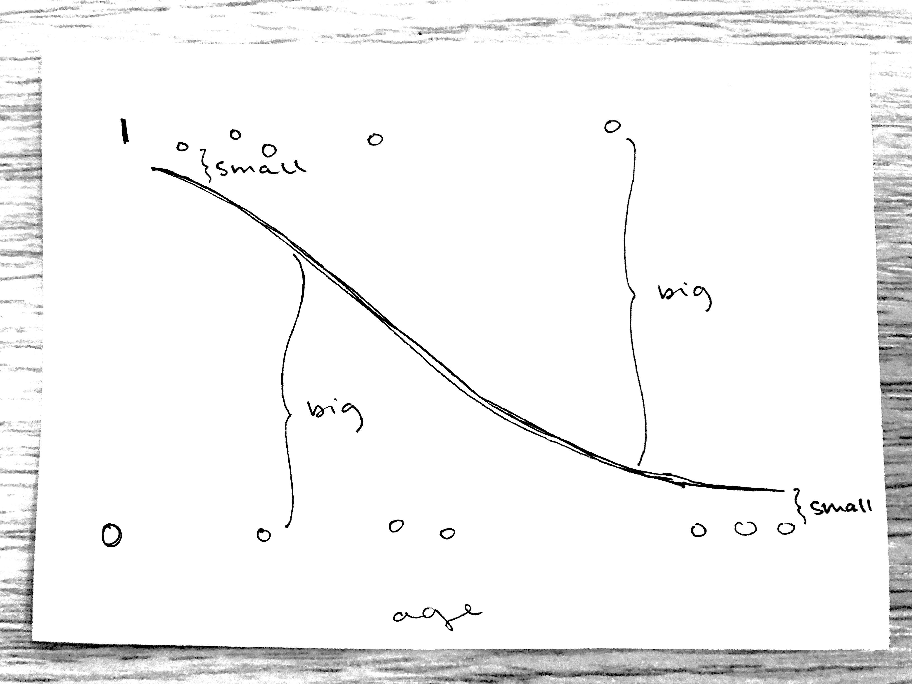

```{r}
#| label: setup
#| include: false

library(tidyverse)
library(effects)

dapr2red <- "#BF1932" 

theme_set(
  theme_minimal(
    base_size = 28
  )
)
```


# Course overview {background-color="white" style="font-size:80%;"}

<br>

:::: {.columns}

::: {.column width="50%"}

```{r echo = FALSE, results='asis', warning = FALSE}
block1_name = "Introduction to linear models <br>(with Dr. Patrick Sturt)"
block1_lecs = c("Introduction to linear regression",
                "Interpreting linear models",
                "Testing individual predictors",
                "Model testing and comparison",
                "Simple linear model: Practice analysis")
block2_name = "Extending linear models <br>(with Dr. Elizabeth Pankratz)"
block2_lecs = c("Categorical predictors and treatment coding",
                "Sum coding",
                "Assumptions and diagnostics",
                "Bootstrapping",
                "Categorical predictors: Practice analysis (led by Patrick)")

source("https://raw.githubusercontent.com/uoepsy/junk/main/R/course_table.R")

course_table(block1_name,block2_name,block1_lecs,block2_lecs,week = 0)
```

:::

::: {.column width="50%"}

```{r echo = FALSE, results='asis', warning = FALSE}
block3_name = "Interactions <br>(with Dr. Elizabeth Pankratz)"
block3_lecs = c("Mean-centering and numeric/categorical interactions",
                "Numeric/numeric interactions",
                "Categorical/categorical interactions",
                "Correcting for multiple comparisons",
                "Interactions: Practice analysis <br> (led by Patrick)")
block4_name = "Logistic regression <br>(with Dr. Elizabeth Pankratz)"
block4_lecs = c("Probabilities and log-odds",
                "Modelling binary outcomes with logistic regression",
                "TODO",
                "Logistic regression: Practice analysis <br> (led by Patrick)",
                "Course Q&A and exam prep")

source("https://raw.githubusercontent.com/uoepsy/junk/main/R/course_table.R")

course_table(block3_name,block4_name,block3_lecs,block4_lecs,week = 7)
```

:::

::::


## This week's learning objectives

<br>

::::: {style="font-size: 125%;"}

::: {.dapr2callout}
x
:::

:::::


# Running example: Marshmallow experiment

## Running example: Marshmallow experiment

In the marshmallow experiment, a child is shown a marshmallow.
The child is told that they can take the marshmallow now, but if they wait, they can have two marshmallows later.

**We have data on 100 children's ages and whether they took the marshmallow immediately (0 = no, 1 = yes).**

<br>

::::{.columns}
:::{.column width="30%"}
{fig-align="left" width="100%"}

:::{style="font-size:70%;"}
image from pixabay
:::
:::
:::{.column width="10%"}
:::
:::{.column width="60%"}
```{r include=F}
mallow <- read_csv("https://uoepsy.github.io/data/mallow.csv")
mallow <- mallow |>
  mutate(
    agegroup = factor(
      ifelse(age < 6, 'below 6', '6+'),
      levels = c('below 6', '6+')
    ), .before = taken
  )
```

```{r}
mallow |> head(16)
```
:::
::::


## Continuous and categorical predictor examples

::::{.columns}
:::{.column width="50%"}

:::hcenter
**Continuous predictor:**
:::

```{r}
mallow_m1 <- glm(
  taken ~ age,
  data = mallow,
  family = binomial(link = 'logit')
)
```

```{r fig.width = 7, fig.height = 7}
#| code-fold: true

effect(term = "age",  mod = mallow_m1, xlevels = list(age = 0:10)) |>
  as.data.frame(type = 'link') |>
  ggplot(aes(x = age, y = fit)) +
  geom_line() +
  geom_ribbon(aes(ymin = lower, ymax = upper), alpha = .3) +
  labs(
    y = 'Log-odds of taking\nthe marshmallow immediately',
    x = 'Age (years)'
  ) +
  scale_x_continuous(breaks = seq(0, 10, 2))
```

:::
:::{.column width="50%"}

:::hcenter
**Categorical predictor:**
:::

```{r}
mallow_m2 <- glm(
  taken ~ agegroup,
  data = mallow,
  family = binomial(link = 'logit')
)
```


```{r fig.width = 7, fig.height = 7}
#| code-fold: true

effect(term = 'agegroup', mod = mallow_m2) |>
  as.data.frame(type = 'link') |>
  ggplot(aes(x = agegroup, y = fit)) +
  geom_point() +
  geom_errorbar(aes(ymin = lower, ymax = upper), width = 0) +
  labs(
    y = 'Log-odds of taking\nthe marshmallow immediately',
    x = 'Age group'
  ) 
```
:::
::::


## ? Retrieval practice: interpret?


# Logistic regression model assumptions

## No more assumptions about $\epsilon$

**The mathematical model formulation for standard linear regression includes the error term $\epsilon$:**

$$
y = \beta_0 + (\beta_1 \cdot x) + \epsilon
$$

and we have lots of assumptions about these errors: independence, normality, equal variance.

<br>

In contrast, **the mathematical model formulation for logistic regression has no such error term:**

$$
\text{logodds}(y) = \beta_0 + (\beta_1 \cdot x)
$$

Logistic regression doesn't have errors $\epsilon$, therefore no assumptions about the errors, so we don't need to check those assumptions anymore!


## What logistic regression has instead of errors $\epsilon$

For each observation, logistic regression has:

- an estimated probability that the outcome = 1;
- the actual observed outcome, 0 or 1; and
- **how different those two things are.**

Those differences = the model's **"deviance residuals".**

{fig-align="center"}


## Checking (standardised) deviance residuals

For a logistic regression model to be a good choice for modelling this data, **the model’s standardised deviance residuals should not be smaller than –3 or bigger than 3.**

<br>

Extract a model's standardised deviance residuals using `rstandard()` with `type = 'deviance'`:

<br>

```{r}
rstandard(mallow_m1, type = 'deviance') |> head()
```

<br>

```{r}
rstandard(mallow_m2, type = 'deviance') |> head()
```


## Plot standardised deviance residuals for example models

::::{.columns}
:::{.column width="50%"}
:::hcenter
**Continuous predictor:**
:::
```{r eval=F}
rstandard(mallow_m1, type = 'deviance') |> 
  plot()
```

```{r echo=F, fig.align = 'center', fig.height = 6, fig.width = 7}
rstandard(mallow_m1, type = 'deviance') |> plot(cex.lab = 1.6, cex.axis = 1.6, cex = 1.6)
```

All within –3 to 3 ✅

:::
:::{.column width="50%"}
:::hcenter
**Categorical predictor:**
:::
```{r eval=F}
rstandard(mallow_m2, type = 'deviance') |> 
  plot()
```

```{r echo=F, fig.align = 'center', fig.height = 6, fig.width = 7}
rstandard(mallow_m2, type = 'deviance') |> plot(cex.lab = 1.6, cex.axis = 1.6, cex = 1.6)
```

All within –3 to 3 ✅

:::
::::


# Diagnostics for influential observations

## Diagnostics for influential observations

As for standard linear regression models, we can check for influential observations using Cook's Distance.

Recall that **Cook's Distance = the average distance that the predicted outcome values will move, if a given data point is removed.**

<br>

For logistic regression, the threshold values for comparison:

- Cook's Distance **> 0.5** indicates **moderately influential** values.
- Cook's Distance **> 1** indicates **highly influential** values.

<br>

Extract Cook's Distance values using `cooks.distance()`:

```{r}
cooks.distance(mallow_m1) |> head()
```

<br>

```{r}
cooks.distance(mallow_m2) |> head()
```


## Plot Cook's Distance for example models

::::{.columns}
:::{.column width="50%"}

:::hcenter
**Continuous predictor:**
:::

```{r eval=F}
cooks.distance(mallow_m1) |> plot()
```

```{r echo=F, fig.align = 'center', fig.height = 6, fig.width = 7}
cooks.distance(mallow_m1) |> plot(cex.lab = 1.6, cex.axis = 1.6, cex = 1.6)
```

Everything below 0.5, so no moderately or highly influential values ✅

:::
:::{.column width="50%"}

:::hcenter
**Categorical predictor:**
:::
```{r eval=F}
cooks.distance(mallow_m2) |> plot()
```

```{r echo=F, fig.align = 'center', fig.height = 6, fig.width = 7}
cooks.distance(mallow_m2) |> plot(cex.lab = 1.6, cex.axis = 1.6, cex = 1.6)
```

Everything below 0.5, so no moderately or highly influential values ✅

:::
::::

(If we *did* find influential values, follow the process outlined in Lecture 08: double-check your data for mistakes, and if in doubt, run a sensitivity analysis.)


# Logistic regression model fit and comparison

## Model fit for logistic regression: Deviance

For logistic regression models, we measure model fit using **deviance:**

- How much the model's predictions deviate from the observed data
- "Badness of fit"
  - therefore, **smaller deviance = better fit**


<br>

| the kind of model | how we measure its fit |
| --- | --- |
| standard linear regression | residual sum of squares |
| logistic regression | deviance |


## Deviance appears in model summary

```{r}
summary(mallow_m1)
```

<br>

**Fun fact: If we take the model's deviance residuals (non-standardised), square them, and add them up, we get the model's residual deviance!**

```{r}
residuals(mallow_m1, type = 'deviance')^2 |> sum()
```


## Null deviance vs. residual deviance

```{r echo=F}
cat(paste0(capture.output(
  summary(mallow_m1)
), '\n')[15:16])
```

**Null deviance:** the deviance of an intercept-only version of the model: `taken ~ 1`.

**Residual deviance:** the deviance of the actual model we fit: `taken ~ age`.


The smaller number represents the model with better fit.

But to know whether the full model has a **significantly** better fit than the intercept-only model, we need to actually statistically compare models.


## Comparing models with difference in deviance

Compute the **difference in deviance** = null deviance minus residual deviance.

$$
138.59 - 111.21 = 27.38
$$

We want to know: **How likely is it that we observed this value just by chance, if there were no difference in fit between the two models?**


## In R: Testing difference in deviance

To get a p-value, we can compare the difference in deviance to a $\chi^2$ distribution (the same way we'd compare an observed $t$ statistic to the $t$ distribution).

First, define the model we want to compare the full model to (must be nested within the full model):

```{r}
mallow_m0 <- glm(taken ~ 1, data = mallow, family = binomial(link = 'logit'))
```

<br>

Run the model comparison using the `anova()` function with `test = 'Chisq'` **(but make sure to report this as a model comparison, not an ANOVA!)**:

```{r}
anova(
  mallow_m0,  # nested model
  mallow_m1,  # full model
  test = 'Chisq'
)
```

**Interpretation:** This difference in deviance is significantly different from zero. 
The full model fits significantly better than the intercept-only model ($\chi^2$(1) = 27.38, p < 0.001).


# A few big-picture comments to conclude

## When to compare models?

The model comparison we just did (`taken ~ 1` vs. `taken ~ age`) is not very useful.

In fact, **most model comparisons are not very useful.** For example, using model comparison to...

- **... compare two models that only differ in one parameter &nbsp; ❌**
  - The significance test for that parameter tells you the same information.
- **... choose what predictors to include in a model &nbsp; ❌**
  - Include the predictors that are theoretically motivated by your RQ and required to control for confounds.
  - Do not remove predictors just because they're non-significant or don't significantly improve the fit of the model.

<br>

**So when _is_ model comparison useful?**

- **When you want to test the combined impact of multiple predictors.**
- Imagine your RQ is: Does personality predict whether children take the marshmallow immediately, beyond the effect of age? 
  - Full model: `glm(taken ~ age + O + C + E + A + N)`
  - Each individual slope coefficient may be non-significant.
  - But the full model might have a significant difference in deviance compared to `taken ~ age`.

**Note: this applies to *all* model comparisons: standard linear regression as well as logistic regression.**


## What statistical tests to conduct/report?

This course has given you a lot of tools.

But it's not the case that you should use every tool for every analysis.

Goal: **You should only conduct/report the test(s) that are directly motivated by your question** and no additional or extraneous ones.

Let's practice identifying what tests are motivated by what kinds of questions.

For all questions we'll look at, we'll assume that the full model is `glm(taken ~ O+C+E+A+N)`.


TODO woo!


<!-- Is higher neuroticism associated with taking the marshmallow immediately, while holding other personality traits constant? -->

<!-- - Significance test for intercept? No -->
<!-- - Significance test for slope coefficients? Only `N` -->
<!-- - Comparison to null model? No -->
<!-- - Comparison to some non-null  nested model? No -->


<!-- Holding all personality traits constant, are people more likely to take the marshmallow than they are to leave it? -->

<!-- - Significance test for intercept? Yes -->
<!-- - Significance test for slope coefficients? No -->
<!-- - Comparison to null model? No -->
<!-- - Comparison to some non-null  nested model? No -->


<!-- Do neuroticism and conscientiousness together significantly influence how likely someone is to take the marshmallow? -->

<!-- - Significance test for intercept? No -->
<!-- - Significance test for slope coefficients? No -->
<!-- - Comparison to null model? No -->
<!-- - Comparison to some non-null  nested model? Yes, to `taken ~ O + E + A` -->


<!-- Do personality traits predict whether people will take the marshmallow immediately? -->

<!-- - Significance test for intercept? No -->
<!-- - Significance test for slope coefficients? No -->
<!-- - Comparison to null model? Yes -->
<!-- - Comparison to some non-null nested model? No -->


# Back matter

## Revisiting this week's learning objectives

TODO


## This week 

<br>

::::{.columns}
:::{.column width="50%"}
**Tasks:**

<br>

{width=80px style="margin:10px;margin-bottom:-50px"} Work on exercises in labs

<br>

{width=80px style="margin:10px;margin-bottom:-45px"} Complete the weekly quiz 


:::

:::{.column width="50%"}
**Get support:**

<br>

{width=80px style="margin:10px;margin-bottom:-30px"}
Consult the [flash cards](https://uoepsy.github.io/dapr2/2627/flashcards/){target="_blank"}

<br>

{width=80px style="margin:10px;margin-bottom:-50px"}
Ask questions anonymously on Piazza

<br>

{width=80px style="margin:10px;margin-bottom:-40px"} 
We really like seeing you in office hours!


:::
::::


