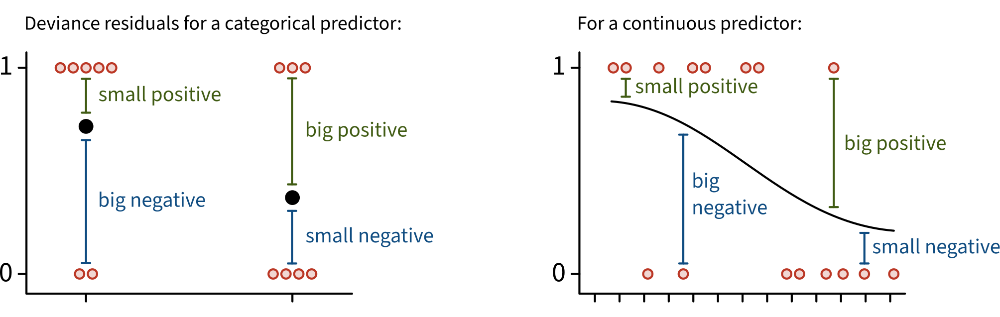

```{r}
#| label: setup
#| include: false

library(tidyverse)
library(effects)

source('../_theme/theme_quarto.R')

```


# Course overview {background-color="white" style="font-size:80%;"}

<br>

:::: {.columns}
::: {.column width="50%"}

```{r echo = FALSE, results='asis', warning = FALSE}
source('../dapr2_course_outline.R')
source("https://raw.githubusercontent.com/uoepsy/junk/main/R/course_table.R")
course_table(block1_name, block2_name, block1_lecs, block2_lecs, week = 0)
```

:::

::: {.column width="50%"}

```{r echo = FALSE, results='asis', warning = FALSE}
course_table(block3_name, block4_name, block3_lecs, block4_lecs, week = 8)
```

:::
::::


## This week's learning objectives

<br>

::::: {style="font-size: 125%;"}

::: {.dapr2callout}
How do we interpret interactions in logistic regression models?
:::

::: {.dapr2callout .fragment}
How do we measure model fit for logistic regression models?
:::

::: {.dapr2callout .fragment}
What assumption does a logistic regression model make, and how do we check it?
:::

::: {.dapr2callout .fragment}
How do we identify influential observations in logistic regression models?
:::

::: {.dapr2callout .fragment}
How do we statistically compare two nested logistic regression models?
:::


:::::

## Where we are in the analysis plan {visibility="uncounted"}

{fig-align="center"}


# Logistic regression with an interaction

## This week's data: Pro-generative-AI views

```{r include=F}
n_obs <- 50
set.seed(1)
proAI_data <- tibble(
  Anglo_Above20 = rnorm(n_obs, mean = qlogis(.50), sd = 1),
  Anglo_Below20 = rnorm(n_obs, mean = qlogis(.65), sd = 1),
  China_Above20 = rnorm(n_obs, mean = qlogis(.80), sd = 1.5),
  China_Below20 = rnorm(n_obs, mean = qlogis(.80), sd = 1),
) |>
  pivot_longer(cols = everything(), names_to = 'splitme', values_to = 'logodds_pro') |>
  separate(splitme, into = c('culture', 'age')) |>
  mutate(
    culture = factor(culture),
    age = factor(age, levels = c('Below20', 'Above20')),
    proAI = factor(ifelse(logodds_pro > 0, 1, 0))
  ) |>
  select(culture, age, proAI)
```

::::{.columns}
:::{.column width="60%"}

```{r fig.width = 10, fig.height = 8}
#| code-fold: true
proAI_data |>
  ggplot(aes(x = age, fill = proAI)) +
  geom_bar(position = 'fill') +
  facet_wrap(~ culture) +
  theme(
    strip.text = element_text(size=28)
  ) +
  labs(
    y = 'Proportion'
  )
```


:::
:::{.column width="40%"}

<br>

```{r}
proAI_data |> head(12)
```


:::
::::

`proAI = 0` means "no" (our "failure" outcome), `proAI = 1` means "yes" (our "success" outcome).

**Our model will estimate the probability of people being pro-generative-AI as a function of their culture, their age group, and the interaction between those two predictors**.


## Specify the model in mathematical notation

First, check the contrasts, so we can write the variables correctly:

::::{.columns}
:::{.column width="50%"}
```{r}
contrasts(proAI_data$culture)
```
:::
:::{.column width="50%"}
```{r}
contrasts(proAI_data$age)
```
:::
::::

<br>
 
So (remember there's no $\epsilon$ in logistic regression models):

$$
\text{logodds(proAI)} = \beta_0 + 
(\beta_1 \cdot \text{culture}_\text{China}) + 
(\beta_2 \cdot \text{age}_\text{Above20}) + 
(\beta_3 \cdot \text{culture}_\text{China} \cdot \text{age}_\text{Above20})
$$

<br>

Write:

:::{style="font-size:150%;"}
```
$$
\text{logodds(proAI)} = \beta_0 + 
(\beta_1 \cdot \text{culture}_\text{China}) + 
(\beta_2 \cdot \text{age}_\text{Above20}) + 
(\beta_3 \cdot \text{culture}_\text{China} \cdot \text{age}_\text{Above20})
$$
```
:::

## Fit the model

```{r}
proAI_mdl <- glm(
  
  proAI ~ culture * age,                 # define model formula as usual
      
  data = proAI_data,                     # define data as usual
      
  family = binomial                      # define the type of outcome 
                                         # (fun fact: 'logit' is default!)
) 
```

```{r}
summary(proAI_mdl)
```

## Interpret coefficients (1)

::::{.columns}
:::{.column width="60%"}

```{r fig.width = 10, fig.height = 8}
#| code-fold: true

p_proAI_logodds <- Effect(focal.predictors = c('culture', 'age'), mod = proAI_mdl) |>
  as.data.frame(type = 'link') |>
  ggplot(aes(x = age, y = fit)) +
  
  # points for the group mean estimates
  geom_point(size = 5) +

  # error bars for the 95% CIs
  geom_errorbar(
    aes(
      ymin = lower, 
      ymax = upper), 
    width = 0,
    linewidth = 1.5
  ) +

  # axis labels for clarity
  labs(
    y = 'Log-odds of pro-gen-AI views',
    x = 'Age'
  ) +
    
  facet_wrap(~ culture) +
  theme(strip.text = element_text(size = 28))

p_proAI_logodds
```


:::{style="font-size:75%;"}
```{r echo=F}
cat(paste0(capture.output(
  summary(proAI_mdl)
), '\n')[6:12])
```

:::


:::
:::{.column width="40%"}

**`(Intercept)`:**

- For someone below 20 from an anglophone country, the estimated log-odds of having pro-gen-AI views are 1.39 (or `plogis(1.39)` = 80.1%).
- This estimate is significantly different from zero ($p$ < 0.001).
  - Recall: the intercept being different from zero means **being different from chance,** so now it's actually an interesting hypothesis to test.
  
**`cultureChina`:**

- The log-odds of a person below 20 from China having pro-gen-AI views is estimated to increase by 1.37, compared to someone below 20 from an anglo country.
- This estimate is significantly different from zero ($p$ = 0.049).

:::
::::

## Interpret coefficients (2)

::::{.columns}
:::{.column width="60%"}

```{r fig.width = 10, fig.height = 8}
#| code-fold: true
p_proAI_logodds
```


:::{style="font-size:75%;"}
```{r echo=F}
cat(paste0(capture.output(
  summary(proAI_mdl)
), '\n')[6:12])
```

:::


:::
:::{.column width="40%"}

**`ageAbove20`:**

- The log-odds of a person above 20 from an anglo country having pro-gen-AI views is estimated to decrease by 1.31, compared to someone below 20 from an anglo country.
- This estimate is significantly different from zero ($p$ = 0.004).

**`cultureChina:ageAbove20`**:

- For a person from China, the effect of being above 20 is increased by 0.37 log-odds compared to a person from an anglo country.
- Or: For a person above 20, the effect of being from China is increased by 0.37 log-odds compared to a person below 20.
- This estimate is not significantly different from zero ($p$ = 0.664).

:::
::::


## A new thing in the model summary: <br> what's "deviance"?

```{r}
summary(proAI_mdl)
```


## Deviance = model fit


For logistic regression models, we measure model fit using **deviance:**

- How much the model's predictions deviate from the observed data
- "Badness of fit"
  - therefore, **smaller deviance = better fit**


<br>

| the kind of model | how we measure its fit |
| --- | --- |
| standard linear regression | residual sum of squares |
| logistic regression | deviance |


## Null deviance vs. residual deviance

```{r echo=F}
cat(paste0(capture.output(
  summary(proAI_mdl)
), '\n')[15:17])
```

<br>

**Null deviance:** the deviance of an intercept-only version of the model: `proAI ~ 1`.

**Residual deviance:** the deviance of the actual model we fit: `proAI ~ culture * age`.

<br>

The smaller number represents the model with better fit.

But to know whether the full model has a **significantly** better fit than the intercept-only model, we'd need to actually statistically compare models.

We'll do that soon, but first...


# Logistic regression model assumptions

## No more assumptions about $\epsilon$

**The mathematical model formulation for standard linear regression includes the error term $\epsilon$:**

$$
y = \beta_0 + (\beta_1 \cdot x) + \epsilon
$$

and we have lots of assumptions about these errors: independence, normality, equal variance.

<br>

In contrast, as we've seen, **the mathematical model formulation for logistic regression has no such error term:**

$$
\text{logodds}(y) = \beta_0 + (\beta_1 \cdot x)
$$

Logistic regression doesn't have errors $\epsilon$, therefore no assumptions about the errors, so we don't need to check those assumptions anymore!


## What logistic regression has instead of errors $\epsilon$

For each observation, logistic regression has:

- an estimated probability that the outcome is equal to 1;
- the actual observed outcome, 0 or 1; and
- **how different those two things are** = the model's **"deviance residuals".**

<br>

{fig-align="center"}

<!-- <br> -->

<!-- Fun fact: If we take the model's deviance residuals, square them, and add them up, we get the same residual deviance shown in the model summary! -->

<!-- ```{r} -->
<!-- residuals(proAI_mdl, type = 'deviance')^2 |> sum() -->
<!-- ``` -->


## Checking (standardised) deviance residuals

For a logistic regression model to be a good choice for modelling this data, **the model’s standardised deviance residuals should not be smaller than –3 or bigger than 3.**

<br>

Extract a model's standardised deviance residuals using `rstandard()` with `type = 'deviance'`:

```{r}
rstandard(proAI_mdl, type = 'deviance') |> head()
```

And plot them:

```{r eval=F}
rstandard(proAI_mdl, type = 'deviance') |> plot()
```

```{r echo=F, fig.align = 'center', fig.height = 6, fig.width = 8}
rstandard(proAI_mdl, type = 'deviance') |> plot(cex.lab = 1.6, cex.axis = 1.6, cex = 1.6)
```

All within –3 to 3 ✅
<!-- (The negative deviance residuals are a lot bigger than the positive ones because the overall probability of pro-AI views are all quite high, so any anti-AI views are very "deviant" from the overall probabilities) -->


# Diagnostics for influential observations

## Diagnostics for influential observations

Same as in standard linear regression models, we check for influential observations using Cook's Distance.

Recall that **Cook's Distance = the average distance that the predicted outcome values will move, if a given data point is removed.**

<br>

For logistic regression, we can compare to some threshold values:

- Cook's Distance **> 0.5** indicates **moderately influential** values.
- Cook's Distance **> 1** indicates **highly influential** values.

<br>

Extract Cook's Distance values using `cooks.distance()`:

```{r}
cooks.distance(proAI_mdl) |> head()
```


## Plot Cook's Distance for example models


```{r eval=F}
cooks.distance(proAI_mdl) |> plot()
```

```{r echo=F, fig.align = 'center', fig.height = 6, fig.width = 7}
cooks.distance(proAI_mdl) |> plot(cex.lab = 1.6, cex.axis = 1.6, cex = 1.6)
```

Everything well below 0.5, so no moderately or highly influential values ✅

(If we *did* find influential values, follow the process outlined in Lecture 08: double-check your data for mistakes, and if in doubt, run a sensitivity analysis.)


# Logistic regression model comparison

## Logistic regression model comparison

```{r echo=F}
cat(paste0(capture.output(
  summary(proAI_mdl)
), '\n')[15:17])
```

<br>

**Null deviance:** the deviance of an intercept-only version of the model: `proAI ~ 1`.

**Residual deviance:** the deviance of the actual model we fit: `proAI ~ culture * age`.

<br>

To know whether the full model has a **significantly** better fit than the intercept-only model, we will statistically compare models.

To do that, we compute the **difference in deviance** = null deviance minus residual deviance.

$$
138.59 - 111.21 = 27.38
$$

And like always, we want to know: **How likely is it that we would observe this value (or one more extreme) just by chance, if there were no difference in fit between the two models?**

To get a p-value, we can compare the difference in deviance to a $\chi^2$ distribution (the same way we'd compare an observed $t$ statistic to the $t$ distribution).

## In R: Test difference in deviance

Fit the null model (aka the intercept-only model):

```{r}
proAI_null <- glm(proAI ~ 1, data = proAI_data, family = binomial)
```

<br>

Run the model comparison using the `anova()` function with `test = 'Chisq'` **(but make sure to report this as a model comparison, not an ANOVA!)**:

```{r}
anova(
  proAI_null,  # null model (or any other nested model you want to compare)
  proAI_mdl,   # full model
  test = 'Chisq'
)
```

<br>

**Interpretation:** This difference in deviance is significantly different from zero, which means that the full model fits significantly better than the intercept-only model ($\chi^2$(3) = 28.3, $p$ < .001).


## When to compare models?

The model comparison we just did (`proAI ~ 1` vs. `proAI ~ culture * age`) is not very useful (because the full model is almost always a huge improvement!)

In fact, **most model comparisons are not very useful.** For example, using model comparison to...

- **... compare two models that only differ in one parameter &nbsp; ❌**
  - The significance test for that parameter tells you the same information.
- **... choose what predictors to include in a model &nbsp; ❌**
  - Include the predictors that are theoretically motivated by your RQ and required to control for confounds.
  - Do not remove predictors just because they're non-significant or don't significantly improve the fit of the model.

<br>

**So when _is_ model comparison useful?**

- **When you need to test the combined impact of multiple predictors.**
  - Imagine your RQ is: Does personality predict pro-gen-AI views, beyond the effects of age and culture? 
    - Full model: `glm(proAI ~ age * culture + O + C + E + A + N)`
    - Each individual `OCEAN` slope coefficient may be non-significant.
    - But the full model might have a significant difference in deviance compared to `proAI ~ age * culture`.


<!-- ## What statistical tests to conduct/report? -->

<!-- This course has given you a lot of tools. -->

<!-- But it's not the case that you should use every tool for every analysis. -->

<!-- Goal: **You should only conduct/report the test(s) that are directly motivated by your question** and no additional or extraneous ones. -->

<!-- Let's practice identifying what tests are motivated by what kinds of questions. -->

<!-- For all questions we'll look at, we'll assume that the full model is `glm(proAI ~ O+C+E+A+N)`. -->


<!-- TODO woo! -->


<!-- Is higher neuroticism associated with taking the marshproAI_data immediately, while holding other personality traits constant? -->

<!-- - Significance test for intercept? No -->
<!-- - Significance test for slope coefficients? Only `N` -->
<!-- - Comparison to null model? No -->
<!-- - Comparison to some non-null  nested model? No -->


<!-- Holding all personality traits constant, are people more likely to take the marshproAI_data than they are to leave it? -->

<!-- - Significance test for intercept? Yes -->
<!-- - Significance test for slope coefficients? No -->
<!-- - Comparison to null model? No -->
<!-- - Comparison to some non-null  nested model? No -->


<!-- Do neuroticism and conscientiousness together significantly influence how likely someone is to take the marshproAI_data? -->

<!-- - Significance test for intercept? No -->
<!-- - Significance test for slope coefficients? No -->
<!-- - Comparison to null model? No -->
<!-- - Comparison to some non-null  nested model? Yes, to `proAI ~ O + E + A` -->


<!-- Do personality traits predict whether people will take the marshproAI_data immediately? -->

<!-- - Significance test for intercept? No -->
<!-- - Significance test for slope coefficients? No -->
<!-- - Comparison to null model? Yes -->
<!-- - Comparison to some non-null nested model? No -->


# To conclude

## Look at all the skills you've developed this year!

{fig-align="center"}

<br>

**What you're doing here is not easy. I really hope you are proud of yourselves for all your hard work.**


# Back matter

## Revisiting this week's learning objectives (1)

:::dapr2callout

**How do we interpret interactions in logistic regression models?**

- Exactly the same as we would in standard logistic regression models.
:::


:::dapr2callout

**How do we measure model fit for logistic regression models?**

- In terms of a model's "deviance", which is like "badness of fit".
- Smaller deviance represents a better fit to the data.
:::

:::dapr2callout

**What assumption does a logistic regression model make, and how do we check it?**

- Logistic regression assumes that standardised deviance residuals will fall between –3 and 3.
- We check this assumption by plotting the standardised deviance residuals.
:::

## Revisiting this week's learning objectives (2)


:::dapr2callout

**How do we identify influential observations in logistic regression models?**

- We use Cook's Distance, as before.
- Rules of thumb for interpreting Cook's Distance for logistic regression: moderate influence > 0.5, high influence > 1.

:::

:::dapr2callout

**How do we statistically compare two nested logistic regression models?**

- Calculate the difference of deviance (e.g., residual deviance minus null deviance).
- Compare the difference of deviance to a $\chi^2$ distribution to see whether it's significantly different from zero

:::

## This week 

<br>

::::{.columns}
:::{.column width="50%"}
**Tasks:**

<br>

{width=80px style="margin:10px;margin-bottom:-50px"} Work on exercises in labs

<br>

{width=80px style="margin:10px;margin-bottom:-45px"} Complete the weekly quiz 


:::

:::{.column width="50%"}
**Get support:**

<br>

{width=80px style="margin:10px;margin-bottom:-30px"}
Consult the [flash cards](https://uoepsy.github.io/dapr2/2627/flashcards/){target="_blank"}

<br>

{width=80px style="margin:10px;margin-bottom:-50px"}
Ask questions anonymously on Piazza

<br>

{width=80px style="margin:10px;margin-bottom:-40px"} 
We really like seeing you in office hours!


:::
::::


