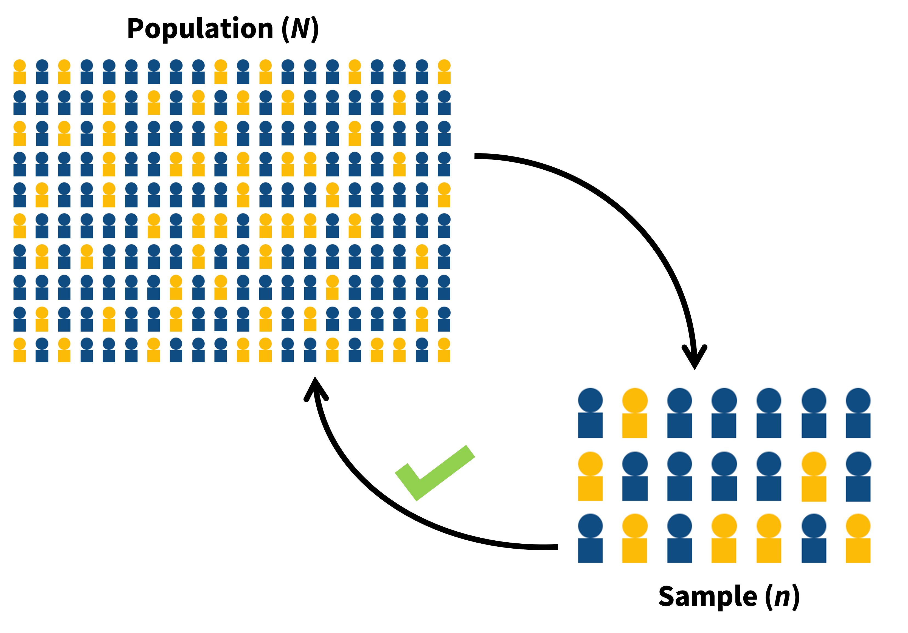
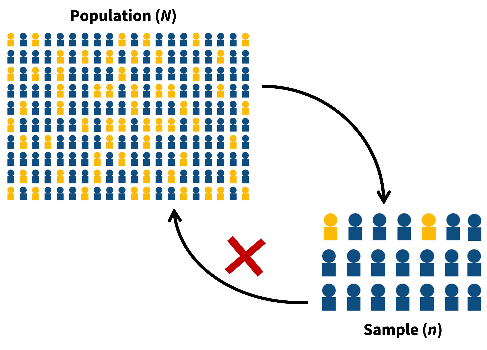

```{r setup, include=FALSE}
options(htmltools.dir.version = FALSE)
```

```{r, include=FALSE}
# options(digits=4,scipen=2)
# options(knitr.table.format="html")
# xaringanExtra::use_xaringan_extra(c("tile_view","animate_css","tachyons"))
# xaringanExtra::use_extra_styles(
#   mute_unhighlighted_code = FALSE
# )

library(knitr)
library(tidyverse)
library(kableExtra)
# knitr::opts_chunk$set(
#   dev = "png",
#   warning = FALSE,
#   message = FALSE,
#   cache = TRUE,
#   fig.showtext = TRUE
# )

source('https://uoepsy.github.io/files/rep_sample_n.R')

baseColour <- "#BF1932"
```

```{r xaringan-themer, include = FALSE}
library(xaringanthemer)
style_mono_accent(
  # base_color = "#0F4C81", # DAPR1
   base_color = "#BF1932", # DAPR2
  # base_color = "#88B04B", # DAPR3 
  # base_color = "#FCBB06", # USMR
  # base_color = "#a41ae4", # MSMR
  header_color = "#000000",
  header_font_google = google_font("Source Sans Pro"),
  header_font_weight = 400,
  text_font_google = google_font("Source Sans Pro", "400", "400i", "600", "600i"),
  code_font_google = google_font("Source Code Pro")
)
theme_set(theme_gray(base_size = 15))
 
opts_chunk$set(
  dev = "svg",
  warning = TRUE,
  message = FALSE)
```

## Week's Learning Objectives
1. Understand the principles of bootstrapping.
2. Understand bootstrap distribution.
3. Understand the application of confidence intervals within bootstrapping
4. Apply the bootstrap confidence interval to inference in linear models


---
## Issues with Linear Models

+ Sometimes we may not be able to draw accurate conclusions from our linear models.
  
  + Assumptions violations may mean our estimates are bad or our inferences poor
      
      + Violations can have many sources:
      
          + Model misspecification
          + Atypical distributions within our variables
          + Unsuitable outcome variable

---
## Model Misspecification
+ Sometimes assumptions appear violated because our model is not correct.

+ Typically we have:
  + Failed to include an interaction
  + Failed to include a non-linear (higher order) effect
  
+ Usually detected by observing violations of linearity or normality of residuals.
  + Solved by including the terms in our linear model.

---
## Atypical Distributions
+ We may see non-normal residuals, heteroscedasticity and/or non-linearity due to distributional issues with our model variables

+ One approach to dealing with this is a non-linear transformation of the outcome and/or predictors.
   
+ This involves applying a function to the values of a variable. 
  + This changes the values and overall shape of the distribution

+ For non-normal residuals and heteroscedasticity, skewed outcomes can be transformed to normality

+ Non-linearity may be helped by a transformation of both predictors and outcomes

---
## Unsuitable Outcome Variable
+ Outcome variable is not continuous or normally distributed, not due to a measurement error, but because it is not be expected to be
  
  + E.g. Reaction time, counts, binary variables.
  + For data like these, we need a slightly different version of a linear model.
  + More on this to come later in the course.
  
---
## Bootstrapped inference
+ One of the concerns when we have violated assumptions is that we make poor inferences.

+ This is because with violated assumptions, the building blocks of our inferences may be unreliable.

+ Bootstrapping as a tool can help us here.


---
class: inverse, center, middle

## Part 1: Bootstrapping

---
## Samples

.center[
```{r echo=FALSE, out.width='65%'}
knitr::include_graphics("figs/Sampling.png")
```
]

---

## Good Samples  

- If a sample of $n$ is drawn at **random**, it should be unbiased and representative of $N$
- Point estimates from such samples will be good estimates of the population parameter.

.pull-left[
.center[**Unbiased Sample**]
```{r, echo = F}

```
]

.pull-right[
.center[**Biased Sample**]
```{r echo = F}

```
]


---

## Recap on sampling distributions
.pull-left[
- We have a population.
- We take a sample of size $n$ from it, and calculate our statistic
    - The statistic is our estimate of the population parameter.
    
- We do this repeatedly, and we can construct a sampling distribution.

- The mean of the sampling distribution will be a good approximation to the population parameter.

- To quantify sampling variation we can refer to the standard deviation of the sampling distribution (the **standard error**) 
]
.pull-right[
{{content}}
]
--
+ University students
{{content}}
--

+ We take a sample of 30 students, calculate the mean height. 
{{content}}
--
    + This is our estimate of the mean height of all university students.
{{content}}
--

+ Do this repeatedly (take another sample of 30, calculate mean height).
{{content}}
--

+ The mean of these sample means will be a good approximation of the population mean.
{{content}}
--

+ To quantify sampling variation in mean heights of 30 students, we can refer to the standard deviation of these sample means.
{{content}}


---

## Practical problem:

.pull-left[
```{r echo=FALSE,message=FALSE,warning=FALSE}

set.seed(942)
pd<-tibble(x=rnorm(500, 170, 10))
ggplot(pd, aes(x=x))+
  geom_dotplot(dotsize = .5)+
  labs(x="Mean height of sample of size 30", title="500 samples of 30 students")+
  scale_y_continuous(NULL,breaks=NULL)+
  geom_label(aes(x = 140, y = 0.95, label = "Each dot is the mean\nheight of 30\nrandomly sampled\nstudents"),
             hjust = 0, vjust = 1, lineheight = 0.8, colour = baseColour, fill=NA,
             label.size = NA, size = 6) +
  geom_curve(aes(x = 145, y = 0.75, xend = 159, yend = 0.45),
             colour = baseColour,
             size=0.5,
             curvature = 0.2,
             arrow = arrow(length = unit(0.03, "npc")))+
  geom_vline(aes(xintercept=mean(x)), lty="dashed", color=baseColour, linewidth = 1)+
  geom_label(aes(x = mean(x)+5, y = 1, label = "The mean of the\nsample means"),
             hjust = 0, vjust = 1, lineheight = 0.8, colour = baseColour, fill=NA,
             label.size = NA, size = 6)+
  geom_segment(aes(x = mean(x)+4.5, y = .97, xend = mean(x)+.1, yend = .97),
             colour = baseColour, size=0.5,
             arrow = arrow(length = unit(0.03, "npc")))
```
]
.pull-right[
+ This process allows us to get an estimate of the sampling variability, **but is it realistic?**
    
+ Can I really go out and collect 500 samples of 30 students from the population?
    + Probably not...
{{content}}    
]

--

+ So how else can I get a sense of the variability in my sample estimates? 

---

.pull-left[
## Solution 1  
### Theoretical  

+ Collect one sample.

+ Estimate the Standard Error using the formula:  

$$\text{SE} = \frac{\sigma}{\sqrt{n}}$$ 

]
.pull-right[
## Solution 2  
### Bootstrap

- Collect one sample.

- Mimic the act of repeated sampling from the population by repeated **resampling with replacement** from the original sample. 

- Estimate the standard error using the standard deviation of the distribution of **resample** statistics. 

]


---

## Bootstrapping 

> **Bootstrapping:** The process of resampling *with replacement* from the original data to generate multiple samples with the same $n$ as the original data.

--

- Start with an initial sample of size $n$.  

- Take $k$ resamples (sampling with replacement) of size $n$, and calculate your statistic from each one. 

- As $k\to\infty$, the distribution of the $k$ resample statistics begins to approximate the sampling distribution.
  
  + This distribution of resample statistics is known as the **bootstrap distribution**

--

> **Test your understanding:** In our original study, we took a sample of 35 DapR2 students and calculated their mean scores on the exam. We want to use bootstrapping. What will our resample $n$ be? What will our resample statistic be? 


---

## The sample

```{r echo=FALSE}
simpsons_sample <- 
  tibble(
  name = c("Homer Simpson","Ned Flanders","Chief Wiggum","Milhouse","Patty Bouvier", "Janey Powell", "Montgomery Burns", "Sherri Mackleberry","Krusty the Clown","Jacqueline Bouvier"),
  age = c(39, 60, 43, 10, 43, 8, 104, 10, 52, 80)
)
```


.pull-left[
```{r echo=FALSE, out.width=350}
knitr::include_graphics("jk_img_sandbox/sample.png")
```

Suppose I am interested in the mean age of all characters in The Simpsons, and I have collected a sample of $n=10$. 
{{content}}
]


--

+ The mean age of my sample is `r round(mean(simpsons_sample$age),1)`. 

--

.pull-right[
```{r echo=FALSE}
simpsons_sample
```

```{r}
simpsons_sample %>%
  summarise(mean_age = mean(age))
```

]

---

## The **re**sample

.pull-left[

I randomly draw out one person from my original sample, I note the value of interest, and then I put that person "back in the pool" (i.e. I sample with replacement). 
<br>
<br>
```{r echo=FALSE, out.width=350}
knitr::include_graphics("jk_img_sandbox/resample1.png")
```

]
.pull-right[
```{r echo=FALSE}
set.seed(193)
sample_n(simpsons_sample, size = 1)
```
]

---

## The **re**sample

.pull-left[
Again, I draw one person at random again, note the value of interest, and replace them.  
<br>
<br>
```{r echo=FALSE, out.width=350}
knitr::include_graphics("jk_img_sandbox/resample2.png")
```

]
.pull-right[
```{r echo=FALSE}
set.seed(193)
sample_n(simpsons_sample, size = 10, replace = TRUE) %>% head(n=2L)
```
]

---

## The **re**sample

.pull-left[
And again...   
<br>
<br>
<br>
```{r echo=FALSE, out.width=350}
knitr::include_graphics("jk_img_sandbox/resample3.png")
```

]
.pull-right[
```{r echo=FALSE}
set.seed(193)
sample_n(simpsons_sample, size = 10, replace = TRUE) %>% head(n=3L)
```
]

---

## The **re**sample

.pull-left[
And again...  
<br>
<br>
<br>
```{r echo=FALSE, out.width=350}
knitr::include_graphics("jk_img_sandbox/resample4.png")
```

]
.pull-right[
```{r echo=FALSE}
set.seed(193)
sample_n(simpsons_sample, size = 10, replace = TRUE) %>% head(n=4L)
```
]

---

## The **re**sample

.pull-left[
Repeat until I have a the same number as my original sample ( $n = 10$ ).  
<br>
<br>
```{r echo=FALSE, out.width=350}
knitr::include_graphics("jk_img_sandbox/resample.png")
```
{{content}}
]
.pull-right[
```{r echo=FALSE}
set.seed(193)
sample_n(simpsons_sample, size = 10, replace = TRUE)
```
]
--
- This is the **resample**
{{content}}
--
- The mean age of the resample is `r set.seed(193);sample_n(simpsons_sample, size = 10, replace = TRUE) %>% pull(age) %>% mean() %>% round(.,1)`  

---

## Bootstrapping: $Resample_1:Resample_k$

.pull-left[

+ If I repeat this whole process $k$ times, I will have $k$ means from $k$ resamples.

  + Note these are entirely derived from the original sample of 10

]

---
count: false

## Bootstrapping: $Resample_1:Resample_k$

.pull-left[

+ If I repeat this whole process $k$ times, I will have $k$ means from $k$ resamples.

  + Note these are entirely derived from the original sample of 10
  
  + So, if $k$ = 5, I would have something like this:
  
```{r, echo = F, fig.height=4}
set.seed(193)

k5 <- tibble(k=1:5, M=NA)

for(x in 1:nrow(k5)){
  k5$M[x] <- mean(sample(simpsons_sample$age, 10, replace = T))
}
       
ggplot(k5, aes(M)) + geom_histogram(binwidth = 1, fill = baseColour, colour = 'gray28') +
  scale_y_continuous(limits = c(0, 2), breaks = c(0, 1, 2)) +
  labs(x = 'Resample Mean Age', y = 'Frequency')
```


]

.pull-right[

```{r, echo = F}
kbl(k5)
```

]

---

## Increasing $k$

+ Recall that as $k$ grows larger, the distribution of resample statistics begins to approximate the sampling distribution.

--

.center[

```{r, echo=FALSE, warning=FALSE, message=FALSE, fig.width=12, fig.height=5.5}

library(patchwork)

k2000 <- tibble(k=1:2000, M=NA)

set.seed(193)
for(x in 1:nrow(k2000)){
  k2000$M[x] <- mean(sample(simpsons_sample$age, 10, replace = T))
}

pk20 <- k2000[1:20,] %>%
  ggplot(., aes(M)) + geom_histogram(binwidth = 2, fill = baseColour, colour = 'gray28') +
  labs(x = 'Resample Mean Age', y = 'Frequency', title = '20 Resamples') +
  theme(axis.text = element_text(size = 12), axis.title = element_text(size=14, face='bold'),
        title = element_text(size=14, face = 'bold')) +
  geom_vline(xintercept = mean(k2000$M[1:20]), linetype='dashed', linewidth=1) +
  annotate(geom='text', label=paste('Mean of the Means \n', mean(k2000$M[1:20])), x = 60, y = 2.5)

pk50 <- k2000[1:50,] %>%
  ggplot(., aes(M)) + geom_histogram(binwidth = 2, fill = baseColour, colour = 'gray28') +
  labs(x = 'Resample Mean Age', y = 'Frequency', title = '50 Resamples') +
  theme(axis.text = element_text(size = 12), axis.title = element_text(size=14, face='bold'),
        title = element_text(size=14, face = 'bold')) +
  geom_vline(xintercept = mean(k2000$M[1:50]), linetype='dashed', linewidth=1) +
  annotate(geom='text', label=paste('Mean of the Means \n', mean(k2000$M[1:50])), x = 60, y = 7.5)

pk200 <- k2000[1:200,] %>%
  ggplot(., aes(M)) + geom_histogram(binwidth = 2, fill = baseColour, colour = 'gray28') +
  labs(x = 'Resample Mean Age', y = 'Frequency', title = '200 Resamples') +
  theme(axis.text = element_text(size = 12), axis.title = element_text(size=14, face='bold'),
        title = element_text(size=14, face = 'bold')) +
  geom_vline(xintercept = mean(k2000$M[1:200]), linetype='dashed', linewidth=1) +
  annotate(geom='text', label=paste('Mean of the Means \n', mean(k2000$M[1:200])), x = 60, y = 18)

pk2000 <- k2000[1:2000,] %>%
  ggplot(., aes(M)) + geom_histogram(binwidth = 2, fill = baseColour, colour = 'gray28') +
  labs(x = 'Resample Mean Age', y = 'Frequency', title = '2000 Resamples') +
  theme(axis.text = element_text(size = 12), axis.title = element_text(size=14, face='bold'),
        title = element_text(size=14, face = 'bold')) +
  geom_vline(xintercept = mean(k2000$M), linetype='dashed', linewidth=1) +
  annotate(geom='text', label=paste('Mean of the Means \n', mean(k2000$M)), x = 65, y = 125)

(pk20 | pk50) /(pk200 | pk2000)

```
]

---

## Bootstrap Standard Error


+ We have seen the standard error in our linear models, and have discussed it as the measure of sampling variability.  

--

  + It reflects the SD of the sampling distribution.
    
--

+ In the same vein, we can use our bootstrapped distribution to calculate the SE

> **Test your understanding:** How do you think we get this value?

--

> The SD of the bootstrap distribution.

--

.center[
```{r echo=FALSE, message=FALSE,warning=FALSE, fig.width=8, fig.height=3.5}
pk2000 + geom_vline(aes(xintercept=mean(M)-sd(M)), linetype=4, linewidth = .7) +
  geom_vline(aes(xintercept=mean(M)+sd(M)), linetype=4, linewidth = .7) +
  annotate(geom='text', label = paste0('SD = ', round(sd(k2000$M), 2)), x = 65, y = 100)
```
]

---
class: center, middle

## Questions?

---
class: inverse, center, middle

## Part 2: Confidence Intervals

---

## Confidence interval

+ Remember, we usually do not know the value of a population parameter.  

    + We are trying to estimate this from our data.  
  
--

+ A **confidence interval** defines a plausible range of values for our population parameter.  

+ To estimate we need:  

    + A confidence level  
    + A measure of sampling variability (e.g. SE/bootstrap SE).

---

## Confidence interval & level

+ Recall that the confidence level refers to the percentage of times confidence intervals would be expected to contain the true population parameter across repeated samples

+ Also remember that the typical confidence level used is **95%**

--

+ So, if we were to take 100 samples and calculate a 95% CI on each of them, ~95 of those intervals would contain the true population parameter

--

+ What are we 95% confident *in?*  
    + We are 95% confident that our interval contains the true population mean.
    + The *95% probability* comes from the long-run frequencies of our intervals.

--

> Let's see a quick demonstration of this in R...

---

## Simple Visualization 

.pull-left[
```{r, echo=FALSE, message=FALSE}
k2000 <- k2000 %>%
  mutate(
    class = ifelse(M < (mean(M)- 1.96*sd(M)) | M > (mean(M) + 1.96*sd(M)), 1, 0)
  )

k2000 %>%
  ggplot(., aes(x=M)) +
  geom_histogram(aes(y=after_stat(density), ), colour = "white", alpha = 0.3) +
  stat_function(fun = dnorm, args = list(mean = mean(k2000$M), sd = sd(k2000$M)), lwd=2, alpha=.3) +
  geom_vline(xintercept = (mean(k2000$M) - 1.96*sd(k2000$M)), colour = baseColour, lwd=2) +
  geom_vline(xintercept = (mean(k2000$M) + 1.96*sd(k2000$M)), colour = baseColour, lwd=2) +
  labs(x = "Average Age of Simpsons Characters", y = 'Density', title='Sampling Distribution with 95% CI (between red lines)' )
```
]

.pull-right[

+ The confidence interval works outwards from the centre  

+ As such, it "cuts-off" the tails.  

    + E.g. the most extreme estimates will not fall within the interval

]

---
count: false

## Simple Visualization 

.pull-left[
```{r, echo=FALSE, message=FALSE}
k2000 <- k2000 %>%
  mutate(
    class = ifelse(M < (mean(M)- 1.96*sd(M)) | M > (mean(M) + 1.96*sd(M)), 1, 0)
  )

k2000 %>%
  ggplot(., aes(x=M)) +
  geom_histogram(aes(y=after_stat(density), ), colour = "white", alpha = 0.3) +
  stat_function(fun = dnorm, args = list(mean = mean(k2000$M), sd = sd(k2000$M)), lwd=2, alpha=.3) +
  geom_vline(xintercept = (mean(k2000$M) - 1.96*sd(k2000$M)), colour = baseColour, lwd=2) +
  geom_vline(xintercept = (mean(k2000$M) + 1.96*sd(k2000$M)), colour = baseColour, lwd=2) +
  labs(x = "Average Age of Simpsons Characters", y = 'Density', title='Sampling Distribution with 95% CI (between red lines)' )
```
]

.pull-right[

+ The confidence interval works outwards from the centre  

+ As such, it "cuts-off" the tails.  

    + E.g. the most extreme estimates will not fall within the interval

+ To calculate the CI, we identify the upper and lower bounds of the interval (i.e. the red lines) 

+ These need to be positioned so that 95%* of all possible sample mean estimates fall within the bounds.

  + *Replace this value with whatever confidence level you choose

]


---

## Calculating CI: 68/95/99 Rule

.pull-left[
+ Remember that sampling distributions become normal as $k$ increases, and normal distributions have fixed properties  

+ Specifically...
]

.pull-right[
```{r, echo = F, fig.height=4, fig.width=7}
(normDist <- ggplot(data.frame(x = c(-4, 4)), aes(x = x)) +
  stat_function(fun=dnorm, geom = "line", size = 1.5) +
  scale_x_continuous(breaks = seq(-4, 4, 1), limits = c(-4, 4)) + 
  labs(x='') +
  theme(axis.text.x = element_text(size = 12), 
        axis.text.y = element_blank(),
        axis.title.y = element_blank(),
        axis.ticks.y = element_blank(),
        axis.title.x = element_text(size = 14, face = 'bold')))
```

]


---
## Calculating CI: 68/95/99 Rule

.pull-left[
+ Remember that sampling distributions become normal as $k$ increases, and normal distributions have fixed properties  

+ Specifically...
  
  + 68% of observations fall within 1 SD of the mean
]

.pull-right[
```{r, echo = F, fig.height=4, fig.width=7}
normDist + xlab("# of standard deviations from the mean") +
  geom_area(stat = "function", fun = dnorm, fill = baseColour, xlim = c(-1, 1)) +
  theme(axis.text = element_text(size=12), axis.title = element_text(size=14, face='bold')) +
  geom_vline(xintercept = -1, colour = baseColour, size = 1.5) +
  geom_vline(xintercept = 1, colour = baseColour, size = 1.5) +
  annotate('text', label = '~68%', x = 0, y = 0.12, colour = 'white', size = 8)
```
]

---
count: false
## Calculating CI: 68/95/99 Rule

.pull-left[
+ Remember that sampling distributions become normal as $k$ increases, and normal distributions have fixed properties  

+ Specifically...
  
  + 68% of observations fall within 1 SD of the mean
  + **95% of observations fall within 1.96 SD of the mean**
]

.pull-right[
```{r, echo = F, fig.height=4, fig.width=7}

normDist + xlab("# of standard deviations from the mean") +
  geom_area(stat = "function", fun = dnorm, fill = baseColour, xlim = c(-2, 2)) +
  theme(axis.text = element_text(size=12), axis.title = element_text(size=14, face='bold')) +
  geom_vline(xintercept = -2, colour = baseColour, size = 1.5) +
  geom_vline(xintercept = 2, colour = baseColour, size = 1.5) +
  annotate('text', label = '~95%', x = 0, y = 0.12, colour = 'white', size = 8)

```
]

---
count: false

## Calculating CI: 68/95/99 Rule

.pull-left[
+ Remember that sampling distributions become normal as $k$ increases, and normal distributions have fixed properties  

+ Specifically...
  
  + 68% of observations fall within 1 SD of the mean
  + **95% of observations fall within 1.96 SD of the mean**
  + 99% of observations fall within 3 SD of the mean
]

.pull-right[
```{r, echo = F, fig.height=4, fig.width=7}

normDist + xlab("# of standard deviations from the mean") +
  geom_area(stat = "function", fun = dnorm, fill = baseColour, xlim = c(-3, 3)) +
  theme(axis.text = element_text(size=12), axis.title = element_text(size=14, face='bold')) +
  geom_vline(xintercept = -3, colour = baseColour, size = 1.5) +
  geom_vline(xintercept = 3, colour = baseColour, size = 1.5) +
  annotate('text', label = '~99%', x = 0, y = 0.12, colour = 'white', size = 8)

```
]


---

## Calculating CI  

.pull-left[
+ The bounds of the 95% CI for a mean are:  

$$
\text{Lower Bound} = mean - 1.96 \times SE
$$

$$
\text{Upper Bound} = mean + 1.96 \times SE 
$$
+ where 

$$SE = \frac{SD}{\sqrt{n}}$$
]

.pull-right[

```{r, echo = F, fig.height=4, fig.width=7}

normDist + xlab("# of standard deviations from the mean") +
  geom_area(stat = "function", fun = dnorm, fill = baseColour, xlim = c(-2, 2)) +
  theme(axis.text = element_text(size=12), axis.title = element_text(size=14, face='bold')) +
  geom_vline(xintercept = -2, colour = baseColour, size = 1.5) +
  geom_vline(xintercept = 2, colour = baseColour, size = 1.5) +
  annotate('text', label = '~95%', x = 0, y = 0.12, colour = 'white', size = 8)

```
]


--


> **Test your understanding:** If we wanted to calculate the 99% confidence interval, what would we replace 1.96 with in the equation above?


---

## Calculating CI - Theoretical Approach

```{r message=FALSE,warning=FALSE}
simpsons_sample <- read_csv("https://uoepsy.github.io/data/simpsons_sample.csv")
mean(simpsons_sample$age)
```

$$mean \pm 1.96 \times \frac{SD}{\sqrt{n}}$$

```{r message=FALSE,warning=FALSE}
mean(simpsons_sample$age) - 1.96*(sd(simpsons_sample$age)/sqrt(10))
mean(simpsons_sample$age) + 1.96*(sd(simpsons_sample$age)/sqrt(10))
```

---
## Calculating CI - Bootstrap Approach

Step 1 - Perform bootstrapping

.pull-left[
```{r message=FALSE,warning=FALSE}
resamples2000 <- rep_sample_n(simpsons_sample, n = 10, 
                              samples = 2000, replace = TRUE) 

bootstrap_dist <- resamples2000 %>%
  group_by(sample) %>%
  summarise(resamplemean = mean(age))
```
]

.pull-right[
```{r, echo = F, fig.height=5}
(bootstr <- ggplot(bootstrap_dist, aes(resamplemean)) + geom_histogram(colour = 'gray28', fill = baseColour) + 
  scale_x_continuous(breaks=seq(15, 80, by=5)))
```

]

---
## Calculating CI - Bootstrap Approach

Step 2 - Calculate CI

.pull-left[
+ Remember that the SE = the $SD$ of the bootstrap...

```{r}
sd(bootstrap_dist$resamplemean)
```

**Lower Bound:**
```{r}
mean(simpsons_sample$age) - 1.96*sd(bootstrap_dist$resamplemean)
```


**Upper Bound:**
```{r}
mean(simpsons_sample$age) + 1.96*sd(bootstrap_dist$resamplemean)
```

]

.pull-right[
```{r, echo = F, fig.height=5}
bootstr +
  geom_vline(xintercept = mean(simpsons_sample$age) - 1.96*sd(bootstrap_dist$resamplemean), linetype='dashed') +
  geom_vline(xintercept = mean(simpsons_sample$age) + 1.96*sd(bootstrap_dist$resamplemean), linetype='dashed')
```

]

---

## Sampling Distributions and CIs are not just for means 

For a 95% Confidence Interval around a statistic: 

$$
\text{Lower Bound} = statistic - 1.96 \times SE
$$
$$
\text{Upper Bound} = statistic + 1.96 \times SE
$$


---
class: center, middle

# Questions?

---
class: inverse, center, middle

# Part 3
## Bootstrapping linear model


---
## Bootstrapping a linear model
- We have looked at bootstrapping of the mean.
  - But we can compute a bootstrap distribution of any statistic.

- As a result, it is a straightforward extension to linear models.

- We can calculate $\beta$ coefficients, $R^2$, $F$-statistics etc.
  - In each case we generate a resample
  - Run the linear model
  - Save the statistic of interest
  - Repeat this $K$ times
  - Generate the distribution of $K$ statistics of interest.

---
## `Boot` in `car`
- The primary package in R for doing bootstrapping is called `boot`
  - But it is moderately complicated to use.

- Thankfully there is an easier to use wrapper in the `car` package called `Boot`
  - Note the capital letters.
  
```{r, eval=FALSE}
library(car)
?Boot
```


---
## `Boot` in `car`

- The key arguments to `Boot` are the following:

```{r, eval = F}
Boot(object, f, R)
```


+ `object`: Your fitted model.

+ `f`: Which bootstrap statistics to compute on each resample. 
  - By default, `f = coef`, returning the regression coefficients.

+ `R`: how many bootstrap samples to compute. 
  - By default, `R = 999`.


---
## Applying bootstrap

```{r, echo = F}
tib1 <- tibble(
  name = as_factor(c("John", "Peter","Robert","David","George","Matthew", "Bradley")),
  height = c(1.52,1.60,1.68,1.78,1.86,1.94,2.09),
  weight = c(54,49,50,67,70,110,98)
)
```


.pull-left[

- **Step 1.** Run model

```{r}
m1 <- lm(weight ~ height, data = tib1)
```

- **Step 2.** Load `car`

```{r, warning=FALSE, message=FALSE}
library(car)
```

- **Step 3.** Run `Boot`

```{r}
boot_m1 <- Boot(m1, R = 1000)
```

]

.pull-right[
```{r, echo = F}
kbl(tib1)
```

]

---
## Applying bootstrap

$$weight\sim height$$

- **Step 4.** See summary results

```{r}
summary(boot_m1)
```

---
## Applying bootstrap

$$weight\sim height$$

- **Step 5.** Calculate confidence interval
```{r}
Confint(boot_m1, type = "perc")
```

--

> **Test your understanding:** Given that the intercept and slopes are interpreted in the same way as they would be in the `lm` output, how would you interpret these estimates?

---
## Interpreting the results

+ So currently, the intercept and slope values make very little sense.

+ Let's re-scale `height` to be in centimetres, mean centre,  and re-run.

```{r}
tib1 <- tib1 %>%
  mutate(
    heightcm = height*100
  )

m2 <- lm(weight ~ scale(heightcm, scale=F), data = tib1)

boot_m2 <- Boot(m2, R = 1000)
```

---
## Interpreting the results

```{r, echo = F}
(resCI <- Confint(boot_m2, type = "perc"))
```

```{r, eval = F}
Confint(boot_m2, type = "perc")
```

> **Test your understanding:** Now how will you interpret these estimates? What about the CI?


--


> The average expected weight of participants with *average* height (`r round(mean(tib1$heightcm))`cm) is 71.1kg.

> For every cm increase in height, there is a 1.05kg increase in weight. 

> We can be 95% confident that the CI [`r round(resCI[2,2],2)` , `r round(resCI[2,3],2)`] includes the true population $\beta_1$ estimate. Because the CI does not include 0, we can reject the null at $\alpha = 0.05$

---
class: center, middle

## Questions?


---
## Summary  

- Good samples are representative, random and unbiased.  

- Bootstrap resampling is a tool to construct a *bootstrap distribution* of any statistic which, with sufficient resamples, will approximate the *sampling distribution* of the statistic.  

- Confidence Intervals are a tool for considering the plausible value for an unknown population parameter.  
  - We can use bootstrap SE to calculate CI.
  - And using bootstrap CI's is a plausible approach when we have assumption violations, and other issues, in our linear models.

+ We have seen how to apply this for `lm` using  `Boot` from `car`.


---

class: inverse, center, middle

# Thanks for Listening!

