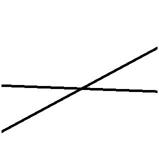

```{r setup, include=FALSE}
options(htmltools.dir.version = FALSE)
```

```{r xaringan-themer, include = FALSE}
library(xaringanthemer)
style_mono_accent(
  #base_color = "#0F4C81", # DAPR1
   base_color = "#BF1932", # DAPR2
  # base_color = "#88B04B", # DAPR3 
  # base_color = "#FCBB06", # USMR
  # base_color = "#a41ae4", # MSMR
  header_color = "#000000",
  header_font_google = google_font("Source Sans Pro"),
  header_font_weight = 400,
  text_font_google = google_font("Source Sans Pro", "400", "400i", "600", "600i"),
  code_font_google = google_font("Source Code Pro")
)
```


```{r echo=FALSE, message=FALSE, warning=FALSE}
library(tidyverse)
library(sjPlot)
library(patchwork)
library(kableExtra)

salary2 <- read_csv("data/salary2.csv")
```

# Course Overview

.pull-left[

<!---
I've just copied the output of the Sem 1 table here and removed the bolding on the last week, so things look consistent with the trailing opacity produced by the course_table.R script otherwise.
-->


<table style="border: 1px solid black;>
  <tr style="padding: 0 1em 0 1em;">
    <td rowspan="5" style="border: 1px solid black;padding: 0 1em 0 1em;opacity:1;text-align:center;vertical-align: middle">
        <b>Introduction to Linear Models</b></td>
    <td style="border: 1px solid black;padding: 0 1em 0 1em;opacity:1">
        Intro to Linear Regression</td>
  </tr>
  <tr><td style="border: 1px solid black;padding: 0 1em 0 1em;opacity:1">
        Interpreting Linear Models</td></tr>
  <tr><td style="border: 1px solid black;padding: 0 1em 0 1em;opacity:1">
        Testing Individual Predictors</td></tr>
  <tr><td style="border: 1px solid black;padding: 0 1em 0 1em;opacity:1">
        Model Testing & Comparison</td></tr>
  <tr><td style="border: 1px solid black;padding: 0 1em 0 1em;opacity:1">
        Linear Model Analysis</td></tr>

  <tr style="padding: 0 1em 0 1em;">
    <td rowspan="5" style="border: 1px solid black;padding: 0 1em 0 1em;opacity:1;text-align:center;vertical-align: middle">
        <b>Analysing Experimental Studies</b></td>
    <td style="border: 1px solid black;padding: 0 1em 0 1em;opacity:1">
        Categorical Predictors & Dummy Coding</td>
  </tr>
  <tr><td style="border: 1px solid black;padding: 0 1em 0 1em;opacity:1">
        	Effects Coding & Coding Specific Contrasts</td></tr>
  <tr><td style="border: 1px solid black;padding: 0 1em 0 1em;opacity:1">
        Assumptions & Diagnostics</td></tr>
  <tr><td style="border: 1px solid black;padding: 0 1em 0 1em;opacity:1">
        Bootstrapping</td></tr>
  <tr><td style="border: 1px solid black;padding: 0 1em 0 1em;opacity:1">
        Categorical Predictor Analysis</td></tr>
</table>


]

.pull-right[


```{r echo = FALSE, results='asis'}
block3_name = "Interactions"
block3_lecs = c("Interactions I",
                "Interactions II",
                "Interactions III",
                "Analysing Experiments",
                "Interaction Analysis")
block4_name = "Advanced Topics"
block4_lecs = c("Power Analysis",
                "Binary Logistic Regression I",
                "Binary Logistic Regression II",
                "Logistic Regression Analysis",
                "	Exam Prep and Course Q&A")

source("https://raw.githubusercontent.com/uoepsy/junk/main/R/course_table.R")
course_table(block3_name,block4_name,block3_lecs,block4_lecs,week=2)
```


]


---


# Week's Learning Objectives

1. Understand the concept of an interaction

2. Interpret interactions between continuous variables

3. Visualise and probe interactions in R

4. Recognise different forms of interaction


---
#  General definition of interaction

+ When the effects of one predictor on the outcome differ across levels of another predictor

+ Continuous-continuous interaction (**referred to as moderation**):
	+ The slope of the regression line between a continuous predictor and the outcome changes as the values of a second continuous predictor change
	
+ Note interactions are symmetrical: We can talk about interaction of X with Z, or Z with X

---
#  Lecture notation

$$y_i = \beta_0 + \beta_1 x_{i} + \beta_2 z_{i} + \beta_3 x_{i}z_{i} + \epsilon_i$$

+ Lecture notation for this week:

  + $y$ is a continuous outcome
  
  + $x$ is a continuous predictor
  
  + $z$ is a continuous predictor
  
  + $xz$ is their product or interaction predictor

---
#  Interpretation: Continuous $\times$ Continuous 

$$y_i = \beta_0 + \beta_1 x_{i} + \beta_2 z_{i} + \beta_3 x_{i}z_{i} + \epsilon_i$$

+ Interpretation:
  
  + $\beta_0$ = Value of $y$ when $x$ and $z$ are both 0
  
  + $\beta_1$ = Effect of $x$ (slope) when $z$ = 0
  
  + $\beta_2$ = Effect of $z$ (slope) when $x$ = 0
  
  +  $\beta_3$ = Change in slope of $x$ on $y$ per each unit of $z$ (and vice versa)
	    + Or how the effect of $x$ depends on $z$ (and vice versa)

---
#  Interpretation: Continuous $\times$ Continuous 

$$y_i = \beta_0 + \beta_1 x_{i} + \beta_2 z_{i} + \beta_3 x_{i}z_{i} + \epsilon_i$$

+ Note, $\beta_1$ and $\beta_2$ and are referred to as **conditional effects**, not as main effects
	
	+ They are the effects at the value 0 of the interacting variable
	
	+ "Main effects" are typically assumed to be constant, but in the presence of an interaction, the effect of each variable that is involved in the interaction depends on the other variable that is involved in the interaction
	
	+ For any $\beta$ associated with a variable **not** included in the interaction, interpretation does not change from what we covered last semester

---
#  Example: Continuous $\times$ Continuous 

+ Conducting a study on how years of service and employee performance ratings predicts salary in a sample of managers

$$y_i = \beta_0 + \beta_1 x_{i} + \beta_2 z_{i} + \beta_3 x_{i}z_{i} + \epsilon_i$$

+ $y$ = Salary (unit = thousands of pounds)

+ $x$ = Years of service

+ $z$ = Average performance ratings

---
#  Plot Salary and Service 

.pull-left[
```{r, eval=FALSE}
  ggplot(salary2, aes(x=serv, y=salary)) +
  geom_point() +
  labs(x = "Years of Service", 
       y = "Salary (£1000)")
```
]


.pull-right[
```{r, echo=FALSE}
  ggplot(salary2, aes(x=serv, y=salary)) +
  geom_point()+
  labs(x = "Years of Service", 
       y = "Salary (£1000)")
```
]

---
#  Model: Continuous $\times$ Continuous 

```{r echo=FALSE}
m1 <- lm(salary ~ serv*perf, data = salary2)
summary(m1)
```


???
+ General comments:
	+ The coefficients for service and the interaction are significant at nominal alpha = 0.05.
	+ R-squared suggests we have a good model
		+ Explains 52.6% variance.
	+ Difference in R-squared to adjusted is small (0.42%)

---
#  Continuous $\times$ Continuous Interpretation

.pull-left[

+ **Intercept**: A manager with 0 years of service and 0 performance rating earns £87,920

+ **Service**: For a manager with 0 performance rating, for each year of service, salary decreases by £10,940
  + Slope when performance = 0
  
+ **Performance**: For a manager with 0 years service, for each point of performance rating, salary increases by £3,150
  + Slope when service = 0
  
+ **Interaction**: For every year of service, the relationship between performance and salary increases by an additional £3250
  + Increase to the slope of performance per each additional year of service

]


.pull-right[
```{r, echo=FALSE}
test <- summary(m1)
round(test$coefficients,2)
```


]

???
+ What do you notice here?
+ 0 performance and 0 service are odd values.
+ lets mean centre both, so 0 = average, and look at this again.


---
# Mean centring

```{r}

salary2 <- salary2 %>%
  mutate(
    perfM = scale(perf, scale = F), #<<
    servM = scale(serv, scale = F) #<<
  )

m2 <- lm(salary ~ servM*perfM, data = salary2)

```


---
# Mean centring

```{r echo=FALSE}
summary(m2)
```


???

+ Take a few minutes to look at these results vs the original model results 3 slides back. 

+ What do we notice here?

1. The values of the coefficients have changed for service and performance.
2. The p-value significance has changed.
3. The interaction has stayed the same.
4. R-squared stayed the same.

+ The coefficients change because these are the slopes at specific values of the other variable 0.
+ Remember with an interaction, the relationship changes as the values of the other variable change, so we expect this.
+ The p-values change, because the slope has changed. The null = 0, no effect. So if the slope gets bigger or smaller, the p-value will also change.


---
#  Continuous $\times$ Continuous Mean-Centred

.pull-left[

+ **Intercept**: A manager with average years of service and average performance rating earns £104,850

+ **Service**: For a manager with an average performance rating, for every year of service, salary increases by £1,420.
  + Slope when performance = 0 (mean centered)
  
+ **Performance**: For a manager with average years of service, for each point of performance rating, salary increases by £14,450
  + Slope when service = 0 (mean centered)
  
+ **Interaction**: For every year of service, the relationship between performance and salary increases by an additional £3250
  + Increase to the slope of performance per each additional year of service

]


.pull-right[
```{r, echo=FALSE}
test2 <- summary(m2)
round(test2$coefficients,2)
```

]

???
+ The values for $\beta_1$ and $\beta_2$ make a little more sense. We would expect service and performance increases to lead to increased pay.
+ However, there is an important point here. In the presence of a significant interaction, we tend not to interpret the conditional main effects.

+ This leads to the question of how do we interpret/understand the interaction. 

+ We will come to that next.

---
class: center, middle
# Questions?


---
#  Plotting interactions 

+ Simple slopes:
	+ **Regression of the outcome Y on a predictor X at specific values of an interacting variable Z**
	
+ And we re-arranged such that:

$$\hat{y} = (\beta_1 + \beta_3z)x + (\beta_2z + \beta_0)$$

+ So all we need to do is select values of $Z$, or in our case, performance
	+ This was easy when $Z$ was binary (or categorical), as we had a line for each group
	+ Now we must select reasonable values within the range of the continuous $Z$
	+ It is customary to assess the effect of $X$ at the mean value of $Z$, and at the +/- 1SD values of $Z$

---
#  Simple slope calculations 

$$\hat{y} = (\beta_1 + \beta_3z)x + (\beta_2z + \beta_0)$$

+ In the current data, the SD for performance is `r round(sd(salary2$perfM),2)`

+ Working with the mean-centred variable, we want to plot values for Performance ( $Z$ ) of -1.26, 0 and 1.26

--

Simple slope for Service at -1SD of Performance:

$$\hat{salary} = (1.425 + (3.255*(-1.26)))service + ((14.445*(-1.26)) + 104.848)$$

Simple slope for Service at mean Performance:

$$\hat{salary} = (1.425 + (3.255*0))service + ((14.445*0) + 104.848)$$

Simple slope for Service at +1SD of Performance:

$$\hat{salary} = (1.425 + (3.255*1.26))service + ((14.445*1.26) + 104.848)$$


---
#  Probing interactions 

+ We could plot these lines manually, but thankfully we have some useful tools

+ These tools also help us ask additional questions:

  + The linear model provides an omnibus test of the interaction effect

  + But there may be specific hypotheses/questions about our simple slopes

  + We may want a way to test the significance of the slopes for specific values of the interacting variable


---
#  `interactions`: Simple Slopes 

.pull-left[
```{r warning=FALSE}
library(interactions)
p_m2 <- probe_interaction(m2, 
                  pred = servM, 
                  modx = perfM, 
                  cond.int = T,
                  interval = T, 
                  jnplot = T)
```

]

.pull-right[
```{r}
p_m2$interactplot
```

]

---
#  `interactions`: Simple Slopes 

+ From the same object created with the `probe_interactions` function, we can look at the significance of the simple slopes:

```{r}
p_m2$simslopes$slopes
```


---
#  Probing interactions 

+ Note that our simple slopes analysis requires us to pick points of $Z$ at which we test the slope

	+ Sometimes, we may not have a particular reason to choose any particular value
	+ That has led to a default being to choose the mean of $Z$, and +1 and -1 standard deviation from the mean (i.e. low-average-high)
	+ If we do not know what values to choose, we may want a more general approach
	
--

+ Regions of significance

	+ Region of significance analysis identifies the thresholds (values of $Z$) at which the regression of $Y$ on $X$ changes from non-significance to significance
	+ In our example: At which levels of performance do years of experience significantly predict salary?

---
#  `interactions`: Simple Slopes 


.pull-left[
+ Using the same object, we can look at regions of significance.

```{r eval=FALSE}
p_m2$simslopes$jnplot
```

+ Text interpretation:

> When perfM is OUTSIDE the interval [-2.01, 0.53], the slope of servM is associated with a p-value below .05.

> Note: The range of observed values of perfM is [-2.80, 3.20]
]

.pull-right[
```{r, echo=FALSE}
p_m2$simslopes$jnplot
```
]

---
#  `interactions`: Simple Slopes 


.pull-left[
+ y-axis shows the conditional slopes of the effect of service ( $x$ )
+ x-axis shows values of performance ( $z$ )
+ Horizontal black line is at conditional slope = 0 (i.e. the null hypothesis)
+ The shaded area is the point-wise confidence interval for the simple slopes
  + In other words, it is showing the significance test
  + If the shaded area crosses the horizontal black line, the the 95% CI includes 0
+ The vertical dashed blue lines show the interval where the 95% CI's include 0

]

.pull-right[
```{r, echo=FALSE}
p_m2$simslopes$jnplot
```
]


---
class: center, middle
# Questions?


---
#  Types of interactions


```{r tbl25, echo = FALSE}
tbl25 <- tibble::tribble(
~`TYPE`, ~`B1`, ~`B2`, ~`B3`, ~`DESCRIPTION`,
"Synergistic","+","+","+","Enhancing effect. Interaction produces a bigger change than expected from additive model. Example: Alcohol*depressant drug effects on mood.",
" ","-","-","-"," ",
"Antagonistic","+","+","-","Diminishing returns. The strength of the combined effect weakens as the level of variables increases. Example: IQ*Conscientiousness effect on school performance.",
" ","-","-","+"," ",
"Buffering","+","-","+/-","One variable weakens the effect of the other. The direction of the buffering is driven by the sign of the coefficient for the interaction. Example: Neuroticism*Conscientiousness effect on health",
" ","-","+","+/-"," "
)

kableExtra::kable_styling(knitr::kable(tbl25), font_size = 18)
```

---


#  Types of interactions 

Plotting simple slopes helps us assess whether the interaction is ordinal or disordinal:

.pull-left[

+ Ordinal:

	+ Lines for simple slopes **do not cross** within the plausible range of measurement of $x$
	+ Rank order of the levels of one predictor is maintained across levels of another
	+ More common in observational studies

+ Disordinal:

	+ Lines for simple slopes **cross** within the plausible range of measurement of $x$
	+ Rank order of the levels of one predictor is not maintained across levels of another
	+ More common in experimental work
]

.pull-right[

```{r, out.width = "150px", echo = F}
knitr::include_graphics('figs/ordinal_int.png')
```

```{r, out.width = "150px", echo = F}

```

]
---

#  Higher order terms (Non-linear effects) 

+ The interaction equation:

$$y_i = \beta_0 + \beta_1 x_{i} + \beta_2 z_{i} + \beta_3 x_{i}z_{i} + \epsilon_i$$

+ For a continuous $\times$ continuous interaction this is a non-linear effect, as the slopes of the predictors are not constant

+ We have spoken about non-linearity in the context of model assumptions
	+ Does this mean we can have other non-linear effects?
	+ Yes, and it looks a lot like an interaction

+ The equation with a non-linear term for $X$:

$$y_i = \beta_0 + \beta_1 x_{i} + \beta_2 z_{i} + \beta_3 xx_{i} + \epsilon_i$$


$$y_i = \beta_0 + \beta_1 x_{i} + \beta_2 z_{i} + \beta_3 x_{i}^2 + \epsilon_i$$

---
#  When do we include non-linear terms? 

+ Theory
	+ Power for non-linear (higher order, interaction) effects is usually low
	+ This, and other features of data (e.g. skew), can lead to spurious interactions
	+ So the best plan is not to go looking for them unless there is a solid theoretical reason to expect an interaction or another kind of non-linear effect

+ Sometimes there is evidence for non-linearity in the data, suggesting something may be misspecified in our models
	+ E.g. evidence for non-linearity in our assumption checks
	+ Inclusion of higher-order/interaction terms can help resolve issues with violated model assumptions (linearity & heteroscedasticity)


---
#  Power and interactions 

+ Statistical power for identifying interactions is generally low
  + Particularly for ordinal interactions

--

+ This means that both Type I and Type II error rates are increased
	+ We may fail to reject the null when we should
	+ We may reject the null when we should not

--

+ What does all this mean?
	+ If you identify an interaction in an observational study with low N, be **very** cautious in your interpretation
	+ What is low N? We will talk more about this in the coming weeks


---
# Summary

+ Interpreting continuous-continuous interactions

+ Considered the importance of centring

+ Calculated and visualised simple slopes for continuous variables

+ Defined types of interactions based on patterns of coefficients and crossing points

+ Briefly linked interactions to the broader estimation on non-linear effects

---

## This week 

.pull-left[

### Tasks

```{r, echo = F, out.width='10%'}
knitr::include_graphics('figs/labs.svg')
```

**Attend your lab and work together on the exercises** 

<br>

```{r, echo = F, out.width='10%'}
knitr::include_graphics('figs/exam.svg')
```

**Complete the weekly quiz**

]

.pull-right[

### Support

```{r, echo = F, out.width='10%'}
knitr::include_graphics('figs/forum.svg')
```

**Help each other on the Piazza forum**

<br>

```{r, echo = F, out.width='10%'}
knitr::include_graphics('figs/oh.png')
```

**Attend office hours (see Learn page for details)**

]


