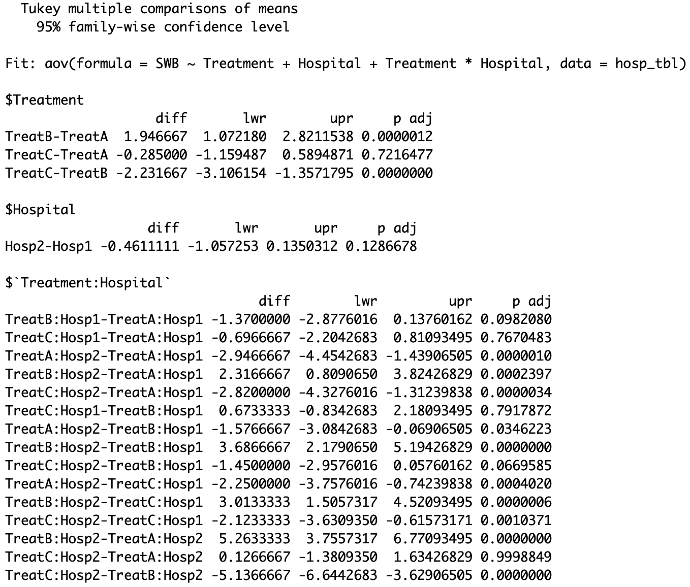

```{r setup, include=FALSE}
options(htmltools.dir.version = FALSE)
```

```{r xaringan-themer, include = FALSE}
library(xaringanthemer)
style_mono_accent(
  #base_color = "#0F4C81", # DAPR1
   base_color = "#BF1932", # DAPR2
  # base_color = "#88B04B", # DAPR3 
  # base_color = "#FCBB06", # USMR
  # base_color = "#a41ae4", # MSMR
  header_color = "#000000",
  header_font_google = google_font("Source Sans Pro"),
  header_font_weight = 400,
  text_font_google = google_font("Source Sans Pro", "400", "400i", "600", "600i"),
  code_font_google = google_font("Source Code Pro")
)
```


```{r echo=FALSE, message=FALSE, warning=FALSE}
library(tidyverse)
library(emmeans)
library(kableExtra)

```

# Week's Learning Objectives
+ Understand the issue of multiple comparisons
+ Understand the corrections available for multiple comparisons
+ Understand the specific application to pairwise comparisons in factorial designs
+ Recap assumptions

---
# Topics for today


---
# Types of errors

+ Type I error = False Positive
  + Reject the null when the null is true. 
  + $\alpha = P(\text{Type I Error})$

+ Type II error = False negative
  + Fail to reject the null when the null is false. 
  + $\beta = P(\text{Type II Error})$
  
---
# A single test
+ If we perform a single test, our Type I error rate is $\alpha$.
  + So if we set $\alpha = 0.05$, the probability of a false positive is 0.05

+ However, what if we do multiple tests ( $m$ ) each with the same $\alpha$ level?

+ What is the probability of a false positive among $m$ tests?

---
# Multiple tests

$$P(\text{Type I error}) = \alpha$$
$$P(\text{not making a Type I error}) = 1 - \alpha$$

$$P(\text{Not making a Type I error in m tests}) = (1 - \alpha)^m$$

$$P(\text{Making a Type I error in m tests}) = 1 - (1-\alpha)^m$$

---
# P(Making a Type I error in m tests)

+ Suppose $m=2$ and $\alpha = 0.05$

```{r}
1 - ((1-0.05)^2)
```

+ Suppose $m=5$ and $\alpha = 0.05$

```{r}
1 - ((1-0.05)^5)
```

+ Suppose $m=10$ and $\alpha = 0.05$

```{r}
1 - ((1-0.05)^10)
```

---
# Why does this matter?

+ The $P(\text{Making a Type I error in m tests}) = 1 - (1-\alpha)^m$ is referred to as the family-wise error rate. 

+ A "family" is a set of related tests. 

+ When we analyse an experimental design, and we look at lots of specific comparisons, we can think of all these tests as a "family". 

+ The larger the family, the more likely we are to find a false positive (see previous slide). 

---
# Corrections
+ There are various methods designed to control for the number of tests.
  + Here control means to keep the Type I Error rate at an intended $\alpha$. 

+ Many options. Some of most common:
  + Bonferroni
  + Sidak
  + Tukey
  + Scheffe

+ Others you may see:
  + Holm's step-down
  + Hochberg's step-up

---
# Example
+ The data comes from a study into patient care in a paediatric wards. 

+ A researcher was interested in whether the subjective well-being of patients differed dependent on the post-operation treatment schedule they were given, and the hospital in which they were staying. 

+ **Condition 1**: `Treatment` (Levels: TreatA, TreatB, TreatC).
  
+ **Condition 2**: `Hosp` (Levels: Hosp1, Hosp2). 
  
+ Total sample n = 180 (30 patients in each of 6 groups).
  + Between person design. 

+ **Outcome**: Subjective well-being (SWB). 
  + An average of multiple raters (the patient, a member of their family, and a friend). 
  + SWB score ranged from 0 to 20.

---
# The data
```{r}
hosp_tbl <- read_csv("hospital.csv", col_types = "dff")
hosp_tbl %>%
  slice(1:10)
```

---
# Our results
```{r}
m4 <- lm(SWB ~ Treatment + Hospital + Treatment*Hospital, data = hosp_tbl)
anova(m4)
```

---
# Bonferroni & Sidak
+ Both are considered "conservative" adjustments.

+ Each treats individual tests within the family as if they are independent.
  + Consider an $\alpha = 0.05$ and $m=\text{number of tests}=10$

+ **Bonferroni**: $\alpha_{Bonferroni} = \frac{\alpha}{m}$

```{r}
0.05/10
```


+ **Sidak**: $\alpha_{Sidak} = 1 - (1- \alpha)^{\frac{1}{m}}$

```{r}
1-((1-0.05)^(1/10))
```

---
# Bonferroni in action
- 
```{r, eval=TRUE}
tA1_A2 <- t.test(SWB ~ Hospital, data = filter(hosp_tbl, (Treatment == "TreatA")))
tA1_B1 <- t.test(SWB ~ Treatment, data = filter(hosp_tbl, ((Treatment == "TreatA" & Hospital == "Hosp1") | (Treatment == "TreatB" & Hospital == "Hosp1"))))
tA1_C1 <- t.test(SWB ~ Treatment, data = filter(hosp_tbl, ((Treatment == "TreatA" & Hospital == "Hosp1") | (Treatment == "TreatC" & Hospital == "Hosp1"))))
tA1_B2 <- t.test(SWB ~ Treatment, data = filter(hosp_tbl, ((Treatment == "TreatA" & Hospital == "Hosp1") | (Treatment == "TreatB" & Hospital == "Hosp2"))))
tA1_C2 <- t.test(SWB ~ Treatment, data = filter(hosp_tbl, ((Treatment == "TreatA" & Hospital == "Hosp1") | (Treatment == "TreatC" & Hospital == "Hosp2"))))
tA2_B1 <- t.test(SWB ~ Treatment, data = filter(hosp_tbl, ((Treatment == "TreatA" & Hospital == "Hosp2") | (Treatment == "TreatB" & Hospital == "Hosp1"))))
tA2_C1 <- t.test(SWB ~ Treatment, data = filter(hosp_tbl, ((Treatment == "TreatA" & Hospital == "Hosp2") | (Treatment == "TreatC" & Hospital == "Hosp1"))))
tA2_B2 <- t.test(SWB ~ Treatment, data = filter(hosp_tbl, ((Treatment == "TreatA" & Hospital == "Hosp2") | (Treatment == "TreatB" & Hospital == "Hosp2"))))
tA2_C2 <- t.test(SWB ~ Treatment, data = filter(hosp_tbl, ((Treatment == "TreatA" & Hospital == "Hosp2") | (Treatment == "TreatC" & Hospital == "Hosp2"))))
tB1_C1 <- t.test(SWB ~ Treatment, data = filter(hosp_tbl, ((Treatment == "TreatB" & Hospital == "Hosp1") | (Treatment == "TreatC" & Hospital == "Hosp1"))))
tB1_B2 <- t.test(SWB ~ Hospital, data = filter(hosp_tbl, ((Treatment == "TreatB" & Hospital == "Hosp1") | (Treatment == "TreatB" & Hospital == "Hosp2"))))
tB1_C2 <- t.test(SWB ~ Treatment, data = filter(hosp_tbl, ((Treatment == "TreatB" & Hospital == "Hosp1") | (Treatment == "TreatC" & Hospital == "Hosp2"))))
tB2_C1 <- t.test(SWB ~ Treatment, data = filter(hosp_tbl, ((Treatment == "TreatB" & Hospital == "Hosp2") | (Treatment == "TreatC" & Hospital == "Hosp1"))))
tB2_C2 <- t.test(SWB ~ Treatment, data = filter(hosp_tbl, ((Treatment == "TreatB" & Hospital == "Hosp2") | (Treatment == "TreatC" & Hospital == "Hosp2"))))
tC1_C2 <- t.test(SWB ~ Hospital, data = filter(hosp_tbl, ((Treatment == "TreatC" & Hospital == "Hosp1") | (Treatment == "TreatC" & Hospital == "Hosp2"))))
```

---
# Bonferroni in action
- 15 tests, so our adjusted $\alpha = 0.05/15 = 0.003$
```{r, echo=TRUE}
tA1_A2
```
  
---
# Bonferroni in action
- 15 tests, so our adjusted $\alpha = 0.05/15 = 0.003$
```{r, echo=TRUE}
tA1_B1
```
  
---
# Bonferroni in action
- 15 tests, so our adjusted $\alpha = 0.05/15 = 0.003$
```{r, echo=TRUE}
tA1_B2
```
  
---
# Bonferroni in action
- 15 tests, so our adjusted $\alpha = 0.05/15 = 0.003$
```{r, echo=TRUE}
tA1_C1
```
  
---
# Bonferroni in action
- 15 tests, so our adjusted $\alpha = 0.05/15 = 0.003$
```{r, echo=TRUE}
tA1_C2
```

---
# Bonferroni in action
- A little easier, but less thorough...
```{r, eval=TRUE}
pairwise_ts <- hosp_tbl %>%
  group_by(Hospital) %>% 
  t_test(SWB ~ Treatment, p.adjust.method = "bonferroni")
```

---
# Bonferroni in action
- A little easier, but less thorough...
```{r, echo=TRUE}
pairwise_ts
```

---
# Tukey & Scheffe
+ **Scheffe procedure** involves an adjustment to the critical value of $F$.
  + The adjustment relates to the number of comparisons being made.
  + And makes the critical value of $F$ larger for a fixed $\alpha$. 
  + The more tests, the larger $F$. 

+ The square-root of the adjusted F provides and adjusted $t$. 

--

+ **Tukey's HSD** (Honest significant Differences)
  + Compares all pairwise group means. 
  + Each difference is divided by the $SE$ of the sum of means. 
  + This produces a $q$ statistic for each comparison. 
  + And is compared against a studentized range distribution. 

---
# Tukey in R
- TukeyHSD() function works on an aov object. 
```{r, eval=FALSE}
m5 <- aov(SWB ~ Treatment + Hospital + Treatment*Hospital, data = hosp_tbl)
TukeyHSD(m5)
```
```{r, echo=FALSE, out.width="40%"}

```


---
class: center, middle
# Time for a break

---
class: center, middle
# Welcome Back!


---
class: center, middle
# Thanks for listening!
