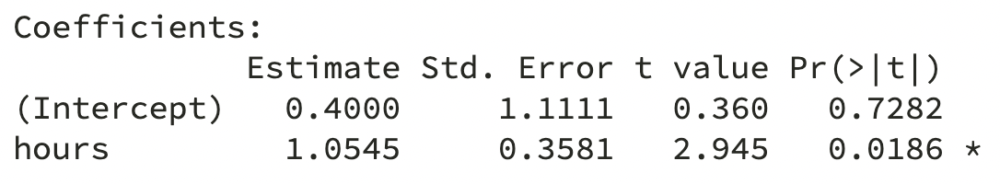
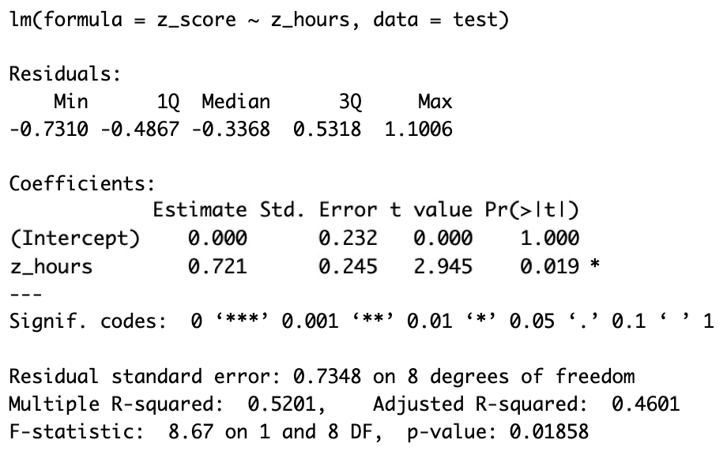
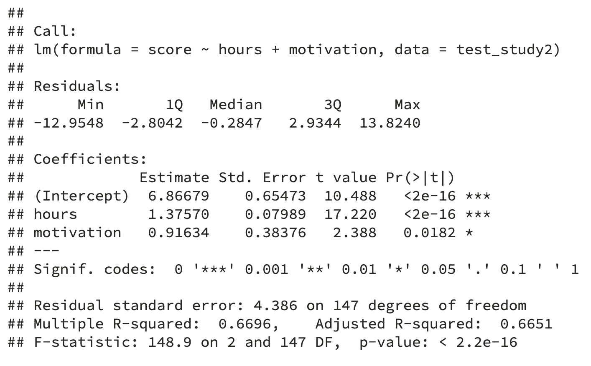

```{r setup, include=FALSE, warning=FALSE, message=FALSE}
options(htmltools.dir.version = FALSE)
library(tidyverse)
library(kableExtra)
library(simglm)

knitr::opts_chunk$set(out.width = '80%')

theme_set(theme_gray(base_size = 15))

baseColour <- "#BF1932"
```


```{r xaringan-themer, include = FALSE}
library(xaringanthemer)
style_mono_accent(
  #base_color = "#0F4C81", # DAPR1
   base_color = "#BF1932", # DAPR2
  # base_color = "#88B04B", # DAPR3 
  # base_color = "#FCBB06", # USMR
  # base_color = "#a41ae4", # MSMR
  header_color = "#000000",
  header_font_google = google_font("Source Sans Pro"),
  header_font_weight = 400,
  text_font_google = google_font("Source Sans Pro", "400", "400i", "600", "600i"),
  code_font_google = google_font("Source Code Pro")
)
```


# Week's Learning Objectives
1. Be able to interpret the coefficients from a simple linear model.

2. Understand how these interpretations change when we add more predictors.

3. Understand how and why we standardize coefficients and how this impacts interpretation


---
class: inverse, center, middle

# Part 1: Recap & Coefficient Interpretation

---
# Linear Model
+ Last week we left off having introduced the linear model:

$$y_i = \beta_0 + \beta_1 x_{i} + \epsilon_i$$

+ Where,
  + $y_i$ is our measured outcome variable
  + $x_i$ is our measured predictor variable
  + $\beta_0$ is the model intercept
  + $\beta_1$ is the model slope
  + $\epsilon_i$ is the residual error (difference between the model predicted and the observed value of $y$)

+ We spoke about calculating by hand, and also the key concept of **residuals**

---
# `lm` in R
+ We also introduced the basic structure of the `lm()` function.

```{r, eval=FALSE}
lm(DV ~ IV, data = datasetName)
```

+ And we had run our first model....

```{r, echo=FALSE}
test <- tibble(
  student = paste(rep("ID",10),1:10, sep=""),
  hours = seq(0.5,5,.5),
  score = c(1,3,1,2,2,6,3,3,4,8)
)
```

```{r}
lm(score ~ hours, data = test)
```

- Today we are going to focus on the interpretation of our model, and how we extend it to include more predictors. 


---

# `lm` in R

```{r}
summary(lm(score ~ hours, data = test))
```

---
# Interpretation

.pull-left[

+ **Slope is the number of units by which Y increases, on average, for a unit increase in X.**

]

.pull-right[

```{r, echo = F, message = F, fig.height = 5}
(p <- ggplot(test, aes(hours, score)) + geom_point() + geom_smooth(method='lm', se=F, colour = baseColour) +
  scale_y_continuous(breaks=seq(0, 8, 1), limits = c(0, 8)) +
  scale_x_continuous(limits=c(0, 5)) +
   geom_vline(xintercept = 0) +
   geom_hline(yintercept = 0) +
  theme(axis.text = element_text(size=14), axis.title = element_text(size = 16, face = 'bold')))
```

```{r, echo = F}

```

]


---
count: false

# Interpretation

.pull-left[

+ **Slope is the number of units by which Y increases, on average, for a unit increase in X.**
  
  + Unit of Y = 1 point on the test
  + Unit of X = 1 hour of study

]

.pull-right[

```{r, echo = F, message = F, fig.height = 5}
p
```

```{r, echo = F}

```

]

---
count: false

# Interpretation

.pull-left[

+ **Slope is the number of units by which Y increases, on average, for a unit increase in X.**
  
  + Unit of Y = 1 point on the test
  + Unit of X = 1 hour of study
  + So, for every hour of study, test score increases on average by 1.055 points.

]

.pull-right[

```{r, echo = F, message = F, fig.height = 5}
p + geom_segment(x=2.5, y = 3, xend=3.5, yend = 3, colour = baseColour, linetype = 'dashed') +
  geom_segment(x=3.5, y = 3, xend = 3.5, yend = 4.05, colour = baseColour, linetype = 'dashed')
```

```{r, echo = F}

```

]

---
# Interpretation

.pull-left[
+ **Slope is the number of units by which Y increases, on average, for a unit increase in X.**
  
  + Unit of Y = 1 point on the test
  + Unit of X = 1 hour of study
  + So, for every hour of study, test score increases on average by 1.055 points.

+ **Intercept is the expected value of Y when X is 0.**
  
  + X = 0 is a student who does not study.

]

.pull-right[

```{r, echo = F, message = F, fig.height = 5}
p
```

```{r, echo = F}

```

]


---
count: false

# Interpretation
    
.pull-left[
+ **Slope is the number of units by which Y increases, on average, for a unit increase in X.**
  
  + Unit of Y = 1 point on the test
  + Unit of X = 1 hour of study
  + So, for every hour of study, test score increases on average by 1.055 points.

+ **Intercept is the expected value of Y when X is 0.**
  
  + X = 0 is a student who does not study.
  + So, a student who does not study would be expected to score 0.40 on the test.
  
]

.pull-right[

```{r, echo = F, message = F, fig.height = 5}
p + geom_segment(x=0.52, y = 0.95, xend = 0, yend = 0.40, colour = baseColour, linetype = 'dashed')
```

```{r, echo = F}

```

]


---
# Note of caution on intercepts
+ In our example, 0 has a meaning.
    + It is a student who has studied for 0 hours.
    
+ But it is not always the case that 0 is meaningful.

+ Suppose our predictor variable was not hours of study, but age.

+ **Look back at the interpretation of the intercept, and instead of hours of study, insert age. Read this aloud a couple of times.**

--

+ This is the first instance of a very general lesson about interpreting statistical tests. 
    + The interpretation is always in the context of the constructs and how we have measured them.


---
# Scale of measurement

.pull-left[
+ Let's have some practice....

  + $X$ = unit is 1 year
  + $Y$ = unit is £1000
  + $\beta_1$ = 0.4

]


.pull-right[

+ $\beta_0$ = **Intercept is the expected value of Y when X is 0.**

+ $\beta_1$ = **Slope is the number of units by which Y increases, on average, for a unit increase in X.**

]


---
# Scale of measurement

.pull-left[
+ Let's have some practice....

  + $X$ = unit is 1kg
  + $Y$ = unit is 1cm
  + $\beta_1$ = -3.2

]


.pull-right[

+ $\beta_0$ = **Intercept is the expected value of Y when X is 0.**

+ $\beta_1$ = **Slope is the number of units by which Y increases, on average, for a unit increase in X.**

]


---
# Scale of measurement

.pull-left[
+ Let's have some practice....

  + $X$ = unit is 1 increment on a likert scale ranging from 1 to 5 measuring conscientiousness
  + $Y$ = unit is 1 increment on a healthy eating scale
  + $\beta_1$ = 0.25

]


.pull-right[

+ $\beta_0$ = **Intercept is the expected value of Y when X is 0.**

+ $\beta_1$ = **Slope is the number of units by which Y increases, on average, for a unit increase in X.**

]

---
class: center, middle

# Questions?

---
class: inverse, center, middle

# Part 2: Standardization

---
# Unstandardized vs standardized coefficients
- So far we have calculated _unstandardized_ $\hat \beta_1$.
  + This means we use the units of the variables we measured.
  + We interpreted the slope as the change in $y$ units for a unit change in $x$ , where the unit is determined by how we have measured our variables.

+ However, sometimes these units do not make the most sense
  + When this is the case, we may want to do something to help interpretation.
  + This is typically called **standardization**


---
# Standardized units
+ Why might standard units be useful?

--

+ **If the scales of our variables are arbitrary.**
  + Example: A sum score of questionnaire items answered on a Likert scale.
  + A unit here would equal moving from a 2 to 3 on one item.
  + This is not especially meaningful (and actually has A LOT of associated assumptions)

--

+ **If we want to compare the effects of variables on different scales**
  + If we want to say something like, the effect of $x_1$ is stronger than the effect of $x_2$, we need a common scale.


---
# Standardizing the coefficients
+ After calculating a $\hat \beta_1$, it can be standardized by:


$$\hat{\beta_1^*} = \hat \beta_1 \frac{s_x}{s_y}$$

+ where;
  + $\hat{\beta_1^*}$ = standardized beta coefficient
  + $\hat \beta_1$ = unstandardized beta coefficient
  + $s_x$ = standard deviation of $x$
  + $s_y$ = standard deviation of $y$


---
# Standardizing the variables

+ Alternatively, for continuous variables, transforming both the predictor and outcome variables to $z$-scores (mean=0, SD=1) prior to fitting the model yields standardised betas.

+ $z$-score for $x$:

$$z_{x_i} = \frac{x_i - \bar{x}}{s_x}$$

+ and the $z$-score for $y$:

$$z_{y_i} = \frac{y_i - \bar{y}}{s_y}$$

+ That is, we divide the individual deviations from the mean by the standard deviation
  
---
# Two approaches in action


```{r}
m1 <- lm(score~hours, data = test)
summary(m1)$coefficients
```

```{r}
round(1.054545 * (sd(test$hours)/sd(test$score)),3) #<<
```

---
# Two approaches in action


```{r}
test <- test %>%
  mutate(
    z_score = scale(score, center = T, scale = T), #<<
    z_hours = scale(hours, center = T, scale = T)  #<<
  )

performance_z <- lm(z_score ~ z_hours, data = test) 
round(summary(performance_z)$coefficients,3)

```

--

$$z_{x_i} = \frac{\color{#BF1932}{x_i - \bar{x}}}{s_x}$$
+ `center = T` indicates $x$ should be mean centered

---
count: false

# Two approaches in action


```{r}
test <- test %>%
  mutate(
    z_score = scale(score, center = T, scale = T), #<<
    z_hours = scale(hours, center = T, scale = T)  #<<
  )

performance_z <- lm(z_score ~ z_hours, data = test) 
round(summary(performance_z)$coefficients,3)
```

$$z_{x_i} = \frac{x_i - \bar{x}}{\color{#BF1932}{s_x}}$$

+ `center = T` indicates $x$ should be mean centered
+ `scale = T` indicates $x$ should be divided by $s_x$ 

---
## Interpreting standardized regression coefficients  

.pull-left[
**Unstandardized**
```{r, echo=F}
knitr::include_graphics('figs/unstandardizedResults.png')
```
]

.pull-right[
**Standardized**
```{r, echo=F}

```
]

--

+ $R^2$ , $F$ and $t$-test and their corresponding $p$-values remain the same for the standardized coefficients as for unstandardised coefficients.

--

+ $\beta_0$ (intercept) = zero when all variables are standardized:

$$\beta_0 = \bar{y}-\hat \beta_1\bar{x}$$

$$\bar{y} - \hat \beta_1 \bar{x} = 0 - \hat \beta_1  0 = 0$$

---
##  Interpreting standardized regression coefficients  

+ The interpretation of the coefficients becomes the increase in $y$ in standard deviation units for every standard deviation increase in $x$

+ So, in our example:

>**For every standard deviation increase in hours of study, test score increases by `r round(summary(performance_z)$coefficients[2], 2)` standard deviations**


---
# Which should we use? 
+ Unstandardized regression coefficients are often more useful when the variables are on  meaningful scales
	+ E.g. X additional hours of exercise per week adds Y years of healthy life

+ Sometimes it's useful to obtain standardized regression coefficients
	+ When the scales of variables are arbitrary
	+ When there is a desire to compare the effects of variables measured on different scales	

+ Cautions
	+ Just because you can put regression coefficients on a common metric doesn't mean they can be meaningfully compared.
	+ The SD is a poor measure of spread for skewed distributions, therefore, be cautious of their use with skewed variables


---
# Relationship to correlation ( $r$ )
+ Standardized slope ( $\hat \beta_1^*$ ) = correlation coefficient ( $r$ ) for a linear model with a single continuous predictor.

+ For example:

```{r}
round(lm(z_score ~ z_hours, data = test)$coefficients, 2)
```


```{r}
round(cor(test$hours, test$score),2)
```

---
# Relationship to correlation ( $r$ )

+ They are the same:
  + $r$ is a standardized measure of linear association
  + $\hat \beta_1^*$ is a standardized measure of the linear slope.

+ Something similar is true for linear models with multiple predictors.
  + Slopes are equivalent to the *part correlation coefficient*

---
class: center, middle

# Questions?

---
class: inverse, center, middle

# Part 3: Adding more predictors to our model

---
#  Multiple predictors (multiple regression)
+ The aim of a linear model is to explain variance in an outcome

+ In simple linear models, we have a single predictor, but the model can accommodate (in principle) any number of predictors. 

+ However, when we include multiple predictors, those predictors are likely to correlate.

+ Thus, a linear model with multiple predictors finds the optimal prediction of the outcome from several predictors, **taking into account their redundancy with one another**


---
#  Uses of multiple regression 
+ **For prediction:** multiple predictors may lead to improved prediction. 

+ **For theory testing:** often our theories suggest that multiple variables together contribute to variation in an outcome

+ **For covariate control:** we might want to assess the effect of a specific predictor, controlling for the influence of others.
	+ E.g., effects of personality on health after removing the effects of age and sex


---
#  Extending the regression model 

+ Our model for a single predictor:

$$y_i = \beta_0 + \beta_1 x_{1i} + \epsilon_i$$ 

+ is extended to include additional $x$'s:

$$y_i = \beta_0 + \beta_1 x_{1i} + \beta_2 x_{2i} + \beta_3 x_{3i} + \epsilon_i$$  

+ For each $x$, we have an additional $\beta$
  + $\beta_1$ is the coefficient for the 1st predictor
  + $\beta_2$ for the second etc.


---
#  Interpreting coefficients in multiple regression 

$$y_i = \beta_0 + \beta_1 x_{1i} + \beta_2 x_{2i} + \beta_j x_{ji} + \epsilon_i$$

+ Given that we have additional variables, our interpretation of the regression coefficients changes a little

+ $\beta_0$ = the predicted value for $y$ **all** $x$ are 0.
	
+ Each $\beta_j$ is now a **partial regression coefficient**
	+ It captures the change in $y$ for a one unit change in $x$ **when all other x's are held constant**

---
# What does holding constant mean? 

+ Refers to finding the effect of the predictor when the values of the other predictors are fixed

+ It may also be expressed as the effect of **controlling for**, or **partialling out**, or **residualizing for** the other $x$'s

+ With multiple predictors `lm` isolates the effects and estimates the unique contributions of predictors. 

---
#  Visualizing models

.pull-left[

```{r, warning=FALSE, echo=FALSE, message=FALSE}
df <- read_csv("data/salary2.csv")
m1 <- lm(salary ~ perf, data = df)
m2 <- lm(salary ~ perf + serv, data = df)

ggplot(df, aes(x=perf, y=salary)) +
  geom_point() +
  geom_smooth(method = "lm")+
  xlab("") +
  ylab("")

```

]

.pull-right[

```{r, echo=FALSE}
knitr::include_graphics("figs/lm_surface.png")
```

]

???
+ In simple linear models, we could visualise the model as a straight line in 2D space
	+ Least squares finds the coefficients that produces the *regression line* that minimises the vertical distances of the observed y-values from the line

+ In a regression with  2 predictors, this becomes a regression plane in 3D space
	+ The goal now becomes finding the set of coefficients that minimises the vertical distances between the *regression*  *plane* and the observed y-values

+ The logic extends to any number of predictors
	+ (but becomes very difficult to visualise!)

---
#  Example: lm with 2 predictors 
```{r, echo=FALSE, message=FALSE, warning=FALSE}
set.seed(7284) 

sim_arguments <- list(
  formula = y ~ 1 + hours + motivation,
  fixed = list(hours = list(var_type = 'ordinal', levels = 0:15),
               motivation = list(var_type = 'continuous', mean = 0, sd = 1)),
  error = list(variance = 20),
  sample_size = 150,
  reg_weights = c(0.6, 1.4, 1.5)
)

df <- simulate_fixed(data = NULL, sim_arguments) %>%
  simulate_error(sim_arguments) %>%
  generate_response(sim_arguments)

test_study2 <- df %>%
  dplyr::select(y, hours, motivation) %>%
  mutate(
    ID = paste("ID", 101:250, sep = ""),
    score = round(y+abs(min(y))),
    motivation = round(motivation, 2)
  ) %>%
  dplyr::select(ID, score, hours, motivation)

```


+ Imagine we extend our study of test scores.

+ We sample 150 students taking a multiple choice Biology exam (max score 40).

+ We give all students a survey at the start of the year measuring their school motivation. 
  + We standardize this variable so the mean is 0, negative numbers are low motivation, and positive numbers high motivation. 
  
+ We then measure the hours they spent studying for the test, and collate their scores on the test.

---
# Our data
```{r}
slice(test_study2, 1:6)
```


---
#  `lm` code

```{r}
performance <- lm(score ~ hours + motivation, #<<
          data = test_study2)
```

+ Multiple predictors are separated by `+`


---
# Multiple regression coefficients

+ Before we interpret our results, let's put all the pieces together:

--

$$Score_i = \beta_0 + \beta_1 Hours_{i} + \beta_2 Motivation_{i} + \epsilon_i$$

--

.pull-left[
```{r, echo = F, out.width='125%'}

```
]

.pull-right[
+ $\beta_0=$
+ $\beta_1=$
+ $\beta_2=$
]

---
count: false

# Multiple regression coefficients

+ Before we interpret our results, let's put all the pieces together:

$$Score_i = \beta_0 + \beta_1 Hours_{i} + \beta_2 Motivation_{i} + \epsilon_i$$

.pull-left[
```{r, echo = F, out.width='125%'}

```
]

.pull-right[
+ $\beta_0 = `r round(performance$coefficients[1], 2)`$
+ $\beta_1 = `r round(performance$coefficients[2], 2)`$
+ $\beta_2 = `r round(performance$coefficients[3], 2)`$

]

---

count: false

# Multiple regression coefficients

+ Before we interpret our results, let's put all the pieces together:

$$Score_i = \beta_0 + \beta_1 Hours_{i} + \beta_2 Motivation_{i} + \epsilon_i$$

.pull-left[
```{r, echo = F, out.width='125%'}

```
]

.pull-right[
+ $\beta_0 = `r round(performance$coefficients[1], 2)`$
+ $\beta_1 = `r round(performance$coefficients[2], 2)`$
+ $\beta_2 = `r round(performance$coefficients[3], 2)`$

```{r}
test_study2[1,]
```

```{r}
round(residuals(performance)[1],2)
```
]

--

$$`r test_study2$score[1]` = `r round(performance$coefficients[1], 2)` + `r round(performance$coefficients[2], 2)` \times `r test_study2$hours[1]` +  `r round(performance$coefficients[3], 2)` \times `r test_study2$motivation[1]` + `r round(residuals(performance),2)[1]`$$


---
#  Multiple regression coefficients 

```{r}
res <- summary(performance)
round(res$coefficients,2)
```

+ **A student who did not study, and who has average school motivation would be expected to score `r round(res$coefficients[[1,1]],2)` on the test.**


---
#  Multiple regression coefficients 

```{r}
res <- summary(performance)
round(res$coefficients,2)
```

+ **Controlling for students level of motivation, for every additional hour studied, there is a `r round(res$coefficients[[2,1]],2)` points increase in test score.**


---
#  Multiple regression coefficients 

```{r}
res <- summary(performance)
round(res$coefficients,2)
```

+ **Controlling for hours of study, for every SD unit increase in motivation, there is a `r round(res$coefficients[[3,1]],2)` points increase in test score.**


---
class: center, middle

# Questions?

---
# Key Take Homes

1. We run linear models using `lm()` in R
2. The intercept is the value of $Y$ when $X$ = 0
3. The slope is the unit change in $Y$ for each unit change in $X$
4. In certain cases, we may standardize our variables; this will affect their interpretation
5. We can easily add more predictors to our model
6. When we do, our interpretations of the coefficients are when all other predictors are held constant.


---
# For next week
+ Things to recap...

  + We will look again at significance testing.
  + And also discuss sampling variability.

+ If you want a refresh, go back and review sampling and hypothesis testing material from dapR1


---
class: center, middle
# Thanks for listening!

