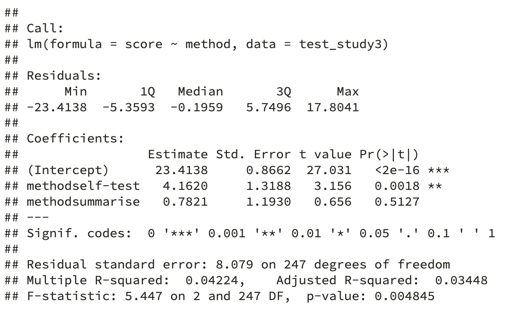
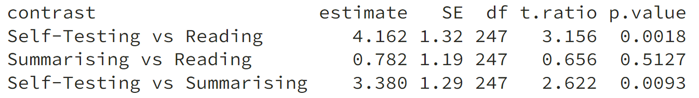
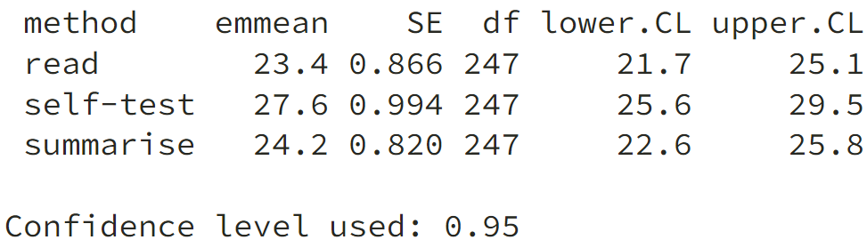

```{r setup, include=FALSE}
options(htmltools.dir.version = FALSE)
```

```{r xaringan-themer, include = FALSE}
library(xaringanthemer)
style_mono_accent(
  #base_color = "#0F4C81", # DAPR1
   base_color = "#BF1932", # DAPR2
  # base_color = "#88B04B", # DAPR3 
  # base_color = "#FCBB06", # USMR
  # base_color = "#a41ae4", # MSMR
  header_color = "#000000",
  header_font_google = google_font("Source Sans Pro"),
  header_font_weight = 400,
  text_font_google = google_font("Source Sans Pro", "400", "400i", "600", "600i"),
  code_font_google = google_font("Source Code Pro")
)
```

```{r, echo=FALSE, message=FALSE, warning=FALSE}
library(tidyverse)
library(kableExtra)
library(effsize)
library(simglm)
library(emmeans)

baseColor = "#BF1932"

theme_set(theme_gray(base_size = 15))

knitr::opts_chunk$set(message = FALSE, warning = FALSE, fig.retina = 1.5)
```

```{r, echo=FALSE, message=FALSE, warning=FALSE}
set.seed(3119) 

sim_arguments <- list(
  formula = y ~ 1 + hours + motivation + study + method,
  fixed = list(hours = list(var_type = 'ordinal', levels = 0:15),
               motivation = list(var_type = 'continuous', mean = 0, sd = 1),
               study = list(var_type = 'factor', 
                            levels = c('alone', 'others'),
                            prob = c(0.53, 0.47)),
               method = list(var_type = 'factor', 
                            levels = c('read', 'summarise', 'self-test'),
                            prob = c(0.3, 0.4, 0.3))),
  error = list(variance = 20),
  sample_size = 250,
  reg_weights = c(0.6, 1.4, 1.5, 6, 6, 2)
)

df3 <- simulate_fixed(data = NULL, sim_arguments) %>%
  simulate_error(sim_arguments) %>%
  generate_response(sim_arguments)

test_study3 <- df3 %>%
  dplyr::select(y, hours, motivation, study, method) %>%
  mutate(
    ID = paste("ID", 101:350, sep = ""),
    score = round(y+abs(min(y))),
    motivation = round(motivation, 2),
    study = factor(study),
    method = factor(method)
  ) %>%
  dplyr::select(ID, score, hours, motivation, study, method)

```


# Course Overview

.pull-left[

```{r echo = FALSE, results='asis'}
block1_name = "Introduction to Linear Models"
block1_lecs = c("Intro to Linear Regression",
                "Interpreting Linear Models",
                "Testing Individual Predictors",
                "Model Testing & Comparison",
                "Linear Model Analysis")
block2_name = "Analysing Experimental Studies"
block2_lecs = c("Categorical Predictors & Dummy Coding",
                "	Effects Coding & Coding Specific Contrasts",
                "Assumptions & Diagnostics",
                "Bootstrapping",
                "	Categorical Predictor Analysis")

source("https://raw.githubusercontent.com/uoepsy/junk/main/R/course_table.R")
course_table(block1_name,block2_name,block1_lecs,block2_lecs,week=6)
```


]

.pull-right[


```{r echo = FALSE, results='asis'}
block3_name = "Interactions"
block3_lecs = c("Interactions I",
                "Interactions II",
                "Interactions III",
                "Analysing Experiments",
                "Interaction Analysis")
block4_name = "Advanced Topics"
block4_lecs = c("Power Analysis",
                "Binary Logistic Regression I",
                "Binary Logistic Regression II",
                "Logistic Regresison Analysis",
                "	Exam Prep and Course Q&A")

source("https://raw.githubusercontent.com/uoepsy/junk/main/R/course_table.R")
course_table(block3_name,block4_name,block3_lecs,block4_lecs,week=0)
```

]

---

# This Week's Learning Objectives

1. Understand the meaning of model coefficients in the case of a binary predictor

2. Understand how to apply dummy coding to include categorical predictors with 2+ levels

3. Be able to include categorical predictors into an `lm` model in R

4. Introduce `emmeans` as a tool for testing different effects in models with categorical predictors


---
class: inverse, center, middle

# Part 1: Categorical variables

---
#  Categorical variables (recap dapR1) 
+ Categorical variables can only take discrete values
	+ E.g., animal type: 1= duck, 2= cow, 3= wasp

+ They are mutually exclusive
  + No duck-wasps or cow-ducks!

+ In R, categorical variables should be of class `factor`
  + The discrete values are `levels`
  + Levels can have numeric values (1, 2 3) and labels (e.g. "duck", "cow", "wasp")
  + All that these numbers represent is category membership

---
# Understanding category membership
+ When we have looked at variables like hours of study, an additional unit (1 hour) is more time
  + As values change (and they do not need to change by whole hours), we get a sense of more or less time being spent studying
  + Across our whole sample, that gives us variation in hours of study

+ When we have a categorical variable, we do not have this level of precision

+ Suppose we split hours of study into the following groups:
  + 0 to 2.99 hours = low study time
  + 3 to 9.99 hours = medium study time
  + 10+ hours = high study time
  
+ **Side note**: This is for point of demonstration, it is generally not a good idea to break a continuous measure into groups for the purposes of analysis

---
# Understanding category membership

.pull-left[
```{r, echo=FALSE}

sampDat <- test_study3 %>%
  select(1:3) %>%
  mutate(
    hours_cat = cut(hours, breaks = c(-0.1, 2.99, 9.99, Inf), labels = c("low", "medium", "high")),
    hours_catNum = cut(hours, breaks = c(-0.1, 2.99, 9.99, Inf), labels = c("1", "2", "3"))
  ) 

sampDat %>%
  slice(1:10) %>%
  arrange(., desc(hours_cat)) %>%
  kable(.) %>%
  kable_styling(., full_width = F)
```
]

.pull-right[
```{r, echo = F}
summary(sampDat[,c('hours', 'hours_cat', 'hours_catNum')])
```
]


---
# Binary variable (recap)

+ Binary variable is a categorical variable with two levels

+ Traditionally coded with a 0 and 1

+ In `lm`, binary variables are often referred to as dummy variables
  + when we use multiple dummies, we talk about the general procedure of dummy coding

+ Why 0 and 1?

--
  
Quick version: It has some nice properties when it comes to interpretation

--

>  **Have a guess:**

> What is the interpretation of the intercept if the predictor is binary?

--

> What about the slope?

---
class: center, middle

# Questions?

---
class: inverse, center, middle

# Part 2: lm with a single binary predictor


---
# Extending our example

.pull-left[
+ Our in-class example so far has used *test scores*, *revision time* and *motivation*

+ Let's say we also collected data on who they studied with (`study`);
  + 0 = alone; 1 = with others
  
+ And also which of three different revisions methods they used for the test (`study_method`)
	+ 1 = Notes re-reading; 2 = Notes summarising; 3 = Self-testing ([see here](https://www.psychologicalscience.org/publications/journals/pspi/learning-techniques.html))

+ We collect a new sample of 200 students
]


.pull-right[

```{r}
head(test_study3) %>%
  kable()
```


]

---
#  LM with binary predictors 
+ Now lets ask the question:

  + **Do students who study with others score better than students who study alone?**

+ Our equation looks familiar: 

$$score_i = \beta_0 + \beta_1 study_{i} + \epsilon_i$$

+ And in R:

```{r}
performance_study <- lm(score ~ study, data = test_study3)
```

---
# Model results
```{r}
summary(performance_study)
```

---
# Interpretation

.pull-left[
+ As before, the intercept $\hat \beta_0$ is the expected value of $y$ when $x=0$

+ What is $x=0$ here?
  + It is the students who study alone

+ So what about $\hat \beta_1$?

+ **Look at the output on the right hand side** 
  + What do you notice about the difference in averages?
  + Let's look back at the summary results again....

]

.pull-right[
```{r warning=FALSE, message=FALSE}
test_study3 %>%
  group_by(study) %>% #<<
  summarise(
    Average = round(mean(score),4) #<<
  )
```


]

---
# Model results

.pull-left[
```{r, echo = F}
knitr::include_graphics('figs/catModResults.png')
```
]

.pull-right[
```{r, echo = F}
test_study3 %>%
  group_by(., study) %>% 
  summarise(
    Average = round(mean(score),4)
  )
```
]


---
# Interpretation
+ $\hat \beta_0$ = predicted expected value of $y$ when $x = 0$
  + Or, the mean of group coded 0 (those who study alone)
  
+ $\hat \beta_1$ = predicted difference between the means of the two groups
  + Group 1 - Group 0 (Mean `score` for those who study with others - mean `score` of those who study alone)
  
+ Notice how this maps to our question
  + Do students who study with others score better than students who study alone?

---
class: center, middle

# Questions?

---
class: inverse, center, middle

# Part 3: Prediction equations for groups & significance


---
#  Equations for each group 

<br>

$$\widehat{score} = \hat \beta_0 + \hat \beta_1 study$$
<br>

+ For those who study alone ( $study = 0$ ):


$$\widehat{score}_{alone} = \hat \beta_0 + \hat \beta_1 \times 0$$


+ So:


$$\widehat{score}_{alone} = \hat \beta_0$$


---
#  Equations for each group 
+ For those who study with others ( $study = 1$ ):


$$\widehat{score}_{others} = \hat \beta_0 + \hat \beta_1 \times 1$$


+ So:


$$\widehat{score}_{others} = \hat \beta_0 + \hat \beta_1$$


+ And if we re-arrange:


$$\hat \beta_1 = \widehat{score}_{others} - \hat \beta_0$$


+ Remembering that $\hat \beta_0 = \widehat{score}_{alone}$, we finally obtain:

$$\hat \beta_1 = \widehat{score}_{others} - \widehat{score}_{alone}$$


---
#  Visualise the model

.center[

```{r, echo=FALSE, fig.width=7, fig.height=6}
(bin <- test_study3 %>%
  ggplot(., aes(x=factor(study), y=score, colour = study)) +
  geom_point(alpha=0.4) +
  labs(x = "\n Study", y = "Test Score \n") +
  ylim(0,45) +
  scale_x_discrete(labels = c("alone", "others")) +
  theme(legend.position = "none",
        axis.text = element_text(size=12),
        axis.title = element_text(size = 14, face = 'bold')))
```
]

---
count: false

#  Visualise the model

.center[
```{r, echo=FALSE, fig.width=7, fig.height=6}
bin +
  geom_jitter(width = .1, height = 0, alpha=0.4)

```
]

---
count: false

#  Visualise the model

.center[
```{r, echo=FALSE, fig.width=7, fig.height=6}
gpM <- test_study3 %>%
  group_by(study) %>%
  summarise(
    score = mean(score)
  )

bin +
  geom_jitter(width = .1, height = 0, alpha=0.4) + 
  geom_errorbar(data = gpM, width=0.6,aes(ymax=after_stat(y),ymin=after_stat(y)), size=1)

```
]

---
count: false

#  Visualise the model

.center[

```{r, echo=FALSE, warning=FALSE, message=FALSE, fig.width=7, fig.height=6}
library(latex2exp)

bin +
  geom_jitter(width = .1, height = 0, alpha=0.4) + 
  geom_errorbar(data = gpM, width=0.6,aes(ymax=after_stat(y),ymin=after_stat(y)), size=1) +
  geom_segment(x=1.5, y=gpM[[1,2]], xend=1.5, yend=gpM[[2,2]], size =1, col=baseColor) +
  geom_segment(x=1.48, y=gpM[[1,2]], xend=1.52, yend=gpM[[1,2]], size =1, col=baseColor) +
  geom_segment(x=1.48, y=gpM[[2,2]], xend=1.52, yend=gpM[[2,2]], size =1, col=baseColor) +
  geom_text(x=1.58, y = gpM[[2,2]]-2, label = TeX('$\\hat{\\beta}_1$'), size=5, col = baseColor) +
  geom_text(x=0.65, y = gpM[[1,2]] , label = TeX('$\\hat{\\beta}_0$'), size=5, col = baseColor)

```
]

---
#  Evaluation of model and significance of $\beta_1$

+ $R^2$ and $F$-ratio interpretation are identical to their interpretation in models with only continuous predictors

+ And we assess the significance of predictors in the same way

  + We calculate $\hat \beta_1$ = difference between groups
  
	+ $t$-value using the SE of $\hat \beta_1$, and associated $p$-value
	
	+ Or a confidence interval around the coefficient


---
# Hold on... it's a t-test

```{r}
t.test(score ~ study, var.equal = T, data = test_study3)
```


---
# Model results

+ **Test your understanding:**  How do we interpret our results?

.pull-left[
```{r, echo = F}
modSum <- round(summary(performance_study)[['coefficients']], 2)
fTest <- round(summary(performance_study)[['fstatistic']], 2)
descDat <- test_study3 %>%
  group_by(., study) %>% 
  summarise(
    Average = round(mean(score),2),
    SD = round(sd(score), 2))

knitr::include_graphics('figs/catModResults.png')
```
]

--

.pull-right[
Study habits significantly predicted student test scores, *F*(`r fTest['numdf']`, `r fTest['dendf']`) = `r fTest['value']`, *p* < .001. Study habits explained `r round(summary(performance_study)[['r.squared']]*100, 2)`% of the variance in test scores.  Specifically, students who studied with others (*M* = `r descDat$Average[2]`, *SD* = `r descDat$SD[2]` ) scored significantly higher than students who studied alone (*M* = `r descDat$Average[1]`, *SD* = `r descDat$SD[1]`), $\beta_1$ = `r modSum[2,'Estimate']`, *SE* = `r modSum[2, 'Std. Error']`, *t* = `r modSum[2, "t value"]`, *p* < .001. 

]

---
class: center, middle

# Questions?

---
class: inverse, center, middle

# Part 4: Categorical variables with >2 levels


---
#  Including categorical predictors with >2 levels in a regression 
  + The goal when analysing categorical data with 2 or more levels is that each of our $\beta$ coefficients represents a specific difference between means

  + e.g. When using a single binary predictor, $\beta_1$ is the difference between the two groups


+  To be able to do this when we have 2+ levels, we need to apply a **coding scheme**

+ Two common coding schemes are:
  + Dummy coding (which we will discuss now)
  + Effects coding (or sum to zero, which we will discuss next week)
  + There are LOTS of ways to do this; if curious, [see here](https://stats.oarc.ucla.edu/r/library/r-library-contrast-coding-systems-for-categorical-variables/)

---
#  Dummy coding 
+ Dummy coding uses 0's and 1's to represent group membership
	+ One level is chosen as a baseline
	+ All other levels are compared against that baseline
	
+ Notice, this is identical to binary variables already discussed

+ Dummy coding is simply the process of producing a set of binary coded variables

+ For any categorical variable, we will create $k$-1 dummy variables
  + $k$ = number of levels


---
#  Choosing a baseline? 
+ Each level of your categorical predictor will be compared against the baseline

+ Good baseline levels could be:
	+ The control group in an experiment
	+ The group expected to have the lowest score on the outcome
	+ The largest group

+ The baseline should not be:
	+ A poorly defined level, e.g. an `Other` group
	+ Much smaller than the other groups


---
# Steps in dummy coding by hand

1. Choose a baseline level

2. Assign everyone in the baseline  group `0` for all $k$-1 dummy variables

3. Assign everyone in the next group a `1` for the first dummy variable and a `0` for all the other dummy variables

4. Assign everyone in the next again group a `1` for the second dummy variable and a `0` for all the other dummy variables

5. Repeat until all $k$-1 dummy variables have had 0's and 1's assigned

6. Enter the $k$-1 dummy variables into your regression


---
#  Dummy coding by hand

.pull-left[
+ We start out with  a dataset that looks like:

```{r, echo=FALSE}
test_study3 %>%
  dplyr::select(ID,score,method) %>%
  slice(1:10)
```


]


.pull-right[
+ And end up with one that looks like:

```{r, echo=FALSE}
dummyCoded <- test_study3 %>%
  select(ID, score, method) %>%
  mutate(
    method1 = ifelse(method == "self-test", 1, 0),
    method2 = ifelse(method == "summarise", 1, 0))

dummyCoded %>% 
  slice(1:10)
```

]

---
#  Dummy coding by hand

+ We would then enter the dummy coded variables into a regression model:

.pull-left[
```{r, echo = F}
dummyCoded %>% 
  slice(1:10)
```

]

.pull-right[
```{r, echo = F}
knitr::include_graphics('figs/dcResults.png')
```
]

--

> **Test your understanding:** Which method is our baseline?
> How does our model know to treat it as the baseline?


---
#  Dummy coding with `lm` 

+ `lm` automatically applies dummy coding when you include a variable of class `factor` in a model.
  + It selects the first group (alphabetically) as the baseline group

+ It represents this as a contrast matrix which looks like:

```{r}
contrasts(test_study3$method)
```


---
#  Dummy coding with `lm` 

```{r, echo = F}
mod1 <- lm(score ~ method, data = test_study3)
```


+ `lm` does all the dummy coding work for us:

.pull-left[
.center[**Dummy Coding in lm**]
```{r, eval = F}
summary(lm(score ~ method, 
           data = dummyCoded))
```

```{r, echo = F}

```

]

.pull-right[
.center[**Dummy Coding by Hand**]
```{r, eval = F}
summary(lm(score ~ method1+method2, 
           data = dummyCoded))
```

```{r, echo = F, out.width='90%'}
knitr::include_graphics('figs/dcResults.png')
```
]

---
#  Dummy coding with `lm`

.pull-left[
+ The intercept is the mean of the baseline group (re-reading)

+ The coefficient for `methodself-test` is the mean difference between the self-testing group and the baseline group (re-reading)

+ The coefficient for `methodsummarise` is the mean difference between the note summarising group and the baseline group (re-reading)

]

.pull-right[

```{r}
mod1
```

```{r, echo=FALSE}
test_study3 %>%
  group_by(method) %>%
  summarise(
    Group_Mean = mean(score)
  )

```


]


---
#  Dummy coding with `lm` (full results)

```{r}
summary(mod1)
```

---
#  Changing the baseline group  

+ The level that `lm` chooses as its baseline may not always be the best choice
	+ You can change it using:

```{r, eval=FALSE}
contrasts(test_study3$method) <- contr.treatment(3, base = 2)
```


	
+ `contrasts` gets updated, giving you the new coding scheme

+ `contr.treatment` specifies that you want dummy coding

+ `3` is the number of levels of your predictor

+ `base = 2` is the level number of your new baseline


---
#  Results using the new baseline 

.pull-left[

```{r}
contrasts(test_study3$method) <- 
  contr.treatment(3, base = 2)
```

+ The intercept is the now the mean of the second group (Self-Testing)

+ `method1` is now the difference between Notes re-reading and Self-Testing

+ `method3` is now the difference between Notes summarising and Self-testing 


]

.pull-right[

```{r}
mod2 <- lm(score ~ method, data = test_study3)
mod2
```

```{r, echo=FALSE}
test_study3 %>%
  group_by(method) %>%
  summarise(
    Group_Mean = mean(score)
  )

```

]

---
#  New baseline (full results)

```{r}
summary(mod2)
```

???
+ Note that the choice of baseline does not affect the R^2 or F-ratio

---
class: center, middle

# Questions?

---
class: inverse, center, middle

# Part 5: Testing manual contrasts using emmeans


---
# Using `emmeans` to test contrasts

+ With dummy coding, each non-baseline level is compared to the baseline
+ But what if we also want to compare two non-baseline levels to each other?

+ We will use the package `emmeans` to test our contrasts
  + We will also be using this in the next few weeks to look at analysing experimental designs

+ **E**stimated
+ **M**arginal
+ **Means**

+ Essentially this package provides us with a lot of tools to help us model contrasts and linear functions

---
# Working with `emmeans`

```{r, echo = F}
test_study3 <- df3 %>%
  dplyr::select(y, hours, motivation, study, method) %>%
  mutate(
    ID = paste("ID", 101:350, sep = ""),
    score = round(y+abs(min(y))),
    motivation = round(motivation, 2),
    study = factor(study),
    method = factor(method)
  ) %>%
  dplyr::select(ID, score, hours, motivation, study, method)
```

+ We already have our model:

```{r, eval=F}
mod1 <- lm(score ~ method, test_study3)
```

+ Next we use `emmeans` to get the estimated means of our groups

```{r}
method_mean <- emmeans(mod1, ~method)

method_mean
```


---
# Visualise estimated means

.pull-left[
```{r, eval=FALSE}
plot(method_mean)
```

+ We then use these means and standard errors to test contrasts (differences between levels)

]

.pull-right[
```{r, echo=FALSE}
plot(method_mean)
```

]

---
# Defining the contrast

+ **NOTE**: The order of your categorical variable matters as `emmeans` uses this order 


```{r}
levels(test_study3$method)
```

+ For each pairwise comparison, assign `1` to the level you are interested in, and `-1` to the baseline you want to compare it to


```{r}
method_comp <- list("Self-Testing vs Reading" = c(-1, 1, 0),
                    "Summarising vs Reading" = c(-1, 0, 1),
                    "Self-Testing vs Summarising" = c(0, 1, -1))

```

--

+ The estimate for your `-1` level will be subtracted from your `1` level to obtain the difference between the levels
+ We will then look at the significance of that difference

---
# Requesting the test
+ In order to test our effects, we use the `contrast` function from `emmeans`

```{r}
method_comp_test <- contrast(method_mean, method_comp)
method_comp_test
```
--

+ We can see we have p-values, but we can also request confidence intervals

```{r}
confint(method_comp_test)
```


---
# Interpreting the results
+ The estimate is the difference between the average of the group means within each comparison

.pull-left[

```{r, eval = F}
method_comp_test
```


```{r, echo = F}

```
]

.pull-right[
```{r, eval = F}
method_mean
```

```{r, echo = F, out.width='75%'}

```

]
+ So for `Self-Testing vs Summarising` :

```{r}
27.6-24.2
```
+ Those who test themselves on the content of their notes have higher scores than those who simply re-read their notes
  + And this is statistically significant

---
class: center, middle

# Questions?

---
# Key points from this week

+ When we have categorical predictors, we are modelling the means of groups
  
+ When the categorical predictor has more than one level, we can represent it with dummy-coded binary variables
  + We have k-1 dummy variables, where k = number of levels (groups/categories)
  + Each dummy variable slope represents the difference between the mean of the group scored 1 and the reference group

+ In R, we need to make sure... 
  + R recognises the variable as a factor (`factor()`), and 
  + We have the correct reference level (`contr.treatment()`)

+ We also looked at the use of `emmeans` to test specific contrasts
  + Run the model
  + Estimate the means
  + Define the contrast
  + Test the contrast

---

## This week 

.pull-left[

### Tasks

```{r, echo = F, out.width='10%'}
knitr::include_graphics('figs/labs.svg')
```

**Attend your lab and work together on the exercises** 

<br>

```{r, echo = F, out.width='10%'}
knitr::include_graphics('figs/exam.svg')
```

**Complete the weekly quiz**

]

.pull-right[

### Support

```{r, echo = F, out.width='10%'}
knitr::include_graphics('figs/forum.svg')
```

**Help each other on the Piazza forum**

<br>

```{r, echo = F, out.width='10%'}
knitr::include_graphics('figs/oh.png')
```

**Attend office hours (see Learn page for details)**

]


---
class: inverse, center, middle

# Thanks for listening