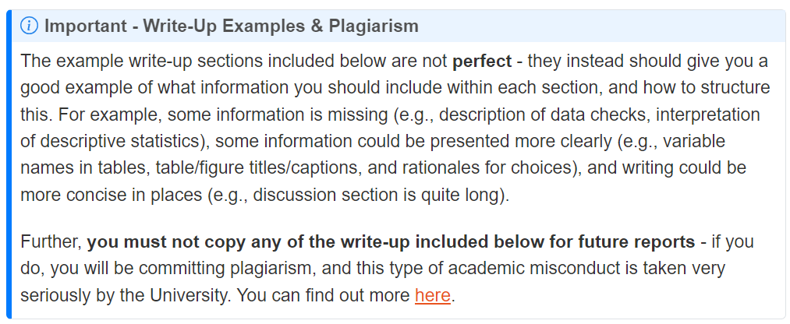

```{r setup, include=FALSE}
options(htmltools.dir.version = FALSE)
```

```{r xaringan-themer, include = FALSE}
library(xaringanthemer)
style_mono_accent(
  #base_color = "#0F4C81", # DAPR1
   base_color = "#BF1932", # DAPR2
  # base_color = "#88B04B", # DAPR3 
  # base_color = "#FCBB06", # USMR
  # base_color = "#a41ae4", # MSMR
  header_color = "#000000",
  header_font_google = google_font("Source Sans Pro"),
  header_font_weight = 400,
  text_font_google = google_font("Source Sans Pro", "400", "400i", "600", "600i"),
  code_font_google = google_font("Source Code Pro")
)
```


```{r echo=FALSE, message=FALSE, warning=FALSE}
library(tidyverse)
library(car)
library(patchwork)
library(kableExtra)
```

# Overview
+ Brief overview of correct models for RQ1 & RQ2
+ Outline some of the most common mistakes across reports
  + Some of the points discussed  are fundamental, in that it is not possible to correctly and fully answer the questions if this was done. Others are less fundamental, but are the things that differentiate a passing grade from a high grade  
  + Non-exhaustive list - look at your individual feedback comments

---
# RQ1: Model

To address RQ1: **differences in dominance ratings between face occlusion conditions depend on the head tilt condition**

```{r, eval = FALSE}
m1 <- lm(dominance ~ anxiety + neg_affect + pos_affect + occlusion_cond * tilt_cond, data = dat)
```

---

# RQ2: Contrast

To address RQ2: **the difference in dominance ratings between face occlusion conditions differed between those that saw tilted and non-tilted heads**

```{r, eval = FALSE}
# compare those who saw tilted and non-tilted conditions
tilt_coef  <- c('down' = .5, 'up' = .5, 'none' = -1)

#compare lower and upper occlusion conditions
occlusion_coef  <- c('lower' = 1, 'upper' = -1)

#combine individual weights into the interaction
contr = tilt_coef %o% occlusion_coef
contr

# call emmeans to check ordering of coefficients 
emm <- emmeans(m1, ~occlusion_condition * tilt_condition)
emm

# insert the coefficients following the order specified by the rows of emm above
comp <- contrast(emm, method = list('Hyp' = c(-1, 1, 0.5, -0.5, 0.5, -0.5)))
summary(comp, infer=T)
```

---
class: center, middle

# Common Errors

---

# Covariates: None Included
+ The questions specifically asked: "After **accounting for anxiety, positive and negative affect**, the researchers want to know whether:

  a. differences in dominance ratings between face occlusion conditions depend on the head tilt condition

  b. the difference in dominance ratings between face occlusion conditions differed between those that saw tilted and non-tilted heads"

+ This means that the two affect variables and anxiety variable needed to be included in all models. If these were not included, the questions could not be answered adequately

---
# Covariates: Inclusion Based on Significance

Selecting only a small number of the covariates (i.e., positive affect and anxiety) based on their relation to the DV

+ Lacked rationale given RQs. Why?
  + If we have covariates we want to control for, we want them in a model whether their effect is significant or not. This is because although the effects may not be large enough to meet our $\alpha$ threshold, it is unlikely their effect is 0 
  + By wrongfully excluding some covariates, our resulting estimates of tilt condition & occlusion condition may differ in part be due to differences in those covariates

+ When would this have been appropriate?
  + If a covariate had very high multicollinearity
  + If we believed that there were many model influential cases based on responses to the covariate
  + If we had a small sample size and lots of covariates to control for  
+ Very few students provided any sort of rationale based on the above for only including a subset of covariates, most focused on significance

---
# Covariates: Model Comparison with and without Covariates

+ A number of reports fit a model without the covariates, and interpreted this for questions Q1 and Q2, then fit a model with covariates and compared this based on $F$-tests to the model without
+ This was a redundant analysis - we need to control for covariates in all models, not interested in whether their inclusion improved model fit
    
---
# Interaction: Not Specified

+ Both RQ1 and RQ2 both required looking at an interaction   
  + RQ1: Interaction concerned tilt condition and occlusion condition  
  + RQ2: Same variables but the interaction of the specific contrasts (see the creation of 'contr' in the code on slide 5). 
+ If these were not included, the questions could not be answered

---
# Contrast: Not Specified

**Combining levels**
+ No contrast given for RQ2, instead a second interaction model used where a new binary variable was created where observation condition now contained only 2 levels - 'tilted' and 'non-tilted' 
  + Not optimal or efficient

**Simple effects / pairwise tests**
+ The particular combination of averaging across levels of tilt conditions conditions could not be achieved through either simple or pairwise effects
  + Unable to answer RQ2 using this approach

---
# Specification: Models

+ The model should have contained 9 $\beta$ coefficients (including the intercept):
  + 1 for intercept
  + 1 for positive affect
  + 1 for negative affect
  + 1 for anxiety
  + 2 for tilt condition $(k-1 = 3-1 = 2)$
  + 1 for occlusion condition $(r-1 = 2-1 = 1)$
  + 2 for interaction $((r-1)(k-1) = (2-1)(3-1) = (1)(2) = 2)$

+ Common for reports to contain model in the form of `R` code (i.e., included 7 $\beta$ coefficients (including the intercept) where there was:
  + 1 for tilt condition
  + 1 for occlusion condition
  + 1 for interaction

---
# Specification: Null & Alternative Hypotheses

+ Errors mostly followed from previous mis-specification of model, where many reports then suggested that RQ1 could be answered by evaluating a single $\beta$ coefficient (e.g., $H_0: \beta_{8} = 0$)

+ Some suggested that both interaction $\beta$ coefficients had to $\neq$ 0 in alternative hypothesis

+ In some cases, no hypotheses formally stated or described in text - unclear what models were being used to test

---
# Assumptions: Details

**Analysis Strategy**
+ In many cases there was insufficient information given concerning assumption checks. What needs to be included:
  + the assumption being evaluated
  + the plot used to evaluate this assumption
  + how you would determine whether the assumption was met
  + what you will do if there is a violation
  
**Results**
+ Linearity of model assumed, but the covariates were continuous - needed to check this   
+ Many just referred to appendix with no comment on how the assumptions were met. What needs to be included:
  + reference to all assumptions mentioned in analysis strategy
  + evaluation of plot - how we know the assumption was met
  + any action taken if assumption violated (e.g., removed $n$ outliers since [insert criteria to justify])

---
# Assumptions: Plagarism

+ Most obvious area where copying and pasting from labs occurred, with very minor or no changes to wording
+ Message contained in labs and write-up labs:

.pull-left[

**Labs**

```{r echo=FALSE, out.width = '100%'}
knitr::include_graphics('figs/lab_plagarism2324_lbs.png')
```

]

.pull-right[

**Write-Up & Recap Labs**

```{r echo=FALSE, out.width = '100%'}

```

]
---
# Analysis Strategy: Unable to Replicate

+ Report instructions: "A reader of your compiled report should be able to more or less replicate your analyses without referring to your `R` code"
  + Data checks not mentioned (e.g., were scores in range? Were there `NA` values?)
  + No statement of alpha (e.g., were statements of signifiance made in relation to $\alpha = .05$, $\alpha = .01$, or something else?)
  + Not clear which coding scheme was used (dummy or effects? why?)
  + Not stated what reference levels were used or why certain levels were chosen (i.e., lacking rationale)
  + Models and/or hypotheses not formally presented or described in words (or there was a mis-match)
  + Weights for contrast not provided
  + Specifying a hypothesis for contrast analysis, but not stating what values represented 
  + No mention or limited discussion of assumptions (what criteria was used?)
  
---

# Interpretation: Errors or Issues with Detail

**Errors**
+ Mis-interpretation of results (e.g., estimates and/or significance), especially of interaction coefficents
+ Incorrect contrast estimate
  + Failed to check that the ordering of the weights matched the order of the levels within `emmeans`. This resulted in the incorrect value for the contrast
  + How/why did this happen? Typically when factors were re-ordered or re-labelled incorrectly
  
**Missing / Lacking Detail**
+ Level of interpretation in the reports was very low, largely focusing on statistical significance
+ Tables / figures presented, but not interpreted (e.g., only stating that descriptive statistics are presented in Table 1)

**Too Much Detail**
+ Reporting every single coefficient contained in the model output. Important in the results to focus on what is relevant to the RQs
+ Repetition of findings - e.g., repeated across tables/figures/in-text

---

# Interpretation: What we Wanted to See

**Results**  
+ All key model results presented  
+ A focus on the coefficients of interest - a full interpretation of *key* results 
+ Interpretation of the direction and magnitude of effects that were relevant  

**Discussion**
+ Summary of findings for *both* RQs framed in relation to the questions not specific results  
+ Results summarised into concise and accurate take-home messages that provided a clear answer to the study RQs     

---

# Instructions: Structure

+ Report instructions: "Your report should include three sections: 1. Analysis Strategy 2. Results 3. Discussion (very brief)"
  + Many reports did not follow the above structure - some included no sections, others included many more sections

+ Report instructions: "Your analysis strategy should not contain any results."
  + Some reports included descriptive statistics in this section and/or results from assumption checks

+ Report instructions: "The Discussion section should contain very brief (1-2 sentence) summary statements linking the formal results to each of the research questions. The marking of this section will be based on the coherence and accuracy of these statements. This should not introduce any new statistical results, nor repeat detailed statistical results, but should refer to those presented in the analysis"
  + Discussion sections were often too long
  + Some included reporting of statistical results (either repeated from results section or new)
  + Lack of linking to RQs, especially RQ2 (e.g., no statement of direction of difference)

---

# Instructions: R Code/Output

+ Report instructions: "**Code chunks should be hidden** in the pdf produced by your rmd file. To tell RMarkdown to not show your code when knitting to HTML, add `echo=FALSE` next to the `r` that [appears after the backticks](https://uoepsy.github.io//rmd-bootcamp/05-echoeval.html). There should be no visible R code or direct output in your report. For a guide on writing and formatting in RMarkdown, you may find these resources helpful:

  + [UoEPsy Rmd-Bootcamp](https://uoepsy.github.io/scs/rmd-bootcamp/)  
  + [RMarkdown CheatSheet](https://www.rstudio.com/wp-content/uploads/2015/02/rmarkdown-cheatsheet.pdf)  
  + [Writing Math in Rmd](https://rpruim.github.io/s341/S19/from-class/MathinRmd.html#:~:text=Math%20inside%20RMarkdown,10n%3D1n2)"   

+ Common issues:
  
  + Many reports included `R` code and/or direct `R` output -- make sure to check your PDF files before submission
  + Not creating own tables (e.g., printing contrast weights `R` object instead of creating table)
  + Not checking chunk options
  + Writing in `R` chunks as comments (i.e., using #) instead of as normal text
  
---
# Instructions: Key Tables/Figures in Appendix

Report instructions: 
+ "The assumption appendix is only for assumption and diagnostic figures and results. Any results from your main models including in the appendix will not be marked"
+ "All key model results should be presented (tables very useful) in the main body of the report"

+ These should have been in the main text if they contain the results for models you set out in your analysis strategy.

---
# Instructions: Formatting

+ Report instructions: "Reporting should be clear and consistent. If in doubt, follow APA 7th Edition guidelines"
  + Often numbers rounded to varying decimal points
  
+ Report instructions: "Figures and tables should be numbered and captioned, and referred to in the text; important statistical outcomes should be summarised in the text"
  + Figures and/or tables often not numbered or captioned
  + Often figure/table presented, but not commented on or referred to at all
  
+ Report instructions: "If you cannot knit to pdf, then try the following steps:
1) Knit to html file 2) Open your html in a web-browser (e.g. Chrome, Firefox) 3) Print to pdf (Ctrl+P, then choose to save to pdf) 4) Submit the pdf you just saved"
  + A number of students submitted 1 page PDF docs which were very difficult to read due to size issues

+ Presentation issues with model equations - often cut-off and full equation not shown on page. Need to knit regularly while you are writing to check that models, tables, plots, etc. are displaying as you intended and correctly

---
class: center, middle

# **Questions?**

---
class: center, inverse, middle, animated, rotateInDownLeft

# End
